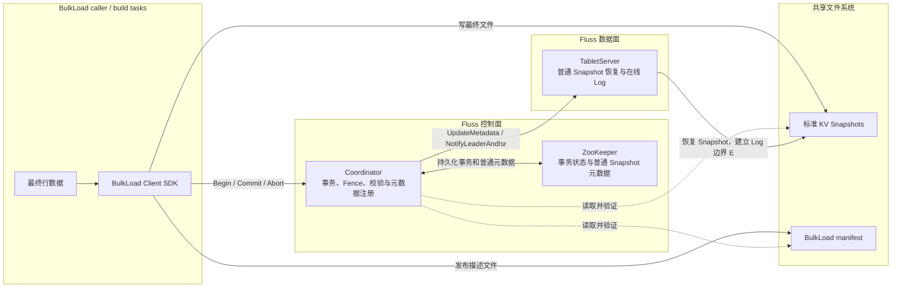
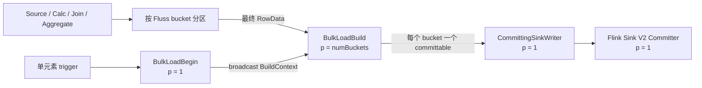
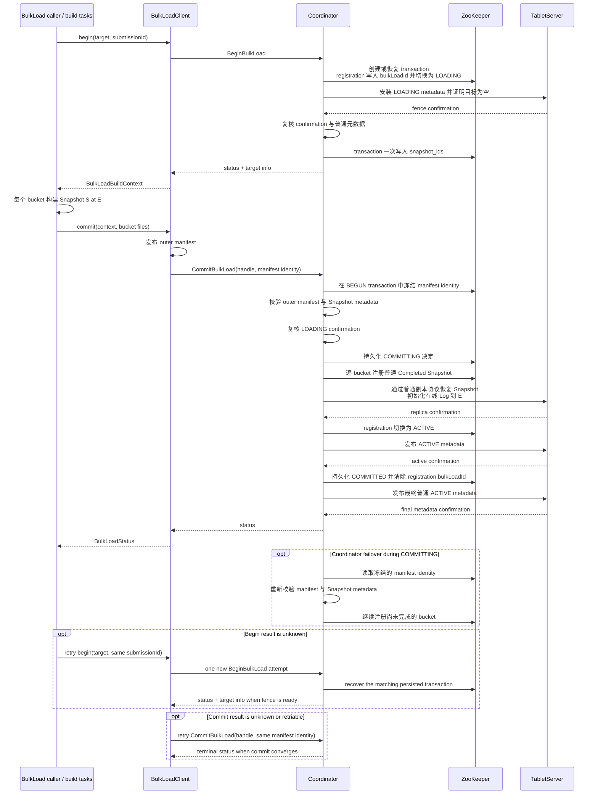
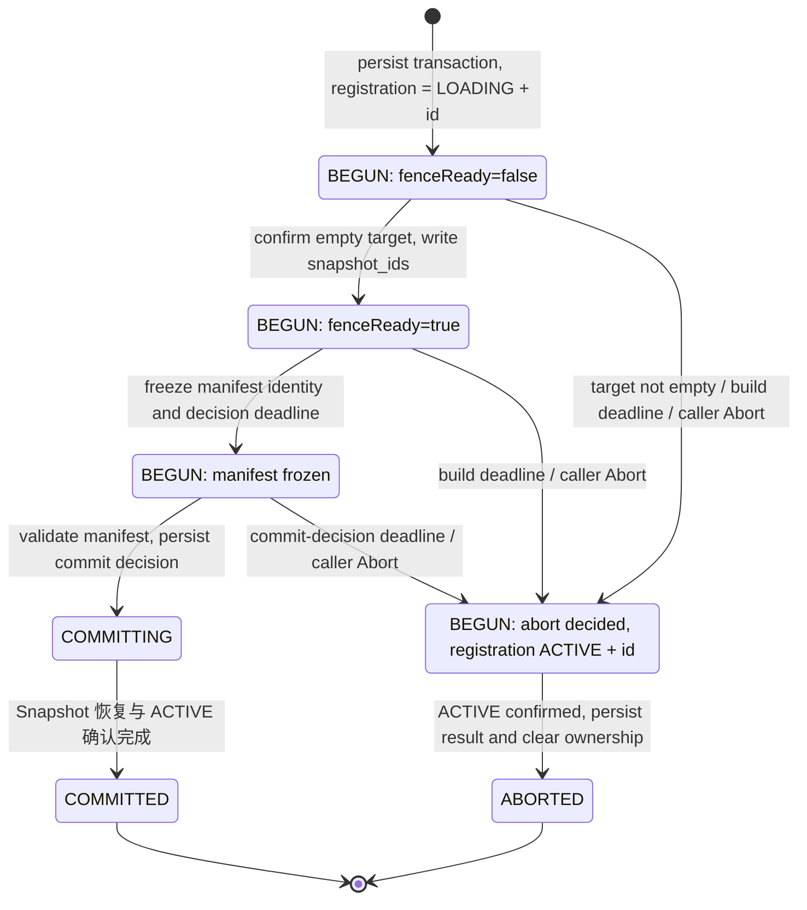

<!--
 Licensed to the Apache Software Foundation (ASF) under one or more
 contributor license agreements.  See the NOTICE file distributed with
 this work for additional information regarding copyright ownership.
 The ASF licenses this file to You under the Apache License, Version 2.0
 (the "License"); you may not use this file except in compliance with
 the License.  You may obtain a copy of the License at

    http://www.apache.org/licenses/LICENSE-2.0

 Unless required by applicable law or agreed to in writing, software
 distributed under the License is distributed on an "AS IS" BASIS,
 WITHOUT WARRANTIES OR CONDITIONS OF ANY KIND, either express or implied.
 See the License for the specific language governing permissions and
 limitations under the License.
-->

# Fluss 主键表 BulkLoad 架构设计

## 1. 架构概览

BulkLoad 面向已经由批任务计算完成的主键表最终状态。BulkLoad caller 或 build task 通过
Client SDK 为每个 bucket 直接生成一个 Fluss KV Snapshot；Coordinator 在事务 fence 内验证
这些 Snapshot，并将其注册为普通 Completed Snapshot；TabletServer 随后通过普通副本恢复路径
安装 Snapshot，初始化在线 Log 边界并恢复服务。

每个 bucket 的持久数据模型是：

```text
Snapshot S at log offset E  ->  online Log [E, +infinity)
```

Snapshot `S` 保存完整 KV 状态并记录逻辑边界 `E`。服务该状态所需的物理数据由 Snapshot 和
从 `E` 开始的在线 Log 组成。在线写入从 `E` 开始分配 offset；读取主键表时先读取 Snapshot，
再消费从 `E` 开始的 Log，即可得到连续的当前状态。



### 1.1 分层职责

| 层次 | 组件 | 职责 |
| --- | --- | --- |
| 调用层 | BulkLoad caller、Flink Begin/Build/Committer | 启动事务、按 bucket 构建最终状态、汇总全部 bucket 结果并提交 |
| 构建层 | `BulkLoadClient`、`BulkLoadBucketWriter` | 冻结构建上下文、主键合并、生成标准 KV Snapshot 和 manifest |
| 事务层 | Coordinator BulkLoad manager | 建立目标 fence、验证 manifest、持久化提交决定、原子推进普通元数据和目标状态 |
| 元数据层 | ZooKeeper | 保存 transaction、registration、assignment 和普通 Completed Snapshot 引用 |
| 服务层 | TabletServer Replica | 安装 `LOADING` fence、恢复 Snapshot、将本地 Log 初始化到 `E`、确认 `ACTIVE` |
| 存储层 | 共享文件系统 | 保存 Snapshot 数据、Snapshot metadata 和外层 manifest |

最终数据文件从创建时起使用标准路径和标准格式。提交阶段只建立元数据引用，其处理量由 bucket
数量和描述文件大小决定。Commit 完成后，Snapshot、在线 Log、周期 Snapshot 和湖存储分层均按
普通 Fluss 生命周期工作。

### 1.2 物理目标与原子范围

一次 transaction 覆盖一个物理目标的全部 bucket。物理目标是非分区表，或分区表中的一个已
确定分区。Begin 要求目标为空，并在 registration 中以物理目标为单位建立排他 fence。目标在
Snapshot 注册和副本恢复期间保持 `LOADING`；全部 bucket 收敛后切换为 `ACTIVE`，transaction
完成前仍由同一 registration 中的 `bulkLoadId` 保持所有权。

当前能力边界如下：

- 目标为新的空主键表，或一个完整指定的空静态分区；
- 每次 transaction 覆盖一个物理目标，分区之间分别提交；
- 输入包含目标表全部列，使用 Default Merge Engine；
- 目标不含自增主键，Flink 构建不使用 speculative execution；
- Flink 接入点为 Flink 2.2 batch `INSERT INTO`。

## 2. 核心数据模型

### 2.1 Snapshot 边界 E

`E` 是 Snapshot 对应的 log end offset，也是提交后在线 Log 的起始 offset。它表示 Snapshot
承载的状态边界；边界以下的状态已经完整包含在 KV 文件中。

`BulkLoadBucketWriter` 提供两条完成路径：

- `finish()` 遍历最终 RocksDB 状态，按主键去重后的行数作为 `E`。Flink SQL BulkLoad 使用
  这条路径。
- `finishAtLogEndOffset(long E)` 接收 BulkLoad caller 持有的非负上游边界。

同一主键被多次写入 bucket writer 时，后加入的完整行覆盖先加入的完整行，即 Default Merge
Engine 的 last-win 语义。`finish()` 的计数发生在最终状态遍历中，因此重复主键只计一次。

每个 bucket 的 `E` 独立确定。普通构建路径中，非空 bucket 的 `E` 为正数；空 bucket 的
`E` 为零。副本恢复加载 Snapshot 后，将本地空 Log tail 持久初始化到 `E`，第一条在线记录使用
offset `E`。

### 2.2 核心抽象

| 抽象 | 含义 |
| --- | --- |
| Physical target | fence、空检查和原子可见性的单位 |
| BulkLoad transaction | 一个物理目标全部 bucket 的一次装载，具有持久 handle 和状态 |
| Build context | Begin 冻结的可序列化构建契约，包含 handle、表格式、bucket 路由和 Snapshot ID |
| Bucket writer | 独占一个 bucket 的本地 RocksDB 最终状态构建器 |
| Bucket files | 一个 bucket 的不透明可序列化结果，内部只保存 Snapshot metadata 引用 |
| Outer manifest | 按 bucket 排序的 Snapshot metadata 引用集合，是 Commit 的文件事实源 |
| Completed Snapshot | Commit 注册到普通 bucket 元数据树、供 Replica 恢复的标准 Snapshot |

Build context 可以传给单进程 builder 或分布式 build task。Bucket files 只在 Build 与
Committer 之间传递。Manifest 和 RPC message 均由 Client SDK 管理。

## 3. 公共 Client API

公共入口位于 `org.apache.fluss.client.bulkload`，通过现有 `Connection` 获取：

```java
BulkLoadClient bulkLoadClient = connection.getBulkLoadClient();
```

核心 API 签名如下：

```java
BulkLoadBeginResult begin(
        PhysicalTablePath target,
        String submissionId,
        @Nullable Duration buildTimeout,
        Duration awaitTimeout)
        throws Exception;

BulkLoadStatus commit(
        BulkLoadBuildContext context,
        Collection<BulkLoadBucketFiles> bucketFiles,
        Duration awaitTimeout)
        throws Exception;

BulkLoadStatus abort(BulkLoadHandle handle) throws Exception;

BulkLoadBucketWriter(
        BulkLoadBuildContext context, int bucketId, File localWorkDir);
void add(InternalRow row);
BulkLoadBucketFiles finish() throws Exception;
BulkLoadBucketFiles finishAtLogEndOffset(long logEndOffset) throws Exception;
```

`submissionId` 是调用方为一次逻辑提交分配的稳定标识。Begin 将它与调用者身份组成幂等键，
重试时恢复同一 transaction。`buildTimeout` 控制构建决定期限，`null` 使用服务端默认值；
`awaitTimeout` 限制客户端等待 Begin 或 Commit 收敛的时间。

`BulkLoadBeginResult` 包含持久状态。`isBuildRequired()` 为 `true` 时，结果同时携带
`BulkLoadBuildContext`；该上下文包含冻结的 `TableInfo`、bucket 路由规则、remote data
directory、transaction handle 和每个 bucket 的 Snapshot ID。已经进入持久提交决定的恢复流程
由 Client 完成，调用方收到终态结果后无需重新构建。

每个 `BulkLoadBucketWriter` 绑定一个 bucket 和一个本地 RocksDB 实例。`add` 重新校验
`BulkLoadBuildContext.bucketOf(row)` 的结果。writer 完成后返回 `BulkLoadBucketFiles`，调用方
把完整的 `[0, numBuckets)` 集合交给 `commit`。Client 校验 transaction identity 和 bucket
完整性，发布外层 manifest，并通过 Commit RPC 等待持久决定收敛。

## 4. Flink Begin / Build / Committer 拓扑

Flink SQL 保留 Planner 生成的 Source、Calc、Join、Aggregate 等算子，BulkLoad sink 使用
Begin、Build 和标准 Sink V2 Committer 三层运行时拓扑：



Begin operator 在运行时消费唯一 trigger，调用公共 `begin` API，并将冻结的 build context
broadcast 给全部 Build subtasks。事务创建、目标 fence 和遗留 transaction 恢复均发生在该算子
中，JobManager 的作业构建与 `EXPLAIN` 不产生事务副作用。若 Begin 已恢复提交中的 transaction，
该算子完成持久决定且不输出 build context。

Build operator 有两路输入：按 Fluss bucket 分区的最终 `RowData`，以及 broadcast 的 build
context。其 parallelism 固定为 `numBuckets`，subtask `b` 独占 bucket `b` 的 RocksDB writer；
空 bucket 同样创建 writer。数据输入结束时，每个 subtask 调用 `finish()`，因此 Snapshot 边界
等于该 bucket 的最终去重行数，并输出一个包含 context 与 bucket files 的
`BulkLoadCommittable`。

终端 sink 的 `CommittingSinkWriter` 在 end-of-input 后提交完整 committable 集合，并通过标准
writer state 支持恢复。parallelism 为 1 的 Committer 校验所有 committable 属于同一 build
context，收集全部 bucket files，再调用公共 `BulkLoadClient.commit`。Flink 的 committable
序列化、恢复和 Commit 重试遵循 Sink V2 生命周期。

## 5. Coordinator RPC 与端到端时序

BulkLoad 线协议复用 `AdminGateway`，API key 从版本 0 开始：

| RPC | ApiKey | 请求 | 响应 |
| --- | ---: | --- | --- |
| `BeginBulkLoad` | 1065 | physical target、caller token、可选 build timeout | `created`、持久 status；fence 完成时携带 target info |
| `CommitBulkLoad` | 1066 | handle；首次提交携带 manifest path、length、SHA-256 | 当前持久 status |
| `AbortBulkLoad` | 1067 | handle | `ABORTED` status |

Begin target info 向 Client 提供 handle、冻结的表定义与文件目录，以及按 bucket 排列的 Snapshot
ID。Commit 的 manifest path、length 和 SHA-256 构成一个 identity：第一次 Commit 完整提供，
Coordinator 将其写入 transaction；后续恢复可仅携带 handle。携带 identity 的重试必须与持久值
完全一致。



每次公共 `begin` 调用只发送一次 `BeginBulkLoad` RPC，并在本次调用的 await timeout 内等待。
调用方未取得确定结果时，以相同 `submissionId` 再次调用 `begin`；新的 RPC attempt 由
Coordinator 按 caller identity 和 token 恢复同一持久 transaction。

`commit` 在 Client 内部实现有界 retry loop。遇到 retriable failure 或未知结果时，它使用相同
handle 和 manifest identity 重发 `CommitBulkLoad`，直到 RPC 返回终态或 await timeout 用尽。

## 6. ZooKeeper 元数据与 manifest

### 6.1 Namespace

BulkLoad 使用独立 namespace 保存事务控制事实：

```text
/bulk_load
└── transactions
    ├── tables
    │   └── {tableId}
    │       └── {bulkLoadId}              # transaction
    └── partitions
        └── {partitionId}
            └── {bulkLoadId}              # transaction
```

transaction 绑定系统分配的 `tableId` 或 `partitionId`；数据库、表或分区名称用于冻结并校验
registration identity。

可服务数据使用现有 Fluss 元数据树：

```text
/metadata/databases/{database}/tables/{table}[/partitions/{partition}]
    # registration: data_state + nullable bulk_load_id

/tabletservers/tables/{tableId}/buckets/{bucketId}
/tabletservers/partitions/{partitionId}/buckets/{bucketId}
└── snapshots/{snapshotId}                 # ordinary Completed Snapshot reference
```

assignment 和 Coordinator epoch 继续使用既有节点。TabletServer registration 创建时，同时创建
`/tabletservers/session-fences/{serverId}-{sessionId}` ephemeral 节点。Coordinator 在提交
checked-multi 中同时检查 registration version 和该 session fence：registration version 防止同一
节点被修改，session fence 防止 registration 删除重建后 version 重新从零开始造成 ABA。

### 6.2 Transaction 内容

transaction 使用严格、确定性的版本化 JSON，保存以下持久事实：

- handle、state、caller token、creator identity；
- frozen physical target、remote data directory、schema ID；
- registration metadata path 与 version；
- 按 bucket id 排列的 `snapshot_ids`；
- created、updated、build deadline、commit-decision deadline 和 result-expiry 时间；
- 冻结的 manifest path、length、SHA-256；
- Abort reason 与 message。

未知字段、缺失必填字段、无效字段组合和不支持的版本会被拒绝。`snapshot_ids` 在 fence 完成后
一次写入，其数组下标就是 bucket id。该字段同时证明 Begin 的服务端准备阶段已经完成，并为
manifest 验证、普通元数据注册和活跃文件保护提供 Snapshot identity。

registration 的 `bulk_load_id` 是物理目标当前 BulkLoad 所有权的唯一事实。`LOADING + id` 表示
目标已关闭外部访问，`ACTIVE + id` 表示数据已经恢复服务但 transaction 尚未持久化终态，
`ACTIVE + null` 表示目标没有被 BulkLoad 占用。`LOADING + null` 是非法组合。transaction 在终态
后继续保留一段时间，以回答 Begin、Commit 和 Abort 重试。

### 6.3 Outer manifest

Client 在规范路径发布一个小型 JSON manifest：

```json
{
  "version": 1,
  "bulk_load_id": "<transaction UUID>",
  "buckets": [
    {
      "bucket_id": 0,
      "snapshot_metadata": {
        "path": "<canonical _METADATA path>",
        "length": 123,
        "sha256": "<64 lowercase hex characters>"
      }
    }
  ]
}
```

`buckets` 按 bucket id 排序并完整覆盖 `[0, numBuckets)`。每个元素只含一个标准 Snapshot
metadata 文件引用。

Coordinator 先验证 outer manifest 的规范路径、长度和 SHA-256，再验证每个 Snapshot：

- transaction、physical target、bucket ID 和预分配 Snapshot ID 一致；
- Snapshot location 与 metadata path 位于该 transaction 推导出的标准目录；
- metadata digest、metadata length 和 private file length 一致；
- private file 的本地相对路径安全且唯一，远程路径位于 Snapshot 目录；
- shared files 和 auto-increment ranges 为空；
- `log_offset` 非负；
- FULL changelog image 带 row count，WAL image 的 row count 为空；
- incremental size 等于 private files 的总长度。

解析结果直接形成每个 bucket 的 `CompletedSnapshot`，供 Commit 的普通元数据注册使用。

## 7. 事务生命周期与原子边界



transaction 从创建开始即持久化为 `BEGUN`。`snapshot_ids` 为空时 `fenceReady=false`，Client
尚未取得 build context；空目标确认完成后，Coordinator 写入完整 `snapshot_ids`，state 仍为
`BEGUN` 且 `fenceReady=true`。Commit 首先在同一 state 中冻结 manifest identity 与
commit-decision deadline。严格验证完成后的 `BEGUN -> COMMITTING` 才是持久提交决定。

ready fence 的 `snapshot_ids` 保护 build task 生成的候选 Snapshot。调用方可在任一 `BEGUN`
阶段 Abort；目标非空会在 fence 阶段自动 Abort，build deadline 会在 manifest 冻结前自动 Abort，
commit-decision deadline 会在 manifest 冻结后、提交决定前自动 Abort。进入 `COMMITTING` 后，
任一 Coordinator leader 都沿同一决定推进至 `COMMITTED`。逐 bucket 注册期间目标保持
`LOADING`，因此外部访问只会观察完整提交前或完整提交后的状态。

### 7.1 Begin

Begin 解析 physical target，冻结 schema、bucket count、bucket routing、文件格式和 remote data
directory。Coordinator 在一个 checked-multi 中创建 `BEGUN` transaction，并把 registration 从
`ACTIVE + null` 切换为 `LOADING + bulkLoadId`；transaction 此时没有 `snapshot_ids`。

当前 assignment holder 安装 `LOADING` metadata，关闭外部访问，确认本地 Log、high watermark
和 KV 状态为空。Coordinator 将 confirmation 与 assignment、TabletServer registration、session
fence 以及普通 Completed Snapshot 元数据一起复核，然后为所有 bucket 分配 Snapshot ID，并在
transaction 中一次写入完整 `snapshot_ids`。Begin 随后返回 build context。

transaction 不保存 replica assignment。创建 transaction 时 Coordinator 检查当前 assignment
version；每轮 fence、manifest validation、Snapshot 注册和副本收敛都重新读取当前 assignment，
并将 confirmation 与当前 holder registrations 和 sessions 重新匹配。bucket count 和 routing
来自冻结的表定义，assignment 变化通过新的 convergence round 收敛。

### 7.2 Build

每个 bucket writer 在本地 RocksDB 中按主键合并完整行，flush 后创建 checkpoint，再将 checkpoint
文件写到标准 KV Snapshot 目录。Snapshot metadata 记录 physical target、Snapshot ID、文件
handle、row count 形态和边界 `E`。数据文件和 metadata 使用不可覆盖的 create-or-exact-reuse
发布规则；相同对象可由重试复用，内容冲突会使构建失败。

Build 只生成候选文件，transaction 保持 `BEGUN`。

### 7.3 Commit

Client 要求 bucket files 完整覆盖目标，发布 outer manifest，并提交其 identity。Coordinator 在
`BEGUN` transaction 中冻结 identity 和 commit-decision deadline，读取并严格验证 manifest 与
全部 Snapshot metadata，再次复核当前 `LOADING` confirmation，随后将 transaction 切换为
`COMMITTING`。

Coordinator 按 bucket 通过 create-or-exact-reuse 注册普通 Completed Snapshot ZNode，同时把同一
`CompletedSnapshot` 放入运行时 Snapshot store。普通副本协议驱动 leader 和 follower 恢复
Snapshot，并把本地 Log tail 初始化到 Snapshot 的 `E`。全部副本确认后，Coordinator 将
registration 切换为 `ACTIVE + bulkLoadId`、发布 ACTIVE metadata 并等待确认，最后在同一个
checked-multi 中写入 `COMMITTED`，同时将 registration 释放为 `ACTIVE + null`。Coordinator
随后按普通元数据协议发布释放所有权后的最新 registration version；当前 TabletServer 实例确认后，
Commit 才返回终态。

### 7.4 Abort

Abort 适用于 `BEGUN`。Coordinator 先在一个 checked-multi 中将 registration 切换为
`ACTIVE + bulkLoadId`，并在 transaction 中持久化 Abort reason。任一新 Coordinator 都能从这两项
持久事实恢复同一 Abort 决定。TabletServer 确认 ACTIVE metadata 后，Coordinator 在同一个
checked-multi 中将 transaction 写为 `ABORTED`，同时将 registration 释放为 `ACTIVE + null`，
再发布并确认该最新普通 ACTIVE metadata，随后返回 Abort 结果。
调用方在明确的构建失败或主动取消时发起 Abort；Commit RPC 结果未知时由 Client 继续读取和
推进持久决定。

### 7.5 Checked-multi 边界

| 阶段 | 关键检查 | 原子写入 |
| --- | --- | --- |
| 创建 transaction | Coordinator epoch、`ACTIVE + null` registration 与 assignment version | transaction、`LOADING + id` registration |
| 完成 fence | transaction、`LOADING + id` registration、assignment、holder registration 与 session | 完整 `snapshot_ids` |
| 冻结 manifest | `BEGUN` transaction、`LOADING + id` registration | manifest identity 与 decision deadline |
| 决定提交 | Coordinator epoch、transaction、`LOADING + id` registration、assignment、holder session | `BEGUN -> COMMITTING` |
| 注册 bucket | 相同控制事实、bucket root version、Snapshot node identity | 创建普通 Snapshot ZNode，或确认已存在的精确值 |
| 恢复目标 | transaction、`LOADING + id` registration、assignment 与 holder session | `ACTIVE + id` registration identity |
| 完成 transaction | `ACTIVE + id` registration、transaction、assignment 与 holder session | terminal state、result expiry、`ACTIVE + null` registration |

多个 checked-multi 通过 `LOADING` fence 和持久 `COMMITTING` 决定组成一个可恢复的原子提交。

## 8. 一致性、恢复与清理

### 8.1 关键不变量

| 不变量 | 保证机制 |
| --- | --- |
| 一个 physical target 最多一个非终态 transaction | registration 中唯一 `bulk_load_id` 与 ZooKeeper CAS |
| Begin 返回 build context 时目标为空且外部访问已关闭 | `LOADING` registration、TabletServer confirmation、普通元数据复核 |
| bucket 结果属于同一 transaction | build context、Snapshot ID、规范路径和 manifest 完整性校验 |
| 部分 bucket 对用户不可见 | 元数据注册和副本恢复期间保持 `LOADING` |
| Commit 重试得到同一结果 | 冻结 manifest identity、持久提交决定、create-or-exact-reuse |
| 文件引用交接连续 | registration 所有权关联 transaction 的候选 Snapshot，终态与所有权释放原子完成 |

### 8.2 Coordinator 与 Replica 恢复

Coordinator 启动时从 table 和 partition registration 的非空 `bulk_load_id` 枚举非终态
transaction：

- `BEGUN` transaction 继续完成 fence，或等待 Commit/Abort；
- 已冻结 manifest 的 `BEGUN` transaction 重新校验 manifest，并在 confirmation 复核后决定提交；
- `COMMITTING` transaction 根据持久 manifest identity 重新解析 Snapshot metadata，确认已注册的
  bucket 并继续其余 bucket，然后恢复副本；
- registration 已为 `ACTIVE` 的 transaction 完成最后的 terminal state 写入。

terminal state 与 `ACTIVE + null` 已经原子持久化时，Coordinator 的普通启动元数据广播会发布
当前 registration version；Begin、Commit 或 Abort 重试也会等待当前 TabletServer 实例确认该
version 后再返回持久结果。

TabletServer 的 ZooKeeper 连接在同一 session 内短暂中断时，进程内的 replica、角色和 BulkLoad
fence 状态仍然连续。`SUSPENDED` 期间 TabletServer 关闭外部访问并使旧的在途请求失效；
`RECONNECTED` 后只验证 registration 和 session fence 仍由原 session 持有，验证成功即恢复访问。
普通增量 `UpdateMetadata` 和 `NotifyLeaderAndIsr` 不承担重连完成信号，也不改变 BulkLoad
transaction 状态。

TabletServer incarnation 变化后，新的 registration 和 session 必须重新安装 metadata 并完成副本
恢复。Completed Snapshot 是 leader replacement 和 follower recovery 的普通恢复来源。Replica
从 Snapshot 的 `E` 恢复 KV，再从同一 offset 接续在线 Log。

### 8.3 活跃引用与终态回收

文件清理在读取普通 Snapshot 引用时，同时读取 registration 所属的非终态 transaction。
transaction 的 `snapshot_ids` 可直接推导每个候选 Snapshot 目录。读取器在普通引用读取前后复核
Coordinator epoch、registration 和 transaction version；观察变化时放弃本轮清理。

引用交接顺序为：

```text
registration.bulk_load_id -> transaction.snapshot_ids
                              |
                              v Commit registers metadata
ordinary Completed Snapshot references
                              |
                              v transaction reaches terminal state
ordinary Snapshot lifecycle
```

`ABORTED` transaction 的候选 Snapshot 进入 orphan grace period。`COMMITTED` transaction 的
Snapshot 由普通 Completed Snapshot 引用保护。terminal result GC 在结果保留期结束后确认
registration 不再属于该 transaction，删除 outer manifest，再通过 Coordinator epoch、registration
与 transaction version 保护的 checked-multi 删除 transaction；空 transaction 父节点可随后回收。

普通 Remote Log 引用由既有清理路径独立读取，BulkLoad 活跃引用只增加 transaction 所持的
Snapshot IDs。

## 9. 在线续写与 Tiering 交接

Commit 恢复 Replica 时，Snapshot boundary `E` 同时成为本地 Log start offset、log end offset 和
high watermark 的初始边界。在线 writer 因而从 offset `E` 追加。周期 Snapshot 从已安装 Snapshot
继续增量演进，读取路径使用 Snapshot 状态加 `[E, +infinity)` 的在线 Log。

对于启用湖存储的主键表，首次 tiering 尚无 committed bucket offset。Tiering split generator 在
发现 Completed Snapshot 时创建 `TieringSnapshotSplit(snapshotId, E)`，Snapshot reader 将完整 KV
状态写入湖表，Tiering Committer 把 `E` 记录为该 bucket 的 tiered offset。后续轮次从已提交的
`E` 开始生成 bounded Log split，只消费在线 Log 新增部分。

Flink SQL BulkLoad 使用 `finish()`：非空 bucket 的去重行数形成正数 `E`，因此首次 tiering 会选择
Snapshot split；空 bucket 的 `E=0` 且没有 KV 行，当前轮无需产生 split。在线写入使 log end offset
前进后，该 bucket 进入普通 tiering 调度。

至此，BulkLoad 的长期可服务形态与普通主键表一致：每个 bucket 由一个 Completed Snapshot 确立
边界，在线 Log 从该边界连续追加，tiering 在 Snapshot 与后续 Log 之间按同一 offset 交接。
