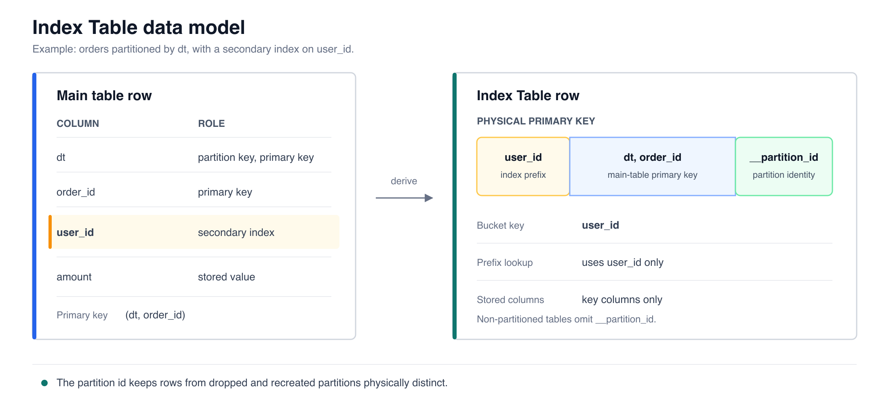
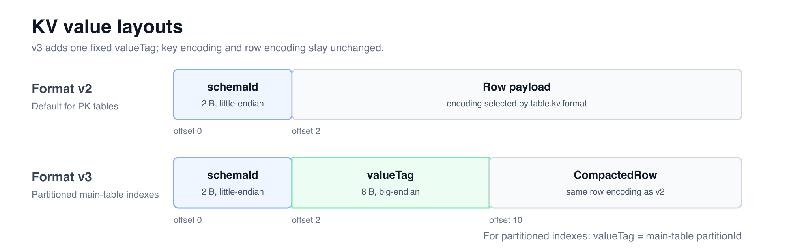
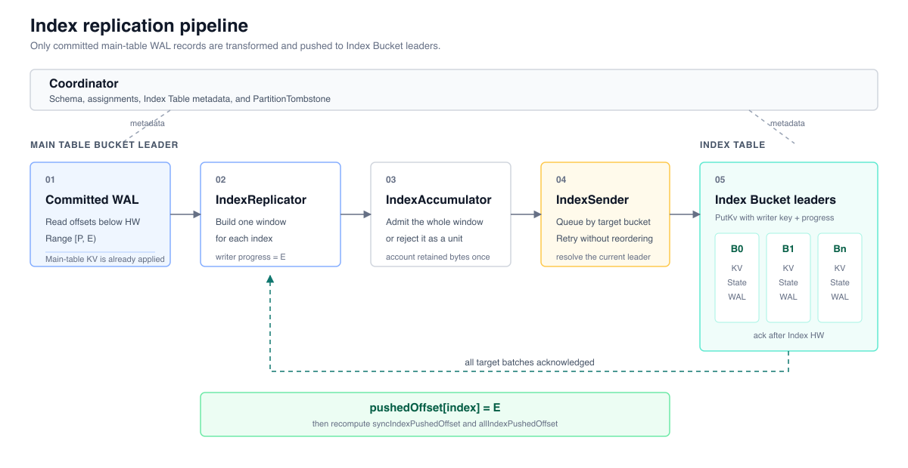
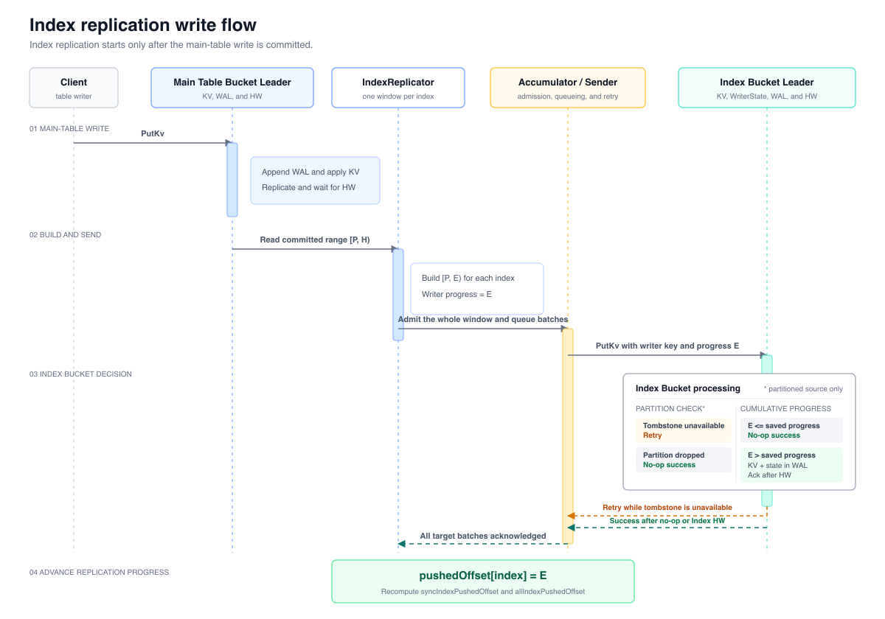
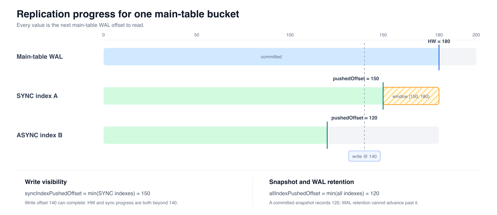
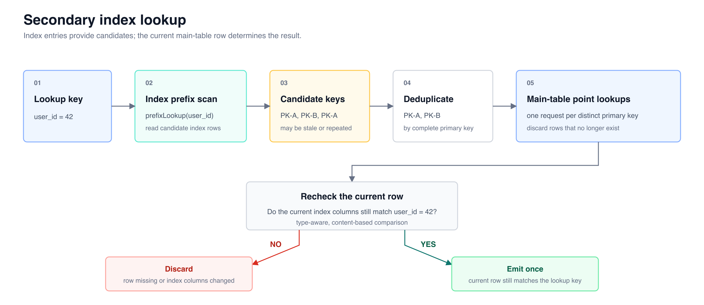
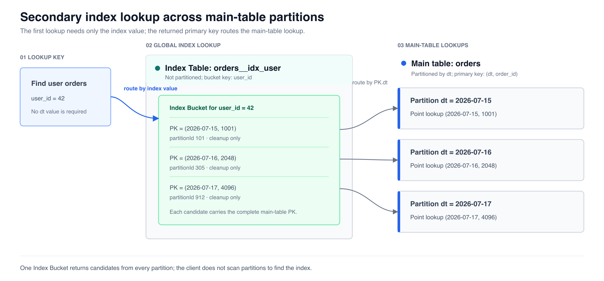

# FIP-38: Global Secondary Index

- Source: <https://cwiki.apache.org/confluence/display/FLUSS/FIP-38%3A%2BGlobal%2BSecondary%2BIndex>
- Created by: Yang Wang
- Source page last updated: Apr 15, 2026

|  |  |
|---|---|
| Discussion thread | <https://lists.apache.org/thread/jp1bshpbnlfmwdtfswgbc3670fq4hof3> |
| Vote thread | *TBD* |
| ISSUE | *TBD* |
| Release | `<Fluss Version>` |

> **方案概要**
> - 每个二级索引在系统内部对应一张独立的 Index Table，索引复制复用现有 `PutKv`
> - 主表 bucket leader 的 HW 推进后，`IndexReplicator` 从已提交的 WAL 生成索引记录并异步写入 Index Table；每个索引用 `pushedOffset` 记录已完成的复制位置
> - 每个 Index Bucket 按来源主表 `TableBucket` 保存已经接收的最大 writer progress，避免 leader 切换前发出的迟到请求覆盖更新的数据
> - 每个索引的 `(name, type, columns, visibility, bucketCount)` 都保存在 Schema 中；Flink connector 参数只负责和 Schema 中的索引定义互相转换
> - 写入可见性支持 `sync | async`，默认 `sync`
> - 查询先对 Index Table 执行 `prefixLookup`，再按主表完整主键查询主表；查询主表前按主键去重，查询后再次校验索引列
> - 删除主表分区时，在主表 metadata 中记录 `PartitionTombstone`，用它过滤并清理该分区的索引记录

## 1. Motivation

Fluss 的 Primary Key Table 支持按完整主键点查；当表的 bucket key 允许路由时，也支持按 bucket key 前缀查询。但对于既不是完整主键、又不能定位主表 bucket 的非主键列（如 `user_id`、`device_id`），现有 lookup 路径无法直接完成查询。此时用户不得不：

1. **冗余建表**：为每个查询维度创建独立的 PK Table，数据写入多份，存储和写入成本翻倍。
2. **外部系统**：引入额外系统维护二级索引列到主键的映射，增加运维复杂度和数据一致性风险。
3. **全表扫描**：在 Flink 中扫描全表再过滤，延迟高、资源消耗大，不适合实时场景。

这些方案在成本、一致性和实时性之间难以兼顾。我们需要一种原生的二级索引机制，让用户在建表时声明索引列，系统自动维护索引数据，使 Flink Lookup Join 和 Java lookup API 能够通过非主键列查询。

**核心目标**：

- 用户通过 DDL 声明索引列，零额外运维
- 二级索引数据自动随主表写入更新，可见性语义可配置且明确
- 支持跨分区的二级索引查询
- 二级索引数据具备副本容错能力

**不在本 FIP 范围内**：

- 不支持对已有表在线执行 `ADD INDEX` / `DROP INDEX`。其中 `ADD INDEX` 需要回填历史数据，后续可由独立的离线任务完成

## 2. Public Interfaces

本 FIP 会增加或改变以下接口。具体定义和默认值见 §3.12。

| 接口 | 变化 |
|------|------|
| Schema API | 每个索引在 `Schema` 中保存为 `(name, type, columns, visibility, bucketCount?)`。未指定 `visibility` 时使用 `SYNC`，未指定 bucket 数时继承主表 bucket 数。 |
| Flink SQL connector | `secondary-index.<name>.columns`、`.visibility` 和 `.bucket.num` 与 Schema 中的索引定义互相转换。`visibility` 按索引设置，没有表级配置。 |
| Java lookup API | `Table.getSecondaryIndexLookuper(String indexName)` 先查 Index Table，再按主表完整主键去重并查询主表，最后校验当前索引列是否仍匹配查询条件。 |
| KV 幂等写入模式 | 新增 `table.kv.idempotence-protocol-version` 作为格式选择器。取值 `0` 时使用现有的连续 batch sequence 模式；取值 `1` 时使用累计进度模式，将 64 位 `writerId` 扩展为 128 位 `WriterKey`，并用非负 int64 表示调用方已经处理到的进度。累计进度模式只执行进度大于 WriterState 记录值的 batch，使用条件见 §3.5.4。 |
| 表属性与服务端配置 | Coordinator 创建 Index Table 时显式设置 `table.kv.idempotence-protocol-version = 1`。`index.replication.*` TabletServer 配置控制复制线程、单次 WAL 读取大小、重试和缓冲区上限。 |
| KV value 格式 | 普通 PK Table 未显式设置 `table.kv.format-version` 时使用 v2；非分区主表对应的 Index Table 固定使用 v2，分区主表对应的 Index Table 固定使用带 `valueTag` 的 v3，具体布局见 §3.2。 |
| KV batch、WAL 与 WriterState | 累计进度模式使用新的 KV record batch、KV Table WAL 和 WriterState Snapshot 格式，保存完整 `WriterKey`、int64 进度和对应的目标 WAL offset。连续 batch sequence 模式继续使用现有格式。 |
| 网络协议 | `PutKv` 增加 API version 2，用于传输累计进度模式的 record batch。API version 只表示节点能否解码这种 batch；目标表 metadata 决定写入模式，服务端拒绝 batch 格式与表配置不一致的请求。本 FIP 不增加索引专用 RPC。 |
| Metrics | `TabletServerMetricGroup` 增加固定数量的索引复制、恢复、WriterState 和 PartitionTombstone 指标，不使用 table/index/bucket label。 |
| DDL 与表生命周期 | 只能在创建 PK Table 时声明二级索引。不支持在线 `ADD INDEX`、在线 `DROP INDEX`、带二级索引主表的 Schema 变更。公共 client 不为内部 Index Table 创建 writer；服务端拒绝与表配置不一致的 KV batch。 |

## 3. Proposed Changes

### 3.1 每个索引对应一张 Index Table

每个二级索引在系统内部对应一张独立的 **Index Table**，拥有自己的 bucket、KV 存储和 WAL。

Index Table 复用普通表已有的分布式能力：Coordinator 负责 bucket 分配，Replica 协议负责副本同步，Snapshot 保存 KV 状态。二级索引不需要新的存储引擎或副本协议。

索引复制复用现有 `PutKv` 路径：主表 bucket leader 的 HW 推进后，`IndexReplicator` 向对应的 Index Bucket leader 发送 `PutKv`（详见 §3.5）。

Coordinator 创建的 Index Table 始终是 Fluss 内部表，不启用 lake，不继承主表的 lake format，不在 LakeCatalog 中建表，也不参与 lake tiering。增加二级索引不会改变主表原有的 lake 表生命周期或删除行为。

每个索引可以在 Schema 中单独指定 bucket 数；未指定时继承主表 bucket 数。Index Table 的副本数始终继承主表，不提供按索引设置的 replication factor。

### 3.2 Index Table 数据模型

**Schema、Primary Key 和 bucket key**

Index Table 行只包含索引列、主表 Primary Key 列，以及分区主表需要的内部列。索引列与主表 Primary Key 列同名时只保留一次；Index Table 不保存主表的非主键列或 WAL offset。

| 主表类型 | Index Table 的列和 Primary Key 顺序 | bucket key |
|----------|--------------------------------------|------------|
| 非分区表 | 索引列，随后是尚未出现的主表 Primary Key 列 | 索引列 |
| 分区表 | 索引列，随后是尚未出现的主表 Primary Key 列，最后是 `__partition_id` | 索引列 |

索引列位于 key 开头。Client 使用索引列编码后的前缀执行 `prefixLookup`，再使用主表 Primary Key 列查询主表。`__partition_id` 不参与查询条件或 bucket 计算。

同名分区删除后重建会获得新的 `partitionId`。旧分区的 DELETE 携带旧的 `__partition_id`，不会删除新分区的索引行。



**Index Table 的 KV 编码**

`table.kv.format-version` 标识一张表使用的物理 key 和 value 编码。Index Table 使用 `table.kv.format = COMPACTED`，其 format version 不继承主表，而是由 Coordinator 根据主表是否分区确定：

| 主表类型 | Index Table format version | key encoding | value 布局 |
|----------|----------------------------|--------------|------------|
| 非分区表 | v2 | v2 | `[schemaId (2B, little-endian)][CompactedRow]` |
| 分区表 | v3 | 与 v2 相同 | `[schemaId (2B, little-endian)][valueTag = partitionId (8B, big-endian)][CompactedRow]` |

v3 只允许用于 Coordinator 创建的分区主表 Index Table。它在 value header 中增加通用的 `valueTag`，不改变 key encoding 或 `CompactedRow` 编码。分区主表对应的 Index Table 把主表 `partitionId` 写入 `valueTag`。v2 的 row payload 从 byte offset 2 开始；v3 的 `valueTag` 从 byte offset 2 开始，row payload 从 byte offset 10 开始。

`KvValueLayout` 根据 `table.kv.format-version` 统一定义 schema id、`valueTag` 和 row payload 的位置。Java 写入与读取使用该布局，native compaction filter 安装时也从该布局取得 `valueTag` offset，避免各处分别维护固定位置。

分区表的 `partitionId` 同时保存在 key 的 `__partition_id` 和 value 的 `valueTag` 中。key 中的值用于区分分区删除前后的索引行；`valueTag` 供查询过滤和 compaction filter 直接读取。写入校验和删除后的清理规则见 §3.9。



Flink SQL DDL 示例见 §3.12.1.2；无论通过 Java Schema API 还是 Flink SQL 声明索引，Coordinator 都按上述规则派生相同的 Index Table Schema。

### 3.3 Coordinator 管理 Index Table 生命周期

Coordinator 在创建主表时创建 Index Table，并在主表删除时清理它们。每张 Index Table 都携带 `table.index-meta.main-table-id`，用于记录所属主表的 tableId。该属性只能由 Coordinator 写入，用户不能通过建表接口设置。

**创建**：用户在 `CREATE TABLE` 中声明二级索引（详见 §3.12.1）。Coordinator 先为主表和全部 Index Table 分配 tableId、Schema 和 assignment，再通过一个 ZooKeeper transaction 写入全部 Fluss metadata。任一路径冲突或提交前的 metadata 冲突都会使整个 transaction 失败，不会只留下主表或部分 Index Table。Index Table 不会在 LakeCatalog 中创建，主表原有的 LakeCatalog 建表流程保持不变。

**分区管理**：Index Table 本身不分区（详见 §3.8）。主表创建分区时，只创建主表的 partition metadata 和 assignment。新分区产生数据后，`IndexReplicator` 按普通索引复制流程生成索引记录。

**并发修改**：同一数据库中的建表、开始删表、表变更和分区变更按顺序更新 metadata。创建主表和 Index Table 的 transaction 校验当前 Coordinator，并确认数据库 metadata 在提交前没有发生变化；修改或删除已有表、分区的 transaction 还会校验相应的 tableId 或 partitionId。表的实际清理在记录待删除状态后分批执行，不占用上述串行控制；清理过程通过待删除状态、tableId、ZooKeeper version 和 Coordinator epoch，避免旧 Coordinator 或迟到请求误删同名新表。

**删除**：

- 主表执行 `DROP TABLE` 时，Coordinator 先确认已有 Index Table 都属于该主表，再在一个 ZooKeeper transaction 中把主表和这些 Index Table 记录为待删除。只有全部写入成功后才开始清理
- 清理可以分批完成。发生临时故障时 Coordinator 会重试；Coordinator leader 切换后，新 Coordinator 会继续尚未完成的清理
- 主表仍存在时，用户不能单独删除它的内部 Index Table，避免主表 Schema 仍引用一个已经不存在的索引
- 主表已经不存在时，允许单独删除遗留的内部 Index Table
- 主表执行 `DROP PARTITION` 时，通过 `PartitionTombstone` 处理该分区的索引记录，详见 §3.9

**不支持的操作**：

| 操作 | 支持？ | 原因 |
|------|------------|------|
| 建表时声明索引 | ✓ | — |
| 主表删除时级联删除 Index Table | ✓ | — |
| 在线 `ADD INDEX` 到已有表 | ✗ | 需要回填历史数据，留待后续方案（详见 §7） |
| 在线 `DROP INDEX` | ✗ | 需要先停止索引复制、等待已有请求完成，再删除 Index Table 和 metadata（详见 §7）|
| 带二级索引主表的 Schema 变更 | ✗ | 当前没有同时修改主表 Schema、Index Table Schema 和索引复制逻辑的协议 |
| 内部 Index Table 的 Schema 变更 | ✗ | Index Table Schema 仅由建表时的主表 Schema 派生，禁止独立修改 |

### 3.4 主要组件和数据流

系统采用 push 方式复制索引。主表 Bucket Leader 的 HW 推进后，`IndexReplicator` 从已提交的主表 WAL 生成索引修改，并写入对应的 Index Bucket Leader。



运行时组件的职责如下：

| 角色 | 职责 |
|------|------|
| **主表 Bucket Leader** | 接收用户写入，维护主表 KV、WAL 和 HW；为每个索引维护复制进度 |
| **IndexReplicator** | 按索引读取已提交的主表 WAL，把主表修改转换为 Index Table 的 UPSERT 和 DELETE，并按目标 Index Bucket 组成复制窗口 |
| **IndexAccumulator / IndexSender** | 在内存中暂存完整复制窗口，发现目标 Leader，复用 `PutKv` 发送 batch，并在网络或 Leader 变化等临时故障后重试 |
| **Index Bucket Leader** | 根据 `PartitionTombstone` 和 WriterState 判断请求是否应执行，把新的索引修改写入 Index Table，并在对应 WAL 进入 HW 后确认完成 |

### 3.5 索引复制写入流程

索引复制不在主表 `PutKv` 的处理线程中执行。主表先完成 KV、WAL 和副本复制；HW 推进后，`IndexReplicator` 才能处理对应的 WAL。这样不会把尚未提交的主表写入暴露给 Index Table。

索引列发生变化时，复制端既要删除旧索引项，也要写入新索引项，因此带二级索引的主表必须使用 `FULL` changelog。二级索引不改变主表的 `table.log.format`。Coordinator 在建表时设置这一约束，Server 也会拒绝不满足该约束的表定义。

#### 3.5.1 复制写入流程



`sync` 和 `async` 都执行图中的完整复制流程。两者只在主表何时向 client 返回写入结果上不同，详见 §3.6.3。

#### 3.5.2 从主表 WAL 生成索引修改

`IndexReplicator` 解码已提交的主表 WAL 后，按如下规则生成 Index Table 的 UPSERT 和 DELETE：

| 主表 WAL 事件 | Index Table 写入 | 主表 WAL 必须提供 |
|----|----|----|
| INSERT / 新主键的 UPSERT（索引列非 null） | UPSERT `(newIndexKey, mainTablePrimaryKey)` | 修改后的完整行 |
| UPDATE（索引列从 A 变为 B） | DELETE `(A, mainTablePrimaryKey)` + UPSERT `(B, mainTablePrimaryKey)` | 修改前和修改后的完整行 |
| UPDATE（索引列不变） | 跳过 | 能够比较修改前后的索引列 |
| DELETE | DELETE `(currentIndexKey, mainTablePrimaryKey)` | 删除前的完整行 |
| Partial Update（没有携带索引列） | 根据合并前后的完整行判断 | 能够还原修改前和修改后的索引列 |

修改前或修改后的复合索引值只要包含 null，就不生成对应的 DELETE 或 UPSERT，详见 §3.10。索引写入只使用覆盖写和删除，不保存表示删除状态的索引行。

#### 3.5.3 复制窗口与发送

每个索引独立按复制窗口推进。设 `P` 为该索引下一条待读取的主表 WAL offset，`E` 为本次窗口处理结束后的下一个 offset；窗口覆盖 `[P, E)`。`E` 只能位于一次完整主表修改之后，不能拆开同一次 UPDATE 的修改前和修改后记录。

一个窗口按以下方式处理：

1. 每个索引最多只有一个正在处理的窗口。`IndexReplicator` 从 `[P, HW)` 读取一段主表 WAL，并确定 `E`。
2. 生成的索引修改按目标 Index Bucket 分组。每个非空目标最多生成一个 batch；同一窗口的所有 batch 使用同一个 `WriterKey`，并把 `E` 作为 writer progress。没有修改的目标不发送空 batch。
3. 如果整个窗口没有生成索引修改，直接把该索引的 `pushedOffset` 从 `P` 推进到 `E`。
4. 非空窗口的全部 batch 必须一起进入 `IndexAccumulator`。缓冲区无法接收整个窗口时，不加入任何 batch，`pushedOffset` 保持为 `P`，稍后从同一位置重试。
5. 只有全部目标 batch 都确认完成，才把 `pushedOffset` 推进到 `E`。任一 batch 仍在发送或重试时，窗口保持未完成，后续窗口不会越过它。

窗口同时受主表 WAL 读取量和目标请求期望大小的限制，但不能为满足期望大小而拆开一次主表修改或单个目标 batch。`IndexAccumulator` 只提供有界的内存缓冲，不承担故障恢复；需要重建索引修改时仍然读取主表 WAL。

在同一个 TabletServer 内，`IndexSender` 按目标 Index Bucket 排队，正在重试的 batch 不会被后续本地 batch 越过。Index Bucket 仍可能同时收到其他 TabletServer 的请求，以及主表 Leader 切换前发出的迟到请求，因此正确性不能依赖这条本地发送顺序。

#### 3.5.4 KV 幂等写入模式

本 FIP 保留现有的连续 batch sequence 模式，并增加累计进度模式。两种模式解决的写入问题不同，累计进度模式不是现有模式的超集。

| 维度 | 连续 batch sequence 模式 | 累计进度模式 |
|------|--------------------------|--------------|
| writer 标识 | 64 位 `writerId` | 将 64 位 `writerId` 扩展为 128 位 `WriterKey`，适用于需要由多个稳定 ID 共同确定 writer 的场景 |
| 进度字段 | int32 `batchSequence`，下一批必须与上一批连续 | 非负 int64 `writerProgress`；更大的值表示该 writer 在数据来源中处理到了更晚的位置 |
| 接收规则 | 检查连续性，并保留近期 batch 信息用于识别重试 | 每个 `WriterKey` 只保存最大的 writer progress 及其目标 WAL offset；只执行 progress 更大的 batch |
| 状态清理 | 不活跃的 writer 可以按 TTL 过期 | 不按 TTL 过期；只有存在可在恢复后重新应用的持久化生命周期信息时，才能显式移除 |

累计进度模式中，请求 `(WriterKey, writerProgress)` 的含义是：请求成功后，目标端已经包含该 writer 在 `writerProgress` 之前所有与当前目标相关的修改。接收端按以下规则处理：

1. WriterState 中没有该 `WriterKey`，或 `writerProgress` 大于已保存的进度时，执行 KV 修改，把修改和新的 WriterState 写入同一个 KV Table WAL batch，并在该 WAL offset 进入目标 Bucket HW 后返回成功。
2. `writerProgress` 等于或小于已保存的进度时，该请求已经被相同或更新的结果覆盖。接收端不解码 KV 记录、不修改 KV、不追加 WAL；保存当前进度的 WAL offset 进入 HW 后返回成功。
3. writer progress 为负数、batch 格式与表配置不一致，或一个 WAL append 同时包含无法统一判断为新请求或旧请求的 batch 时，在修改 KV 前拒绝。

累计进度模式不能从稀疏的 progress 值判断中间是否漏掉了请求。使用方必须同时保证：

1. `WriterKey` 在其状态存续期间稳定且唯一，不能分配给另一个逻辑 writer。
2. writer progress 不回退、不重置、不溢出；同一 `WriterKey` 和 progress 的重试必须产生相同的逻辑结果。
3. 发送更大的 progress 前，较早进度对应的目标修改必须已经持久化，或者包含在当前请求的重放结果中。更大的 progress 不能越过仍需执行、但尚未持久化且未被重放的修改。

因此，累计进度模式不允许彼此独立的 batch 任意乱序执行；它只允许已经被更大进度完整覆盖的旧请求迟到。

这与 TCP 的累计 ACK 只有一个共同点：较大的值表示此前输入已经被完整覆盖。TCP 使用连续的字节序号，接收端可以直接发现缺口；Index Bucket 只收到与自己相关的稀疏索引修改，无法据此判断主表 WAL 中间是否有遗漏。若要让目标端检查连续性，就必须向每个目标发送空 batch，或者为每个目标维护一套连续编号及其恢复状态。本设计不引入这些额外状态，完整性由发送方的上述约束保证。

累计进度状态不会按 TTL 自动删除。通用实现只提供按 `WriterKey` 移除状态的能力；使用方必须以持久化的生命周期信息为依据，并在恢复后重新执行清理。配置选择见 §3.12.2，batch 和 WAL 编码见 §3.12.3，WriterState 恢复要求见 §3.11.2。

#### 3.5.5 Index Bucket 接收索引写入

Index Table 使用累计进度模式。索引模块把来源主表的 `TableBucket` 编码为稳定的 `WriterKey`，把复制窗口结束位置 `E` 作为 writer progress。对一个目标 Index Bucket 而言，请求 `(WriterKey, E)` 表示：请求成功后，该目标已经包含这个来源主表 Bucket 在 offset `E` 之前产生的全部相关索引修改。

索引复制按以下规则满足 §3.5.4 的使用条件：

1. 同一索引最多只有一个未完成窗口；非空窗口的全部目标 batch 完成前，不能推进 `pushedOffset` 或开始后续窗口。
2. 主表 Leader 恢复时，把已提交 Snapshot 中的 `indexPushedOffset` 作为每个索引共同的恢复起点。新窗口如果覆盖更大的结束位置，也会重新生成恢复起点到该位置之间的全部相关索引修改。
3. 同一 `WriterKey` 和结束位置即使由不同 Leader、不同窗口边界生成，其结果都表示主表 WAL 在该位置上的同一索引状态。

WriterState 在每个 Index Bucket 内分别维护。某个窗口没有当前 Index Bucket 的索引修改时不发送空 batch，因此该 Bucket 看到的 writer progress 可以跳跃；安全性来自前述发送规则，而不是目标端自行检查主表 WAL 是否连续。

非分区主表的索引 batch 直接按上述规则处理。分区主表必须先通过 §3.9.5 定义的 `PartitionTombstone` 检查，只有仍然有效的分区才进入累计进度判断。非分区主表的 WriterState 随 Index Table 一起删除。

### 3.6 复制进度与写入可见性

#### 3.6.1 复制进度模型

本节中的 offset 都表示下一条待读取的主表 WAL offset。`pushedOffset[index] = P` 表示该索引已经完整处理 offset 小于 `P` 的主表 WAL；由这些记录生成的 Index Table batch 已经完成，或根据目标端状态被安全忽略。

每个索引独立维护 `pushedOffset`。主表 Bucket 再计算两个最小值：

```
allIndexPushedOffset = min(pushedOffset[index] for all indexes)
syncIndexPushedOffset = min(pushedOffset[index] for sync indexes),
                        only when at least one SYNC index exists
```



主表 Bucket 把 `allIndexPushedOffset` 写入现有 KV Snapshot metadata 的 `indexPushedOffset` 字段，并与 flushed log offset 一起提交。只有已提交 Snapshot 中的值才能作为 Leader 恢复索引复制和删除主表原始 WAL 的依据；Snapshot 提交失败时继续使用上一个已提交值，不能使用尚在内存中的进度删除本地或远端 WAL。

所有索引都参与 `allIndexPushedOffset`，包括 async 索引。因此，落后的 async 索引不会延迟用户写入确认，但会推迟主表 WAL 的删除。没有 sync 索引时不计算 `syncIndexPushedOffset`。本 FIP 不为复制进度增加单独的状态文件或 metadata 节点。

#### 3.6.2 复制正确性不变量

| 必须成立的规则 | 保证 |
|----------------|------|
| `IndexReplicator` 只处理 offset 小于主表 HW 的 WAL，并且不拆开同一次主表修改 | Index Table 不会包含来自未提交主表写入的结果 |
| 每个索引最多有一个未完成窗口；空窗口直接推进，非空窗口只有在全部目标 batch 完成后才推进 | `pushedOffset` 连续覆盖主表 WAL，不会因为部分发送成功而跳过某个 Index Bucket |
| 同一来源主表 `TableBucket` 使用稳定的 `WriterKey`，窗口结束位置 `E` 作为 writer progress | 新旧 Leader 即使划分出不同大小的窗口，也可以比较它们处理到的主表 WAL 位置 |
| 分区检查允许写入后，Index Bucket 按 §3.5.4 的累计进度模式处理请求和完成确认 | 重放、重复请求和旧 Leader 的迟到请求不能覆盖更新的索引结果；已经完成的新 batch 具有持久化依据 |
| 分区主表在 `PartitionTombstone` 完成初始化前拒绝索引写入；已删除分区在 WriterState 检查前直接成功且不写数据 | metadata 暂时未传播完整时不会错误写入，重放也不会重新产生已删除分区的索引 |
| 删除主表原始 WAL 时，只能使用已提交 Snapshot 中的 `allIndexPushedOffset`，并同时遵守主表已有的 Snapshot 和 WAL 删除条件 | 内存进度在 Leader 故障后丢失时，仍能从 Snapshot 记录的位置重新生成索引修改 |

Leader 切换后，新 Leader 恢复出的 `pushedOffset` 可能早于故障前的内存进度，因此允许重复读取和发送。如果新窗口从更早的位置开始，它会重放这段 WAL；如果从更晚的位置开始，已提交 Snapshot 已经证明此前的窗口全部完成。两种情况下，Index Bucket 按更大的窗口结束位置处理请求都能收敛到相同结果。完整恢复流程见 §3.11。

#### 3.6.3 sync 和 async 的写入完成条件

| 索引定义 | 主表写入完成条件 |
|----------|------------------|
| 没有二级索引 | `HW > writeOffset` |
| 只有 async 索引 | `HW > writeOffset` |
| 至少一个 sync 索引 | `HW > writeOffset` **AND** `syncIndexPushedOffset > writeOffset` |

可见性属于单个索引，一张表可以同时包含 sync 和 async 索引。只有 sync 索引参与第二个完成条件；所有判断都在当前主表 Bucket 内完成，不需要跨 Bucket 协调。

`sync` 和 `async` 使用相同的发送、重试和故障恢复语义。`sync` 只增加 client 等待条件，不提供跨主表 Bucket 的全局顺序，也不保证多个查询看到同一个 Snapshot。等待索引进度超时或失败不会回滚已经提交的主表写入；返回错误只表示本次请求没有在等待期限内同时满足两项完成条件。

#### 3.6.4 索引键更新期间的可见性

一次 UPDATE 把索引值从 A 改为 B 时，复制端生成 DELETE `(A, mainTablePrimaryKey)` 和 UPSERT `(B, mainTablePrimaryKey)`。两条修改属于同一个窗口并使用相同的 writer progress `E`；如果 A 和 B 落到不同的 Index Bucket，则分别进入两个目标 batch。

窗口只有在涉及的全部目标 batch 都完成后才能推进。该索引定义为 sync 时，主表写入会等待这一条件；定义为 async 时，主表写入返回后两条索引修改可能仍在传播，也可能只完成了一部分。因此，通过 B 查询可能暂时找不到这条记录，通过 A 查询也可能暂时得到一个旧候选。

Index Table 和主表不提供覆盖两次查询的共同 Snapshot。无论索引是 sync 还是 async，查询都必须以回表时读到的主表当前行作为最终判断依据，详见 §3.7。

#### 3.6.5 失败处理与反压

| 场景 | 行为及影响 |
|------|------------|
| 网络中断、目标 Leader 不可达或 `PutKvResponse` 缺少目标 Bucket | `IndexSender` 保留原 batch，重新发现目标 Leader 并退避重试；窗口和 `pushedOffset` 都不推进 |
| Index Bucket 返回错误 | 当前实现保留原 batch 并重试所有这类错误，不会跳过索引修改；永久性错误也会使复制一直停在当前窗口，需要运维介入 |
| 单个 `IndexReplicator` 的缓冲区达到上限 | 暂停为该主表 Bucket 构建新窗口，已加入的 batch 完成后自动恢复 |
| TabletServer 的索引复制总缓冲区达到上限 | 暂停同一 TabletServer 上其他 `IndexReplicator` 接收新窗口，直到已有 batch 释放空间 |
| 单个不可拆分的目标 batch 超过传输硬上限 | 停止对应主表 Bucket 的索引复制并报告失败，不能推进 `pushedOffset` 或跳过该 batch |
| Index Bucket 已修改 KV，但无法确定 WAL 是否写入 | 停止该 Index Bucket Replica，并通过恢复流程重建 KV 和 WriterState，不能丢弃这次修改后继续服务 |

上述内存缓冲只控制运行时流量，主表 WAL 仍是故障恢复的数据来源。完整的 Leader 切换、远端 WAL 和 Replica Migration 处理见 §3.11；配置和运行指标见 §3.12。

### 3.7 二级索引查询

非分区表和分区表使用相同的两次查询：Index Table 只提供候选主键，是否返回一行由主表当前数据决定。完整查询规则见 §3.7.2。



#### 3.7.1 为什么必须回表校验

§3.6.4 中从 A 更新到 B 的例子说明，查询可能读到尚未删除的旧索引项，也可能暂时看不到尚未写入的新索引项。回表校验会丢弃索引列已经不等于查询值的旧候选；但没有跨两次查询的共同 Snapshot 时，读取路径无法补回一个没有出现在候选集合中的主键。

#### 3.7.2 查询规则

```
Query Index Table: prefixLookup(IndexTable, lookupKey) → candidate index rows
                   uniquePKs = deduplicate(candidate rows by complete main-table PK)
Query main table: for each pk in uniquePKs:
                    row = pointGet(DataTable, pk)
                    if row == null: discard                    // main-table row was deleted
                    if row.indexColumns != lookupKey: discard  // current row no longer matches
                    emit row
```

“完整主键”指主表 Schema 中定义的全部 Primary Key 列。去重使用字段内容而不是对象身份，因此相同的字符串或二进制值即使来自不同对象也表示同一个主键。每次 `lookup()` 独立保存候选主键和待校验的索引值，并发查询不会共享这些状态。

#### 3.7.3 规则边界

| 保证 | 不保证 |
|------|--------|
| 不返回回表时索引列已经不匹配查询值的主表行 | Index Table 和主表来自同一个 Snapshot |
| 同一个主表完整主键最多查询一次、返回一条结果 | Index Table 中不存在尚未清理的旧记录 |
| 旧索引项只会增加候选，不会使不匹配的主表行进入结果 | 查询 Index Table 时尚未成为候选的主表行一定能够返回 |

分区表使用同一套查询规则，但完整主键如何定位分区、以及内部 `partitionId` 如何参与索引行清理，需要额外说明，详见 §3.8。

### 3.8 分区表的二级索引查询

§3.1 至 §3.7 的 Index Table、索引复制和两次查询同时适用于非分区表与分区表。本节只说明同一查询路径如何定位分区，以及为什么删除分区后需要额外清理索引行。

#### 3.8.1 普通 Lookup 为什么需要分区键

Fluss 要求分区表的分区键是 Primary Key 的一部分。普通主键 Lookup 使用主键中的分区列定位分区，因此查询条件必须包含分区键。以按 `dt` 分区、Primary Key 为 `(dt, order_id)` 的 `orders` 表为例，只知道 `user_id` 时无法确定订单属于哪个日期分区。

#### 3.8.2 二级索引如何定位主表分区

Index Table 不按主表的分区方式进行分区。所有主表分区的索引行写入同一张 Index Table，并只按索引列计算 Index Bucket。通过 `user_id` 查询时，Client 不需要预先知道 `dt`：

1. 根据 `user_id` 定位一个 Index Bucket 并执行 `prefixLookup`
2. 从候选索引行取得主表完整主键 `(dt, order_id)`
3. 使用 `dt` 定位主表分区，再使用完整主键定位并查询主表 Bucket



与非分区表相比，第一跳完全相同，都是根据索引列定位 Index Bucket。区别只在第二跳：非分区表直接根据完整主键定位主表 Bucket；分区表先使用完整主键中的分区列定位分区，再定位主表 Bucket。

第一跳不需要按主表分区逐个查询，因此其路由范围不会随着主表分区数量增加。端到端开销仍取决于返回的候选主键数量和随后执行的主表查询数量。

内部 `partitionId` 不参与查询路由。由于 Index Table 不随单个主表分区一起删除，Index Table key 中的 `__partition_id` 和 value 中的 `partitionId` 用于区分同名分区重建前后的索引行，并识别已经删除分区留下的记录。查询过滤和后台清理见 §3.9。

### 3.9 删除分区后的索引清理

#### 3.9.1 需要处理的场景

二级索引清理需要覆盖两种分区删除方式：

- 分区生命周期触发的自动过期和删除
- 用户显式执行 `DROP PARTITION`，包括 partitionId 稀疏分配的非时间分区表

无论分区如何删除，Index Table 最终都要清理属于该 `partitionId` 的索引行。

#### 3.9.2 PartitionTombstone 表示什么

```
PartitionTombstone  (one per partitioned main table)
  ├─ floor:        partitionId       // every partitionId ≤ floor is deleted
  ├─ explicitSet:  Set<partitionId>  // deleted ids above floor
  └─ version:      int64             // non-negative and monotonically increasing
```

- `partitionId <= floor` 或 `partitionId` 位于 `explicitSet` 中，表示该分区已经删除
- 初始值为 `floor = -1`、`explicitSet = {}`、`version = 0`
- `partitionId` 由现有的 ZK 全局递增计数器分配，已经分配过的 id 不会复用；同名分区重建会得到新的 id
- `partitionId` 可以稀疏分配。`floor` 只表示它以下不存在仍然有效的分区，不要求中间的每个 id 都曾经分配或按顺序删除
- `explicitSet` 保存 `floor` 以上已经删除的 `partitionId`；`floor` 增大后移除已经被它覆盖的 id
- 删除状态只会增加，不会把已经删除的 `partitionId` 重新标记为有效

**以下操作会更新 PartitionTombstone**：
- 分区生命周期中的系统自动过期
- 用户显式 `DROP PARTITION`
- 主表 `DROP TABLE` 直接级联删除整个 Index Table，不更新 `PartitionTombstone`

#### 3.9.3 Coordinator 原子更新并保存 PartitionTombstone

PartitionTombstone 保存在分区主表 metadata 路径下的独立 znode 中。一份状态供该主表的所有 Index Table 使用；它不写入主表 metadata 主 znode，也不保存在 Index Table 中。ZK 中的值是唯一可写数据来源，Coordinator 不维护第二份可提交状态。

`DROP PARTITION` 和自动删除过期分区使用同一个过程：

1. 从 ZK 读取最新的 PartitionTombstone 及其 `stat.version`
2. 根据待删除的 `partitionId` 和当前分区 metadata 计算新值
3. 在同一个 ZK transaction 中删除 partition metadata，并创建或 CAS 更新 PartitionTombstone
4. transaction 使用现有 metadata 修改所需的 Coordinator、table、partition 和 znode version 条件；任一条件不满足时，删除和更新都不提交
5. CAS 冲突时重新读取并重新计算，不能提交基于旧状态计算的结果

整表删除会使此前读取的 table root version 失效，因此尚未提交的分区删除 transaction 不能在整表删除后重新创建表路径。PartitionTombstone 的 `version` 是内容中的递增版本；ZK `stat.version` 只用于 CAS，两者含义不同。

删除一个分区 `p` 时，按以下规则计算新状态：

```
1. p = incoming dropped partitionId
2. if p > floor:
     explicitSet.add(p)
   else:
     /* p is already covered by floor; no state change */
3. Build alivePartitionIdsAfterDrop when available:
     normal path reads current partition registrations and excludes p
     repair path may read registrations after the partition was deleted
4. if alivePartitionIds is available and non-empty:
     floor = max(floor, min(alivePartitionIds) - 1)
   else if alivePartitionIds is available and empty:
     floor = max(floor, p, max(explicitSet, default = floor))
   else:
     /* read failed: keep explicitSet and do not advance floor */
5. explicitSet.removeIf(id ≤ floor)
6. version++
```

读取当前分区列表失败时，本次删除仍加入 `explicitSet`，但不更新 `floor`。这会暂时保留更多 id，不会漏记本次删除。创建新分区时，新的 `partitionId` 必须大于当前 `floor`；现有全局递增分配满足这一条件，Coordinator 仍会拒绝不满足条件的结果。

PartitionTombstone 使用以下 Big-Endian 编码：

```
PartitionTombstone binary format
├─ formatVersion   : uint8       // current = 1
├─ reserved        : uint8 × 3
├─ version         : int64       // non-negative and strictly increasing
├─ floor           : int64       // every partitionId ≤ floor is deleted
├─ explicitCount   : int32       // non-negative
└─ explicit[i]     : int64 × N   // strictly sorted; every id is greater than floor
```

固定头部为 24 bytes，每个 explicit id 占 8 bytes。`explicitCount >= 4096` 或序列化结果 `>= 256KB` 时，Coordinator 记录 warn 日志；先根据实际规模判断是否需要 bitmap，当前版本不使用 bitmap。

#### 3.9.4 传播与初始化状态

PartitionTombstone 通过现有 `UpdateMetadataRequest` 进入 TabletServer metadata cache，不增加 RPC。主表 metadata event 和 Index Table metadata event 都可以携带所属主表的最新状态，两类 event 的到达顺序不影响结果。TabletServer 只在内存中保存该状态，重启后重新通过 metadata 同步获得，不单独落盘。

Coordinator 读取 PartitionTombstone 失败时安排 metadata repair；发送失败时重新读取最新值后重试。不存在对应 znode 表示主表目前没有已删除分区，但 Coordinator 仍要明确发送空状态。TabletServer 必须区分：

| 本地状态 | 含义 | Index Bucket 内部写入 |
|----------|------|------------------------|
| 尚未初始化 | 还不能确定是否存在已删除分区 | 拒绝并让 `IndexSender` 重试 |
| 已初始化且为空 | 已确认当前没有已删除分区 | 正常处理 |
| 已初始化且非空 | 已取得删除状态 | 按 `floor` 和 `explicitSet` 判断 |

读取或发送失败不能解释为空状态。已经初始化但版本落后时，本地只会少知道一些已删除分区，因此可能暂时保留更多索引行，不会把仍然有效的分区误判为已删除。

#### 3.9.5 PartitionTombstone 的使用位置

Index Bucket 在接收内部写入、返回查询结果和 RocksDB compaction 时使用 PartitionTombstone。

**(1) 写入 Index Table**（Index Bucket leader 接收内部 PutKv）

- index 模块先解码并校验 `WriterKey`。分区主表的 `high` 保存 partitionId，`low` 保存分区标记和主表 bucketId；common PutKv/WriterState 不解释这些位，Index Table metadata 也不保存主表 bucket 数
- PartitionTombstone 尚未初始化：返回错误，`IndexSender` 保留原 batch 并重试；Index Bucket 不解码 row、不修改 KV 或 WriterState
- partitionId 已删除：直接返回成功，不解码 row、不修改 KV 或 WriterState，也不追加 WAL
- partitionId 未删除：先按 §3.5.4 的累计进度模式判断是否需要执行。只有 writer progress 大于 WriterState 中的记录时才解码数据，并校验 key 末尾的 `__partition_id` 与 `WriterKey` 中的 partitionId 一致；UPSERT 还校验索引行中的 `__partition_id` 一致。DELETE 没有 value，只校验 key。校验通过后，v3 `valueTag` 从 UPSERT 行的 `__partition_id` 生成
- 发布新的 PartitionTombstone 后，相关 Index Bucket 删除该分区的 WriterState；清理与 leader 写入及 follower WAL replay 串行执行。已经通过旧状态检查的写入可以先完成，但查询过滤会屏蔽对应记录，compaction 最终将其删除

**(2) Index Bucket 返回 `prefixLookup` 结果前过滤**

Index Bucket leader 执行 `prefixLookup` 后，在序列化 response 前，根据本地 PartitionTombstone 过滤候选索引行：

```
for each entry in prefixLookupResult:
    pid = KvValueLayout.readValueTag(entry.value)
    if partitionTombstone.isTombstoned(pid):
        drop   // do not serialize this entry into the response
    else:
        emit entry
```

这样做有三个直接作用：
- 已删除分区的索引行即使尚未被 compaction 删除，也不会返回给 Client
- Client 需要查询的主表主键更少
- 收到最新 metadata 后，查询可以立即过滤旧索引行，不必等待下一次 compaction

它和 Client 端主键去重、回表校验（§3.7.2）的分工如下：

| 位置 | 处理的问题 | 判断依据 |
|---|---|---|
| Index Bucket 过滤 | 已删除分区留下的索引行 | value v3 `valueTag` 中的 `partitionId` 是否出现在 PartitionTombstone 中 |
| Client 按主键去重 | 同名分区重建后，同一主表主键对应多条索引候选 | 包含分区列、不包含 `__partition_id` 的主表完整主键 |
| Client 回表校验 | 主表索引列已更新，但旧索引项尚未删除 | 主表当前索引列是否等于查询值 |

即使 Index Bucket 尚未初始化 PartitionTombstone，或者本地版本落后，最多只是返回更多候选：主表行不存在时 pointGet 返回空；同名分区重建时，Client 按完整主键去重；当前索引列已经变化时，回表校验会丢弃该行。因此，查询正确性不依赖 Index Bucket 本地 PartitionTombstone 的更新时间。

**(3) RocksDB compaction filter**

- compaction filter 按 §3.2 的 v3 value 布局读取 `valueTag`，把它解释为主表 `partitionId`；如果该 id 已删除，则丢弃索引记录
- 每个 compaction filter 实例从本地 metadata cache 复制一份 PartitionTombstone，并在自身生命周期内使用。不同实例取得不同版本时，旧版本只会少删除一些记录，不会误删
- Java 查询过滤和 native C++ filter 都必须在读取 `valueTag` 前验证 value 至少有 10 bytes。长度不足时保留记录；正好 10 bytes 已经足以读取 `valueTag`
- native filter 不能从 value 本身识别 KV format，因此只能安装到 metadata 已确认的分区 v3 Index Table，不能绑定到其他 Column Family
- compaction filter 是内部实现，不通过 table property 或 SQL DDL 暴露

#### 3.9.6 故障期间的 PartitionTombstone

| 场景 | 恢复规则 |
|------|----------|
| Index Bucket leader 切换 | 新 leader 按 §3.11 恢复 Index Table 数据；PartitionTombstone 达到 §3.9.4 的已初始化状态后才接受内部写入 |
| Replica migration | 新 replica 通过标准 metadata 同步获得 PartitionTombstone，并按 §3.11 恢复 KV、WriterState 和 WAL |
| TabletServer 重启 | 重新拉取 table metadata；收到明确的空或非空状态前，分区 Index Table 的内部写入保持拒绝 |
| Coordinator failover | 新 Coordinator 从 metadata store 读取最新状态并继续广播；发送失败时重新读取后重试 |
| TabletServer 与 Coordinator 失联 | 已初始化时继续使用本地 cache；尚未初始化时继续拒绝分区 Index Table 的内部写入 |

以上场景均沿用 §3.9.4 的初始化状态和版本落后处理，不定义额外的故障语义。

### 3.10 Partial Update 与 nullable 索引列

Partial Update writer 在创建时沿用 PK Table 的校验规则，二级索引列没有特殊处理：

1. target columns 必须包含全部主键列。
2. auto-increment 列由系统填写，不能出现在 target columns 中。
3. 除主键和 auto-increment 列外，Schema 中所有列都必须是 nullable，包括已经列入 target columns 的列和二级索引列。

第三条是对整张 Schema 的要求，不是只检查本次省略的列。因此，只要主表存在一个非主键、非 auto-increment 的 `NOT NULL` 列，client 和 server 都会在创建 Partial Update writer 或 row merger 时拒绝该模式。将该列写入 target columns 也不能绕过校验。auto-increment 列在插入时由 Server 填写，更新时保留已有值，因此不受 nullable 限制。普通的完整 UPSERT 不受这条 Partial Update 限制。

主表以 `FULL` changelog 记录合并前后的完整行，`IndexReplicator` 根据完整行生成索引修改。对于 nullable 索引列，规则如下：

| 修改前的索引值 | 修改后的索引值 | Index Table 写入 |
|----------------|----------------|------------------|
| null | null | 无 |
| null | 非 null | UPSERT 新索引行 |
| 非 null | null | DELETE 旧索引行 |
| 非 null | 不同的非 null | DELETE 旧索引行并 UPSERT 新索引行 |
| 非 null | 相同的非 null | 无 |

复合索引中任一索引列为 null，都视为该索引值为 null，不生成 Index Table 行。这里不需要额外的“合并后 NOT NULL 索引列为 null”检查：Partial Update 的 Schema 校验已经排除了这种输入；完整 UPSERT 则遵守普通的 Schema 写入校验。

### 3.11 Bucket 故障与副本恢复

故障恢复分别重建主表 Bucket 的索引复制进度和 Index Bucket 的 KV/WriterState。两者都只使用已经提交的 Snapshot 和连续 WAL，不从对端查询或猜测进度，也不能跳到一个更晚但无法证明安全的位置。

| 恢复对象 | 持久化依据 | 无法恢复时的行为 |
|----------|------------|------------------|
| 主表 Bucket | 已提交主表 KV Snapshot 中的 `indexPushedOffset`，以及从该位置开始连续的远端和本地主表 WAL | 不能成为 leader，不用 `logStartOffset` 或其他更晚位置代替 |
| Index Bucket | 已提交 Index KV Snapshot、完整的累计进度 WriterState Snapshot，以及能够同时覆盖两者的连续 Index Table WAL | 不能成为 leader，不丢弃 WriterState 后继续服务 |

索引 batch 在恢复后可能重复发送。Index Bucket 按 §3.5.4 的累计进度模式处理重复或迟到请求；分区 Index Table 还必须满足 §3.9.6 的 metadata 恢复条件。

#### 3.11.1 主表 Bucket Leader 故障

- 不存在主表 KV Snapshot 时，索引复制从主表 WAL offset `0` 开始。
- Schema 声明二级索引，但主表 KV Snapshot 缺少非负 `indexPushedOffset` 时，Snapshot 状态不完整，leader 恢复失败；不得用当前 `logStartOffset` 代替。

1. 新 leader 从最近一次已提交的 KV Snapshot 恢复 KV，并读取其中的 `indexPushedOffset`
2. 每个索引从该 offset 重新读取主表 WAL；允许重复读取已经发送过的记录
3. 如果该 offset 早于本地 WAL 起点，则先从远端原始 WAL 读取到本地 WAL 起点；逻辑 offset 必须连续。远端 batch 可以覆盖已经处理过的 offset，这部分会被跳过；缺少任何 offset 都使恢复失败
4. 重新处理 `< HW` 的 WAL；Index Bucket 按 §3.5.4 处理重复或迟到的 batch
5. 不向 Index Bucket 查询复制进度或 WriterState

旧 leader 只发送已提交的主表 WAL，新 leader 从已提交 Snapshot 中记录的位置恢复。新旧 leader 即使选择不同的复制窗口边界，也使用窗口结束位置 `E` 作为 writer progress，按 §3.6.2 的不变量处理重叠请求。

#### 3.11.2 Index Bucket Leader 故障与 Replica Migration

1. 选择一份已提交的 Index KV Snapshot，其 WAL offset 为 K
2. 选择一份完整的累计进度 WriterState Snapshot，其 WAL offset 为 R
3. 验证 Index Table WAL 从 K 和 R 开始都连续，直至本次恢复的结束 offset
4. 重放 WAL，同时恢复 KV 修改和 WriterState；截断 WAL 时也必须同时回滚两者
5. 累计进度 WriterState 不按普通 writer TTL 过期。每份 Snapshot 都是在其 offset 上的完整 writer map；所有 writer 已被清理时，这份完整 map 可以为空
6. Snapshot 缺失或损坏时，只有另一份可用 Snapshot 加连续 WAL 能完整覆盖恢复范围，才能改用它；否则该 replica 不能成为 leader。没有 WriterState Snapshot 时，只有保留的 Index Table WAL 从 offset `0` 开始才能恢复；不能因为 writer map 为空而跳过前面的 WAL

Index Bucket 已修改 KV，但无法确认 WAL 是否写入时，必须停止该 replica 并通过恢复流程重建。不能只丢弃这次 KV 修改后继续服务，否则恢复后可能出现 WriterState progress 已推进但对应 KV 修改不存在。

Replica Migration 使用同一组覆盖规则。新 replica 必须取得能够一起恢复的 KV Snapshot、完整 WriterState Snapshot 和连续的本地或远端 WAL；只有所需 WriterState Snapshot 已经上传后，远端 Index Table segment 才能标记为可恢复。`ReplicaFetcherThread` 恢复 WriterState 失败时终止 replica recovery，不能只记录日志后继续。

### 3.12 接口、配置和运行指标

#### 3.12.1 DDL 中的索引定义

##### 3.12.1.1 `Schema.index(...)`

索引定义保存在 Schema 中。一个索引包含 **`(name, type, columns, visibility, bucketCount?)`**。`visibility` 属于单个索引；`bucketCount` 为空时继承主表 bucket 数。本 FIP 实现 `IndexType.SECONDARY`，接口包含 `type` 字段，以便以后支持其他索引类型。

```java
Schema schema = Schema.newBuilder()
    .column("order_id", DataTypes.BIGINT())
    .column("user_id",  DataTypes.BIGINT())
    .column("amount",   DataTypes.DECIMAL(10, 2))
    .primaryKey("order_id")
    .index(
        "idx_user",
        IndexType.SECONDARY,
        Arrays.asList("user_id"),
        IndexVisibility.SYNC,
        16)
    .build();
```

所有 `index(...)` 重载方法都生成相同结构的 Schema 索引定义；省略可选参数时使用 §3.12.1.3 中的默认值。

##### 3.12.1.2 Flink SQL DDL

Flink SQL DDL 目前无法直接表达通用 `INDEX(...)` 子句，因此通过 connector 参数声明索引。connector 在建表时把这些参数转换为 Schema 中的索引定义；运行时只读取 Schema，不另外保存一份 Flink 索引配置。

```sql
CREATE TABLE orders (
    order_id BIGINT PRIMARY KEY,
    user_id  BIGINT,
    amount   DECIMAL(10, 2)
) WITH (
    'secondary-index.idx_user.columns'    = 'user_id',
    'secondary-index.idx_user.bucket.num' = '16',
    'secondary-index.idx_user.visibility' = 'sync'
);
```

多索引示例：

```sql
WITH (
    'secondary-index.idx_user.columns' = 'user_id',
    'secondary-index.idx_city.columns' = 'city',
    'secondary-index.idx_city_name.columns' = 'city,name'
);
```

`secondary-index.<name>.columns` 接受 JSON string array 或逗号分隔的列名；Flink 从 Schema 生成 table options 时使用 JSON string array，以完整保留合法列名。`secondary-index.<name>.visibility` 接受 `sync` 或 `async`。

##### 3.12.1.3 默认值

| 属性 | 默认值 |
|------|--------|
| `secondary-index.<name>.bucket.num` | 未指定时 **继承主表 bucket 数** |
| `secondary-index.<name>.visibility` | 未指定时 **`sync`** |
| Index Table replication factor | **继承主表 replication factor** |

##### 3.12.1.4 约束

- 索引列必须存在于表 Schema 中
- 仅 Primary Key Table 支持二级索引
- 每个索引至少包含一列；同一索引内不允许重复列，同一 schema 内不允许重复索引名
- 索引列必须是 Fluss key encoder 支持的类型
- 索引列可定义为 nullable 或 NOT NULL。使用 Partial Update 时，整张 Schema 中所有非主键、非 auto-increment 列都必须是 nullable（详见 §3.10）
- 显式 bucket 数必须为正数，并受集群 table bucket 上限校验
- 索引名仅允许字母、数字、下划线，不可包含 `__`
- 用户 Schema 不能声明内部保留列名 `__partition_id`
- 当前不支持带二级索引主表或内部 Index Table 的 Schema 变更

#### 3.12.2 服务端配置与表属性

以下 TabletServer 配置控制索引复制的并发度、请求大小、重试和缓冲区上限：

| 配置项 | 默认值 | 说明 |
|--------|--------|------|
| `index.replication.reader.threads` | `1` | TabletServer 上读取主表 WAL 并构建索引数据的线程数 |
| `index.replication.sender.threads` | `1` | TabletServer 上向 Index Bucket 发送数据的线程数 |
| `index.replication.request.target-bytes` | `1mb` | 构建复制窗口和合并 PutKv 请求时采用的期望大小。一次完整的主表修改和单个 Index Bucket batch 都不能拆分，因此实际大小可能超过该值；发送前仍会校验 RPC 请求的硬上限 |
| `index.replication.buffer.max-bytes-per-main-bucket` | `64mb` | 单个主表 bucket 构建下一个复制窗口前检查的缓冲区上限。已经进入缓冲区的完整窗口可能使其短暂超过该值 |
| `index.replication.buffer.max-bytes` | `256mb` | 整个 TabletServer 上尚未完成的索引 batch 最多占用多少缓冲区；一个复制窗口的全部 batch 必须一起进入缓冲区 |
| `index.replication.retry.backoff` | `100ms` | 第一次重试前的等待时间；连续失败时按指数增加，最长为 10 秒 |

线程数、请求大小和缓冲区上限必须为正数；重试等待时间必须大于 0 且不能超过 10 秒。配置不合法时 TabletServer 拒绝启动，不会自动改成其他值。

**KV 表幂等写入模式**

`table.kv.idempotence-protocol-version` 选择整套 WriterState、KV batch、WAL 和 Snapshot 格式，不同取值不能混用。两种模式的行为差异见 §3.5.4，具体编码见 §3.12.3。

- 未设置或取值为 `0` 时，KV Table 使用连续 batch sequence 模式。
- 取值为 `1` 时，KV Table 使用累计进度模式。当前版本只允许内部 Index Table 选择该值。
- Log Table 拒绝该 KV property，`ProduceLog` 及其 writer state 保持现有协议。

**Coordinator 写入的 Index Table 属性**

| 内部属性 | 说明 |
|----------|------|
| `table.index-meta.main-table-id` | 标识 Fluss 内部 Index Table，并记录它所属的主表；公共客户端据此拒绝创建 writer，Server 据此读取 PartitionTombstone |
| `table.kv.idempotence-protocol-version = 1` | 为 Index Table 选择累计进度模式；运行时不根据表身份隐式切换 |

这些属性由 Coordinator 创建 Index Table 时写入，用户不能设置。分区索引的后台清理同样是内部行为，不暴露 table property 或 SQL DDL。

#### 3.12.3 PutKv 协议

`PutKv` API version 2 用于传输累计进度模式的 record batch：

- 连续 batch sequence 模式使用 magic 0，batch header 包含 `writerId:int64 + batchSequence:int32`
- 累计进度模式使用 magic 1，batch header 包含 `writerKeyHigh:int64 + writerKeyLow:int64 + writerProgress:int64`

目标表 metadata 决定使用哪种模式。API version 只表示节点能否传输对应的 batch；表配置、API version 和 batch magic 不匹配时，服务端在解码 KV 记录和修改数据前拒绝请求。

索引复制使用累计进度模式。`IndexSender` 复用 `PutKv`，发送前通过 ApiVersions 确认目标节点支持 API version 2，因此不需要索引专用 RPC。公共 client 根据 `table.index-meta.main-table-id` 拒绝写 Index Table，不依赖 ApiVersions。

#### 3.12.4 Metrics

以下指标都注册在 `TabletServerMetricGroup`，统计当前 TabletServer 上的全部主表 bucket 和 Index Bucket。指标不带 table、index 或 bucket label，因此每台 TabletServer 产生的时间序列数量固定。核心指标用于判断请求是否正常发出、batch 是否反复重试、内存中是否积压，以及是否有主表 bucket 长时间没有推进索引复制；其余指标只保留无法由核心指标区分的恢复或数据正确性异常。具体 bucket 通过日志定位。

| Metric | 类型 | 说明 |
|--------|------|------|
| `indexPushRequestsPerSecond` | Meter | 实际调用 `PutKv` 的次数，在请求发出时计数；ApiVersions 检查不计入 |
| `indexPushBatchRetriesPerSecond` | Meter | 发送前或发送后未能完成、并且已经重新进入发送队列的 Index Bucket batch 数量。一个 `PutKv` 可以携带多个 batch，因此该指标不等同于失败 RPC 数量 |
| `indexPushRequestLatencyMs` | Histogram | 一次 `PutKv` 从调用到完成回调的耗时；包含成功、返回错误、网络异常和超时，不包含进入发送队列前的等待时间 |
| `indexPushPendingBytes` | Gauge | 等待发送、正在发送或等待重试的索引 batch 占用的缓冲区字节数；不是 JVM heap 的精确使用量 |
| `indexPushInFlightRequests` | Gauge | 当前已经发出、尚未收到返回结果的 PutKv RPC 数量 |
| `indexPushOldestInFlightAgeMs` | Gauge | 当前最早一个未完成 PutKv RPC 已经等待的时间 |
| `indexReplicationMaxNoProgressTimeMs` | Gauge | 当前 TabletServer 上所有正在运行索引复制的主表 leader bucket 中，最长的无进展时间。只有 `HW > allIndexPushedOffset` 时才计时；`allIndexPushedOffset` 每次推进后重新计时，追平 HW 后归零。已经进入 `FAILED` 状态的 bucket 不计入，由下一项指标表示 |
| `indexReplicationFailedSourceBucketCount` | Gauge | 当前 TabletServer 上处于 `FAILED` 状态的主表 leader bucket 数量 |
| `partitionTombstoneApplyDropsPerSecond` | Meter | Index Table apply 阶段根据 value 中的 partitionId 丢弃的 UPSERT 记录数量；常见于 metadata 更新与正在执行的写入、重放或重试发生并发时 |
| `indexPushStaleProgressBatchesPerSecond` | Meter | WriterState 判断为重复或迟到的累计进度 batch 数量 |
| `indexSourceRemoteReadBytesPerSecond` | Meter | 恢复索引复制时从主表远端原始 WAL 读取的字节数 |
| `indexSourceRemoteReadFailuresPerSecond` | Meter | 读取主表远端原始 WAL 失败的次数 |
| `indexWriterStateEntries` | Gauge | 当前 TabletServer 上 Index Bucket 内部 WriterState 的记录总数 |
| `indexPushRecordTooLargeFailuresPerSecond` | Meter | 单个不可拆分的 Index Bucket batch 使完整 PutKv frame 超过传输或 codec 上限的次数 |
| `indexPushTombstoneNoOpBatchesPerSecond` | Meter | 累计进度 batch 在 WriterState 检查前发现其 `WriterKey` 属于已删除分区，因而直接返回成功且不解码记录、不修改 WriterState 的 batch 数量 |
| `indexWriterStateRecoveryCoverageFailuresPerSecond` | Meter | Index Table KV、WriterState 和 WAL 无法共同覆盖恢复范围的次数 |

#### 3.12.5 Java Lookup API

- `Table.getSecondaryIndexLookuper(indexName)` 返回指定索引的查询接口；主键去重和回表校验由 `SecondaryIndexLookuper` 统一实现（见 §3.7）
- Index Table 返回的候选数达到 1024 时记录低选择度 warn 日志，但仍处理全部不同的主表主键，不限制回表查询数量

#### 3.12.6 Flink Connector

- Lookup 条件包含完整主键时优先使用主键点查；否则选择列全部包含在 lookup 条件中的二级索引。多个索引都匹配时优先选择列数更多的索引，并用列位置保证选择结果稳定
- 未被索引使用的 lookup 条件在查询结果上继续过滤。没有匹配的二级索引时，只有主表布局支持 bucket key 前缀查询才使用 `prefixLookup`，否则拒绝该 lookup 计划
- Lookup Join 复用 Java Lookup API 的主键去重和回表校验，不依赖 connector 私有过滤（见 §3.7）。当前未接入 Spark connector
- Flink 同步 lookup function 和异步 lookup function 使用相同的二级索引查询逻辑；这里的执行方式与索引定义中的 `IndexVisibility.SYNC` / `ASYNC` 无关

## 4. Compatibility, Deprecation, and Migration Plan

### 4.1 Compatibility Commitments

| 范围 | 契约 |
|------|------|
| 普通 KV 表 | 默认使用连续 batch sequence 模式。KV value、PutKv magic 0 batch、WAL batch、WriterState Snapshot、重复 batch 处理和 TTL 行为不受二级索引影响。 |
| Log Table | 拒绝 `table.kv.idempotence-protocol-version`；`ProduceLog` 和 Log Table writer state 不使用累计进度模式。 |
| 没有索引的表 | Snapshot 不需要 `indexPushedOffset`，恢复方式不受二级索引影响。 |
| 有索引但没有 KV Snapshot 的主表 | 从主表 WAL offset `0` 开始复制索引。 |
| 有索引且已经存在 KV Snapshot 的主表 | 每个已提交 Snapshot 都必须包含非负 `indexPushedOffset`。缺少该字段或值为负数时，状态不足以恢复 leader，不能用 `logStartOffset` 代替。 |
| 普通 PK Table 的 KV format | 新建表未显式设置 format version 时使用 v2；升级前 metadata 中没有 format version 的表仍按 v1 解析 key，不要求迁移已有数据。 |
| Index Table 的 KV format | 非分区主表对应的 Index Table 使用 v2，分区主表对应的 Index Table 使用 v3，具体布局见 §3.2。只有支持相应 format version 的节点才能读取和恢复该表；native compaction filter 只安装到分区主表对应的 v3 Index Table。 |
| 累计进度模式的 Index Table 状态 | 使用 KV magic 1、Index Table WAL magic 3、完整的累计进度 WriterState Snapshot 和连续 WAL。Server 必须支持这些格式才能恢复该 Index Table。 |
| 启用 lake 的主表 | 使用原有 LakeCatalog 表生命周期。Index Table 不启用 lake，也不增加 lake 清理或回滚行为。 |

### 4.2 网络协议和混合版本

`IndexSender` 复用 `PutKv` RPC 向 Index Bucket leader 写入索引 batch。PutKv API v2 只表示节点能够传输 magic 1 record，不决定表使用哪种幂等写入模式。record magic 必须和表配置一致。

- 支持 API v2 的 client 仍可向连续 batch sequence 模式的表发送 magic 0 batch
- 向连续 batch sequence 模式的表发送 magic 1 batch，或向累计进度模式的表发送 magic 0 batch 时，服务端在解码 row 和修改 KV 前拒绝请求
- `IndexSender` 在发送 magic 1 batch 前，通过 ApiVersions 检查 Index Bucket leader 所在节点。该节点不支持时等待并重试，不会降级为 magic 0
- 支持本 FIP 的公共客户端根据 `table.index-meta.main-table-id` 拒绝 `Table.newUpsert()`；服务端同时校验协议和 batch 格式

### 4.3 滚动升级和启用顺序

1. 升级所有可能承载 Index Bucket 的 TabletServer
2. 升级 Coordinator
3. 升级 Java client 和 Flink connector
4. 创建第一张带索引的表之前，确认所有可能承载 Index Bucket 的节点都支持 PutKv API v2，并能够读取新的 WriterState、KV 和 WAL 格式
5. 只为新建表声明索引；不自动修改已有表
6. 观察 `indexReplicationMaxNoProgressTimeMs`、失败的主表 bucket 数、`indexPushPendingBytes`、最早未完成请求的等待时间和 batch 重试速率；再结合具体的远端 WAL、record 过大、重复或迟到 batch、WriterState 恢复指标定位原因

二级索引只随新建表创建，不自动修改已有表，因此已有用户表不需要迁移工具。在线 `ADD INDEX` 和 `DROP INDEX` 的后续设计见 §7。

### 4.4 回滚和降级

- 创建任何累计进度模式的 Index Table 前，可以直接回滚软件，因为集群中还没有这种格式的数据
- 已经存在累计进度模式的 Index Table 后，不能降级到无法读取其 KV、WAL 或 WriterState 格式的版本；恢复必须使用支持这些格式的版本
- 回滚不能把累计进度模式的数据改写为连续 batch sequence 模式，也不能丢弃 WriterState，否则旧主表 leader 的迟到请求可能覆盖更新的索引数据
- 使用连续 batch sequence 模式的普通表始终可以读取；限制只影响 metadata 中明确选择累计进度模式的 Index Table

## 5. Test Plan

系统测试和集成测试负责证明真实写入、复制、查询、failover 和恢复链路；单元测试负责穷举 sender/WriterState 等状态机的竞态、失败分支和二进制边界。两者不能互相替代。异步测试必须等待可观察的条件并设置超时，不能用固定时长的 sleep 证明正确性。

### 5.1 系统正确性和恢复场景

| 场景 | 测试方法 | 必须断言 |
|------|----------|----------|
| 原子创建和 metadata 传播 | 创建带多个索引的主表，并注入 metadata 冲突或只收到部分 metadata 的情况 | 主表和全部 Index Table 要么一起可见，要么都不可见；`ReplicaIndexController` 遇到暂时不完整的 Index Table metadata 时重试且不崩溃；不留下无对应表的 assignment |
| INSERT / UPDATE / DELETE 复制 | 跨多个主表 bucket 和 Index Bucket 写入 FULL changelog，包括索引列变化和没有生成索引写入的复制窗口 | Index Table 中出现准确的 UPSERT/DELETE，旧 key 消失；没有索引写入时不发送空 batch 但仍推进 `pushedOffset`；所有非空 batch 完成前不能推进 `pushedOffset` |
| 缓冲区和不同主表 bucket 之间的隔离 | 填满一个 `IndexReplicator` 的缓冲区，使一个包含多个 Index Bucket 的复制窗口加入队列失败，同时运行另一个 `IndexReplicator` | 一个复制窗口的 batch 要么全部加入队列，要么全部不加入；失败后队列和缓冲区计数不留残余；只有 TabletServer 总缓冲区达到上限时，才会阻塞无关的 `IndexReplicator` |
| 新旧主表 leader 请求乱序 | 暂停旧 leader 的请求，选出新 leader 并让它处理到更大的窗口结束位置 `E`，最后再发送旧请求 | 最终状态与较大的 writer progress 一致；较小或相同 writer progress 的迟到请求不修改 KV/WAL；保存较大 progress 的 Index Table WAL offset 进入 HW 前，迟到请求不能返回成功 |
| 主表 leader 恢复 | 分别在 Snapshot 提交前后触发 failover，并加入缺少 `indexPushedOffset` 的 Snapshot | 从已提交 `indexPushedOffset` 重新读取，允许重复发送；缺少或为负数时不能成为 leader；恢复过程不查询 Index Bucket 状态 |
| 主表 WAL tiering 和 TTL | 把恢复所需的 WAL 移到远端原始 WAL，分别测试远端与本地 WAL 正确相接、batch 重叠和 offset 缺口 | 正确相接或存在 batch 重叠时，已经处理的 offset 被跳过，恢复结果与不中断复制时一致；存在 offset 缺口或所需 WAL 不可用时恢复失败，不能跳过数据 |
| Index Bucket failover 和迁移 | 在存在等待发送和正在发送的请求时停止 Index Bucket leader，再从 KV Snapshot、完整 WriterState Snapshot 和 WAL 恢复 | 短暂故障期间请求保持等待并在 Index Bucket 恢复后继续；最终 Index Table 行准确；故障超过写入 timeout 时允许向 client 返回错误；KV、WriterState 和 WAL 不能共同覆盖恢复范围时不能成为 leader |
| 分区删除后重建 | 写入真实分区数据，删除分区，以相同分区名重建，并发送旧分区的迟到请求 | 尚未收到 PartitionTombstone 时返回错误，`IndexSender` 保留原 batch 并重试，Index Bucket 不修改 KV/WriterState；已删除分区的请求直接返回成功且不写入；旧、新分区的 key 不冲突；查询只返回新分区中的当前行 |
| Coordinator failover 与分区删除并发 | 在删除 transaction 执行期间切换 Coordinator，并并发制造 PartitionTombstone CAS 冲突 | partition metadata 删除和 PartitionTombstone 更新保持原子；旧 epoch/version 的 transaction 不产生修改；CAS 重试会读取并合并最新的 `floor` 和 `explicitSet` |
| 二级索引查询 | 返回不相邻的重复候选、内容相同但对象不同的二进制主键和旧索引 key，并发执行多个 lookup 并复用可变的查询值；删除分区后以同名分区重建，在 Index Bucket 的 PartitionTombstone 为空或落后时同时返回旧、新索引行 | 每个主表完整主键只查询一次；二进制主键按内容比较；每次 lookup 的状态和待校验值互不共享；当前索引列不匹配的行不会返回；旧、新索引行同时存在时只返回新分区中的当前行 |
| 混合版本 | 分别向支持和不支持 PutKv API v2 的 Index Bucket leader 所在节点发送累计进度请求，并尝试通过公共 API 写 Index Table | 支持 API v2 的节点最终完成；不支持的节点等待并重试，不改成 magic 0；magic 和表配置不匹配时在修改 KV 前失败；支持本 FIP 的公共客户端拒绝创建 Index Table writer |
| Lake 与表生命周期 | 创建并删除启用 lake 的主表和其 Index Table，再单独清理一个主表已不存在的 Index Table | LakeCatalog 中不创建 Index Table；主表 lake 行为不变；主表存在时拒绝单独删除 Index Table，主表不存在后允许清理 |

### 5.2 二进制格式和 native compaction filter

- 编解码测试覆盖 KV magic 0/1、Index Table WAL magic 0-3、两种写入模式的 WriterState Snapshot、int64 writer progress 边界，以及 `WriterKey` 的内容比较
- WAL 截断和改用其他 Snapshot 的测试证明 KV 与累计进度 WriterState 恢复到同一个 Index Table WAL offset；Snapshot 和 WAL 之间存在缺口时必须失败
- Java `valueTag` 查询过滤和 native RocksDB compaction filter 分别覆盖长度 `0..9` 的短 value、正好 10 bytes 的 value、int64 边界 `valueTag`，以及分别命中和不命中 PartitionTombstone 的 v3 value。短 value 必须保留且不能越界；正好 10 bytes 已足够读取 `valueTag`。另行验证 compaction filter 只会安装到分区 v3 Index Table
- Schema JSON 往返测试覆盖每个索引的 visibility 和 bucket 数，并验证字段缺失时的默认值

### 5.3 压力、反压和运维指标

- 多 bucket 压力测试覆盖索引 key 倾斜、低选择度查询、重试和多个 `IndexReplicator` 同时工作。测试必须证明缓冲区有上限、反压和恢复自动完成、没有死锁，也没有无限增长的队列
- `prefixLookup` 返回 1024 个候选时记录低选择度 warn 日志，但仍处理每个不同的主表完整主键，不存在隐藏的数量上限
- Metrics 测试验证 TabletServer 聚合、固定的时间序列数量，以及成功、重试、重复或迟到 batch、已删除分区 batch、主表 bucket 复制失败和恢复失败时的准确变化
- failover 和重试测试使用 latch、可控制的 Future 或带超时的条件等待；二级索引测试中不使用固定 `Thread.sleep`

### 5.4 发布条件

只有满足以下条件才能发布：受影响的 Maven 模块完整测试通过；所有支持的 Flink connector 版本都通过 lookup 集成测试；RocksDB native 测试在支持的平台通过；上表中的系统场景没有被忽略或隔离。主要集成测试包括 `IndexPushReplicationITCase`、`IndexPushOrderingITCase`、`IndexPushFailoverITCase`、`IndexSourceRemoteRecoveryITCase`、`IndexTargetRecoveryITCase`、`FlussTableSecondaryIndexLookuperITCase`，以及各 Flink 版本的二级索引 lookup IT case。

## 6. Rejected Alternatives

### 6.1 把二级索引和主表放在同一个 tablet

把二级索引数据存储在主表所在的 tablet 中（类似 MySQL secondary index）。

**否决原因**：二级索引列和主键的 hash 分布不同。按二级索引查询时需要扫描主表所有 bucket，而且二级索引不能独立增加 bucket。

### 6.2 使用外部索引服务

引入独立系统维护二级索引列到主键的映射。

**否决原因**：引入新的存储引擎和运维复杂度，数据一致性难以保证（双写问题），与 Fluss 的 WAL + KV 架构不匹配。

### 6.3 让 Index Table 按主表分区

Index Table 与主表采用相同的分区策略。

**否决原因**：这种方案需要对主表的每个分区分别执行索引查询，第一跳的请求数量随分区数增加。全局 Index Table 根据完整索引值定位一个 Index Bucket，不需要按主表分区逐个查询；端到端开销仍取决于候选主键数量和回表查询数量。

### 6.4 通过 DROP PARTITION 清理 Index Table

通过显式的 partition drop 操作清理 Index Table 中的过期数据。

**否决原因**：Index Table 不分区，不能执行 `DROP PARTITION`。如果为 Index Table 再增加一套逻辑分区，仍需要扫描全表才能找到属于某个主表分区的记录。PartitionTombstone 和 compaction filter（§3.9）可以在 RocksDB compaction 时删除这些记录，不需要额外扫描。

### 6.5 由 Index Bucket 主动拉取索引数据

由 Index Bucket leader 从所有主表 Bucket leader 拉取索引数据。

**否决原因**：

- 每个 Index Bucket 都要发现并订阅全部主表 bucket，包括后来创建的新分区，订阅关系很多
- 主表 bucket 必须在内存中保留已经生成的索引数据，供多个 Index Bucket 拉取，因此还要增加内存池、清理规则和从 WAL 重建缓存的逻辑
- 复制进度分散在每个 Index Bucket，需要再汇总到主表 bucket
- 由主表 bucket 主动发送可以直接读取 WAL、组成 batch 并记录 `pushedOffset`，不需要上述订阅和缓存

### 6.6 跨 Index Bucket 两阶段提交

一次主表写入可能产生发往多个 Index Bucket 的索引修改。该方案考虑用两阶段提交让这些修改全部成功或全部回滚。

**否决原因**：

- 需要为 prepare/commit 状态增加持久化记录，并处理协调者恢复、超时、重复请求和跨 bucket 回滚
- 这些额外状态和故障路径会显著增加写入、恢复和运维复杂度
- Index Bucket WriterState、每个复制窗口等待全部 batch 完成，以及 sync 写入等待 `syncIndexPushedOffset`（§3.6），已经满足最终一致性和 sync ack 的要求，不需要 2PC

### 6.7 保存当前仍存在的分区列表

Index Bucket 缓存主表当前仍然存在的 partitionId；不在列表中的 partitionId 视为已删除。

**否决原因**：

- TabletServer 本地列表落后时，可能还不知道刚创建的新分区，从而把新分区的索引行误删
- 误删无法恢复，因此不能接受
- §3.9 保存已经删除的 partitionId。本地状态落后时只会暂时多保留索引行，不会误删

## 7. Future Work

### 7.1 为已有表增加索引

当前不支持对已有表在线执行 `ADD INDEX`。未来可以：

- 使用独立任务扫描历史数据并批量写入 Index Table
- 在回填期间继续由 `IndexReplicator` 处理新写入
- 定义回填完成位置和切换规则，避免遗漏或重复覆盖

### 7.2 删除已有索引

当前不支持在线 `DROP INDEX`。未来若支持，需要明确：

- 停止主表 bucket 为该索引生成新的 batch
- 等待已经生成的 batch 完成，并保存最终 `indexPushedOffset`
- 删除 Index Table 的 Snapshot、WAL 和 metadata
- 保证所有节点看到一致的 Schema 和 Index Table 状态

### 7.3 COMPACTED 日志格式下的可配置压缩

不承诺 `COMPACTED` 日志格式下的可配置压缩能力（如 ZSTD）。后续作为独立增强项推进，需要扩展非 Arrow 日志的压缩配置抽象。

### 7.4 只在必要时保存修改前的行

当前要求带二级索引的主表使用 `changelog.image = FULL`，所有 UPDATE 都会写入 UPDATE_BEFORE，增加存储和网络开销。未来可以只为 DELETE 和索引列发生变化的 UPDATE 保存修改前的行，在仍能正确删除旧索引项的前提下降低开销。

### 7.5 复合二级索引优化

对多列复合索引支持更多前缀查询条件，减少 Index Table `prefixLookup` 返回的候选数。

### 7.6 二级索引统计信息

收集索引选择性 / 分布等统计信息，辅助查询优化器决策。

### 7.7 Lakehouse 集成

当前 Index Table 不启用 lake，不继承主表 lake format，不在 LakeCatalog 中建表，也不执行 lake tiering。增加二级索引不会改变主表现有的 lake 表生命周期和删除行为。未来如果需要把 Index Table 数据写入数据湖，应通过独立 FIP 定义。

### 7.8 通用索引框架

扩展索引框架以支持倒排索引、向量索引（ANN）等更多索引类型。
