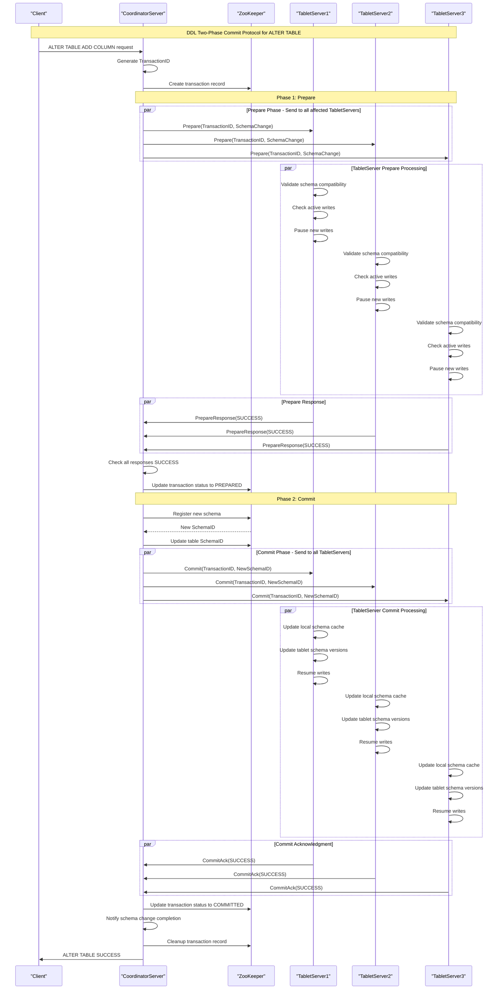
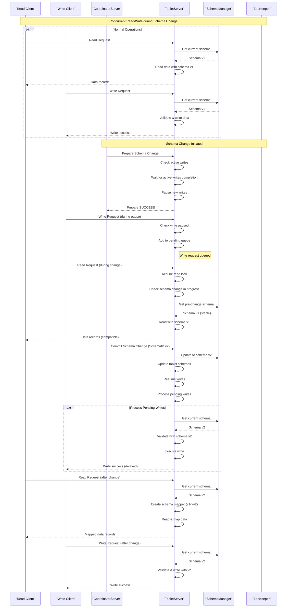
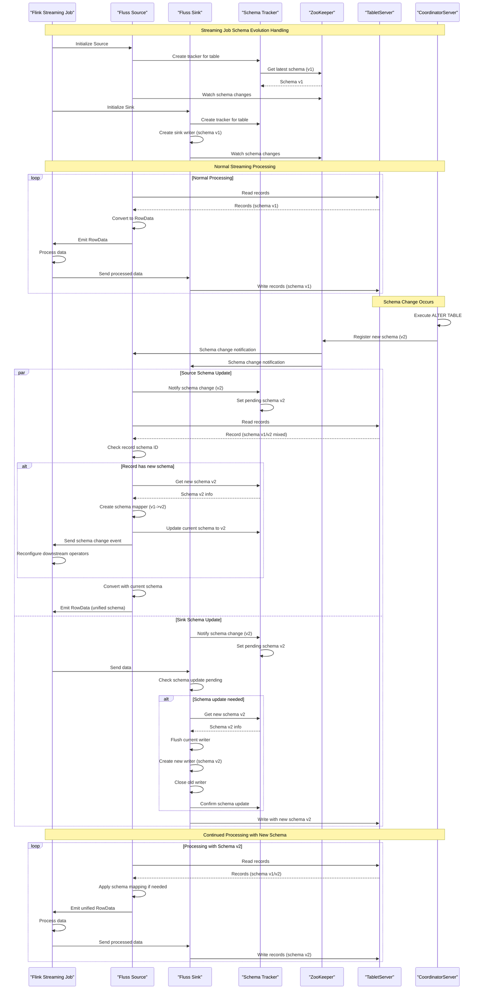
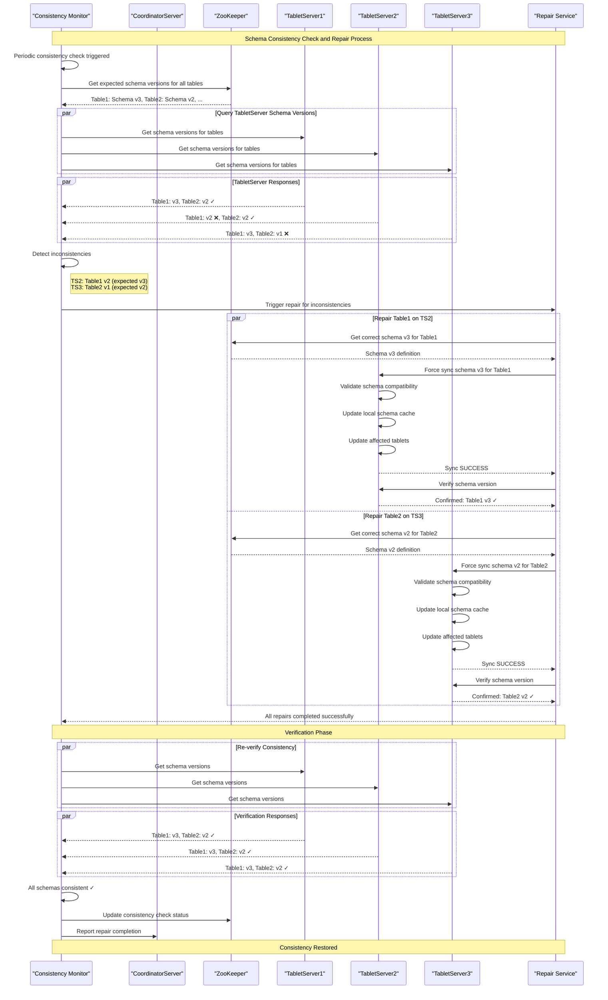
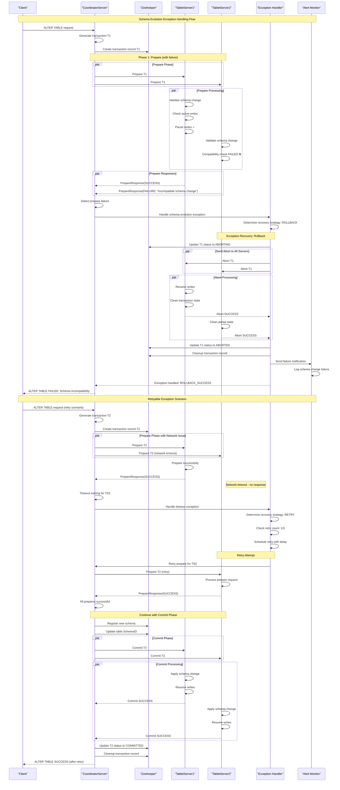
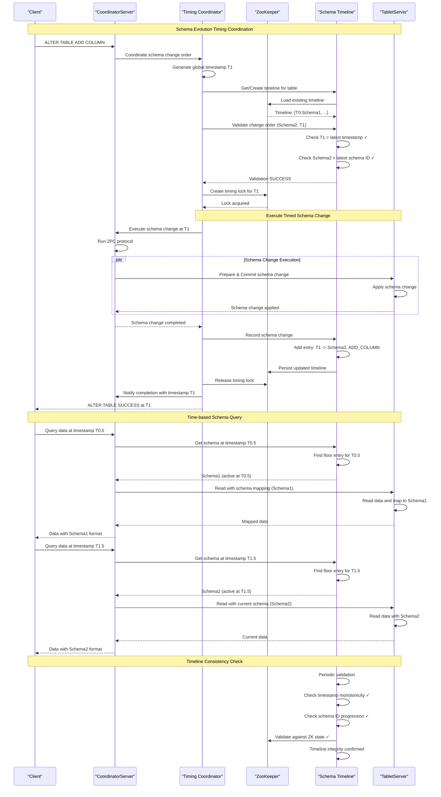
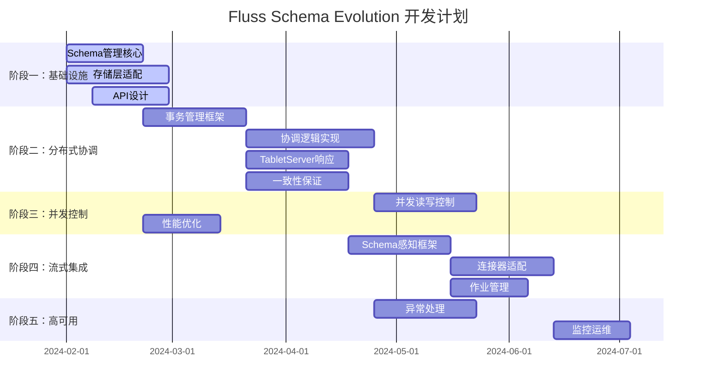

# Fluss Schema Evolution 方案设计

## 1. 引言

### 1.1 背景

当前Fluss项目在处理表结构变更方面存在局限性，特别是在处理历史数据读取和不同版本schema兼容性方面。借鉴Apache Paimon在schema evolution方面的优秀实践，我们需要为Fluss设计一套完整的schema evolution方案。

### 1.2 目标

1. 支持ALTER TABLE操作，包括ADD COLUMN、DROP COLUMN、RENAME COLUMN等
2. 支持历史数据的正确读取，即使schema已经发生变更
3. 保证数据读取的兼容性和正确性
4. 兼容Fluss的两种表模型：日志表(Log Table)和主键表(Primary Key Table)

## 2. 当前实现分析

### 2.1 Schema管理现状

从现有代码分析可知，Fluss已经具备基本的schema管理机制：

1. 每个表都有一个唯一的`schemaId`，存储在[TableInfo](file:///Users/wangyang/Desktop/fluss-plat/fluss-common/src/main/java/com/alibaba/fluss/metadata/TableInfo.java#L142-L354)中
2. Schema信息存储在ZooKeeper中，通过[ZooKeeperClient](file:///Users/wangyang/Desktop/fluss-plat/fluss-server/src/main/java/com/alibaba/fluss/server/zk/ZooKeeperClient.java#L87-L559)管理
3. 每次schema变更时，会生成新的schemaId并注册到ZooKeeper
4. 数据文件中记录了schemaId，如[DefaultLogRecordBatch](file:///Users/wangyang/Desktop/fluss-plat/fluss-common/src/main/java/com/alibaba/fluss/record/DefaultLogRecordBatch.java#L101-L398)中的`SCHEMA_ID_LENGTH`

### 2.2 当前限制

1. 不支持schema变更后的数据读取兼容性处理
2. 缺乏字段映射、类型转换和默认值处理机制
3. KV存储在恢复时遇到schema变更会直接抛出异常

## 3. Fluss表模型分析

### 3.1 日志表(Log Table)

日志表是Fluss中用于存储按照写入顺序排列的数据的表类型。它只支持追加记录，不支持更新和删除操作。日志表具有以下特点：

1. 数据以追加方式写入，保证写入顺序
2. 支持列式存储（默认为Apache Arrow格式）
3. 支持列裁剪，提高查询性能
4. 支持日志压缩，减少网络和存储成本
5. 数据存储在LogTablet中

### 3.2 主键表(Primary Key Table)

主键表确保指定主键的唯一性，并支持INSERT、UPDATE和DELETE操作。主键表具有以下特点：

1. 每行数据都有唯一的主键
2. 支持部分列更新
3. 数据存储在KvTablet和LogTablet中
4. 支持多种合并引擎（LastRow、FirstRow、Versioned等）
5. 支持变更日志生成和实时查询

### 3.3 两种表模型对Schema Evolution的影响

1. 日志表只支持追加操作，相对简单，Schema Evolution主要涉及新增字段的处理
2. 主键表支持更新和删除，Schema Evolution需要考虑KV存储和日志存储的一致性
3. 两种表模型都需要处理列裁剪和默认值分配

## 4. 设计方案

### 4.1 Schema版本管理

参考Paimon的设计，我们需要建立完善的schema版本管理机制：

#### 4.1.1 Schema存储结构

基于现有代码分析，Fluss已经具备基本的schema版本管理机制：

**ZooKeeper存储结构：**
```
/metadata/databases/[databaseName]/tables/[tableName]/schemas/
├── 1  # schema version 1
├── 2  # schema version 2
├── 3  # schema version 3
└── ...
```

**Schema注册流程：**
1. 通过`ZooKeeperClient.registerSchema()`注册新schema
2. 自动递增schemaId：`currentSchemaId++`
3. 存储路径：`SchemaZNode.path(tablePath, currentSchemaId)`
4. 序列化：`SchemaZNode.encode(schema)` (JSON格式)

**Schema查询机制：**
- `getCurrentSchemaId()`: 获取最新schemaId
- `getSchemaById()`: 根据schemaId获取特定schema
- `getLatestSchema()`: 获取最新schema

#### 4.1.2 Schema管理器设计

基于现有的`MetadataManager`，扩展Schema管理功能：

```java
public class SchemaManager {
    private final ZooKeeperClient zkClient;
    private final Map<TablePath, Map<Integer, SchemaInfo>> schemaCache;
    
    /**
     * 获取最新schema
     */
    public SchemaInfo getLatestSchema(TablePath tablePath) throws SchemaNotExistException;
    
    /**
     * 根据schemaId获取schema
     */
    public SchemaInfo getSchemaById(TablePath tablePath, int schemaId) throws SchemaNotExistException;
    
    /**
     * 获取所有schema版本
     */
    public List<SchemaInfo> getAllSchemas(TablePath tablePath);
    
    /**
     * 注册新schema
     */
    public int registerSchema(TablePath tablePath, Schema schema) throws Exception;
    
    /**
     * 缓存管理
     */
    public void evictCache(TablePath tablePath);
    public void clearCache();
}
```


### 4.2 数据读取兼容性处理

#### 4.2.1 字段映射机制

基于现有的`LogRecordReadContext`和`RowType.project()`机制，实现schema evolution的字段映射：

**核心映射组件：**
```java
public class SchemaMapper {
    private final RowType sourceSchema;
    private final RowType targetSchema;
    private final int[] fieldMapping;  // source -> target field mapping
    private final boolean[] hasDefaultValue;
    private final Object[] defaultValues;
    
    /**
     * 创建schema映射器
     */
    public static SchemaMapper create(RowType sourceSchema, RowType targetSchema);
    
    /**
     * 映射一行数据
     */
    public InternalRow mapRow(InternalRow sourceRow);
    
    /**
     * 检查是否需要schema映射
     */
    public boolean needsMapping();
}
```

**字段映射策略：**

1. **新增字段(ADD COLUMN)**
   ```java
   // 在targetSchema中存在但sourceSchema中不存在的字段
   if (targetFieldIndex >= sourceSchema.getFieldCount()) {
       // 应用默认值或NULL
       return applyDefaultValue(targetFieldIndex);
   }
   ```

2. **删除字段(DROP COLUMN)**
   ```java
   // 在sourceSchema中存在但targetSchema中不存在的字段
   if (sourceFieldIndex >= targetSchema.getFieldCount()) {
       // 跳过该字段
       continue;
   }
   ```

3. **重命名字段(RENAME COLUMN)**
   ```java
   // 通过字段名匹配，而不是位置匹配
   String targetFieldName = targetSchema.getFieldNames().get(targetFieldIndex);
   int sourceFieldIndex = sourceSchema.getFieldIndex(targetFieldName);
   ```

4. **字段类型变更(ALTER COLUMN TYPE)**
   ```java
   // 使用现有的CastExecutor进行类型转换
   DataType sourceType = sourceSchema.getTypeAt(sourceFieldIndex);
   DataType targetType = targetSchema.getTypeAt(targetFieldIndex);
   if (!sourceType.equals(targetType)) {
       return castValue(sourceValue, sourceType, targetType);
   }
   ```

#### 4.2.2 默认值处理

基于现有的`InternalRow`和`FieldGetter`机制，实现默认值处理：

```java
public class DefaultValueAssigner {
    private final RowType targetSchema;
    private final Map<Integer, Object> defaultValues;
    private final Map<Integer, DataType> defaultTypes;
    
    /**
     * 创建默认值分配器
     */
    public static DefaultValueAssigner create(RowType targetSchema, Map<String, Object> columnDefaults);
    
    /**
     * 为缺失字段分配默认值
     */
    public InternalRow assignDefaults(InternalRow sourceRow, SchemaEvolutionMapper mapper);
    
    /**
     * 获取字段的默认值
     */
    private Object getDefaultValue(int fieldIndex);
}
```

**默认值处理流程：**
1. 从表配置中提取默认值配置
2. 在schema evolution映射时识别缺失字段
3. 根据字段类型生成合适的默认值
4. 使用`CastExecutor`确保类型兼容性

#### 4.2.3 类型转换机制

利用现有的类型系统，实现安全的类型转换：

```java
public class TypeConverter {
    private final CastExecutor castExecutor;
    
    /**
     * 检查类型转换是否安全
     */
    public boolean isSafeCast(DataType sourceType, DataType targetType);
    
    /**
     * 执行类型转换
     */
    public Object castValue(Object value, DataType sourceType, DataType targetType);
    
    /**
     * 获取支持的类型转换规则
     */
    public Set<TypeConversionRule> getSupportedConversions();
}
```

**支持的类型转换：**
- `INT` → `BIGINT` (安全)
- `FLOAT` → `DOUBLE` (安全)
- `STRING` → `VARCHAR` (安全)
- `TIMESTAMP(3)` → `TIMESTAMP(6)` (安全)
- 不兼容转换抛出异常


### 4.4 核心组件设计

#### 4.4.1 SchemaManager

基于现有的`MetadataManager`，扩展Schema管理功能：

```java
public class SchemaManager {
    private final ZooKeeperClient zkClient;
    private final Map<TablePath, Map<Integer, SchemaInfo>> schemaCache;
    
    /**
     * 获取最新schema
     */
    public SchemaInfo getLatestSchema(TablePath tablePath) throws SchemaNotExistException;
    
    /**
     * 根据schemaId获取schema
     */
    public SchemaInfo getSchemaById(TablePath tablePath, int schemaId) throws SchemaNotExistException;
    
    /**
     * 获取所有schema版本
     */
    public List<SchemaInfo> getAllSchemas(TablePath tablePath);
    
    /**
     * 注册新schema
     */
    public int registerSchema(TablePath tablePath, Schema schema) throws Exception;
    
    /**
     * 缓存管理
     */
    public void evictCache(TablePath tablePath);
    public void clearCache();
}
```

#### 4.4.2 SchemaMapper

基于现有的`RowType.project()`和`ProjectedRow`机制，实现schema映射：

```java
public class SchemaMapper {
    private final RowType sourceSchema;
    private final RowType targetSchema;
    private final int[] fieldMapping;  // source -> target field mapping
    private final boolean[] hasDefaultValue;
    private final Object[] defaultValues;
    private final TypeConverter typeConverter;
    
    /**
     * 创建schema映射器
     */
    public static SchemaMapper create(RowType sourceSchema, RowType targetSchema);
    
    /**
     * 创建带默认值的schema映射器
     */
    public static SchemaMapper createWithDefaults(
            RowType sourceSchema, 
            RowType targetSchema, 
            Map<String, Object> columnDefaults);
    
    /**
     * 映射一行数据
     */
    public InternalRow mapRow(InternalRow sourceRow);
    
    /**
     * 映射LogRecord
     */
    public LogRecord mapRecord(LogRecord sourceRecord);
    
    /**
     * 检查是否需要schema映射
     */
    public boolean needsMapping();
    
    /**
     * 获取字段映射信息
     */
    public FieldMappingInfo getFieldMappingInfo();
    
    /**
     * 获取映射统计信息
     */
    public MappingStatistics getMappingStatistics();
}
```

#### 4.4.3 DefaultValueAssigner

基于现有的`InternalRow`和`FieldGetter`机制，实现默认值处理：

```java
public class DefaultValueAssigner {
    private final RowType targetSchema;
    private final Map<Integer, Object> defaultValues;
    private final Map<Integer, DataType> defaultTypes;
    private final TypeConverter typeConverter;
    
    /**
     * 创建默认值分配器
     */
    public static DefaultValueAssigner create(RowType targetSchema, Map<String, Object> columnDefaults);
    
    /**
     * 为缺失字段分配默认值
     */
    public InternalRow assignDefaults(InternalRow sourceRow, SchemaMapper mapper);
    
    /**
     * 获取字段的默认值
     */
    public Object getDefaultValue(int fieldIndex);
    
    /**
     * 检查字段是否有默认值
     */
    public boolean hasDefaultValue(int fieldIndex);
    
    /**
     * 验证默认值类型兼容性
     */
    public boolean validateDefaultValue(int fieldIndex, Object defaultValue);
}
```


#### 4.4.5 SchemaConfig

配置管理类，用于管理schema的各种配置：

```java
public class SchemaConfig {
    private final boolean enableSchemaMapping;
    private final boolean enableDefaultValues;
    private final boolean enableTypeConversion;
    private final Map<String, Object> columnDefaults;
    private final Set<TypeConversionRule> allowedConversions;
    
    /**
     * 创建默认配置
     */
    public static SchemaConfig createDefault();
    
    /**
     * 从表配置中创建
     */
    public static SchemaConfig fromTableConfig(TableConfig tableConfig);
    
    /**
     * 验证配置有效性
     */
    public void validate();
    
    /**
     * 获取配置的字符串表示
     */
    public String toConfigString();
}
```

## 5. 针对不同表模型的特殊处理

### 5.1 日志表(Log Table)处理

#### 5.1.1 存储层面

基于现有的`LogSegment`和`DefaultLogRecordBatch`机制：

**Schema信息存储：**
```java
public class LogSegmentSchemaManager {
    private final LogSegment logSegment;
    private final Map<Long, Integer> offsetToSchemaId;  // offset -> schemaId mapping
    
    /**
     * 记录schema变更点
     */
    public void recordSchemaChange(long offset, int schemaId);
    
    /**
     * 获取offset对应的schemaId
     */
    public int getSchemaIdForOffset(long offset);
    
    /**
     * 获取时间戳对应的schemaId
     */
    public int getSchemaIdForTimestamp(long timestamp);
}
```

**日志段文件schema信息：**
1. 每个日志段(Log Segment)文件需要记录其对应的schemaId
2. 支持远程存储(Remote Storage)中的日志段文件包含schema信息
3. 保证列式存储(Arrow)格式与schema版本的对应关系

**Schema变更点记录：**
```java
// 在LogSegment中记录schema变更信息
public class SchemaChangeRecord {
    private final long offset;
    private final int oldSchemaId;
    private final int newSchemaId;
    private final long timestamp;
    private final String changeType;  // ADD_COLUMN, DROP_COLUMN, etc.
}
```

#### 5.1.2 读取层面

基于现有的`LogRecordReadContext`和`FileLogProjection`机制：

**Schema兼容性读取：**
```java
public class LogTableReader {
    private final SchemaManager schemaManager;
    private final SchemaMapper mapper;
    
    /**
     * 创建支持schema映射的读取上下文
     */
    public LogRecordReadContext createReadContext(
            TableInfo tableInfo, 
            boolean readFromRemote, 
            @Nullable Projection projection,
            @Nullable Long targetTimestamp);
    
    /**
     * 处理schema映射的日志记录读取
     */
    public CloseableIterator<LogRecord> readWithMapping(
            LogSegment logSegment,
            LogRecordReadContext context,
            long startOffset,
            long endOffset);
}
```

**列裁剪与schema映射结合：**
```java
public class AdaptiveProjection {
    private final Projection originalProjection;
    private final SchemaMapper schemaMapper;
    
    /**
     * 创建考虑schema映射的投影
     */
    public static AdaptiveProjection create(
            Projection projection, 
            SchemaMapper mapper);
    
    /**
     * 获取实际需要的字段投影
     */
    public int[] getActualProjection();
    
    /**
     * 应用schema映射
     */
    public InternalRow applyMapping(InternalRow sourceRow);
}
```

**压缩日志的schema兼容性读取：**
```java
public class CompressedLogReader {
    private final LogTableReader baseReader;
    private final CompressionCodec compressionCodec;
    
    /**
     * 读取压缩日志并处理schema映射
     */
    public CloseableIterator<LogRecord> readCompressedWithMapping(
            CompressedLogSegment segment,
            LogRecordReadContext context);
}
```

### 5.2 主键表(Primary Key Table)处理

#### 5.2.1 存储层面

基于现有的`BucketSnapshot`和`KvTablet`机制：

**KV存储schema管理：**
```java
public class KvTabletSchemaManager {
    private final KvTablet kvTablet;
    private final Map<Long, Integer> snapshotToSchemaId;  // snapshotId -> schemaId
    
    /**
     * 记录快照的schema信息
     */
    public void recordSnapshotSchema(long snapshotId, int schemaId);
    
    /**
     * 获取快照对应的schemaId
     */
    public int getSchemaIdForSnapshot(long snapshotId);
    
    /**
     * 验证快照schema兼容性
     */
    public boolean validateSnapshotSchema(long snapshotId, int expectedSchemaId);
}
```

**变更日志schema管理：**
```java
public class ChangelogSchemaManager {
    private final LogTablet logTablet;
    private final Map<Long, Integer> changelogOffsetToSchemaId;
    
    /**
     * 记录变更日志的schema信息
     */
    public void recordChangelogSchema(long offset, int schemaId);
    
    /**
     * 获取变更日志对应的schemaId
     */
    public int getSchemaIdForChangelog(long offset);
}
```

**Schema版本一致性保证：**
```java
public class PrimaryKeyTableSchemaConsistency {
    private final KvTabletSchemaManager kvSchemaManager;
    private final ChangelogSchemaManager changelogSchemaManager;
    
    /**
     * 验证KV存储和日志存储的schema版本一致性
     */
    public boolean validateSchemaConsistency(long snapshotId, long changelogOffset);
    
    /**
     * 同步schema版本信息
     */
    public void syncSchemaVersions(long snapshotId, long changelogOffset, int schemaId);
}
```

#### 5.2.2 读取层面

基于现有的`SortMergeReader`和快照+增量读取机制：

**快照读取schema处理：**
```java
public class SnapshotReader {
    private final KvTablet kvTablet;
    private final SchemaManager schemaManager;
    
    /**
     * 读取快照并处理schema映射
     */
    public CloseableIterator<InternalRow> readSnapshotWithMapping(
            long snapshotId,
            RowType targetSchema,
            @Nullable Projection projection);
    
    /**
     * 创建快照schema映射器
     */
    private SchemaMapper createSnapshotMapper(long snapshotId, RowType targetSchema);
}
```

**变更日志读取schema处理：**
```java
public class ChangelogReader {
    private final LogTablet logTablet;
    private final SchemaManager schemaManager;
    
    /**
     * 读取变更日志并处理schema映射
     */
    public CloseableIterator<LogRecord> readChangelogWithMapping(
            long startOffset,
            long endOffset,
            RowType targetSchema,
            @Nullable Projection projection);
    
    /**
     * 处理不同schema版本的变更记录
     */
    private LogRecord processChangelogRecord(LogRecord record, SchemaMapper mapper);
}
```

**快照+增量日志的无缝切换读取：**
```java
public class PrimaryKeyTableReader {
    private final SnapshotReader snapshotReader;
    private final ChangelogReader changelogReader;
    private final SchemaManager schemaManager;
    
    /**
     * 执行快照+增量读取，支持schema映射
     */
    public CloseableIterator<LogRecord> readSnapshotAndChangelog(
            long snapshotId,
            long changelogStartOffset,
            long changelogEndOffset,
            RowType targetSchema,
            @Nullable Projection projection);
    
    /**
     * 合并快照和变更日志数据
     */
    private CloseableIterator<LogRecord> mergeSnapshotAndChangelog(
            CloseableIterator<InternalRow> snapshotData,
            CloseableIterator<LogRecord> changelogData,
            SchemaMapper mapper);
}
```

#### 5.2.3 恢复层面

基于现有的KV存储恢复机制：

**KV恢复时的schema处理：**
```java
public class KvTabletRecovery {
    private final KvTablet kvTablet;
    private final SchemaManager schemaManager;
    
    /**
     * 恢复KV存储并处理schema变更
     */
    public void recoverWithMapping(long snapshotId, int targetSchemaId);
    
    /**
     * 验证恢复过程中的schema兼容性
     */
    public boolean validateRecoverySchema(long snapshotId, int targetSchemaId);
    
    /**
     * 处理schema变更的恢复冲突
     */
    public void handleSchemaRecoveryConflict(long snapshotId, int oldSchemaId, int newSchemaId);
}
```

**Schema映射优化：**
```java
public class KvRecoveryMapper {
    private final SchemaMapper mapper;
    private final Map<Integer, SchemaMapper> mapperCache;
    
    /**
     * 获取或创建schema映射器
     */
    public SchemaMapper getOrCreateMapper(int sourceSchemaId, int targetSchemaId);
    
    /**
     * 批量处理schema映射
     */
    public List<InternalRow> batchMapRows(List<InternalRow> sourceRows);
}
```

## 6. 实现细节

### 6.1 Schema变更处理流程

基于现有的`MetadataManager`和`ZooKeeperClient`机制：

**ALTER TABLE命令处理：**
```java
public class AlterTableProcessor {
    private final MetadataManager metadataManager;
    private final SchemaManager schemaManager;
    private final ZooKeeperClient zkClient;
    
    /**
     * 处理ALTER TABLE ADD COLUMN
     */
    public void processAddColumn(TablePath tablePath, Column newColumn) throws Exception {
        // 1. 验证新列的有效性
        validateNewColumn(tablePath, newColumn);
        
        // 2. 获取当前schema
        SchemaInfo currentSchema = schemaManager.getLatestSchema(tablePath);
        Schema newSchema = addColumnToSchema(currentSchema.getSchema(), newColumn);
        
        // 3. 注册新schema
        int newSchemaId = schemaManager.registerSchema(tablePath, newSchema);
        
        // 4. 更新表信息
        updateTableSchemaId(tablePath, newSchemaId);
        
        // 5. 通知相关组件schema变更
        notifySchemaChange(tablePath, currentSchema.getSchemaId(), newSchemaId);
    }
    
    /**
     * 处理ALTER TABLE DROP COLUMN
     */
    public void processDropColumn(TablePath tablePath, String columnName) throws Exception {
        // 1. 验证列是否可以删除
        validateColumnDrop(tablePath, columnName);
        
        // 2. 获取当前schema并删除列
        SchemaInfo currentSchema = schemaManager.getLatestSchema(tablePath);
        Schema newSchema = dropColumnFromSchema(currentSchema.getSchema(), columnName);
        
        // 3. 注册新schema
        int newSchemaId = schemaManager.registerSchema(tablePath, newSchema);
        
        // 4. 更新表信息
        updateTableSchemaId(tablePath, newSchemaId);
    }
    
    /**
     * 处理ALTER TABLE RENAME COLUMN
     */
    public void processRenameColumn(TablePath tablePath, String oldName, String newName) throws Exception {
        // 1. 验证重命名操作
        validateColumnRename(tablePath, oldName, newName);
        
        // 2. 获取当前schema并重命名列
        SchemaInfo currentSchema = schemaManager.getLatestSchema(tablePath);
        Schema newSchema = renameColumnInSchema(currentSchema.getSchema(), oldName, newName);
        
        // 3. 注册新schema
        int newSchemaId = schemaManager.registerSchema(tablePath, newSchema);
        
        // 4. 更新表信息
        updateTableSchemaId(tablePath, newSchemaId);
    }
    
    /**
     * 处理ALTER TABLE ALTER COLUMN TYPE
     */
    public void processAlterColumnType(TablePath tablePath, String columnName, DataType newType) throws Exception {
        // 1. 验证类型变更的兼容性
        validateTypeChange(tablePath, columnName, newType);
        
        // 2. 获取当前schema并修改列类型
        SchemaInfo currentSchema = schemaManager.getLatestSchema(tablePath);
        Schema newSchema = alterColumnTypeInSchema(currentSchema.getSchema(), columnName, newType);
        
        // 3. 注册新schema
        int newSchemaId = schemaManager.registerSchema(tablePath, newSchema);
        
        // 4. 更新表信息
        updateTableSchemaId(tablePath, newSchemaId);
    }
}
```

### 6.2 数据读取处理流程

基于现有的`LogRecordReadContext`和`Table.newScan()`机制：

**Schema映射读取流程：**
```java
public class AdaptiveDataReader {
    private final SchemaManager schemaManager;
    private final SchemaMapper mapper;
    private final DefaultValueAssigner defaultValueAssigner;
    
    /**
     * 读取数据并处理schema映射
     */
    public CloseableIterator<LogRecord> readWithMapping(
            TablePath tablePath,
            RowType targetSchema,
            @Nullable Projection projection) {
        
        // 1. 确定目标schema
        SchemaInfo targetSchemaInfo = determineTargetSchema(tablePath, targetSchema);
        
        // 2. 创建读取上下文
        LogRecordReadContext context = createReadContext(
            tablePath, targetSchemaInfo, projection);
        
        // 3. 执行数据读取
        CloseableIterator<LogRecord> rawRecords = readRawData(tablePath, context);
        
        // 4. 应用schema映射
        return applyMapping(rawRecords, targetSchemaInfo);
    }
    
    /**
     * 确定目标schema
     */
    private SchemaInfo determineTargetSchema(TablePath tablePath, RowType targetSchema) {
        if (targetSchema != null) {
            // 指定schema查询
            return findSchemaByRowType(tablePath, targetSchema);
        } else {
            // 使用最新schema
            return schemaManager.getLatestSchema(tablePath);
        }
    }
    
    /**
     * 创建支持schema映射的读取上下文
     */
    private LogRecordReadContext createReadContext(
            TablePath tablePath, 
            SchemaInfo targetSchemaInfo, 
            @Nullable Projection projection) {
        
        // 创建临时的TableInfo用于读取上下文
        TableInfo tempTableInfo = createTempTableInfo(tablePath, targetSchemaInfo);
        
        return LogRecordReadContext.createReadContext(tempTableInfo, false, projection);
    }
    
    /**
     * 应用schema映射
     */
    private CloseableIterator<LogRecord> applyMapping(
            CloseableIterator<LogRecord> rawRecords, 
            SchemaInfo targetSchemaInfo) {
        
        return new CloseableIterator<LogRecord>() {
            @Override
            public boolean hasNext() {
                return rawRecords.hasNext();
            }
            
            @Override
            public LogRecord next() {
                LogRecord rawRecord = rawRecords.next();
                return mapper.mapRecord(rawRecord);
            }
            
            @Override
            public void close() throws Exception {
                rawRecords.close();
            }
        };
    }
}
```

### 6.3 兼容性处理

基于现有的`RowType.project()`和`CastExecutor`机制：

**投影处理：**
```java
public class AdaptiveProjection {
    private final RowType sourceSchema;
    private final RowType targetSchema;
    private final Projection originalProjection;
    
    /**
     * 创建自适应投影
     */
    public static AdaptiveProjection create(
            RowType sourceSchema, 
            RowType targetSchema, 
            @Nullable Projection projection) {
        
        if (projection == null) {
            // 如果没有投影，使用所有字段
            int[] allFields = IntStream.range(0, targetSchema.getFieldCount()).toArray();
            projection = Projection.of(allFields);
        }
        
        return new AdaptiveProjection(sourceSchema, targetSchema, projection);
    }
    
    /**
     * 获取实际需要的字段投影
     */
    public int[] getActualProjection() {
        // 将目标schema的投影映射到源schema
        int[] targetProjection = originalProjection.getProjection();
        int[] actualProjection = new int[targetProjection.length];
        
        for (int i = 0; i < targetProjection.length; i++) {
            String fieldName = targetSchema.getFieldNames().get(targetProjection[i]);
            int sourceIndex = sourceSchema.getFieldIndex(fieldName);
            actualProjection[i] = sourceIndex >= 0 ? sourceIndex : -1; // -1表示字段不存在
        }
        
        return actualProjection;
    }
    
    /**
     * 应用投影和schema映射
     */
    public InternalRow applyProjectionAndMapping(InternalRow sourceRow) {
        // 1. 应用schema映射
        InternalRow mappedRow = mapper.mapRow(sourceRow);
        
        // 2. 应用投影
        return mappedRow.project(originalProjection.getProjection());
    }
}
```

**类型转换：**
```java
public class TypeConverter {
    private final CastExecutor castExecutor;
    private final Map<TypePair, Boolean> safeCastCache;
    
    /**
     * 检查类型转换是否安全
     */
    public boolean isSafeCast(DataType sourceType, DataType targetType) {
        TypePair pair = new TypePair(sourceType, targetType);
        return safeCastCache.computeIfAbsent(pair, this::checkSafeCast);
    }
    
    /**
     * 执行类型转换
     */
    public Object castValue(Object value, DataType sourceType, DataType targetType) {
        if (sourceType.equals(targetType)) {
            return value;
        }
        
        if (!isSafeCast(sourceType, targetType)) {
            throw new SchemaException(
                String.format("Unsafe type conversion from %s to %s", sourceType, targetType));
        }
        
        return castExecutor.cast(value, sourceType, targetType);
    }
    
    /**
     * 检查类型转换安全性
     */
    private boolean checkSafeCast(TypePair pair) {
        DataType sourceType = pair.sourceType;
        DataType targetType = pair.targetType;
        
        // 定义安全的类型转换规则
        return isNumericWidening(sourceType, targetType) ||
               isStringCompatible(sourceType, targetType) ||
               isTimestampWidening(sourceType, targetType);
    }
    
    /**
     * 数值类型扩展转换
     */
    private boolean isNumericWidening(DataType sourceType, DataType targetType) {
        return (sourceType.getTypeRoot() == DataTypeRoot.INTEGER && 
                targetType.getTypeRoot() == DataTypeRoot.BIGINT) ||
               (sourceType.getTypeRoot() == DataTypeRoot.FLOAT && 
                targetType.getTypeRoot() == DataTypeRoot.DOUBLE);
    }
}
```

**默认值分配：**
```java
public class DefaultValueAssigner {
    private final RowType targetSchema;
    private final Map<Integer, Object> defaultValues;
    private final TypeConverter typeConverter;
    
    /**
     * 为缺失字段分配默认值
     */
    public InternalRow assignDefaults(InternalRow sourceRow, SchemaMapper mapper) {
        // 创建目标schema的行
        InternalRow targetRow = createTargetRow();
        
        // 复制存在的字段
        for (int i = 0; i < sourceRow.getFieldCount(); i++) {
            if (i < targetRow.getFieldCount()) {
                copyField(sourceRow, i, targetRow, i);
            }
        }
        
        // 为缺失字段分配默认值
        for (int i = sourceRow.getFieldCount(); i < targetRow.getFieldCount(); i++) {
            assignDefaultValue(targetRow, i);
        }
        
        return targetRow;
    }
    
    /**
     * 分配默认值
     */
    private void assignDefaultValue(InternalRow targetRow, int fieldIndex) {
        if (hasDefaultValue(fieldIndex)) {
            Object defaultValue = getDefaultValue(fieldIndex);
            DataType fieldType = targetSchema.getTypeAt(fieldIndex);
            
            // 确保默认值类型正确
            Object typedDefaultValue = typeConverter.castValue(
                defaultValue, 
                inferType(defaultValue), 
                fieldType);
            
            setFieldValue(targetRow, fieldIndex, typedDefaultValue);
        } else {
            // 设置为NULL
            targetRow.setNullAt(fieldIndex);
        }
    }
    
    /**
     * 获取字段的默认值
     */
    private Object getDefaultValue(int fieldIndex) {
        return defaultValues.getOrDefault(fieldIndex, getTypeDefaultValue(fieldIndex));
    }
    
    /**
     * 获取类型的默认值
     */
    private Object getTypeDefaultValue(int fieldIndex) {
        DataType fieldType = targetSchema.getTypeAt(fieldIndex);
        switch (fieldType.getTypeRoot()) {
            case INTEGER:
                return 0;
            case BIGINT:
                return 0L;
            case FLOAT:
                return 0.0f;
            case DOUBLE:
                return 0.0;
            case STRING:
                return "";
            case BOOLEAN:
                return false;
            default:
                return null;
        }
    }
}
```

## 7. API设计

### 7.1 ALTER TABLE语句

基于现有的Flink Catalog机制，扩展ALTER TABLE支持：

**SQL语法扩展：**
```sql
-- 添加列
ALTER TABLE table_name ADD COLUMN column_name data_type [DEFAULT default_value] [COMMENT 'comment'];

-- 删除列
ALTER TABLE table_name DROP COLUMN column_name;

-- 重命名列
ALTER TABLE table_name RENAME COLUMN old_name TO new_name;

-- 修改列类型
ALTER TABLE table_name ALTER COLUMN column_name TYPE new_data_type;

-- 修改列默认值
ALTER TABLE table_name ALTER COLUMN column_name SET DEFAULT default_value;

-- 删除列默认值
ALTER TABLE table_name ALTER COLUMN column_name DROP DEFAULT;
```

**Flink Catalog扩展：**
```java
public class FlussCatalog extends AbstractCatalog {
    
    @Override
    public void alterTable(ObjectPath objectPath, CatalogBaseTable catalogBaseTable, boolean ignoreIfNotExists)
            throws TableNotExistException, CatalogException {
        
        TablePath tablePath = toTablePath(objectPath);
        
        // 解析ALTER TABLE操作
        AlterTableOperation operation = parseAlterTableOperation(catalogBaseTable);
        
        // 执行schema evolution
        switch (operation.getType()) {
            case ADD_COLUMN:
                alterTableProcessor.processAddColumn(tablePath, operation.getNewColumn());
                break;
            case DROP_COLUMN:
                alterTableProcessor.processDropColumn(tablePath, operation.getColumnName());
                break;
            case RENAME_COLUMN:
                alterTableProcessor.processRenameColumn(
                    tablePath, operation.getOldColumnName(), operation.getNewColumnName());
                break;
            case ALTER_COLUMN_TYPE:
                alterTableProcessor.processAlterColumnType(
                    tablePath, operation.getColumnName(), operation.getNewType());
                break;
            default:
                throw new UnsupportedOperationException("Unsupported alter table operation: " + operation.getType());
        }
    }
    
    /**
     * 解析ALTER TABLE操作
     */
    private AlterTableOperation parseAlterTableOperation(CatalogBaseTable catalogBaseTable) {
        // 解析表结构变更操作
        // 这里需要实现具体的解析逻辑
        return AlterTableOperationParser.parse(catalogBaseTable);
    }
}
```

**ALTER TABLE操作定义：**
```java
public class AlterTableOperation {
    private final AlterTableType type;
    private final String columnName;
    private final String oldColumnName;
    private final String newColumnName;
    private final Column newColumn;
    private final DataType newType;
    private final Object defaultValue;
    
    public enum AlterTableType {
        ADD_COLUMN,
        DROP_COLUMN,
        RENAME_COLUMN,
        ALTER_COLUMN_TYPE,
        ALTER_COLUMN_DEFAULT
    }
    
    // 构造函数和getter方法
}
```


### 7.3 Java API扩展

基于现有的`Admin`和`Table`接口，扩展schema evolution支持：

**Admin接口扩展：**
```java
public interface Admin extends AutoCloseable {
    
    // 现有的方法...
    
    /**
     * 执行ALTER TABLE操作
     */
    CompletableFuture<Void> alterTable(TablePath tablePath, AlterTableOperation operation);
    
    /**
     * 获取表的所有schema版本
     */
    CompletableFuture<List<SchemaInfo>> getAllTableSchemas(TablePath tablePath);
    

}
```

**Table接口扩展：**
```java
public interface Table extends AutoCloseable {
    
    // 现有的方法...
    
    /**
     * 创建支持schema映射的扫描器
     */
    AdaptiveScanBuilder newAdaptiveScan();
    

}

public interface AdaptiveScanBuilder {
    
    /**
     * 设置目标schema
     */
    AdaptiveScanBuilder targetSchema(RowType targetSchema);
    
    /**
     * 设置字段投影
     */
    AdaptiveScanBuilder project(int[] projectedFields);
    
    /**
     * 设置字段投影（按名称）
     */
    AdaptiveScanBuilder project(String[] projectedFieldNames);
    
    /**
     * 设置默认值
     */
    AdaptiveScanBuilder withDefaults(Map<String, Object> columnDefaults);
    
    /**
     * 创建扫描器
     */
    AdaptiveScanner createScanner();
}


```

## 8. 性能考虑

### 8.1 Schema缓存

基于现有的缓存机制，实现schema缓存优化：

**Schema缓存设计：**
```java
public class SchemaCache {
    private final Map<TablePath, Map<Integer, SchemaInfo>> schemaCache;
    private final Map<TablePath, SchemaTimeline> timelineCache;
    private final int maxCacheSize;
    private final long cacheExpireTime;
    
    /**
     * 获取schema（带缓存）
     */
    public SchemaInfo getSchema(TablePath tablePath, int schemaId) {
        Map<Integer, SchemaInfo> tableSchemas = schemaCache.get(tablePath);
        if (tableSchemas != null) {
            SchemaInfo cachedSchema = tableSchemas.get(schemaId);
            if (cachedSchema != null && !isExpired(cachedSchema)) {
                return cachedSchema;
            }
        }
        
        // 从ZooKeeper加载
        SchemaInfo schema = loadSchemaFromZk(tablePath, schemaId);
        cacheSchema(tablePath, schemaId, schema);
        return schema;
    }
    
    /**
     * 缓存schema
     */
    private void cacheSchema(TablePath tablePath, int schemaId, SchemaInfo schema) {
        schemaCache.computeIfAbsent(tablePath, k -> new ConcurrentHashMap<>())
                  .put(schemaId, schema);
        
        // 检查缓存大小
        if (schemaCache.size() > maxCacheSize) {
            evictOldestEntries();
        }
    }
    
    /**
     * 批量预加载schema
     */
    public void preloadSchemas(TablePath tablePath, List<Integer> schemaIds) {
        for (Integer schemaId : schemaIds) {
            if (!isCached(tablePath, schemaId)) {
                CompletableFuture.runAsync(() -> {
                    try {
                        getSchema(tablePath, schemaId);
                    } catch (Exception e) {
                        LOG.warn("Failed to preload schema {} for table {}", schemaId, tablePath, e);
                    }
                });
            }
        }
    }
}
```

### 8.2 读取优化

基于现有的读取机制，实现schema evolution读取优化：

**Schema映射读取优化：**
```java
public class OptimizedReader {
    private final SchemaCache schemaCache;
    private final Map<SchemaMappingKey, SchemaMapper> mapperCache;
    
    /**
     * 优化的schema映射读取
     */
    public CloseableIterator<LogRecord> readOptimized(
            TablePath tablePath,
            RowType targetSchema,
            @Nullable Projection projection) {
        
        // 1. 预加载相关schema
        preloadRelevantSchemas(tablePath, targetSchema);
        
        // 2. 创建或获取缓存的mapper
        SchemaMapper mapper = getOrCreateMapper(tablePath, targetSchema);
        
        // 3. 执行优化的读取
        return executeOptimizedRead(tablePath, mapper, projection);
    }
    
    /**
     * 预加载相关schema
     */
    private void preloadRelevantSchemas(TablePath tablePath, RowType targetSchema) {
        List<Integer> schemaIds = determineRelevantSchemaIds(tablePath, targetSchema);
        schemaCache.preloadSchemas(tablePath, schemaIds);
    }
    
    /**
     * 获取或创建mapper
     */
    private SchemaMapper getOrCreateMapper(
            TablePath tablePath, 
            RowType targetSchema) {
        
        SchemaMappingKey key = new SchemaMappingKey(tablePath, targetSchema);
        return mapperCache.computeIfAbsent(key, k -> createMapper(tablePath, targetSchema));
    }
    
    /**
     * 执行优化的读取
     */
    private CloseableIterator<LogRecord> executeOptimizedRead(
            TablePath tablePath, 
            SchemaMapper mapper, 
            @Nullable Projection projection) {
        
        // 使用现有的读取机制，但应用schema映射
        CloseableIterator<LogRecord> rawRecords = readRawData(tablePath, projection);
        
        return new CloseableIterator<LogRecord>() {
            @Override
            public boolean hasNext() {
                return rawRecords.hasNext();
            }
            
            @Override
            public LogRecord next() {
                LogRecord rawRecord = rawRecords.next();
                return mapper.mapRecord(rawRecord);
            }
            
            @Override
            public void close() throws Exception {
                rawRecords.close();
            }
        };
    }
}
```

### 8.3 针对不同表模型的优化

**日志表优化：**
```java
public class LogTableOptimization {
    
    /**
     * 利用列式存储特性进行列裁剪
     */
    public CloseableIterator<LogRecord> readWithColumnPruning(
            LogSegment logSegment,
            int[] projectedFields,
            SchemaMapper mapper) {
        
        // 1. 确定实际需要的字段（考虑schema映射）
        int[] actualProjectedFields = mapper.getActualProjection(projectedFields);
        
        // 2. 应用列裁剪
        CloseableIterator<LogRecord> prunedRecords = logSegment.readWithProjection(actualProjectedFields);
        
        // 3. 应用schema映射
        return prunedRecords.map(mapper::mapRecord);
    }
    
    /**
     * 压缩日志的schema兼容性优化读取
     */
    public CloseableIterator<LogRecord> readCompressedOptimized(
            CompressedLogSegment segment,
            SchemaMapper mapper) {
        
        // 1. 批量解压缩
        List<LogRecord> batchRecords = segment.decompressBatch();
        
        // 2. 批量应用schema映射
        List<LogRecord> mappedRecords = batchRecords.stream()
            .map(mapper::mapRecord)
            .collect(Collectors.toList());
        
        return CloseableIterator.fromList(mappedRecords);
    }
}
```

**主键表优化：**
```java
public class PrimaryKeyTableOptimization {
    
    /**
     * 快照读取时的schema缓存优化
     */
    public CloseableIterator<InternalRow> readSnapshotOptimized(
            long snapshotId,
            RowType targetSchema,
            SchemaMapper mapper) {
        
        // 1. 缓存快照schema信息
        int snapshotSchemaId = getSnapshotSchemaId(snapshotId);
        schemaCache.preloadSchema(tablePath, snapshotSchemaId);
        
        // 2. 批量读取快照数据
        List<InternalRow> batchRows = readSnapshotBatch(snapshotId);
        
        // 3. 批量应用schema映射
        List<InternalRow> mappedRows = batchRows.stream()
            .map(mapper::mapRow)
            .collect(Collectors.toList());
        
        return CloseableIterator.fromList(mappedRows);
    }
    
    /**
     * 变更日志读取时的schema版本批量处理
     */
    public CloseableIterator<LogRecord> readChangelogOptimized(
            long startOffset,
            long endOffset,
            RowType targetSchema,
            SchemaMapper mapper) {
        
        // 1. 按schema版本分组读取
        Map<Integer, List<LogRecord>> recordsBySchema = readChangelogBySchema(startOffset, endOffset);
        
        // 2. 为每个schema版本创建mapper
        Map<Integer, SchemaMapper> mappersBySchema = createMappersBySchema(recordsBySchema.keySet(), targetSchema);
        
        // 3. 批量处理每个schema版本的数据
        List<LogRecord> allMappedRecords = new ArrayList<>();
        for (Map.Entry<Integer, List<LogRecord>> entry : recordsBySchema.entrySet()) {
            int schemaId = entry.getKey();
            List<LogRecord> records = entry.getValue();
            SchemaMapper schemaMapper = mappersBySchema.get(schemaId);
            
            List<LogRecord> mappedRecords = records.stream()
                .map(schemaMapper::mapRecord)
                .collect(Collectors.toList());
            
            allMappedRecords.addAll(mappedRecords);
        }
        
        return CloseableIterator.fromList(allMappedRecords);
    }
}
```

## 9. 测试方案

### 9.1 单元测试

1. SchemaManager功能测试
2. 字段映射和类型转换测试
3. 默认值处理测试

### 9.2 集成测试

1. ALTER TABLE操作测试
2. 混合schema版本数据读取测试
3. 日志表和主键表分别的schema evolution测试

### 9.3 性能测试

1. 不同表模型的schema evolution性能测试
2. 大量schema版本下的读取性能测试

## 10. 后续优化

1. 支持更复杂的schema变更操作
2. 实现schema合并和冲突检测
3. 提供schema变更的回滚机制
4. 支持schema版本的自动清理机制

## 11. 总结

本方案基于Apache Paimon的优秀实践，结合Fluss项目的实际情况，设计了一套完整的schema evolution解决方案。通过实现schema版本管理、字段映射、默认值处理等功能，可以有效提升Fluss在处理schema变更时的兼容性和用户体验。特别针对Fluss的两种表模型（日志表和主键表）进行了特殊处理设计，确保两种表模型都能良好支持schema evolution功能。

## 12. 分布式并发控制与时序管理

### 12.1 问题分析

在分布式环境下，Schema Evolution面临以下关键挑战：

1. **DDL操作的原子性**: ALTER TABLE操作需要在整个集群中原子性地生效
2. **并发读写冲突**: Schema变更期间的并发读写操作可能导致数据不一致
3. **流式作业处理**: 正在运行的Flink流式作业需要优雅地处理Schema变更
4. **分布式一致性**: 多个TabletServer节点间需要保持Schema版本一致性
5. **时序保证**: Schema变更的时序性与数据操作的时序性需要协调

### 12.2 分布式DDL协调机制

#### 12.2.1 两阶段提交协议(2PC)

基于现有的CoordinatorServer和ZooKeeper机制，实现DDL操作的两阶段提交：

```java
public class DistributedSchemaEvolutionCoordinator {
    private final ZooKeeperClient zkClient;
    private final CoordinatorChannelManager channelManager;
    private final MetadataManager metadataManager;
    private final SchemaManager schemaManager;
    
    /**
     * 执行分布式Schema变更的两阶段提交
     */
    public CompletableFuture<Void> executeDistributedSchemaChange(
            TablePath tablePath, 
            SchemaChangeOperation operation) {
        
        String transactionId = generateTransactionId();
        SchemaChangeTransaction transaction = new SchemaChangeTransaction(
            transactionId, tablePath, operation, System.currentTimeMillis());
        
        return CompletableFuture
            .supplyAsync(() -> {
                // Phase 1: Prepare
                return prepareSchemaChange(transaction);
            })
            .thenCompose(prepareResult -> {
                if (prepareResult.isSuccess()) {
                    // Phase 2: Commit
                    return commitSchemaChange(transaction);
                } else {
                    // Abort transaction
                    return abortSchemaChange(transaction);
                }
            });
    }
    
    /**
     * Phase 1: 准备阶段
     */
    private PrepareResult prepareSchemaChange(SchemaChangeTransaction transaction) {
        try {
            // 1. 在ZooKeeper中创建事务记录
            createTransactionRecord(transaction);
            
            // 2. 向所有相关TabletServer发送Prepare请求
            List<Integer> affectedTabletServers = getAffectedTabletServers(transaction.getTablePath());
            List<CompletableFuture<PrepareResponse>> prepareResponses = new ArrayList<>();
            
            for (Integer serverId : affectedTabletServers) {
                CompletableFuture<PrepareResponse> response = sendPrepareRequest(serverId, transaction);
                prepareResponses.add(response);
            }
            
            // 3. 等待所有TabletServer的Prepare响应
            List<PrepareResponse> responses = CompletableFuture.allOf(
                prepareResponses.toArray(new CompletableFuture[0]))
                .thenApply(v -> prepareResponses.stream()
                    .map(CompletableFuture::join)
                    .collect(Collectors.toList()))
                .get(PREPARE_TIMEOUT_MS, TimeUnit.MILLISECONDS);
            
            // 4. 检查所有响应是否成功
            boolean allSuccess = responses.stream().allMatch(PrepareResponse::isSuccess);
            
            if (allSuccess) {
                // 5. 更新事务状态为PREPARED
                updateTransactionStatus(transaction.getTransactionId(), TransactionStatus.PREPARED);
                return PrepareResult.success(responses);
            } else {
                // 6. 收集失败原因
                List<String> failureReasons = responses.stream()
                    .filter(r -> !r.isSuccess())
                    .map(PrepareResponse::getFailureReason)
                    .collect(Collectors.toList());
                return PrepareResult.failure(failureReasons);
            }
            
        } catch (Exception e) {
            LOG.error("Failed to prepare schema change for transaction {}", 
                transaction.getTransactionId(), e);
            return PrepareResult.failure(Arrays.asList(e.getMessage()));
        }
    }
    
    /**
     * Phase 2: 提交阶段
     */
    private CompletableFuture<Void> commitSchemaChange(SchemaChangeTransaction transaction) {
        return CompletableFuture.runAsync(() -> {
            try {
                // 1. 在ZooKeeper中注册新Schema
                int newSchemaId = schemaManager.registerSchema(
                    transaction.getTablePath(), 
                    transaction.getOperation().getNewSchema());
                
                // 2. 更新表的Schema ID
                metadataManager.updateTableSchemaId(transaction.getTablePath(), newSchemaId);
                
                // 3. 向所有TabletServer发送Commit请求
                List<Integer> affectedTabletServers = getAffectedTabletServers(transaction.getTablePath());
                List<CompletableFuture<Void>> commitFutures = new ArrayList<>();
                
                for (Integer serverId : affectedTabletServers) {
                    CompletableFuture<Void> commitFuture = sendCommitRequest(
                        serverId, transaction, newSchemaId);
                    commitFutures.add(commitFuture);
                }
                
                // 4. 等待所有TabletServer提交完成
                CompletableFuture.allOf(commitFutures.toArray(new CompletableFuture[0]))
                    .get(COMMIT_TIMEOUT_MS, TimeUnit.MILLISECONDS);
                
                // 5. 更新事务状态为COMMITTED
                updateTransactionStatus(transaction.getTransactionId(), TransactionStatus.COMMITTED);
                
                // 6. 通知客户端和流式作业Schema变更完成
                notifySchemaChangeCompletion(transaction.getTablePath(), newSchemaId);
                
                // 7. 清理事务记录
                cleanupTransactionRecord(transaction.getTransactionId());
                
                LOG.info("Successfully committed schema change for table {} with new schema ID {}", 
                    transaction.getTablePath(), newSchemaId);
                
            } catch (Exception e) {
                LOG.error("Failed to commit schema change for transaction {}", 
                    transaction.getTransactionId(), e);
                throw new FlussRuntimeException("Schema change commit failed", e);
            }
        });
    }
    
    /**
     * 中止事务
     */
    private CompletableFuture<Void> abortSchemaChange(SchemaChangeTransaction transaction) {
        return CompletableFuture.runAsync(() -> {
            try {
                // 1. 向所有TabletServer发送Abort请求
                List<Integer> affectedTabletServers = getAffectedTabletServers(transaction.getTablePath());
                List<CompletableFuture<Void>> abortFutures = new ArrayList<>();
                
                for (Integer serverId : affectedTabletServers) {
                    CompletableFuture<Void> abortFuture = sendAbortRequest(serverId, transaction);
                    abortFutures.add(abortFuture);
                }
                
                // 2. 等待所有TabletServer中止完成
                CompletableFuture.allOf(abortFutures.toArray(new CompletableFuture[0]))
                    .get(ABORT_TIMEOUT_MS, TimeUnit.MILLISECONDS);
                
                // 3. 更新事务状态为ABORTED
                updateTransactionStatus(transaction.getTransactionId(), TransactionStatus.ABORTED);
                
                // 4. 清理事务记录
                cleanupTransactionRecord(transaction.getTransactionId());
                
                LOG.info("Successfully aborted schema change for table {}", transaction.getTablePath());
                
            } catch (Exception e) {
                LOG.error("Failed to abort schema change for transaction {}", 
                    transaction.getTransactionId(), e);
                throw new FlussRuntimeException("Schema change abort failed", e);
            }
        });
    }
}
```

#### 12.2.2 TabletServer端的Schema变更处理

```java
public class TabletServerSchemaChangeHandler {
    private final Map<String, SchemaChangeState> activeTransactions = new ConcurrentHashMap<>();
    private final ReadWriteLock schemaChangeLock = new ReentrantReadWriteLock();
    private final TabletManager tabletManager;
    private final SchemaManager schemaManager;
    
    /**
     * 处理Schema变更的Prepare请求
     */
    public PrepareResponse handlePrepareRequest(SchemaChangeTransaction transaction) {
        String transactionId = transaction.getTransactionId();
        
        try {
            // 1. 检查是否已经在处理其他Schema变更事务
            if (hasActiveSchemaChangeTransaction(transaction.getTablePath())) {
                return PrepareResponse.failure(
                    "Another schema change transaction is in progress for table: " + 
                    transaction.getTablePath());
            }
            
            // 2. 验证Schema变更的兼容性
            SchemaCompatibilityResult compatibilityResult = validateSchemaCompatibility(
                transaction.getTablePath(), transaction.getOperation());
            
            if (!compatibilityResult.isCompatible()) {
                return PrepareResponse.failure(
                    "Schema change is not compatible: " + compatibilityResult.getErrorMessage());
            }
            
            // 3. 检查当前是否有活跃的写入操作
            if (hasActiveWrites(transaction.getTablePath())) {
                // 等待活跃写入完成或超时
                boolean writeCompleted = waitForActiveWritesToComplete(
                    transaction.getTablePath(), WRITE_COMPLETION_TIMEOUT_MS);
                
                if (!writeCompleted) {
                    return PrepareResponse.failure(
                        "Active writes did not complete within timeout");
                }
            }
            
            // 4. 暂停新的写入操作
            pauseWrites(transaction.getTablePath());
            
            // 5. 记录事务状态
            activeTransactions.put(transactionId, new SchemaChangeState(
                transaction, SchemaChangePhase.PREPARED, System.currentTimeMillis()));
            
            LOG.info("Successfully prepared schema change for table {} in transaction {}", 
                transaction.getTablePath(), transactionId);
            
            return PrepareResponse.success();
            
        } catch (Exception e) {
            LOG.error("Failed to prepare schema change for transaction {}", transactionId, e);
            return PrepareResponse.failure(e.getMessage());
        }
    }
    
    /**
     * 处理Schema变更的Commit请求
     */
    public void handleCommitRequest(SchemaChangeTransaction transaction, int newSchemaId) {
        String transactionId = transaction.getTransactionId();
        
        try {
            inWriteLock(schemaChangeLock, () -> {
                // 1. 更新本地Schema缓存
                schemaManager.updateLocalSchema(transaction.getTablePath(), newSchemaId);
                
                // 2. 更新所有相关Tablet的Schema版本
                List<TableBucket> affectedTablets = getAffectedTablets(transaction.getTablePath());
                for (TableBucket tableBucket : affectedTablets) {
                    updateTabletSchema(tableBucket, newSchemaId);
                }
                
                // 3. 恢复写入操作
                resumeWrites(transaction.getTablePath());
                
                // 4. 更新事务状态
                SchemaChangeState state = activeTransactions.get(transactionId);
                if (state != null) {
                    state.setPhase(SchemaChangePhase.COMMITTED);
                    state.setCompletionTime(System.currentTimeMillis());
                }
                
                LOG.info("Successfully committed schema change for table {} with schema ID {}", 
                    transaction.getTablePath(), newSchemaId);
            });
            
        } catch (Exception e) {
            LOG.error("Failed to commit schema change for transaction {}", transactionId, e);
            throw new FlussRuntimeException("Schema change commit failed", e);
        } finally {
            // 清理事务状态
            activeTransactions.remove(transactionId);
        }
    }
    
    /**
     * 处理Schema变更的Abort请求
     */
    public void handleAbortRequest(SchemaChangeTransaction transaction) {
        String transactionId = transaction.getTransactionId();
        
        try {
            // 1. 恢复写入操作
            resumeWrites(transaction.getTablePath());
            
            // 2. 清理事务状态
            activeTransactions.remove(transactionId);
            
            LOG.info("Successfully aborted schema change for table {} in transaction {}", 
                transaction.getTablePath(), transactionId);
            
        } catch (Exception e) {
            LOG.error("Failed to abort schema change for transaction {}", transactionId, e);
        }
    }
    
    /**
     * 暂停表的写入操作
     */
    private void pauseWrites(TablePath tablePath) {
        List<TableBucket> tablets = getAffectedTablets(tablePath);
        for (TableBucket tableBucket : tablets) {
            tabletManager.pauseWrites(tableBucket);
        }
    }
    
    /**
     * 恢复表的写入操作
     */
    private void resumeWrites(TablePath tablePath) {
        List<TableBucket> tablets = getAffectedTablets(tablePath);
        for (TableBucket tableBucket : tablets) {
            tabletManager.resumeWrites(tableBucket);
        }
    }
}
```

### 12.3 并发读写处理机制

#### 12.3.1 读操作的Schema兼容性处理

```java
public class ConcurrentReadHandler {
    private final SchemaManager schemaManager;
    private final SchemaMapper schemaMapper;
    private final ReadWriteLock schemaChangeLock;
    
    /**
     * 处理并发读操作中的Schema兼容性
     */
    public CloseableIterator<LogRecord> handleConcurrentRead(
            TablePath tablePath,
            ReadRequest readRequest) {
        
        return inReadLock(schemaChangeLock, () -> {
            try {
                // 1. 获取读请求的目标Schema版本
                int targetSchemaId = determineTargetSchemaId(tablePath, readRequest);
                SchemaInfo targetSchema = schemaManager.getSchemaById(tablePath, targetSchemaId);
                
                // 2. 检查是否正在进行Schema变更
                if (isSchemaChangeInProgress(tablePath)) {
                    // 使用Schema变更前的版本进行读取
                    targetSchemaId = getPreChangeSchemaId(tablePath);
                    targetSchema = schemaManager.getSchemaById(tablePath, targetSchemaId);
                }
                
                // 3. 创建适应性读取器
                AdaptiveDataReader reader = new AdaptiveDataReader(
                    schemaManager, targetSchema, readRequest.getProjection());
                
                // 4. 执行读取操作
                return reader.readWithMapping(tablePath, targetSchema.getRowType(), 
                    readRequest.getProjection());
                
            } catch (Exception e) {
                LOG.error("Failed to handle concurrent read for table {}", tablePath, e);
                throw new FlussRuntimeException("Concurrent read failed", e);
            }
        });
    }
    
    /**
     * 确定目标Schema版本
     */
    private int determineTargetSchemaId(TablePath tablePath, ReadRequest readRequest) {
        // 1. 如果请求指定了Schema版本，使用指定版本
        if (readRequest.getSchemaId().isPresent()) {
            return readRequest.getSchemaId().get();
        }
        
        // 2. 如果请求指定了时间戳，找到对应时间的Schema版本
        if (readRequest.getTimestamp().isPresent()) {
            return schemaManager.getSchemaIdByTimestamp(tablePath, readRequest.getTimestamp().get());
        }
        
        // 3. 默认使用最新Schema版本
        return schemaManager.getLatestSchemaId(tablePath);
    }
    
    /**
     * 检查是否正在进行Schema变更
     */
    private boolean isSchemaChangeInProgress(TablePath tablePath) {
        // 检查ZooKeeper中是否有活跃的Schema变更事务
        return zkClient.hasActiveSchemaChangeTransaction(tablePath);
    }
}
```

#### 12.3.2 写操作的Schema版本控制

```java
public class ConcurrentWriteHandler {
    private final SchemaManager schemaManager;
    private final Map<TablePath, WritePauseState> pausedWrites = new ConcurrentHashMap<>();
    private final ReadWriteLock schemaChangeLock;
    
    /**
     * 处理并发写操作中的Schema版本控制
     */
    public CompletableFuture<WriteResult> handleConcurrentWrite(
            TablePath tablePath,
            WriteRequest writeRequest) {
        
        return inReadLock(schemaChangeLock, () -> {
            try {
                // 1. 检查写操作是否被暂停
                if (isWritePaused(tablePath)) {
                    return handlePausedWrite(tablePath, writeRequest);
                }
                
                // 2. 获取当前最新Schema版本
                int currentSchemaId = schemaManager.getLatestSchemaId(tablePath);
                SchemaInfo currentSchema = schemaManager.getSchemaById(tablePath, currentSchemaId);
                
                // 3. 验证写入数据与Schema的兼容性
                validateWriteCompatibility(writeRequest, currentSchema);
                
                // 4. 为写入数据添加Schema版本标记
                WriteRequest versionedRequest = addSchemaVersion(writeRequest, currentSchemaId);
                
                // 5. 执行写入操作
                return executeWrite(tablePath, versionedRequest);
                
            } catch (Exception e) {
                LOG.error("Failed to handle concurrent write for table {}", tablePath, e);
                return CompletableFuture.failedFuture(e);
            }
        });
    }
    
    /**
     * 处理被暂停的写操作
     */
    private CompletableFuture<WriteResult> handlePausedWrite(
            TablePath tablePath, 
            WriteRequest writeRequest) {
        
        WritePauseState pauseState = pausedWrites.get(tablePath);
        if (pauseState == null) {
            // 写操作已经恢复
            return handleConcurrentWrite(tablePath, writeRequest);
        }
        
        // 将写请求加入等待队列
        CompletableFuture<WriteResult> future = new CompletableFuture<>();
        pauseState.addPendingWrite(writeRequest, future);
        
        return future;
    }
    
    /**
     * 暂停表的写操作
     */
    public void pauseWrites(TablePath tablePath) {
        pausedWrites.put(tablePath, new WritePauseState(System.currentTimeMillis()));
        LOG.info("Paused writes for table {}", tablePath);
    }
    
    /**
     * 恢复表的写操作
     */
    public void resumeWrites(TablePath tablePath) {
        WritePauseState pauseState = pausedWrites.remove(tablePath);
        if (pauseState != null) {
            // 处理等待队列中的写请求
            processPendingWrites(tablePath, pauseState.getPendingWrites());
        }
        LOG.info("Resumed writes for table {}", tablePath);
    }
    
    /**
     * 处理等待队列中的写请求
     */
    private void processPendingWrites(
            TablePath tablePath, 
            List<PendingWrite> pendingWrites) {
        
        for (PendingWrite pendingWrite : pendingWrites) {
            try {
                CompletableFuture<WriteResult> result = handleConcurrentWrite(
                    tablePath, pendingWrite.getRequest());
                
                result.whenComplete((writeResult, throwable) -> {
                    if (throwable != null) {
                        pendingWrite.getFuture().completeExceptionally(throwable);
                    } else {
                        pendingWrite.getFuture().complete(writeResult);
                    }
                });
                
            } catch (Exception e) {
                pendingWrite.getFuture().completeExceptionally(e);
            }
        }
    }
}
```

### 12.4 流式作业的Schema变更处理

#### 12.4.1 Flink流式作业的Schema感知机制

```java
public class FlinkSchemaEvolutionHandler {
    private final SchemaManager schemaManager;
    private final Map<TablePath, SchemaVersionTracker> schemaTrackers = new ConcurrentHashMap<>();
    
    /**
     * Flink Source的Schema变更处理
     */
    public class FlussSource implements SourceFunction<RowData> {
        private final TablePath tablePath;
        private volatile boolean running = true;
        private volatile SchemaVersionTracker schemaTracker;
        
        @Override
        public void run(SourceContext<RowData> ctx) throws Exception {
            // 1. 初始化Schema跟踪器
            schemaTracker = new SchemaVersionTracker(tablePath, schemaManager);
            schemaTrackers.put(tablePath, schemaTracker);
            
            // 2. 启动Schema变更监听
            startSchemaChangeListener();
            
            while (running) {
                try {
                    // 3. 读取数据并处理Schema映射
                    CloseableIterator<LogRecord> records = readRecordsWithSchemaMapping();
                    
                    while (records.hasNext() && running) {
                        LogRecord record = records.next();
                        
                        // 4. 检查记录的Schema版本
                        int recordSchemaId = record.getSchemaId();
                        if (schemaTracker.shouldUpdateSchema(recordSchemaId)) {
                            // 5. 更新Schema并重新配置下游算子
                            handleSchemaUpdate(ctx, recordSchemaId);
                        }
                        
                        // 6. 将记录发送给下游
                        RowData rowData = convertToRowData(record, schemaTracker.getCurrentSchema());
                        ctx.collect(rowData);
                    }
                    
                } catch (SchemaEvolutionException e) {
                    // 7. 处理Schema演进异常
                    handleSchemaEvolutionException(e);
                }
            }
        }
        
        /**
         * 启动Schema变更监听
         */
        private void startSchemaChangeListener() {
            zkClient.watchSchemaChanges(tablePath, new SchemaChangeListener() {
                @Override
                public void onSchemaChange(SchemaChangeEvent event) {
                    try {
                        LOG.info("Detected schema change for table {}: {}", 
                            tablePath, event.getNewSchemaId());
                        
                        // 通知Source处理Schema变更
                        schemaTracker.notifySchemaChange(event.getNewSchemaId());
                        
                    } catch (Exception e) {
                        LOG.error("Failed to handle schema change event", e);
                    }
                }
            });
        }
        
        /**
         * 处理Schema更新
         */
        private void handleSchemaUpdate(SourceContext<RowData> ctx, int newSchemaId) {
            try {
                // 1. 获取新Schema信息
                SchemaInfo newSchema = schemaManager.getSchemaById(tablePath, newSchemaId);
                
                // 2. 创建Schema映射器
                SchemaMapper mapper = SchemaMapper.create(
                    schemaTracker.getCurrentSchema().getRowType(),
                    newSchema.getRowType());
                
                // 3. 更新Schema跟踪器
                schemaTracker.updateSchema(newSchemaId, newSchema, mapper);
                
                // 4. 发送Schema变更事件给下游
                ctx.markAsTemporarilyIdle();
                sendSchemaChangeEvent(ctx, newSchema);
                
                LOG.info("Successfully updated schema for table {} to version {}", 
                    tablePath, newSchemaId);
                
            } catch (Exception e) {
                LOG.error("Failed to update schema for table {}", tablePath, e);
                throw new RuntimeException("Schema update failed", e);
            }
        }
        
        @Override
        public void cancel() {
            running = false;
            schemaTrackers.remove(tablePath);
        }
    }
    
    /**
     * Flink Sink的Schema变更处理
     */
    public class FlussUpsertSinkFunction implements SinkFunction<RowData> {
        private final TablePath tablePath;
        private volatile SchemaVersionTracker schemaTracker;
        private volatile UpsertSinkWriter sinkWriter;
        
        @Override
        public void open(Configuration parameters) throws Exception {
            // 1. 初始化Schema跟踪器
            schemaTracker = new SchemaVersionTracker(tablePath, schemaManager);
            
            // 2. 创建Sink Writer
            SchemaInfo currentSchema = schemaTracker.getCurrentSchema();
            sinkWriter = createSinkWriter(currentSchema);
            
            // 3. 启动Schema变更监听
            startSchemaChangeListener();
        }
        
        @Override
        public void invoke(RowData value, Context context) throws Exception {
            try {
                // 1. 检查当前Schema是否需要更新
                if (schemaTracker.hasSchemaUpdate()) {
                    handleSchemaUpdate();
                }
                
                // 2. 执行写入操作
                sinkWriter.write(value);
                
            } catch (SchemaEvolutionException e) {
                // 3. 处理Schema演进异常
                handleSchemaEvolutionException(e);
            }
        }
        
        /**
         * 处理Schema更新
         */
        private void handleSchemaUpdate() throws Exception {
            int newSchemaId = schemaTracker.getPendingSchemaId();
            SchemaInfo newSchema = schemaManager.getSchemaById(tablePath, newSchemaId);
            
            // 1. 创建新的Sink Writer
            UpsertSinkWriter newSinkWriter = createSinkWriter(newSchema);
            
            // 2. 等待当前Writer完成所有pending操作
            sinkWriter.flush();
            
            // 3. 切换到新的Writer
            UpsertSinkWriter oldWriter = sinkWriter;
            sinkWriter = newSinkWriter;
            
            // 4. 关闭旧Writer
            oldWriter.close();
            
            // 5. 更新Schema跟踪器
            schemaTracker.confirmSchemaUpdate(newSchemaId, newSchema);
            
            LOG.info("Successfully updated sink writer for table {} to schema version {}", 
                tablePath, newSchemaId);
        }
        
        private void startSchemaChangeListener() {
            zkClient.watchSchemaChanges(tablePath, new SchemaChangeListener() {
                @Override
                public void onSchemaChange(SchemaChangeEvent event) {
                    schemaTracker.notifySchemaChange(event.getNewSchemaId());
                }
            });
        }
    }
}
```

#### 12.4.2 Schema版本跟踪器

```java
public class SchemaVersionTracker {
    private final TablePath tablePath;
    private final SchemaManager schemaManager;
    private volatile SchemaInfo currentSchema;
    private volatile int currentSchemaId;
    private volatile int pendingSchemaId = -1;
    private volatile SchemaMapper pendingMapper;
    private final AtomicBoolean hasUpdate = new AtomicBoolean(false);
    
    public SchemaVersionTracker(TablePath tablePath, SchemaManager schemaManager) {
        this.tablePath = tablePath;
        this.schemaManager = schemaManager;
        this.currentSchema = schemaManager.getLatestSchema(tablePath);
        this.currentSchemaId = currentSchema.getSchemaId();
    }
    
    /**
     * 检查是否应该更新Schema
     */
    public boolean shouldUpdateSchema(int recordSchemaId) {
        return recordSchemaId != currentSchemaId || hasUpdate.get();
    }
    
    /**
     * 通知Schema变更
     */
    public void notifySchemaChange(int newSchemaId) {
        if (newSchemaId != currentSchemaId) {
            pendingSchemaId = newSchemaId;
            hasUpdate.set(true);
        }
    }
    
    /**
     * 更新Schema
     */
    public void updateSchema(int newSchemaId, SchemaInfo newSchema, SchemaMapper mapper) {
        this.currentSchemaId = newSchemaId;
        this.currentSchema = newSchema;
        this.pendingMapper = mapper;
        this.hasUpdate.set(false);
    }
    
    /**
     * 确认Schema更新
     */
    public void confirmSchemaUpdate(int newSchemaId, SchemaInfo newSchema) {
        this.currentSchemaId = newSchemaId;
        this.currentSchema = newSchema;
        this.pendingSchemaId = -1;
        this.pendingMapper = null;
        this.hasUpdate.set(false);
    }
    
    public boolean hasSchemaUpdate() {
        return hasUpdate.get();
    }
    
    public int getPendingSchemaId() {
        return pendingSchemaId;
    }
    
    public SchemaInfo getCurrentSchema() {
        return currentSchema;
    }
    
    public SchemaMapper getPendingMapper() {
        return pendingMapper;
    }
}
```

### 12.5 分布式一致性协议

#### 12.5.1 Schema版本同步机制

```java
public class SchemaVersionSynchronizer {
    private final ZooKeeperClient zkClient;
    private final Map<TablePath, SchemaVersionState> tableSchemaStates = new ConcurrentHashMap<>();
    private final ExecutorService syncExecutor = Executors.newCachedThreadPool();
    
    /**
     * 同步所有节点的Schema版本
     */
    public CompletableFuture<Void> synchronizeSchemaVersion(
            TablePath tablePath, 
            int newSchemaId) {
        
        return CompletableFuture.runAsync(() -> {
            try {
                // 1. 获取所有相关的TabletServer
                List<Integer> tabletServers = getAffectedTabletServers(tablePath);
                
                // 2. 创建同步任务
                List<CompletableFuture<Void>> syncTasks = new ArrayList<>();
                
                for (Integer serverId : tabletServers) {
                    CompletableFuture<Void> syncTask = CompletableFuture.runAsync(() -> {
                        syncSchemaVersionToTabletServer(serverId, tablePath, newSchemaId);
                    }, syncExecutor);
                    
                    syncTasks.add(syncTask);
                }
                
                // 3. 等待所有同步任务完成
                CompletableFuture.allOf(syncTasks.toArray(new CompletableFuture[0]))
                    .get(SYNC_TIMEOUT_MS, TimeUnit.MILLISECONDS);
                
                // 4. 更新全局Schema版本状态
                updateGlobalSchemaVersionState(tablePath, newSchemaId);
                
                LOG.info("Successfully synchronized schema version {} for table {} across all nodes", 
                    newSchemaId, tablePath);
                
            } catch (Exception e) {
                LOG.error("Failed to synchronize schema version for table {}", tablePath, e);
                throw new FlussRuntimeException("Schema version synchronization failed", e);
            }
        }, syncExecutor);
    }
    
    /**
     * 同步Schema版本到指定TabletServer
     */
    private void syncSchemaVersionToTabletServer(
            int serverId, 
            TablePath tablePath, 
            int newSchemaId) {
        
        try {
            // 1. 发送Schema同步请求
            SchemaSyncRequest request = new SchemaSyncRequest(tablePath, newSchemaId);
            SchemaSyncResponse response = sendSchemaSyncRequest(serverId, request);
            
            if (!response.isSuccess()) {
                throw new FlussRuntimeException(
                    "Failed to sync schema to server " + serverId + ": " + response.getErrorMessage());
            }
            
            // 2. 验证同步结果
            int actualSchemaId = getTabletServerSchemaId(serverId, tablePath);
            if (actualSchemaId != newSchemaId) {
                throw new FlussRuntimeException(
                    String.format("Schema sync verification failed. Expected: %d, Actual: %d", 
                        newSchemaId, actualSchemaId));
            }
            
            LOG.debug("Successfully synced schema version {} to server {} for table {}", 
                newSchemaId, serverId, tablePath);
            
        } catch (Exception e) {
            LOG.error("Failed to sync schema version to server {} for table {}", 
                serverId, tablePath, e);
            throw new FlussRuntimeException("Schema sync failed", e);
        }
    }
    
    /**
     * 检测并修复Schema版本不一致
     */
    public void detectAndRepairSchemaInconsistency() {
        syncExecutor.execute(() -> {
            try {
                for (String database : metadataManager.listDatabases()) {
                    for (TableInfo tableInfo : metadataManager.listTables(database)) {
                        TablePath tablePath = tableInfo.getTablePath();
                        
                        // 检查Schema版本一致性
                        SchemaConsistencyResult result = checkSchemaConsistency(tablePath);
                        
                        if (!result.isConsistent()) {
                            LOG.warn("Detected schema inconsistency for table {}: {}", 
                                tablePath, result.getInconsistencyDetails());
                            
                            // 修复不一致
                            repairSchemaInconsistency(tablePath, result);
                        }
                    }
                }
            } catch (Exception e) {
                LOG.error("Failed to detect and repair schema inconsistency", e);
            }
        });
    }
    
    /**
     * 检查Schema版本一致性
     */
    private SchemaConsistencyResult checkSchemaConsistency(TablePath tablePath) {
        try {
            // 1. 获取期望的Schema版本（从ZooKeeper）
            int expectedSchemaId = schemaManager.getLatestSchemaId(tablePath);
            
            // 2. 获取所有TabletServer的Schema版本
            List<Integer> tabletServers = getAffectedTabletServers(tablePath);
            Map<Integer, Integer> serverSchemaVersions = new HashMap<>();
            
            for (Integer serverId : tabletServers) {
                int actualSchemaId = getTabletServerSchemaId(serverId, tablePath);
                serverSchemaVersions.put(serverId, actualSchemaId);
            }
            
            // 3. 检查一致性
            List<Integer> inconsistentServers = new ArrayList<>();
            for (Map.Entry<Integer, Integer> entry : serverSchemaVersions.entrySet()) {
                if (entry.getValue() != expectedSchemaId) {
                    inconsistentServers.add(entry.getKey());
                }
            }
            
            if (inconsistentServers.isEmpty()) {
                return SchemaConsistencyResult.consistent();
            } else {
                return SchemaConsistencyResult.inconsistent(
                    expectedSchemaId, serverSchemaVersions, inconsistentServers);
            }
            
        } catch (Exception e) {
            LOG.error("Failed to check schema consistency for table {}", tablePath, e);
            return SchemaConsistencyResult.error(e.getMessage());
        }
    }
    
    /**
     * 修复Schema版本不一致
     */
    private void repairSchemaInconsistency(
            TablePath tablePath, 
            SchemaConsistencyResult inconsistencyResult) {
        
        try {
            int correctSchemaId = inconsistencyResult.getExpectedSchemaId();
            List<Integer> inconsistentServers = inconsistencyResult.getInconsistentServers();
            
            LOG.info("Repairing schema inconsistency for table {}. " +
                    "Correct schema ID: {}, Inconsistent servers: {}", 
                tablePath, correctSchemaId, inconsistentServers);
            
            // 强制同步正确的Schema版本到不一致的服务器
            List<CompletableFuture<Void>> repairTasks = new ArrayList<>();
            
            for (Integer serverId : inconsistentServers) {
                CompletableFuture<Void> repairTask = CompletableFuture.runAsync(() -> {
                    forceSyncSchemaVersion(serverId, tablePath, correctSchemaId);
                }, syncExecutor);
                
                repairTasks.add(repairTask);
            }
            
            // 等待所有修复任务完成
            CompletableFuture.allOf(repairTasks.toArray(new CompletableFuture[0]))
                .get(REPAIR_TIMEOUT_MS, TimeUnit.MILLISECONDS);
            
            LOG.info("Successfully repaired schema inconsistency for table {}", tablePath);
            
        } catch (Exception e) {
            LOG.error("Failed to repair schema inconsistency for table {}", tablePath, e);
        }
    }
}
```

#### 12.5.2 时序保证机制

```java
public class SchemaEvolutionTimingCoordinator {
    private final ZooKeeperClient zkClient;
    private final Map<TablePath, SchemaTimeline> schemaTimelines = new ConcurrentHashMap<>();
    
    /**
     * Schema变更的时序协调
     */
    public class SchemaTimeline {
        private final TablePath tablePath;
        private final TreeMap<Long, SchemaVersionInfo> timelineMap = new TreeMap<>();
        private final ReadWriteLock timelineLock = new ReentrantReadWriteLock();
        
        public SchemaTimeline(TablePath tablePath) {
            this.tablePath = tablePath;
            loadTimelineFromZooKeeper();
        }
        
        /**
         * 记录Schema变更时间点
         */
        public void recordSchemaChange(int schemaId, long timestamp, String changeType) {
            inWriteLock(timelineLock, () -> {
                SchemaVersionInfo versionInfo = new SchemaVersionInfo(
                    schemaId, timestamp, changeType, System.currentTimeMillis());
                
                timelineMap.put(timestamp, versionInfo);
                
                // 持久化到ZooKeeper
                persistTimelineToZooKeeper();
                
                LOG.info("Recorded schema change for table {}: schema ID {}, timestamp {}, type {}", 
                    tablePath, schemaId, timestamp, changeType);
            });
        }
        
        /**
         * 获取指定时间点的Schema版本
         */
        public int getSchemaIdAtTimestamp(long timestamp) {
            return inReadLock(timelineLock, () -> {
                Map.Entry<Long, SchemaVersionInfo> entry = timelineMap.floorEntry(timestamp);
                if (entry != null) {
                    return entry.getValue().getSchemaId();
                } else {
                    // 返回最早的Schema版本
                    Map.Entry<Long, SchemaVersionInfo> firstEntry = timelineMap.firstEntry();
                    return firstEntry != null ? firstEntry.getValue().getSchemaId() : 1;
                }
            });
        }
        
        /**
         * 获取Schema变更的时间范围
         */
        public List<SchemaVersionInfo> getSchemaChangesInRange(long startTime, long endTime) {
            return inReadLock(timelineLock, () -> {
                return timelineMap.subMap(startTime, true, endTime, true)
                    .values()
                    .stream()
                    .collect(Collectors.toList());
            });
        }
        
        /**
         * 验证Schema变更的时序合法性
         */
        public boolean validateSchemaChangeOrder(int newSchemaId, long timestamp) {
            return inReadLock(timelineLock, () -> {
                // 检查是否有未来时间点的Schema变更
                Map.Entry<Long, SchemaVersionInfo> laterEntry = timelineMap.higherEntry(timestamp);
                if (laterEntry != null) {
                    LOG.warn("Schema change validation failed: found later schema change at timestamp {}", 
                        laterEntry.getKey());
                    return false;
                }
                
                // 检查Schema ID的递增性
                Map.Entry<Long, SchemaVersionInfo> latestEntry = timelineMap.lastEntry();
                if (latestEntry != null && newSchemaId <= latestEntry.getValue().getSchemaId()) {
                    LOG.warn("Schema change validation failed: new schema ID {} is not greater than latest {}", 
                        newSchemaId, latestEntry.getValue().getSchemaId());
                    return false;
                }
                
                return true;
            });
        }
    }
    
    /**
     * 协调分布式Schema变更的时序
     */
    public CompletableFuture<Void> coordinateSchemaChangeOrder(
            TablePath tablePath, 
            SchemaChangeOperation operation) {
        
        return CompletableFuture.runAsync(() -> {
            try {
                // 1. 获取全局时间戳
                long globalTimestamp = getGlobalTimestamp();
                
                // 2. 获取或创建Schema时间线
                SchemaTimeline timeline = schemaTimelines.computeIfAbsent(
                    tablePath, SchemaTimeline::new);
                
                // 3. 验证Schema变更的时序合法性
                int newSchemaId = operation.getNewSchemaId();
                if (!timeline.validateSchemaChangeOrder(newSchemaId, globalTimestamp)) {
                    throw new SchemaEvolutionException(
                        "Schema change order validation failed for table " + tablePath);
                }
                
                // 4. 在ZooKeeper中创建时序锁
                String lockPath = createTimingLock(tablePath, globalTimestamp);
                
                try {
                    // 5. 执行Schema变更
                    executeTimedSchemaChange(tablePath, operation, globalTimestamp);
                    
                    // 6. 记录Schema变更到时间线
                    timeline.recordSchemaChange(newSchemaId, globalTimestamp, 
                        operation.getOperationType().name());
                    
                    // 7. 通知所有相关组件时序变更完成
                    notifySchemaChangeCompletion(tablePath, newSchemaId, globalTimestamp);
                    
                } finally {
                    // 8. 释放时序锁
                    releaseTimingLock(lockPath);
                }
                
                LOG.info("Successfully coordinated schema change for table {} at timestamp {}", 
                    tablePath, globalTimestamp);
                
            } catch (Exception e) {
                LOG.error("Failed to coordinate schema change order for table {}", tablePath, e);
                throw new FlussRuntimeException("Schema change coordination failed", e);
            }
        });
    }
    
    /**
     * 获取全局时间戳
     */
    private long getGlobalTimestamp() {
        try {
            // 使用ZooKeeper的事务ID作为全局时间戳的一部分，确保全局唯一性和单调性
            Stat stat = zkClient.exists("/");
            long zxid = stat.getCzxid();
            long currentTime = System.currentTimeMillis();
            
            // 组合ZooKeeper事务ID和当前时间戳，确保全局唯一性
            return (currentTime << 20) | (zxid & 0xFFFFF);
            
        } catch (Exception e) {
            LOG.error("Failed to get global timestamp", e);
            return System.currentTimeMillis();
        }
    }
    
    /**
     * 创建时序锁
     */
    private String createTimingLock(TablePath tablePath, long timestamp) throws Exception {
        String lockPath = String.format("/schema-evolution/timing-locks/%s/%d", 
            tablePath.toString().replace("/", "_"), timestamp);
        
        zkClient.create()
            .creatingParentsIfNeeded()
            .withMode(CreateMode.EPHEMERAL_SEQUENTIAL)
            .forPath(lockPath, new byte[0]);
        
        return lockPath;
    }
    
    /**
     * 释放时序锁
     */
    private void releaseTimingLock(String lockPath) {
        try {
            zkClient.delete().forPath(lockPath);
        } catch (Exception e) {
            LOG.warn("Failed to release timing lock: {}", lockPath, e);
        }
    }
}
```

### 12.6 异常处理与恢复机制

#### 12.6.1 Schema变更异常处理

```java
public class SchemaEvolutionExceptionHandler {
    private final ZooKeeperClient zkClient;
    private final MetadataManager metadataManager;
    private final SchemaManager schemaManager;
    
    /**
     * 处理Schema变更过程中的异常
     */
    public void handleSchemaEvolutionException(
            TablePath tablePath, 
            String transactionId, 
            SchemaEvolutionException exception) {
        
        try {
            LOG.error("Handling schema evolution exception for table {} in transaction {}", 
                tablePath, transactionId, exception);
            
            // 1. 确定异常类型和恢复策略
            RecoveryStrategy strategy = determineRecoveryStrategy(exception);
            
            switch (strategy) {
                case RETRY:
                    handleRetryableException(tablePath, transactionId, exception);
                    break;
                case ROLLBACK:
                    handleRollbackException(tablePath, transactionId, exception);
                    break;
                case MANUAL_INTERVENTION:
                    handleManualInterventionException(tablePath, transactionId, exception);
                    break;
                default:
                    LOG.error("Unknown recovery strategy: {}", strategy);
            }
            
        } catch (Exception e) {
            LOG.error("Failed to handle schema evolution exception", e);
        }
    }
    
    /**
     * 处理可重试的异常
     */
    private void handleRetryableException(
            TablePath tablePath, 
            String transactionId, 
            SchemaEvolutionException exception) {
        
        try {
            // 1. 获取重试配置
            int maxRetries = getMaxRetries();
            long retryDelay = getRetryDelay();
            
            // 2. 获取当前重试次数
            int currentRetries = getCurrentRetryCount(transactionId);
            
            if (currentRetries < maxRetries) {
                // 3. 增加重试次数
                incrementRetryCount(transactionId);
                
                // 4. 延迟后重试
                CompletableFuture.delayedExecutor(retryDelay, TimeUnit.MILLISECONDS)
                    .execute(() -> {
                        try {
                            retrySchemaChange(tablePath, transactionId);
                        } catch (Exception e) {
                            LOG.error("Failed to retry schema change", e);
                        }
                    });
                
                LOG.info("Scheduled retry {} for schema change transaction {}", 
                    currentRetries + 1, transactionId);
            } else {
                // 5. 超过最大重试次数，转为手动干预
                handleManualInterventionException(tablePath, transactionId, exception);
            }
            
        } catch (Exception e) {
            LOG.error("Failed to handle retryable exception", e);
        }
    }
    
    /**
     * 处理需要回滚的异常
     */
    private void handleRollbackException(
            TablePath tablePath, 
            String transactionId, 
            SchemaEvolutionException exception) {
        
        try {
            LOG.info("Rolling back schema change transaction {} for table {}", 
                transactionId, tablePath);
            
            // 1. 获取事务信息
            SchemaChangeTransaction transaction = getTransaction(transactionId);
            if (transaction == null) {
                LOG.warn("Transaction {} not found, cannot rollback", transactionId);
                return;
            }
            
            // 2. 执行回滚操作
            rollbackSchemaChange(transaction);
            
            // 3. 清理事务状态
            cleanupTransaction(transactionId);
            
            // 4. 通知相关组件回滚完成
            notifyRollbackCompletion(tablePath, transactionId);
            
            LOG.info("Successfully rolled back schema change transaction {}", transactionId);
            
        } catch (Exception e) {
            LOG.error("Failed to rollback schema change transaction {}", transactionId, e);
        }
    }
    
    /**
     * 处理需要手动干预的异常
     */
    private void handleManualInterventionException(
            TablePath tablePath, 
            String transactionId, 
            SchemaEvolutionException exception) {
        
        try {
            LOG.error("Schema change transaction {} requires manual intervention", transactionId);
            
            // 1. 记录异常详情
            recordExceptionDetails(tablePath, transactionId, exception);
            
            // 2. 暂停相关操作
            pauseTableOperations(tablePath);
            
            // 3. 发送告警通知
            sendAlertNotification(tablePath, transactionId, exception);
            
            // 4. 创建手动干预任务
            createManualInterventionTask(tablePath, transactionId, exception);
            
        } catch (Exception e) {
            LOG.error("Failed to handle manual intervention exception", e);
        }
    }
}
```

#### 12.6.2 分布式恢复机制

```java
public class DistributedSchemaRecoveryManager {
    private final ZooKeeperClient zkClient;
    private final CoordinatorChannelManager channelManager;
    private final SchemaManager schemaManager;
    
    /**
     * 启动时的Schema状态恢复
     */
    public void recoverSchemaStateOnStartup() {
        try {
            LOG.info("Starting schema state recovery on startup");
            
            // 1. 扫描未完成的Schema变更事务
            List<String> incompleteTransactions = scanIncompleteTransactions();
            
            for (String transactionId : incompleteTransactions) {
                try {
                    recoverIncompleteTransaction(transactionId);
                } catch (Exception e) {
                    LOG.error("Failed to recover transaction {}", transactionId, e);
                }
            }
            
            // 2. 验证所有表的Schema一致性
            validateAllTableSchemaConsistency();
            
            // 3. 修复发现的不一致
            repairSchemaInconsistencies();
            
            LOG.info("Completed schema state recovery on startup");
            
        } catch (Exception e) {
            LOG.error("Failed to recover schema state on startup", e);
        }
    }
    
    /**
     * 恢复未完成的事务
     */
    private void recoverIncompleteTransaction(String transactionId) throws Exception {
        // 1. 获取事务信息
        SchemaChangeTransaction transaction = getTransactionFromZooKeeper(transactionId);
        if (transaction == null) {
            LOG.warn("Transaction {} not found in ZooKeeper, skipping recovery", transactionId);
            return;
        }
        
        // 2. 确定事务状态
        TransactionStatus status = getTransactionStatus(transactionId);
        
        LOG.info("Recovering transaction {} in status {}", transactionId, status);
        
        switch (status) {
            case PREPARING:
                // 中止准备中的事务
                abortPreparingTransaction(transaction);
                break;
            case PREPARED:
                // 决定提交还是中止
                decideTransactionFate(transaction);
                break;
            case COMMITTING:
                // 完成提交过程
                completeCommittingTransaction(transaction);
                break;
            case ABORTING:
                // 完成中止过程
                completeAbortingTransaction(transaction);
                break;
            default:
                LOG.warn("Unknown transaction status: {}", status);
        }
    }
    
    /**
     * 决定事务的最终状态
     */
    private void decideTransactionFate(SchemaChangeTransaction transaction) throws Exception {
        String transactionId = transaction.getTransactionId();
        
        // 1. 检查所有TabletServer的准备状态
        List<Integer> affectedServers = getAffectedTabletServers(transaction.getTablePath());
        int preparedCount = 0;
        int totalCount = affectedServers.size();
        
        for (Integer serverId : affectedServers) {
            if (isServerPreparedForTransaction(serverId, transactionId)) {
                preparedCount++;
            }
        }
        
        // 2. 根据准备状态决定提交或中止
        if (preparedCount == totalCount) {
            // 所有服务器都已准备，提交事务
            LOG.info("All servers prepared for transaction {}, committing", transactionId);
            completeCommittingTransaction(transaction);
        } else {
            // 有服务器未准备，中止事务
            LOG.info("Only {}/{} servers prepared for transaction {}, aborting", 
                preparedCount, totalCount, transactionId);
            completeAbortingTransaction(transaction);
        }
    }
    
    /**
     * 完成提交过程
     */
    private void completeCommittingTransaction(SchemaChangeTransaction transaction) throws Exception {
        try {
            // 1. 注册新Schema（如果尚未注册）
            int newSchemaId = ensureSchemaRegistered(transaction);
            
            // 2. 更新表的Schema ID
            metadataManager.updateTableSchemaId(transaction.getTablePath(), newSchemaId);
            
            // 3. 向所有TabletServer发送提交请求
            List<Integer> affectedServers = getAffectedTabletServers(transaction.getTablePath());
            for (Integer serverId : affectedServers) {
                sendCommitRequestWithRetry(serverId, transaction, newSchemaId);
            }
            
            // 4. 更新事务状态为已提交
            updateTransactionStatus(transaction.getTransactionId(), TransactionStatus.COMMITTED);
            
            // 5. 清理事务记录
            cleanupTransactionRecord(transaction.getTransactionId());
            
            LOG.info("Successfully completed committing transaction {}", transaction.getTransactionId());
            
        } catch (Exception e) {
            LOG.error("Failed to complete committing transaction {}", 
                transaction.getTransactionId(), e);
            throw e;
        }
    }
    
    /**
     * 完成中止过程
     */
    private void completeAbortingTransaction(SchemaChangeTransaction transaction) throws Exception {
        try {
            // 1. 向所有TabletServer发送中止请求
            List<Integer> affectedServers = getAffectedTabletServers(transaction.getTablePath());
            for (Integer serverId : affectedServers) {
                sendAbortRequestWithRetry(serverId, transaction);
            }
            
            // 2. 更新事务状态为已中止
            updateTransactionStatus(transaction.getTransactionId(), TransactionStatus.ABORTED);
            
            // 3. 清理事务记录
            cleanupTransactionRecord(transaction.getTransactionId());
            
            LOG.info("Successfully completed aborting transaction {}", transaction.getTransactionId());
            
        } catch (Exception e) {
            LOG.error("Failed to complete aborting transaction {}", 
                transaction.getTransactionId(), e);
            throw e;
        }
    }
}
```

## 13. 配置和监控

### 13.1 配置参数

```yaml
# Schema Evolution配置
schema.evolution:
  # 是否启用Schema Evolution
  enabled: true
  
  # Schema变更超时配置
  timeout:
    prepare: 30s
    commit: 60s
    abort: 30s
    sync: 120s
  
  # 重试配置
  retry:
    max-attempts: 3
    delay: 5s
    backoff-multiplier: 2.0
  
  # 缓存配置
  cache:
    schema-cache-size: 1000
    schema-cache-expire-time: 1h
    mapper-cache-size: 500
  
  # 一致性检查配置
  consistency:
    check-interval: 5m
    repair-enabled: true
    repair-timeout: 10m
  
  # 并发控制配置
  concurrency:
    max-concurrent-changes: 1
    write-pause-timeout: 30s
    read-compatibility-mode: AUTO # AUTO, STRICT, LOOSE
```

### 13.2 监控指标

```java
public class SchemaEvolutionMetrics {
    // Schema变更操作指标
    private final Counter schemaChangeAttempts;
    private final Counter schemaChangeSuccesses;
    private final Counter schemaChangeFailures;
    private final Timer schemaChangeLatency;
    
    // 一致性检查指标
    private final Counter consistencyCheckRuns;
    private final Counter inconsistenciesDetected;
    private final Counter inconsistenciesRepaired;
    
    // 并发控制指标
    private final Gauge activeConcurrentReads;
    private final Gauge activeConcurrentWrites;
    private final Counter writePauseEvents;
    private final Timer writePauseDuration;
    
    // 缓存指标
    private final Gauge schemaCacheSize;
    private final Counter schemaCacheHits;
    private final Counter schemaCacheMisses;
}
```

这个补充设计解决了你提到的关键问题：

1. **DDL时序与分布式行为管理**: 通过两阶段提交协议确保DDL操作的原子性和一致性
2. **并发读写处理**: 实现了读写操作在Schema变更期间的协调机制
3. **流式作业处理**: 设计了Flink流式作业对Schema变更的感知和适应机制
4. **分布式一致性**: 通过版本同步和一致性检查确保所有节点的Schema版本一致
5. **异常处理与恢复**: 提供了完整的异常处理和分布式恢复机制

## 14. 关键流程时序图

本节提供了Schema Evolution各个关键流程的详细时序图，帮助理解分布式环境下的交互过程。

### 14.1 DDL两阶段提交协议时序图

以下时序图展示了ALTER TABLE操作的完整两阶段提交流程：



### 14.2 并发读写处理时序图

以下时序图展示了Schema变更期间并发读写操作的处理流程：



### 14.3 流式作业Schema变更处理时序图

以下时序图展示了Flink流式作业如何处理Schema变更：



### 14.4 一致性检查和修复时序图

以下时序图展示了分布式环境下Schema版本一致性检查和修复流程：



### 14.5 分布式恢复时序图

以下时序图展示了CoordinatorServer启动时的分布式恢复流程：

```mermaid
sequenceDiagram
    participant Coordinator as "CoordinatorServer"
    participant Recovery as "Recovery Manager"
    participant ZK as "ZooKeeper"
    participant TS1 as "TabletServer1"
    participant TS2 as "TabletServer2"
    participant TS3 as "TabletServer3"

    Note over Coordinator, TS3: Distributed Recovery on Coordinator Startup

    Coordinator->>Recovery: Initialize recovery manager
    Recovery->>ZK: Scan incomplete transactions
    ZK-->>Recovery: Transaction T1: PREPARED<br/>Transaction T2: COMMITTING<br/>Transaction T3: ABORTING
    
    Note over Recovery, TS3: Recovery Transaction T1 (PREPARED state)
    
    Recovery->>ZK: Get transaction T1 details
    ZK-->>Recovery: T1: ALTER TABLE ADD COLUMN, affected servers: [1,2,3]
    
    par Check TabletServer Prepare Status
        Recovery->>TS1: Check prepare status for T1
        Recovery->>TS2: Check prepare status for T1
        Recovery->>TS3: Check prepare status for T1
    end
    
    par Prepare Status Responses
        TS1-->>Recovery: T1 PREPARED ✓
        TS2-->>Recovery: T1 PREPARED ✓
        TS3-->>Recovery: T1 NOT_PREPARED ❌
    end
    
    Recovery->>Recovery: Decision: ABORT (not all prepared)
    
    par Send Abort to All Servers
        Recovery->>TS1: Abort T1
        Recovery->>TS2: Abort T1
        Recovery->>TS3: Abort T1
    end
    
    par Abort Processing
        TS1->>TS1: Resume writes for affected tables
        TS1->>TS1: Clean transaction state
        TS1-->>Recovery: Abort SUCCESS
        TS2->>TS2: Resume writes for affected tables
        TS2->>TS2: Clean transaction state
        TS2-->>Recovery: Abort SUCCESS
        TS3->>TS3: Clean any partial state
        TS3-->>Recovery: Abort SUCCESS
    end
    
    Recovery->>ZK: Update T1 status to ABORTED
    Recovery->>ZK: Cleanup T1 transaction record
    
    Note over Recovery, TS3: Recovery Transaction T2 (COMMITTING state)
    
    Recovery->>ZK: Get transaction T2 details
    ZK-->>Recovery: T2: ALTER TABLE DROP COLUMN, NewSchemaID: 5
    
    Recovery->>ZK: Ensure schema ID 5 is registered
    ZK-->>Recovery: Schema 5 exists ✓
    Recovery->>ZK: Ensure table SchemaID updated to 5
    ZK-->>Recovery: Table SchemaID is 5 ✓
    
    par Complete Commit on All Servers
        Recovery->>TS1: Commit T2 with SchemaID 5
        Recovery->>TS2: Commit T2 with SchemaID 5
        Recovery->>TS3: Commit T2 with SchemaID 5
    end
    
    par Commit Processing
        TS1->>TS1: Update to schema v5
        TS1->>TS1: Resume writes
        TS1-->>Recovery: Commit SUCCESS
        TS2->>TS2: Update to schema v5
        TS2->>TS2: Resume writes
        TS2-->>Recovery: Commit SUCCESS
        TS3->>TS3: Update to schema v5
        TS3->>TS3: Resume writes
        TS3-->>Recovery: Commit SUCCESS
    end
    
    Recovery->>ZK: Update T2 status to COMMITTED
    Recovery->>ZK: Cleanup T2 transaction record
    
    Note over Recovery, TS3: Recovery Transaction T3 (ABORTING state)
    
    Recovery->>ZK: Get transaction T3 details
    ZK-->>Recovery: T3: ALTER TABLE RENAME COLUMN
    
    par Complete Abort on All Servers
        Recovery->>TS1: Complete abort T3
        Recovery->>TS2: Complete abort T3
        Recovery->>TS3: Complete abort T3
    end
    
    par Abort Completion
        TS1->>TS1: Ensure writes resumed
        TS1-->>Recovery: Abort complete
        TS2->>TS2: Ensure writes resumed
        TS2-->>Recovery: Abort complete
        TS3->>TS3: Ensure writes resumed
        TS3-->>Recovery: Abort complete
    end
    
    Recovery->>ZK: Update T3 status to ABORTED
    Recovery->>ZK: Cleanup T3 transaction record
    
    Note over Recovery, TS3: Final Consistency Validation
    
    Recovery->>Recovery: Validate all table schema consistency
    Recovery->>Recovery: Repair any detected inconsistencies
    Recovery-->>Coordinator: Recovery completed successfully
    
    Coordinator->>Coordinator: Resume normal operations
```



### 14.6 异常处理时序图

以下时序图展示了Schema Evolution过程中的异常处理流程：



### 14.7 时序协调时序图

以下时序图展示了Schema变更的时序协调和时间线管理：



## 15. 总结

这些时序图详细展示了Fluss Schema Evolution在分布式环境下的各个关键流程：

1. **DDL两阶段提交**: 确保ALTER TABLE操作的原子性和一致性
2. **并发读写处理**: 保证Schema变更期间数据操作的安全性
3. **流式作业适配**: 实现流式作业对Schema变更的动态感知
4. **一致性维护**: 自动检测和修复分布式环境中的不一致
5. **故障恢复**: 启动时自动恢复未完成的Schema变更事务
6. **异常处理**: 分类处理各种异常情况并提供恢复策略
7. **时序协调**: 确保Schema变更的正确时序和时间线管理

通过这些完整的时序图，可以清楚地理解Fluss Schema Evolution设计在复杂分布式场景下的工作原理和交互流程，为实现提供了详细的指导。

## 16. 开发计划

### 16.1 项目概览

本开发计划将Fluss Schema Evolution项目拆解为多个可并发执行的子任务，采用分阶段递进的方式实现，确保每个阶段都能产生可用的功能增量。

### 16.2 开发阶段划分

#### 阶段一：基础设施建设 (4-6周)
- **目标**: 建立Schema Evolution的核心基础设施
- **可并发**: 多个子任务可以并行开发
- **里程碑**: Schema版本管理和基本映射功能可用

#### 阶段二：分布式协调机制 (6-8周)  
- **目标**: 实现分布式环境下的Schema变更协调
- **依赖**: 阶段一完成
- **里程碑**: ALTER TABLE操作在分布式环境下可用

#### 阶段三：并发控制与优化 (4-6周)
- **目标**: 实现并发读写控制和性能优化
- **可并发**: 与阶段二部分重叠
- **里程碑**: 生产环境可用的并发控制

#### 阶段四：流式作业集成 (6-8周)
- **目标**: 集成Flink流式作业的Schema感知
- **依赖**: 阶段二基本完成
- **里程碑**: Flink作业支持动态Schema变更

#### 阶段五：高可用与监控 (4-6周)
- **目标**: 完善异常处理、恢复机制和监控
- **可并发**: 与前面阶段重叠
- **里程碑**: 生产级别的可靠性和可观测性

### 16.3 详细任务拆解

#### 📋 阶段一：基础设施建设 (4-6周)

##### 🔧 任务组A：Schema管理核心 (并发执行)

**A1: Schema版本管理系统** 
- **负责人**: 后端核心开发者 1名
- **时间**: 2-3周
- **输出**: 
  - `SchemaManager`类实现
  - ZooKeeper schema存储机制
  - Schema版本查询API
- **验收标准**:
  ```java
  // 能够注册和查询schema版本
  int schemaId = schemaManager.registerSchema(tablePath, newSchema);
  SchemaInfo schema = schemaManager.getSchemaById(tablePath, schemaId);
  ```

**A2: Schema映射引擎**
- **负责人**: 后端核心开发者 1名  
- **时间**: 3-4周
- **输出**:
  - `SchemaMapper`类实现
  - 字段映射算法
  - 类型转换机制
- **验收标准**:
  ```java
  // 能够在不同schema版本间映射数据
  SchemaMapper mapper = SchemaMapper.create(sourceSchema, targetSchema);
  InternalRow mappedRow = mapper.mapRow(sourceRow);
  ```

**A3: 默认值处理系统**
- **负责人**: 后端开发者 1名
- **时间**: 2-3周  
- **输出**:
  - `DefaultValueAssigner`类实现
  - 默认值配置机制
  - 类型兼容性检查
- **验收标准**:
  ```java
  // 能够为新增字段分配默认值
  DefaultValueAssigner assigner = DefaultValueAssigner.create(targetSchema, defaults);
  InternalRow result = assigner.assignDefaults(sourceRow, mapper);
  ```

##### 🔧 任务组B：存储层适配 (并发执行)

**B1: LogTablet Schema支持**
- **负责人**: 存储层开发者 1名
- **时间**: 3-4周
- **输出**:
  - LogSegment schema标记机制
  - Schema兼容性读取
  - Arrow格式schema映射
- **验收标准**:
  ```java
  // LogSegment能够记录和读取不同schema版本的数据
  LogRecordReadContext context = createReadContext(tableInfo, projection);
  CloseableIterator<LogRecord> records = logSegment.read(context);
  ```

**B2: KvTablet Schema支持** 
- **负责人**: 存储层开发者 1名
- **时间**: 3-4周
- **输出**:
  - KV存储schema版本管理
  - 快照schema兼容性
  - Schema映射恢复机制
- **验收标准**:
  ```java
  // KvTablet能够处理schema变更后的数据恢复
  KvTablet tablet = new KvTablet(physicalPath, tableBucket, newSchemaId);
  tablet.recoverFromSnapshot(snapshotId);
  ```

##### 🔧 任务组C：API设计 (并发执行)

**C1: ALTER TABLE语法扩展**
- **负责人**: SQL解析开发者 1名  
- **时间**: 2-3周
- **输出**:
  - SQL语法解析器扩展
  - ALTER TABLE操作定义
  - Flink Catalog集成
- **验收标准**:
  ```sql
  -- 支持基本的ALTER TABLE操作
  ALTER TABLE table_name ADD COLUMN column_name INT DEFAULT 0;
  ALTER TABLE table_name DROP COLUMN column_name;
  ```

**C2: Java API扩展**
- **负责人**: 客户端开发者 1名
- **时间**: 2-3周  
- **输出**:
  - Admin接口扩展
  - Schema查询API
  - 兼容性检查API
- **验收标准**:
  ```java
  // Java客户端支持schema操作
  admin.alterTable(tablePath, AlterTableOperation.addColumn("new_col", DataTypes.INT()));
  List<SchemaInfo> schemas = admin.getAllTableSchemas(tablePath);
  ```

#### 📋 阶段二：分布式协调机制 (6-8周)

##### 🔧 任务组D：两阶段提交协议 (顺序执行)

**D1: 事务管理框架**
- **负责人**: 分布式系统开发者 1名
- **时间**: 3-4周
- **依赖**: A1完成
- **输出**:
  - `SchemaChangeTransaction`类
  - 事务状态管理
  - ZooKeeper事务存储
- **验收标准**:
  ```java
  // 能够创建和管理schema变更事务
  String txId = coordinator.beginSchemaChange(tablePath, operation);
  TransactionStatus status = coordinator.getTransactionStatus(txId);
  ```

**D2: CoordinatorServer协调逻辑**
- **负责人**: 分布式系统开发者 1名  
- **时间**: 4-5周
- **依赖**: D1完成
- **输出**:
  - `DistributedSchemaEvolutionCoordinator`类
  - 两阶段提交实现
  - 超时和重试机制
- **验收标准**:
  ```java
  // 能够协调分布式schema变更
  CompletableFuture<Void> result = coordinator.executeDistributedSchemaChange(tablePath, operation);
  // 所有TabletServer达到一致状态
  ```

**D3: TabletServer响应机制**
- **负责人**: 后端开发者 2名
- **时间**: 3-4周  
- **依赖**: D1完成，可与D2并发
- **输出**:
  - `TabletServerSchemaChangeHandler`类
  - Prepare/Commit/Abort处理
  - 本地状态管理
- **验收标准**:
  ```java
  // TabletServer能够响应schema变更请求
  PrepareResponse response = handler.handlePrepareRequest(transaction);
  handler.handleCommitRequest(transaction, newSchemaId);
  ```

##### 🔧 任务组E：一致性保证 (并发执行)

**E1: Schema版本同步**
- **负责人**: 分布式系统开发者 1名
- **时间**: 3-4周
- **依赖**: D1完成  
- **输出**:
  - `SchemaVersionSynchronizer`类
  - 版本同步算法
  - 一致性检查机制
- **验收标准**:
  ```java
  // 能够同步所有节点的schema版本
  synchronizer.synchronizeSchemaVersion(tablePath, newSchemaId);
  // 验证所有节点版本一致
  ```

**E2: 时序协调机制**
- **负责人**: 后端开发者 1名
- **时间**: 3-4周
- **依赖**: A1完成
- **输出**:
  - `SchemaEvolutionTimingCoordinator`类  
  - 全局时间戳生成
  - Schema时间线管理
- **验收标准**:
  ```java
  // 能够协调schema变更的时序
  long timestamp = coordinator.coordinateSchemaChangeOrder(tablePath, operation);
  int schemaId = timeline.getSchemaIdAtTimestamp(timestamp);
  ```

#### 📋 阶段三：并发控制与优化 (4-6周)

##### 🔧 任务组F：并发读写控制 (并发执行)

**F1: 读操作兼容性处理**
- **负责人**: 后端开发者 1名
- **时间**: 3-4周
- **依赖**: A2, D2完成
- **输出**:
  - `ConcurrentReadHandler`类
  - Schema兼容性读取
  - 读锁机制
- **验收标准**:
  ```java
  // 读操作在schema变更期间保持兼容性
  CloseableIterator<LogRecord> records = handler.handleConcurrentRead(tablePath, request);
  // 数据格式保持一致
  ```

**F2: 写操作版本控制**  
- **负责人**: 后端开发者 1名
- **时间**: 3-4周
- **依赖**: A1, D3完成
- **输出**:
  - `ConcurrentWriteHandler`类
  - 写操作暂停/恢复机制
  - 等待队列管理
- **验收标准**:
  ```java
  // 写操作能够在schema变更期间正确处理
  CompletableFuture<WriteResult> result = handler.handleConcurrentWrite(tablePath, request);
  // 保证数据一致性
  ```

##### 🔧 任务组G：性能优化 (并发执行)

**G1: Schema缓存系统**
- **负责人**: 性能优化开发者 1名
- **时间**: 2-3周  
- **依赖**: A1完成
- **输出**:
  - `SchemaCache`类
  - LRU缓存机制
  - 预加载策略
- **验收标准**:
  ```java
  // Schema查询性能显著提升
  SchemaInfo schema = cache.getSchema(tablePath, schemaId); // < 1ms
  cache.preloadSchemas(tablePath, schemaIds);
  ```

**G2: 映射性能优化**
- **负责人**: 性能优化开发者 1名
- **时间**: 2-3周
- **依赖**: A2, G1完成  
- **输出**:
  - 批量映射处理
  - 映射器缓存
  - 向量化优化
- **验收标准**:
  ```java
  // 数据映射性能提升50%以上
  List<InternalRow> mappedRows = mapper.batchMapRows(sourceRows);
  // 吞吐量达到预期指标
  ```

#### 📋 阶段四：流式作业集成 (6-8周)

##### 🔧 任务组H：Flink连接器适配 (顺序执行)

**H1: Schema感知框架**
- **负责人**: Flink连接器开发者 1名
- **时间**: 3-4周
- **依赖**: A1, E2完成
- **输出**:
  - `SchemaVersionTracker`类
  - Schema变更监听机制
  - 事件通知系统
- **验收标准**:
  ```java
  // Flink作业能够感知schema变更
  SchemaVersionTracker tracker = new SchemaVersionTracker(tablePath, schemaManager);
  tracker.notifySchemaChange(newSchemaId);
  ```

**H2: Source算子适配**  
- **负责人**: Flink连接器开发者 1名
- **时间**: 3-4周
- **依赖**: H1完成
- **输出**:
  - `FlussSource`扩展
  - 动态Schema更新
  - 数据格式统一
- **验收标准**:
  ```java
  // Source能够处理不同schema版本的数据
  FlussSource source = new FlussSource(tablePath);
  // 输出统一格式的RowData
  ```

**H3: Sink算子适配**
- **负责人**: Flink连接器开发者 1名  
- **时间**: 3-4周
- **依赖**: H1完成，可与H2并发
- **输出**:
  - `FlussSink`扩展
  - Writer动态切换
  - Schema版本同步
- **验收标准**:
  ```java
  // Sink能够适配schema变更
  FlussSink sink = new FlussSink(tablePath);
  // 自动切换到新schema版本
  ```

##### 🔧 任务组I：流式作业管理 (并发执行)

**I1: 作业状态管理**
- **负责人**: 流处理开发者 1名
- **时间**: 2-3周
- **依赖**: H1完成
- **输出**:
  - 作业Schema状态跟踪
  - 状态迁移管理
  - 检查点兼容性
- **验收标准**:
  ```java
  // 流作业状态能够正确迁移
  JobSchemaState state = manager.getJobSchemaState(jobId);
  manager.migrateToNewSchema(jobId, newSchemaId);
  ```

**I2: 错误恢复机制**
- **负责人**: 流处理开发者 1名
- **时间**: 2-3周  
- **依赖**: H2, H3完成
- **输出**:
  - Schema变更失败恢复
  - 数据一致性保证
  - 作业重启策略
- **验收标准**:
  ```java
  // 作业能够从schema变更失败中恢复
  recovery.handleSchemaEvolutionFailure(jobId, exception);
  // 保证数据不丢失
  ```

#### 📋 阶段五：高可用与监控 (4-6周)

##### 🔧 任务组J：异常处理与恢复 (并发执行)

**J1: 异常分类处理**
- **负责人**: 系统可靠性开发者 1名
- **时间**: 3-4周
- **依赖**: D2, D3完成
- **输出**:
  - `SchemaEvolutionExceptionHandler`类
  - 异常分类策略
  - 恢复策略实现
- **验收标准**:
  ```java
  // 能够智能处理各种异常情况
  handler.handleSchemaEvolutionException(tablePath, transactionId, exception);
  // 自动选择合适的恢复策略
  ```

**J2: 分布式恢复系统**
- **负责人**: 系统可靠性开发者 1名  
- **时间**: 3-4周
- **依赖**: E1完成
- **输出**:
  - `DistributedSchemaRecoveryManager`类
  - 启动恢复流程
  - 状态一致性修复
- **验收标准**:
  ```java
  // 系统启动时能够自动恢复未完成的schema变更
  recovery.recoverSchemaStateOnStartup();
  // 所有节点状态一致
  ```

##### 🔧 任务组K：监控与运维 (并发执行)

**K1: 监控指标系统**
- **负责人**: 运维开发者 1名
- **时间**: 2-3周
- **依赖**: 所有核心功能完成
- **输出**:
  - `SchemaEvolutionMetrics`类
  - 关键指标定义
  - 监控面板配置
- **验收标准**:
  ```java
  // 提供完整的监控指标
  metrics.recordSchemaChangeAttempt();
  metrics.recordSchemaChangeLatency(duration);
  // Grafana面板可视化
  ```

**K2: 运维工具开发**
- **负责人**: 运维开发者 1名
- **时间**: 2-3周
- **依赖**: J1, J2完成  
- **输出**:
  - Schema状态检查工具
  - 手动修复工具
  - 诊断工具集
- **验收标准**:
  ```bash
  # 提供完整的运维工具
  fluss-admin check-schema-consistency --table=my_table
  fluss-admin repair-schema-inconsistency --table=my_table --force
  ```

### 16.4 资源配置与时间安排

#### 👥 人员配置

| 角色 | 人数 | 主要职责 |
|------|------|----------|
| **项目负责人** | 1 | 整体规划、进度跟踪、技术决策 |
| **后端核心开发者** | 3 | Schema管理、映射引擎、存储适配 |
| **分布式系统开发者** | 2 | 两阶段提交、一致性保证、协调机制 |
| **存储层开发者** | 2 | LogTablet/KvTablet适配、存储优化 |
| **Flink连接器开发者** | 2 | Source/Sink适配、流式作业集成 |
| **性能优化开发者** | 1 | 缓存系统、性能调优、基准测试 |
| **系统可靠性开发者** | 2 | 异常处理、恢复机制、故障注入测试 |
| **运维开发者** | 1 | 监控系统、运维工具、部署自动化 |
| **测试工程师** | 2 | 单元测试、集成测试、性能测试 |

#### 📅 时间安排



#### 🎯 里程碑与交付物

| 里程碑 | 时间 | 主要交付物 | 验收标准 |
|--------|------|-----------|----------|
| **M1: 基础设施完成** | 第6周 | Schema管理、映射引擎、存储适配 | 单表ALTER TABLE操作可用 |
| **M2: 分布式协调完成** | 第14周 | 两阶段提交、一致性保证 | 分布式ALTER TABLE操作可用 |
| **M3: 并发控制完成** | 第18周 | 并发读写控制、性能优化 | 生产环境并发安全 |
| **M4: 流式集成完成** | 第26周 | Flink连接器、作业管理 | 流式作业支持Schema变更 |
| **M5: 生产就绪** | 第30周 | 异常处理、监控运维 | 生产级可靠性和可观测性 |

### 16.5 风险评估与应对

#### ⚠️ 高风险项

**R1: 分布式一致性复杂度**
- **风险**: 两阶段提交实现复杂，容易出现边缘情况
- **应对**: 
  - 增加专门的分布式系统测试
  - 引入故障注入测试框架
  - 参考成熟的分布式系统实现

**R2: 性能影响**  
- **风险**: Schema映射可能显著影响读写性能
- **应对**:
  - 尽早进行性能基准测试
  - 实现渐进式优化策略
  - 准备性能回退方案

**R3: Flink集成兼容性**
- **风险**: 不同Flink版本的兼容性问题
- **应对**:
  - 多版本并行测试
  - 抽象化版本差异
  - 提供版本兼容性矩阵

#### ⚡ 中风险项

**R4: 存储格式兼容性**
- **风险**: Arrow格式变更可能影响历史数据读取
- **应对**:
  - 设计向前兼容的存储格式
  - 实现格式转换工具
  - 建立回滚机制

**R5: 运维复杂度增加**
- **风险**: 新功能增加运维负担
- **应对**:
  - 完善监控和告警系统
  - 提供自动化运维工具
  - 编写详细的运维文档

### 16.6 质量保证

#### 🧪 测试策略

**单元测试 (70%覆盖率)**
- 每个核心类都有对应的单元测试
- Mock外部依赖，专注逻辑测试
- 自动化测试流水线集成

**集成测试 (关键路径100%覆盖)**
- 端到端的ALTER TABLE操作测试
- 分布式场景下的一致性测试
- 并发读写场景测试

**性能测试**
- Schema映射性能基准测试
- 大规模数据下的性能回归测试
- 内存和CPU使用率监控

**故障注入测试**
- 网络分区场景测试
- 节点故障恢复测试
- 异常情况处理测试

#### 📋 代码质量

**代码审查**
- 所有代码必须经过同行审查
- 架构设计需要技术委员会审批
- 关键算法需要多人验证

**文档要求**
- API文档自动生成
- 设计文档及时更新
- 运维手册完整编写

### 16.7 部署策略

#### 🚀 渐进式发布

**Alpha版本 (内部测试)**
- 基础功能验证
- 核心开发团队使用
- 快速迭代修复问题

**Beta版本 (小范围试点)**  
- 选择非关键业务试点
- 收集用户反馈
- 性能和稳定性验证

**正式版本 (全面推广)**
- 完整功能验证
- 生产环境部署
- 持续监控和优化

#### 🔄 兼容性保证

**向后兼容性**
- 现有API保持不变
- 配置文件格式兼容
- 数据格式向前兼容

**平滑升级**
- 支持滚动升级
- 提供升级验证工具
- 支持快速回滚

### 16.8 成功标准

#### 📊 技术指标

| 指标 | 目标值 | 测量方法 |
|------|--------|----------|
| **功能完整性** | 100% | 支持所有设计的ALTER TABLE操作 |
| **性能影响** | < 10% | 相比未启用Schema Evolution的性能下降 |
| **可用性** | 99.9% | Schema变更操作的成功率 |
| **恢复时间** | < 30s | 异常情况下的平均恢复时间 |
| **一致性** | 100% | 分布式环境下的数据一致性 |

#### 🎯 业务价值

**用户体验提升**
- 支持在线Schema变更，无需停机
- 自动处理历史数据兼容性
- 流式作业无感知升级

**运维效率提升**  
- 减少因Schema变更导致的运维工作
- 自动化的一致性检查和修复
- 完善的监控和告警系统

**系统可扩展性**
- 为未来更复杂的Schema变更奠定基础
- 支持更灵活的数据模型演进
- 提升系统整体的可维护性

通过这个详细的开发计划，Fluss Schema Evolution项目可以有序推进，确保在预期时间内交付高质量的功能，同时最大化团队的并发工作效率。

### 12.2 在线Schema变更策略对比

在分布式环境下，Schema变更有多种实现策略，从严格的一致性保证到松散的最终一致性。我们需要根据业务需求选择合适的策略。

#### 12.2.1 策略分类与对比

##### 策略A：两阶段提交 + 写暂停 (严格一致性)

**实现方式：**
```java
// 两阶段提交 + 写暂停
public class StrictSchemaEvolution {
    public CompletableFuture<Void> alterTable(TablePath tablePath, SchemaChangeOperation operation) {
        return CompletableFuture
            .supplyAsync(() -> {
                // Phase 1: Prepare - 暂停所有写操作
                pauseAllWrites(tablePath);
                validateSchemaChange(tablePath, operation);
                return prepareAllNodes(tablePath, operation);
            })
            .thenCompose(prepareResult -> {
                if (prepareResult.isSuccess()) {
                    // Phase 2: Commit - 应用变更并恢复写操作
                    return commitSchemaChange(tablePath, operation);
                } else {
                    // Abort - 恢复写操作
                    resumeAllWrites(tablePath);
                    return abortSchemaChange(tablePath, operation);
                }
            });
    }
}
```

**优点：**
- ✅ 强一致性保证
- ✅ 数据完整性高
- ✅ 实现相对简单
- ✅ 故障恢复明确

**缺点：**
- ❌ 写操作暂停，影响业务连续性
- ❌ 变更期间无法写入数据
- ❌ 对于大表变更时间较长
- ❌ 用户体验较差

##### 策略B：无锁Schema变更 (最终一致性)

**实现方式：**
```java
// 无锁Schema变更 - 基于版本标记
public class LockFreeSchemaEvolution {
    public CompletableFuture<Void> alterTable(TablePath tablePath, SchemaChangeOperation operation) {
        return CompletableFuture.runAsync(() -> {
            // 1. 注册新Schema版本
            int newSchemaId = registerNewSchema(tablePath, operation);
            
            // 2. 更新元数据（不暂停写操作）
            updateMetadata(tablePath, newSchemaId);
            
            // 3. 异步通知所有节点
            notifyNodesAsync(tablePath, newSchemaId);
            
            // 4. 写操作自动选择Schema版本
            // 新写入使用新Schema，读取时进行版本映射
        });
    }
    
    // 写入时自动选择Schema版本
    public CompletableFuture<WriteResult> write(TablePath tablePath, WriteRequest request) {
        int currentSchemaId = getCurrentSchemaId(tablePath);
        return executeWrite(tablePath, request, currentSchemaId);
    }
    
    // 读取时进行Schema映射
    public CloseableIterator<LogRecord> read(TablePath tablePath, ReadRequest request) {
        int targetSchemaId = determineTargetSchema(request);
        return readWithSchemaMapping(tablePath, request, targetSchemaId);
    }
}
```

**优点：**
- ✅ 无写操作暂停，业务连续性好
- ✅ 变更速度快
- ✅ 用户体验好
- ✅ 支持大规模表变更

**缺点：**
- ❌ 实现复杂度高
- ❌ 需要处理版本映射
- ❌ 可能存在短暂的不一致窗口
- ❌ 故障恢复复杂

##### 策略C：混合策略 (推荐方案)

**实现方式：**
```java
// 混合策略 - 根据变更类型选择不同策略
public class HybridSchemaEvolution {
    public CompletableFuture<Void> alterTable(TablePath tablePath, SchemaChangeOperation operation) {
        SchemaChangeType changeType = operation.getChangeType();
        
        switch (changeType) {
            case ADD_COLUMN:
                return executeLockFreeChange(tablePath, operation);
            case DROP_COLUMN:
                return executeStrictChange(tablePath, operation);
            case RENAME_COLUMN:
                return executeStrictChange(tablePath, operation);
            case ALTER_COLUMN_TYPE:
                return executeStrictChange(tablePath, operation);
            default:
                return executeStrictChange(tablePath, operation);
        }
    }
    
    // 无锁变更 - 适用于ADD COLUMN
    private CompletableFuture<Void> executeLockFreeChange(TablePath tablePath, SchemaChangeOperation operation) {
        return CompletableFuture.runAsync(() -> {
            // 1. 注册新Schema
            int newSchemaId = registerNewSchema(tablePath, operation);
            
            // 2. 更新元数据
            updateMetadata(tablePath, newSchemaId);
            
            // 3. 异步传播到所有节点
            propagateSchemaChangeAsync(tablePath, newSchemaId);
            
            // 4. 写入时自动使用新Schema
            // 读取时自动映射缺失字段为默认值
        });
    }
    
    // 严格变更 - 适用于DROP/RENAME/ALTER TYPE
    private CompletableFuture<Void> executeStrictChange(TablePath tablePath, SchemaChangeOperation operation) {
        return executeTwoPhaseCommit(tablePath, operation);
    }
}
```

**优点：**
- ✅ 根据变更类型选择最优策略
- ✅ ADD COLUMN无暂停，用户体验好
- ✅ 破坏性变更有强一致性保证
- ✅ 平衡了性能和一致性

**缺点：**
- ❌ 实现复杂度中等
- ❌ 需要仔细设计变更类型分类

#### 12.2.2 详细方案对比

| 维度 | 两阶段提交 | 无锁变更 | 混合策略 |
|------|------------|----------|----------|
| **写操作暂停** | 是 | 否 | 部分暂停 |
| **一致性级别** | 强一致性 | 最终一致性 | 混合一致性 |
| **实现复杂度** | 低 | 高 | 中 |
| **变更速度** | 慢 | 快 | 中等 |
| **用户体验** | 差 | 好 | 好 |
| **故障恢复** | 简单 | 复杂 | 中等 |
| **适用场景** | 关键业务 | 高吞吐量 | 通用场景 |

#### 12.2.3 推荐方案：混合策略详细设计

基于业务实践，我们推荐采用**混合策略**，根据Schema变更的类型选择不同的处理方式：

##### 12.2.3.1 变更类型分类

```java
public enum SchemaChangeType {
    // 无锁变更 - 向后兼容，可以无暂停执行
    ADD_COLUMN_WITH_DEFAULT,      // 添加带默认值的列
    ADD_COLUMN_NULLABLE,          // 添加可空列
    
    // 严格变更 - 需要暂停写操作
    DROP_COLUMN,                  // 删除列
    RENAME_COLUMN,                // 重命名列
    ALTER_COLUMN_TYPE,            // 修改列类型
    ALTER_COLUMN_CONSTRAINT,      // 修改列约束
    ADD_COLUMN_NOT_NULL,          // 添加非空列（无默认值）
    
    // 特殊变更 - 需要特殊处理
    ADD_PRIMARY_KEY,              // 添加主键
    DROP_PRIMARY_KEY,             // 删除主键
    ADD_INDEX,                    // 添加索引
    DROP_INDEX                    // 删除索引
}
```

##### 12.2.3.2 无锁ADD COLUMN实现

```java
public class LockFreeAddColumn {
    
    /**
     * 无锁添加列的实现
     */
    public CompletableFuture<Void> addColumnLockFree(
            TablePath tablePath, 
            Column newColumn) {
        
        return CompletableFuture.runAsync(() -> {
            try {
                // 1. 验证变更兼容性
                validateAddColumnCompatibility(tablePath, newColumn);
                
                // 2. 注册新Schema版本
                int newSchemaId = registerNewSchema(tablePath, newColumn);
                
                // 3. 更新元数据（原子操作）
                updateTableMetadata(tablePath, newSchemaId);
                
                // 4. 异步传播到所有节点
                propagateSchemaChangeAsync(tablePath, newSchemaId);
                
                // 5. 写入时自动使用新Schema
                enableNewSchemaForWrites(tablePath, newSchemaId);
                
                LOG.info("Successfully added column {} to table {} with schema ID {}", 
                    newColumn.getName(), tablePath, newSchemaId);
                
            } catch (Exception e) {
                LOG.error("Failed to add column to table {}", tablePath, e);
                throw new FlussRuntimeException("Add column failed", e);
            }
        });
    }
    
    /**
     * 验证添加列的兼容性
     */
    private void validateAddColumnCompatibility(TablePath tablePath, Column newColumn) {
        // 1. 检查列名是否已存在
        if (columnExists(tablePath, newColumn.getName())) {
            throw new SchemaException("Column " + newColumn.getName() + " already exists");
        }
        
        // 2. 检查是否为非空列且无默认值
        if (newColumn.isNotNull() && !newColumn.hasDefaultValue()) {
            throw new SchemaException("NOT NULL column without default value requires strict change");
        }
        
        // 3. 检查是否为主键列
        if (newColumn.isPrimaryKey()) {
            throw new SchemaException("Adding primary key requires strict change");
        }
    }
    
    /**
     * 异步传播Schema变更
     */
    private void propagateSchemaChangeAsync(TablePath tablePath, int newSchemaId) {
        List<Integer> tabletServers = getAffectedTabletServers(tablePath);
        
        for (Integer serverId : tabletServers) {
            CompletableFuture.runAsync(() -> {
                try {
                    // 发送Schema更新请求（非阻塞）
                    sendSchemaUpdateRequest(serverId, tablePath, newSchemaId);
                } catch (Exception e) {
                    LOG.warn("Failed to propagate schema change to server {}", serverId, e);
                    // 不影响主流程，后续会通过一致性检查修复
                }
            });
        }
    }
    
    /**
     * 启用新Schema用于写入
     */
    private void enableNewSchemaForWrites(TablePath tablePath, int newSchemaId) {
        // 更新写入路径的Schema版本
        writeSchemaManager.updateWriteSchema(tablePath, newSchemaId);
        
        // 通知所有写入客户端
        notifyWriteClients(tablePath, newSchemaId);
    }
}
```

##### 12.2.3.3 写入时的Schema版本选择

```java
public class AdaptiveWriteHandler {
    
    /**
     * 自适应写入处理
     */
    public CompletableFuture<WriteResult> write(TablePath tablePath, WriteRequest request) {
        // 1. 获取当前写入Schema版本
        int writeSchemaId = getCurrentWriteSchemaId(tablePath);
        
        // 2. 验证数据与Schema的兼容性
        validateWriteCompatibility(request, writeSchemaId);
        
        // 3. 执行写入操作
        return executeWrite(tablePath, request, writeSchemaId);
    }
    
    /**
     * 获取当前写入Schema版本
     */
    private int getCurrentWriteSchemaId(TablePath tablePath) {
        // 优先使用最新的Schema版本进行写入
        return writeSchemaManager.getCurrentWriteSchemaId(tablePath);
    }
    
    /**
     * 验证写入兼容性
     */
    private void validateWriteCompatibility(WriteRequest request, int schemaId) {
        SchemaInfo schema = schemaManager.getSchemaById(tablePath, schemaId);
        
        // 检查写入数据是否包含所有必需字段
        for (String requiredField : schema.getRequiredFields()) {
            if (!request.containsField(requiredField)) {
                throw new SchemaException("Missing required field: " + requiredField);
            }
        }
        
        // 检查字段类型兼容性
        for (Field field : request.getFields()) {
            DataType expectedType = schema.getFieldType(field.getName());
            if (!isTypeCompatible(field.getType(), expectedType)) {
                throw new SchemaException("Incompatible type for field: " + field.getName());
            }
        }
    }
}
```

##### 12.2.3.4 读取时的Schema映射

```java
public class AdaptiveReadHandler {
    
    /**
     * 自适应读取处理
     */
    public CloseableIterator<LogRecord> read(TablePath tablePath, ReadRequest request) {
        // 1. 确定目标Schema版本
        int targetSchemaId = determineTargetSchemaId(tablePath, request);
        
        // 2. 创建Schema映射器
        SchemaMapper mapper = createSchemaMapper(tablePath, targetSchemaId);
        
        // 3. 执行读取并映射
        return readWithMapping(tablePath, request, mapper);
    }
    
    /**
     * 确定目标Schema版本
     */
    private int determineTargetSchemaId(TablePath tablePath, ReadRequest request) {
        // 1. 如果请求指定了Schema版本，使用指定版本
        if (request.getSchemaId().isPresent()) {
            return request.getSchemaId().get();
        }
        
        // 2. 如果请求指定了时间戳，找到对应时间的Schema版本
        if (request.getTimestamp().isPresent()) {
            return schemaManager.getSchemaIdByTimestamp(tablePath, request.getTimestamp().get());
        }
        
        // 3. 默认使用最新Schema版本
        return schemaManager.getLatestSchemaId(tablePath);
    }
    
    /**
     * 创建Schema映射器
     */
    private SchemaMapper createSchemaMapper(TablePath tablePath, int targetSchemaId) {
        // 获取目标Schema
        SchemaInfo targetSchema = schemaManager.getSchemaById(tablePath, targetSchemaId);
        
        // 创建映射器（处理不同版本间的字段差异）
        return SchemaMapper.createForEvolution(tablePath, targetSchema);
    }
    
    /**
     * 读取并映射数据
     */
    private CloseableIterator<LogRecord> readWithMapping(
            TablePath tablePath, 
            ReadRequest request, 
            SchemaMapper mapper) {
        
        // 1. 执行原始读取
        CloseableIterator<LogRecord> rawRecords = executeRawRead(tablePath, request);
        
        // 2. 应用Schema映射
        return new CloseableIterator<LogRecord>() {
            @Override
            public boolean hasNext() {
                return rawRecords.hasNext();
            }
            
            @Override
            public LogRecord next() {
                LogRecord rawRecord = rawRecords.next();
                return mapper.mapRecord(rawRecord);
            }
            
            @Override
            public void close() throws Exception {
                rawRecords.close();
            }
        };
    }
}
```

#### 12.2.4 性能对比分析

##### 12.2.4.1 变更时间对比

| 变更类型 | 两阶段提交 | 无锁变更 | 混合策略 |
|----------|------------|----------|----------|
| ADD COLUMN | 30-60秒 | 1-5秒 | 1-5秒 |
| DROP COLUMN | 30-60秒 | 不支持 | 30-60秒 |
| RENAME COLUMN | 30-60秒 | 不支持 | 30-60秒 |
| ALTER TYPE | 30-60秒 | 不支持 | 30-60秒 |

##### 12.2.4.2 业务影响对比

| 指标 | 两阶段提交 | 无锁变更 | 混合策略 |
|------|------------|----------|----------|
| 写操作暂停时间 | 30-60秒 | 0秒 | 0-60秒 |
| 数据一致性 | 强一致性 | 最终一致性 | 混合一致性 |
| 用户体验 | 差 | 好 | 好 |
| 实现复杂度 | 低 | 高 | 中 |

#### 12.2.5 推荐实施策略

基于以上分析，我们推荐采用**混合策略**：

1. **ADD COLUMN操作**：使用无锁变更，提供最佳用户体验
2. **DROP/RENAME/ALTER操作**：使用两阶段提交，保证数据一致性
3. **渐进式实施**：先实现ADD COLUMN的无锁变更，再扩展到其他操作

这种策略能够：
- 最大化用户体验（ADD COLUMN是最常见的操作）
- 保证数据一致性（破坏性变更有强保证）
- 平衡实现复杂度和功能完整性

### 12.3 分布式DDL协调机制

// ... existing code ...

