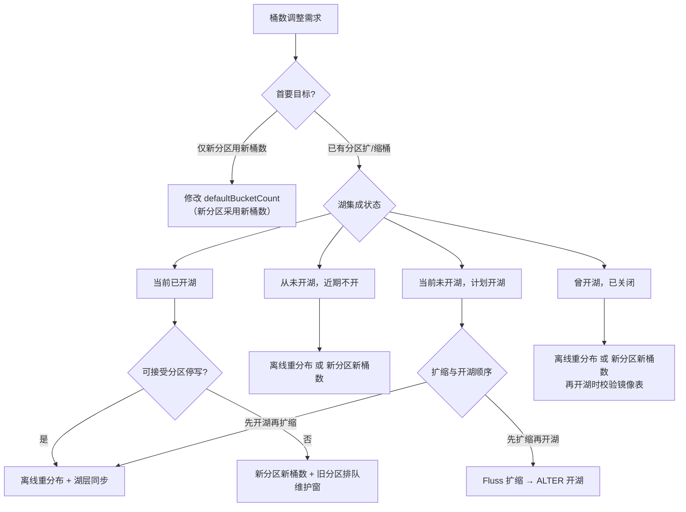
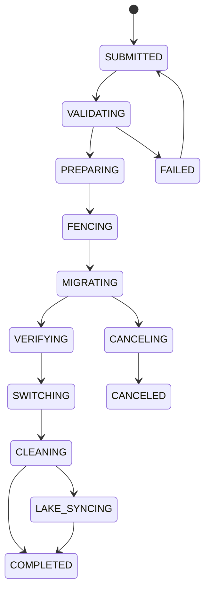
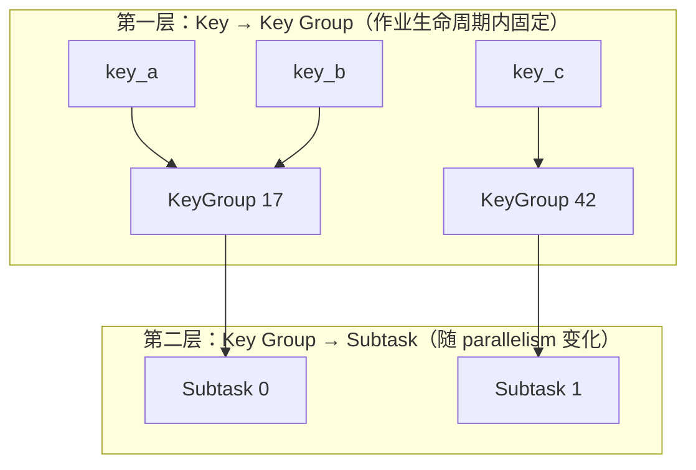

# Fluss 主键表动态分桶设计

> **文档版本**：V2（终稿结构）  
> **文档类型**：架构与时序设计（不含代码实现细节）  
> **关联 Roadmap**：[Operational Excellence — Automated cluster rebalancing and bucket rescaling](/roadmap)

---

## 目录

1. [执行摘要](#1-执行摘要)
2. [问题与目标](#2-问题与目标)
3. [总体方案](#3-总体方案)
4. [Fluss 现状与能力缺口](#4-fluss-现状与能力缺口)
5. [核心能力设计](#5-核心能力设计)
6. [湖流一体与联合读取](#6-湖流一体与联合读取)
7. [运维决策指南](#7-运维决策指南)
8. [实现规格](#8-实现规格)
9. [行业参考](#9-行业参考)
10. [风险与待决事项](#10-风险与待决事项)

---

## 1. 执行摘要

### 1.1 要解决什么问题

Fluss 主键表在建表时通过 `bucket.num` 固定分桶数量，建表后无法变更。随着数据量增长、集群扩容、Flink 作业调整并行度，以及湖仓分层对齐需求，用户需要在 **不破坏主键唯一性、Upsert 语义、变更数据捕获（CDC）连续性** 的前提下，**增加或减少** 分桶数量——可以是全表级别，也可以是按分区独立调整。

### 1.2 推荐方案（一句话）

**默认采用「固定哈希分桶」模式**：以 **新分区采用新桶数** 作为日常策略，以 **已有分区的离线全量重分布** 作为热点分区扩缩容手段，并与 **Paimon 湖表** 在联合读取（Union Read）层面对齐；三种分桶模式在 **建表时选型、长期并存**，同一张表不会在生命周期内自动切换模式。

### 1.3 三种分桶模式

| 模式 | 适用场景 | 说明 |
|------|----------|------|
| **固定哈希分桶**（默认） | 绝大多数主键表 | 路由为 `hash(分桶键) % 桶数`；扩缩需数据迁移或仅对新分区生效 |
| **动态索引分桶**（可选） | 少数需频繁在线扩桶、可接受单写者约束的表 | 维护「主键 → 桶编号」索引；扩桶无需搬数据，不支持缩桶 |
| **一致性哈希分桶**（可选，远期） | 超大表、对维护窗口极敏感 | 虚拟节点环分裂/合并，迁移范围有界；实现复杂度最高 |

### 1.4 工程交付节奏

| 里程碑 | 交付能力 |
|--------|----------|
| **M1** | 新分区可配置不同桶数；分区级桶布局元数据；Flink 写入按分区解析桶数 |
| **M2** | 桶数调整任务（RescaleJob）状态机；已有分区离线重分布；写入隔离与缩桶语义 |
| **M3** | 湖表按分区桶数对齐；联合读取与 Paimon 协同；动态开湖/关湖与扩缩桶时序 |

可选的 **动态索引分桶** 在 M2 之后单独立项；**一致性哈希分桶** 在 M3 之后评估预研。

---

## 2. 问题与目标

### 2.1 业务背景

主键表是 Fluss 的核心表类型，承载实时 Upsert、点查、Lookup Join、CDC 等能力。数据按 **分桶键**（`bucket.key`，默认为物理主键）做哈希路由，落入固定数量的 **桶（Bucket）**。每个桶对应一组 **日志片（LogTablet）+ 键值片（KvTablet）**，是 Fluss 最小的读写与副本管理单元。

当前 `bucket.num` **建表后不可变更**，典型痛点如下：

| 场景 | 问题 |
|------|------|
| 数据量从 GB 增长到 TB | 初始桶数过小，单桶热点、TabletServer 负载不均 |
| 集群扩容 | 新增 TabletServer 无法通过增加桶数提升并行度 |
| Flink 作业升并行度 | Sink 并行度与桶数不匹配，部分 subtask 空闲或争用 |
| 湖仓分层 | Paimon 支持调整桶数，Fluss 固定桶数导致跨层路由不一致 |
| 分区表生命周期 | 历史分区稀疏、新分区密集，无法按分区独立调桶 |

### 2.2 与集群 Rebalance 的边界

Fluss 已有 **集群 Rebalance**：在 **桶集合不变** 的前提下，将已有桶的副本在 TabletServer 间迁移、重选 Leader。这是 **搬移已有分片**，不是 **改变分片数量**。

动态分桶要解决的是：

- 桶 **数量** 变化（增加、减少、按分区变化）
- 数据在桶之间的 **重分布**
- 路由规则在过渡期的 **一致性**

二者可组合使用，但语义与实现路径完全不同。

### 2.3 核心不变量

| 编号 | 不变量 |
|------|--------|
| **I1** | 主键唯一性：任意时刻每个主键最多一个有效行版本 |
| **I2** | 路由确定性：给定 `(布局版本, 主键)` 路由结果唯一 |
| **I3** | 日志与键值一致：同一 TableBucket 的 Log 与 KV 可互相恢复 |
| **I4** | CDC 可解释：变更日志可重建为与快照一致的主键状态 |
| **I5** | 联合读取正确：湖层快照与 Fluss 日志按主键合并，以日志为准 |
| **I6** | 湖层对齐：分层写入与 Fluss 桶布局、偏移量元数据一致 |
| **I7** | 分区间隔离：分区 A 的扩缩不影响分区 B 的 I1–I6 |

### 2.4 设计目标

| 优先级 | 目标 |
|--------|------|
| **P0** | 正确性、可运维（API、进度、回滚） |
| **P1** | 在线能力、湖层对齐 |
| **P2** | 缩桶、分区粒度、自动化 |

### 2.5 非目标（首期）

- 修改 `bucket.key` 列集合
- 日志表（非主键表）的动态分桶（语义不同，另文讨论）
- 改变 `max.bucket.num` 全局上限语义

---

## 3. 总体方案

### 3.1 设计原则

1. **主键表不存在「只改元数据、零迁移」的通用解法**——竞品（Iceberg 禁止 PK 表改分区变换；Kafka 式单纯 rehash 破坏语义）已证明此路不可行。
2. **分桶模式在建表时选定，长期并存**——不是同一张表从一种模式「进化」到另一种。
3. **湖流一体是默认约束面**——即使当前未开湖，设计也须考虑后续开湖、关湖与扩缩桶的时序。
4. **Flink 并行度与 Fluss 桶数是独立维度**——扩缩桶须与 savepoint 协同，不能假设二者始终相等。

### 3.2 默认路线：固定哈希 + 渐进策略 + 离线迁移

适用于 **80% 以上** 主键表，组合三种能力：

| 能力 | 作用 | 典型场景 |
|------|------|----------|
| **新分区采用新桶数** | 修改 `defaultBucketCount`，仅影响未来创建的分区 | 时间分区表：旧分区稀疏、新分区密集 |
| **已有分区离线重分布** | 停写 → 全量扫描 → 按新桶数重写 → 原子切换元数据 | 热点历史分区必须扩桶或缩桶 |
| **湖层协同** | Paimon 镜像表与 Fluss 桶布局对齐；联合读取在迁移各阶段行为明确 | 已开湖或计划开湖的表 |

建表时 `bucketMode = FIXED_HASH`，表生命周期内不切换为其他模式。

### 3.3 可选路线

**动态索引分桶**（`bucketMode = DYNAMIC_INDEX`）

- 面向持续在线、不能接受长时间迁移窗口的 **少数专表**
- 与默认路线 **并列**，不是默认路线的下一阶段
- 代价：索引存储与维护、与湖固定桶模式对齐复杂；须接受 **单写者** 约束

**一致性哈希分桶**（`bucketMode = CONSISTENT_HASH`）

- 面向超大表、对 rebalance 窗口极敏感、可接受高运维复杂度的场景
- **扩桶与缩桶均支持**，不是「专做缩容」的补丁
- 不能从固定哈希表 **原地升级**；须新建表或明确迁移项目
- 建议在默认路线与动态索引路线稳定后再评估（M3 之后）

### 3.4 能力对比（摘要）

| 维度 | 离线重分布 | 双读过渡 | 动态索引 | 一致性哈希 | 新分区新桶数 |
|------|:---:|:---:|:---:|:---:|:---:|
| 正确性 | ★★★★★ | ★★★☆☆ | ★★★★☆ | ★★★★☆ | ★★★★★ |
| 联合读取兼容 | ★★★★★ | ★★☆☆☆ | ★★★★☆ | ★★★☆☆ | ★★★★☆ |
| 在线扩桶 | ★★☆☆☆ | ★★★★☆ | ★★★★★ | ★★★★☆ | ★★★☆☆ |
| 缩桶 | ★★★★☆ | ★★★☆☆ | ★☆☆☆☆ | ★★★★☆ | ★☆☆☆☆ |
| 实现复杂度 | 中 | 高 | 高 | 最高 | 低 |

默认路线采用 **新分区新桶数 + 离线重分布**；**双读过渡** 因联合读取几乎无法对齐，不推荐用于开湖表。

---

## 4. Fluss 现状与能力缺口

### 4.1 核心概念

| 概念 | 说明 |
|------|------|
| **TableBucket** | 逻辑分片标识 `(tableId, partitionId?, bucketId)`，`bucketId ∈ [0, numBuckets)` |
| **分桶键（Bucket Key）** | 哈希路由键；主键表必须为物理主键的子集（不含分区键） |
| **TableAssignment** | `bucketId → [replicaServerIds]`，首元素为 preferred Leader |
| **Tablet** | LogTablet（WAL + changelog）+ KvTablet（点查/更新状态） |

### 4.2 端到端数据流

**建表**：Client DDL → Coordinator 校验 → 生成 Assignment → ZK 持久化 → Bucket 状态机 → TabletServer 创建 Tablet。

**写入/点查**：Client 编码分桶键 → `hash % numBuckets` → 查元数据得 Leader → RPC 到 TabletServer。

**扫描/联合读取**：枚举 `[0, numBuckets)`（每分区独立），从各桶 Leader 拉取并合并。

### 4.3 元数据与约束

| 元数据 | 存储 | 可变性 |
|--------|------|--------|
| `bucketCount`, `bucketKeys` | ZK `TableRegistration` | **当前不可变** |
| `TableAssignment` / `PartitionAssignment` | ZK | 创建时生成；Rebalance 可改副本位置 |
| Bucket 状态 | Coordinator + ZK | NewBucket / OnlineBucket / OfflineBucket |

**关键约束**：

1. 哈希路由粘性：`bucketId = hash(bucketKey) % numBuckets`
2. Log + KV 共置：同桶的 LogTablet 与 KvTablet 在同一副本上
3. 开湖后分桶函数切换为 Paimon/Iceberg/Hudi 实现
4. 上限：`max.bucket.num` 默认 128,000

### 4.4 能力缺口

| 能力 | 现状 |
|------|------|
| 修改 `bucket.num` | 不支持 |
| 按分区不同桶数 | 不支持 |
| 在线数据重分布 | 不支持 |
| 集群 Rebalance | 支持（仅迁移已有桶副本） |
| Bucket 状态机 | 具备扩展基础 |

---

## 5. 核心能力设计

### 5.1 新分区采用新桶数（渐进策略）

**思路**：`ALTER` 仅更新表的 `defaultBucketCount`；**已有分区保持原桶数**，未来创建的分区使用新默认值；对必须调整的历史分区，另行触发离线重分布。

**优点**：实现量小；符合时间分区自然衰减；分区间天然隔离。

**局限**：同表不同分区桶数不一致；热点旧分区扩桶仍需额外迁移。

**与 Flink 协同**：仅改默认值时 **无需停作业**；新分区自动使用新桶数。

### 5.2 已有分区离线重分布（Overwrite 迁移）

**思路**：以 **分区** 为最小操作单元，与 Paimon Fixed Bucket 调整流程同构。

**元数据**：引入 `layoutEpoch`（布局版本）、`partitionRescaleState`（稳定 / 迁移中 / 已完成）。

**典型时序**：

1. 提交调整任务，校验前置条件
2. 创建目标桶、生成新 Assignment
3. **写入隔离（Write Fence）**：目标分区停写
4. 按源桶扫描 KV，按新 `hash % 新桶数` 写入目标桶
5. 完整性校验（行数、路由抽样、Log-KV 一致）
6. 原子切换 `PartitionBucketLayout`（`layoutEpoch++`）
7. 清理旧桶；若已开湖，同步 Paimon overwrite

**读写行为**：迁移期间目标分区停写；读可走旧布局或阻塞；完成后按新哈希路由。

**优点**：正确性最强；与 Paimon 调整桶数流程一致；可复用 Bucket 状态机。

**缺点**：分区级停写窗口；大数据量耗时长；缩桶成本更高。

### 5.3 动态索引分桶（可选模式）

**思路**：持久化 `主键 → bucketId` 映射；新主键按负载分配；已存在主键永驻原桶。扩桶无需搬数据。

**约束**：单写者（每表/每分区）；**不支持缩桶**。

**湖层对齐**：Fluss 索引主导，Paimon 侧使用 Fixed Bucket（`bucket=maxBuckets`），**禁止** Fluss 与 Paimon 各维护独立动态索引。

### 5.4 一致性哈希分桶（可选模式）

**思路**：将哈希空间划分为虚拟节点（vnode）范围；扩桶 = 分裂范围；缩桶 = 合并范围；仅受影响区间的数据迁移。

**两层映射**：

```
主键 → hash(主键) → 虚拟节点位置（固定）→ 范围查找 → bucketId（可变）
```

**优点**：扩缩均支持，迁移量有界；与 Hudi 一致性哈希、Flink Key Group 的两层结构同构。

**缺点**：实现复杂度最高；Log+KV 同步迁移难；迁移期并发 Upsert 需 per-key 隔离。

### 5.5 不推荐：双读过渡

迁移期间维护旧/新两套路由：写走新布局，读合并两布局。理论上无停写，但读放大、CDC 双份事件风险大，且 **联合读取几乎无法与 Paimon 对齐**。仅适合纯 Fluss、短过渡期的边缘场景。

---

## 6. 湖流一体与联合读取

### 6.1 联合读取模型

开湖表维持 **热层（Fluss Log/KV）+ 冷层（Paimon）** 两层：

| 层 | 角色 |
|----|------|
| **Paimon** | 历史快照至可读分层偏移量 |
| **Fluss** | 自该偏移量至当前的日志尾部 |

主键表：每个 `(分区, bucketId)` 一个 Hybrid Split，湖层快照 + Fluss 日志按主键 sort-merge，**以日志为准**。

### 6.2 分桶模式与 Paimon 映射

| Fluss 配置 | Paimon 模式 |
|------------|-------------|
| 有 `bucket.key` + `bucket.num` | Fixed Bucket：`bucket=N, bucket-key=...` |
| 无 `bucket.key` | Dynamic Bucket：`bucket=-1` |

当前 **主键表强制哈希分桶**，开湖后必然走 Paimon **Fixed Bucket**。

### 6.3 动态开湖与扩缩桶时序

Fluss 支持在已有表上动态开湖：

- `ALTER TABLE SET ('table.datalake.enabled' = 'true')`：Coordinator 按 **当时** Fluss 表的 `bucketCount` / `bucketKeys` 创建镜像 Paimon 表
- `table.datalake.format` 可先于 `table.datalake.enabled` 设置，无需重建表
- `ALTER TABLE RESET ('table.datalake.enabled')`：关闭分层；历史湖数据可能保留

**推荐顺序：先调整 Fluss 桶布局，再开湖**——镜像表一次性按新布局创建，无需对已有 Paimon 数据 overwrite（因尚未分层或仅有空镜像）。

### 6.4 按分区不同桶数

当前全链路假设 **单表单一 `numBuckets`**：`LakeSplitGenerator`、分层任务、Flink Sink 均按表级 N 枚举。支持按分区不同桶数须：

| Fluss 表类型 | 推荐 Paimon 对齐方式 |
|--------------|----------------------|
| 有 bucket.key 的主键表 | Fixed + 分区级 rescale overwrite |
| 需 per-partition 不同 N | Postpone（`bucket=-2`）或 Dynamic |
| 无 bucket.key 的日志表 | Dynamic + `__bucket` 系统列 |

### 6.5 迁移各阶段的联合读取行为

| 阶段 | 联合读取 |
|------|----------|
| 稳定（STABLE） | 正常 hybrid merge |
| 写入隔离（WRITE_FENCED） | 仅读；日志尾部不再增长 |
| 迁移中（MIGRATING） | 禁止或返回 STALE |
| 湖层同步中（LAKE_SYNCING） | 使用上一稳定 epoch 的湖快照 |
| 已完成（COMPLETED） | 新布局 + 新可读快照 |

**说明**：若采用「先 Fluss 扩缩、后开湖」，可 **跳过 LAKE_SYNCING**（开湖时镜像按新布局创建）。

### 6.6 跨层一致性要求

1. Fluss 桶数 + 分桶键 → Paimon bucket/bucket-key 自动对齐
2. 分层偏移量按 `(partitionId, bucketId)` 跟踪，携带 `layoutEpoch`
3. 联合读取使用 `getReadableLakeSnapshot`
4. `__bucket` 系统列与 Fluss 桶编号一致
5. 分区名编码一致（`partition.legacy-name=false`）
6. 主键比较器对齐
7. 同桶 splits 共置同一 reader/task

---

## 7. 运维决策指南

### 7.1 决策维度

扩缩桶运维须同时考虑：

1. **目标范围**：仅新分区用新桶数，还是已有分区也要扩/缩？
2. **湖集成状态**：从未开湖 / 计划开湖 / 当前已开湖 / 曾开湖已关闭
3. **操作顺序**：扩缩与开湖、关湖的先后
4. **可接受的停写窗口**：分区级维护窗是否可接受

**注意**：主键表 **不以「是否 Dynamic」作为决策分支**——当前主键表开湖后走 Paimon Fixed；Dynamic 适用于日志表或无 bucket.key 场景。

### 7.2 决策流程



### 7.3 分场景说明

**从未开湖，且近期不计划开湖**

- 推荐：新分区新桶数 + 按需对热点旧分区执行离线重分布
- 联合读取不在范围；无湖层同步阶段
- 若已预置 `table.datalake.format`，开湖时镜像表将继承扩缩后的布局

**当前未开湖，但计划开湖**

| 顺序 | 路径 | 说明 |
|------|------|------|
| **先扩缩，后开湖**（推荐） | 离线重分布 / 新分区新桶数 → `ALTER SET table.datalake.enabled=true` | 避免对已有 Paimon 数据 overwrite；镜像表按新布局一次性创建 |
| **先开湖，后扩缩** | 开湖 → 积累分层数据 → 离线重分布 + 湖层同步 | 若已有大量湖数据，overwrite 成本高 |

**当前已开湖**

- 主键表：**离线重分布 + 湖层同步**，与 Paimon Fixed rescale 对齐
- 仅新分区扩容：新分区新桶数 + 旧分区排队离线重分布
- 不推荐双读过渡用于开湖表

**曾开湖，已关闭分层**

- 按纯 Fluss 执行扩缩
- 历史 Paimon 数据仍在，但联合读取不再拼接
- 若再次开湖，须校验镜像表是否存在、布局是否与 Fluss 一致

### 7.4 文字版决策清单

```
1. 是否只需「新分区用新桶数、旧分区不动」?
   └─ 是 → 修改 defaultBucketCount

2. 是否需要对已有分区扩/缩桶?
   ├─ 当前已开湖
   │  ├─ 可停写 → 离线重分布 + Paimon overwrite（湖层同步）
   │  └─ 不可停写 → 新分区新桶数，或排队维护窗执行离线重分布
   │
   ├─ 当前未开湖，但将开湖
   │  ├─ 优先：先 Fluss 扩缩 → 再 ALTER 开湖
   │  └─ 若已开湖后再扩缩 → 同「已开湖」路径
   │
   ├─ 当前未开湖，且长期不开湖
   │  └─ 离线重分布 / 新分区新桶数（无湖层协同）
   │
   └─ 曾开湖已关闭
      └─ 离线重分布 / 新分区新桶数；再开湖时单独校验镜像表
```

### 7.5 Flink 作业协同 Runbook

对 **已有分区离线重分布**（须停写）：

| 步骤 | 操作 |
|------|------|
| 1 | `STOP WITH SAVEPOINT` |
| 2 | `CALL sys.rescale_buckets(...)` |
| 3 | 轮询至 `COMPLETED` |
| 4 | （若已开湖）确认 Paimon overwrite 完成 |
| 5 | 以 `parallelism >= 新桶数` 从 savepoint 恢复 |

对 **仅修改 defaultBucketCount**：无需停作业；新分区自动使用新桶数。

---

## 8. 实现规格

### 8.1 桶数调整任务（RescaleJob）状态机

#### 设计原则

- 与 `TableBucketStateMachine`（桶生命周期）、`RebalanceManager`（副本迁移）**正交**
- 一个 `(tableId, partitionId)` 同时最多一个活跃 RescaleJob
- Coordinator 单线程事件循环驱动状态转移

#### 任务状态

| 状态 | 含义 |
|------|------|
| `SUBMITTED` | 已提交，等待校验 |
| `VALIDATING` | 前置检查 |
| `PREPARING` | 创建目标桶、生成 Assignment |
| `FENCING` | 广播停写、等待 in-flight 完成 |
| `MIGRATING` | 数据迁移进行中 |
| `VERIFYING` | 完整性校验 |
| `SWITCHING` | 原子切换布局元数据 |
| `CLEANING` | 下线旧桶 |
| `LAKE_SYNCING` | 等待 Paimon 层同步（已开湖且需 overwrite 时） |
| `COMPLETED` / `FAILED` / `CANCELED` | 终态 |



#### 写入隔离（Write Fence）协议

1. **软通知**：广播 `RescaleNotice`，客户端 flush pending batches
2. **硬隔离**：`Produce` 对目标分区返回 `PARTITION_RESCALING`

| RPC | 隔离期间 |
|-----|----------|
| Produce（目标分区） | 拒绝 |
| Lookup / Scan | 允许读旧布局（可配置） |
| CreatePartition（其他分区） | 允许 |

#### 迁移子任务

每个源桶一个任务：`PENDING → SCANNING → WRITING → CHECKPOINTING → DONE`。断点持久化 `lastScannedPk`、`rowsMigrated`，支持崩溃续跑。

#### 完整性校验

1. 行数守恒：迁出行数 = 源桶行数
2. 路由抽样：随机主键验证 `hash(pk) % 目标桶数` 与存储位置一致
3. Log-KV 一致：目标桶 KV 行数 = Log distinct PK 数
4. 无孤儿：源桶残留为 0

#### 原子切换

ZK 事务批：更新 `PartitionBucketLayout`（`bucketCount=目标N`, `layoutEpoch++`）→ 删除 `WriteFence` → 追加 `LayoutHistory`。

#### 与 Rebalance 互斥

| 操作 A | 操作 B | 结果 |
|--------|--------|------|
| Rescale(P) | Rescale(P) | 第二个拒绝 |
| Rescale(P) | Rescale(Q) | 允许并行 |
| Rescale(P) | Rebalance(bucket ∈ P) | 互斥 |
| Rescale(P) | Tiering(P) | Tiering 暂停 |

#### Admin API

| 接口 | 语义 |
|------|------|
| `rescaleBuckets(table, partition?, targetBuckets)` | 提交任务 |
| `getRescaleProgress(jobId)` | 查询进度 |
| `cancelRescaleJob(jobId)` | 取消 |
| `retryRescaleJob(jobId)` | 重试 |

### 8.2 元数据模型（PartitionBucketLayout）

#### 设计目标

- 向后兼容：旧表 `partition.bucketCount = null` → 继承表级
- 支持 per-partition 桶数
- `layoutEpoch` 驱动客户端缓存失效与湖层偏移量版本化

#### 表级扩展（TableRegistration）

| 字段 | 类型 | 说明 |
|------|------|------|
| `defaultBucketCount` | int | 新分区默认桶数（`ALTER` 可改）；兼容原 `bucketCount` |
| `bucketMode` | enum | `FIXED_HASH` / `DYNAMIC_INDEX` / `CONSISTENT_HASH` |
| `maxBucketCount` | int | 动态索引/一致性哈希上限 |
| `bucketLayoutVersion` | int | 协议版本 |

```
resolveBucketCount(table, partition):
  if partition.bucketCount != null: return partition.bucketCount
  return table.defaultBucketCount
```

#### 分区级扩展（PartitionRegistration）

| 字段 | 类型 | 默认 | 说明 |
|------|------|------|------|
| `bucketCount` | int? | null | null = 继承 default |
| `layoutEpoch` | long | 0 | 扩缩完成时 +1 |
| `rescaleState` | enum | STABLE | STABLE / FENCED / MIGRATING / LAKE_SYNCING |
| `activeJobId` | string? | null | 当前 RescaleJob |
| `createdWithBucketCount` | int | 创建时快照 | 审计 |

#### PartitionInfo RPC 扩展

| 字段 | 说明 |
|------|------|
| `bucketCount` | 解析后有效桶数 |
| `layoutEpoch` | 当前 epoch |
| `rescaleState` | 供 Client 决定重试策略 |

分区表路由：**不得**仅用 `TableInfo.numBuckets`，须 per-record 解析分区后查 `bucketCount`。

#### 湖层偏移量扩展

```
BucketOffsetEntry:
  partitionId, bucketId, layoutEpoch, logOffset, bucketCountAtTier
```

扩缩后推荐策略：新 epoch 从 offset=0，并发送 `layout_switch` 控制事件。

#### ZK 路径

| 路径 | 内容 |
|------|------|
| `/fluss/tables/{id}/registration` | TableRegistration |
| `/fluss/tables/{id}/partitions/{pid}/registration` | PartitionRegistration + layout |
| `/fluss/tables/{id}/rescale-jobs/{jobId}` | RescaleJob |
| `/fluss/tables/{id}/write-fences/{pid}` | WriteFence |
| `/fluss/tables/{id}/layout-history/{pid}` | LayoutHistory |

### 8.3 Flink 连接器改造

#### 问题

当前 Flink Connector 在多处将 `numBuckets` **固化在作业构建期**。动态分桶要求 **运行时感知布局** 或 **作业级协同扩缩**。

#### BucketLayoutProvider 抽象

```
BucketLayoutProvider:
  getDefaultBucketCount()
  getPartitionBucketCount(partitionName)
  getPartitionLayoutEpoch(partitionName)
  getPartitionRescaleState(partitionName)
  refresh() / refreshIfEpochStale()
```

#### 改造项

**Sink**

| 组件 | 改造 |
|------|------|
| `FlinkRowDataChannelComputer` | per-record 解析分区 → 动态 N |
| `HashBucketAssigner` | 接受 `BucketLayoutProvider` |
| `ChannelComputer` | `shouldCombinePartitionInSharding` 用 per-partition N |
| Produce 错误处理 | 捕获 `PARTITION_RESCALING` → 刷新元数据 → 退避重试 |
| `RecoveryOffsetManager` | per-partition 枚举 bucket |

**Source / 联合读取**

| 组件 | 改造 |
|------|------|
| `LakeSplitGenerator` | per-partition `resolveBucketCount` |
| `FlinkSourceEnumerator` | 感知 layout 变更，动态增删 split |
| Union Read | `LAKE_SYNCING` 期间降级为纯 Fluss |

**Catalog**

| 组件 | 改造 |
|------|------|
| `FlinkCatalog` | `ALTER TABLE SET bucket.num`；`CALL sys.rescale_buckets` |

#### Flink Key Group 与 Connector 映射

| Flink | Fluss Connector |
|-------|-----------------|
| maxParallelism | maxBucketCount |
| hash % maxParallelism（固定） | hash(pk) % bucketCount（Fixed） |
| Key Group → Subtask | (partition, bucketId) → channel |
| Savepoint 门控 | Write Fence + Flink savepoint |

#### 改造分期

| 阶段 | 目标 | 前置条件 |
|------|------|----------|
| **基础** | per-partition layout 感知 + rescale 入口 | 服务端 Schema + RPC |
| **增强** | Source / Union Read / Recovery 全链路 | 基础完成 |
| **完善** | 可观测性、文档 | 增强完成 |

**关键路径**：服务端 Schema → BucketLayoutProvider → PartitionInfo → ChannelComputer / LakeSplitGenerator → Source / Union Read。

**上线约束**：服务端 `PartitionBucketLayout` 与 `PartitionInfo` RPC **必须先于** Connector 改造发布。

---

## 9. 行业参考

本章从 Lake 存储格式、OLAP 引擎、流计算状态层三个维度归纳业界做法，供方案选型对照。核心矛盾始终是：**分片数变化** 与 **主键路由稳定性** 之间的冲突。

### 9.1 对比总览

| 系统 | 分布单元 | 动态调整 | 迁移策略 | 主键表适用性 |
|------|----------|----------|----------|--------------|
| **Paimon** | Bucket (LSM) | Fixed / Dynamic / Postpone | ALTER + OVERWRITE；索引扩桶 | Fixed 路径最可落地 |
| **Iceberg** | 分区变换 | Spec 演化 | 无自动迁移 | PK 表 **禁止** 演化 |
| **Hudi** | Bucket → File Group | 三引擎 | 离线 replace；CH 局部 split/merge | CH 为在线局部迁移代表 |
| **Kafka** | Topic Partition | 仅增加 | **无迁移** | **反模式**（rehash 不搬数据） |
| **StarRocks** | Tablet | ALTER BUCKETS | 异步后台重分布 | 引擎内搬运参考 |
| **Doris** | Tablet | 仅新分区 | 旧分区不可变 | 与「新分区新桶数」同构 |
| **Flink** | Key Group | Savepoint rescale | 状态句柄随 Key Group 迁移 | 仅计算层，非存储 |

### 9.2 重点系统要点

**Paimon**

- **Fixed Bucket**：`ALTER` 改元数据 + `INSERT OVERWRITE` 重组；与 Fluss 离线重分布应对齐
- **Dynamic Bucket**：Key→Bucket 索引；单写者；不支持缩桶
- **Postpone Bucket**：写入先进 postpone 目录，compact 时 per-partition 决定桶数

**Iceberg**

- 分区 spec 演化对 PK 表 **硬禁止**——同一 PK 在新旧 transform 下路由冲突

**Hudi**

- Simple Bucket：分区内固定 hash，不支持在线改 N
- Partition-Level Bucket：按分区规则不同 N，离线 replace，须停写
- Consistent Hashing（RFC-42）：环分裂，局部迁移

**Kafka**

- 仅增分区、不搬数据；扩分区后同 key 路由改变——**主键表绝不可照搬**

**Doris**

- 已有分区桶数不可变；新分区可用新配置——与 Fluss 渐进策略同构

### 9.3 Flink Key Group（计算层对照）

Flink 的 Key Group 是有状态流计算中成熟的「逻辑分片 rescale」实践，与 Fluss 桶扩缩在 **问题结构** 上相似，但 **不是一致性哈希**：



| 概念 | 定义 | 可变性 |
|------|------|--------|
| **Key** | 业务键（`keyBy` 字段） | — |
| **maxParallelism** | Key Group 总数上限 | **作业创建后不可变** |
| **Key Group ID** | `hash(key) % maxParallelism` | **固定** |
| **parallelism** | 当前 subtask 数 | **可变** |

**结论**：Flink 是 **固定 Hash 分区（逻辑分片）+ 可变范围归属（物理分配）**；Fluss 一致性哈希方案在两层结构上与 Key Group 同构，但须迁移 **持久化** Log+KV，成本远高于搬 checkpoint。

Paimon Fixed rescale 官方流程要求 Flink `stop-with-savepoint` → ALTER + OVERWRITE → 以 `parallelism ≥ 新桶数` 恢复。Fluss 引入扩缩桶后，Connector 须文档化 **同一维护窗** 内的协同。

### 9.4 设计模式归纳

| 模式 | 代表 | 核心做法 | Fluss 对应 |
|------|------|----------|------------|
| **朴素 Rehash** | Kafka | 改 N，不搬数据 | **禁止** |
| **元数据演化** | Iceberg | 改 spec，旧新共存 | 不适用 PK 表 |
| **离线 Overwrite** | Paimon Fixed | 停写 + 全量重组 | 离线重分布 |
| **Key→Bucket 索引** | Paimon Dynamic | 索引维护路由 | 动态索引分桶 |
| **一致性哈希** | Hudi CH | 环分裂，局部迁移 | 一致性哈希分桶 |
| **引擎后台重分片** | StarRocks | 异步 tablet 搬运 | 长期演进 |
| **新分区新配置** | Doris、Paimon Postpone | 旧布局不变 | 新分区新桶数 |
| **计算状态 Rescale** | Flink Key Group | 固定逻辑分片 + 搬状态 | Connector 协同参考 |

### 9.5 行业结论（指导 Fluss）

1. 主键表不存在「只改元数据、零迁移」的通用解法。
2. Lake 生态内最可落地的是 **Paimon Fixed rescale 路径**（离线重分布），与联合读取兼容性最好。
3. 按分区不同桶数在 Paimon 侧靠 Postpone 或分区级 overwrite；Fluss 渐进策略须专门设计湖协同。
4. Flink Key Group 的两层映射思想可指导一致性哈希设计，但 Fluss 须额外解决持久化与湖层一致。
5. 在线扩缩的工业先例（Hudi CH、StarRocks）均伴随显著工程复杂度；Fluss 宜先 Offline 后 Online。

---

## 10. 风险与待决事项

### 10.1 技术风险

| 风险 | 缓解 |
|------|------|
| Log+KV 迁移不一致 | 以 Log 为 source of truth |
| 大分区迁移时间过长 | 并行 per-bucket；可限速 |
| 湖层 rescale 不同步 | readable snapshot 门控 |
| 与 Rebalance 死锁 | 全局锁 + 优先级 |

### 10.2 待决事项

1. M1 是否纳入缩桶（离线重分布反向）？建议支持但文档化维护窗与校验要求
2. 桶编号是否允许非连续？
3. 动态索引分桶：索引放 Coordinator 还是 IndexTablet？是否纳入近期路线图？
4. 写入隔离：Coordinator 拒绝 vs Client 订阅 vs 两者结合？
5. ZK 移除后 Rescale 元数据存储方案？
6. 一致性哈希分桶：是否在 M3 完成前启动预研？

### 10.3 总结

Fluss 主键表固定哈希分桶已成为并行度与长期运维的瓶颈，但现有 Bucket 状态机、Assignment 管理、Rebalance 基础设施提供了良好底座。

**竞品表明不存在银弹**：要强正确性用离线迁移；要在线扩桶用索引或一致性哈希；纯 rehash 不迁数据是主键表反模式。

**推荐路径**：

1. **默认（固定哈希）**：新分区新桶数 + 已有分区离线重分布 + 湖层协同——覆盖绝大多数主键表；按 M1→M2→M3 交付，**非**路由范式升级
2. **可选（动态索引）**：少数流式专表，与默认路线并列，单独立项
3. **可选（一致性哈希）**：远期高级模式，扩缩并重、有界在线迁移，不承接默认表的「原地升级」

联合读取与动态开湖是默认路线的核心约束面；Flink Key Group 的两层映射思想可指导一致性哈希设计，但 Flink 并行度 rescale 与 Fluss 桶扩缩仍是两个独立维度，须通过 savepoint 协同变更。

---

## 参考资料

- [Fluss Bucketing](/table-design/data-distribution/bucketing.md)
- [Fluss Primary Key Table](/table-design/table-types/pk-table.md)
- [Fluss Rebalance](/maintenance/operations/rebalance.md)
- [Fluss Architecture](/concepts/architecture.md)
- [Paimon Data Distribution](https://paimon.apache.org/docs/master/primary-key-table/data-distribution/)
- [Paimon Rescale Bucket](https://paimon.apache.org/docs/master/maintenance/rescale-bucket/)
- [Flink Rescalable State](https://flink.apache.org/2017/07/04/a-deep-dive-into-rescalable-state-in-apache-flink/)
- [Hudi RFC-42 Consistent Hashing](https://github.com/apache/hudi/blob/master/rfc/rfc-42/rfc-42.md)
