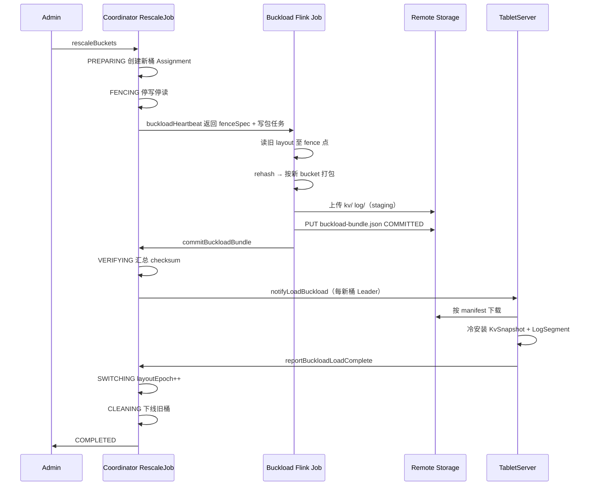
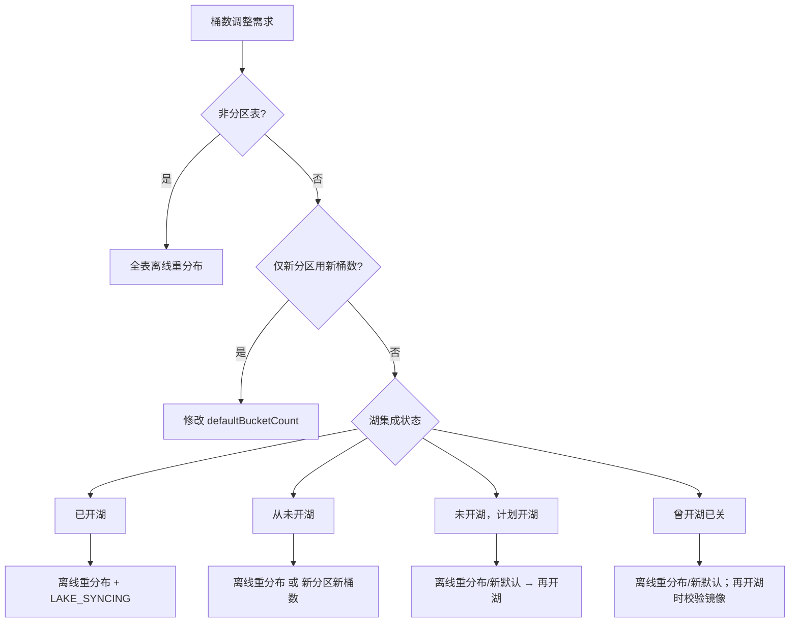
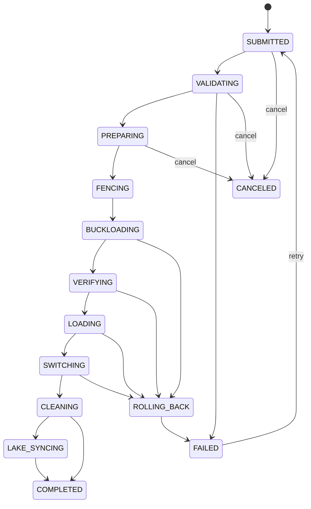

# Fluss 主键表动态分桶 — 目标架构设计

> **文档类型**：目标架构与时序设计（不含代码实现细节）  
> **文档状态**：Target Architecture  
> **关联 Roadmap**：[Operational Excellence — Automated cluster rebalancing and bucket rescaling](/roadmap)

---

## 目录

1. [执行摘要](#1-执行摘要)
2. [现状基线与目标能力](#2-现状基线与目标能力)
3. [问题、不变量与验收标准](#3-问题不变量与验收标准)
4. [总体方案](#4-总体方案)
5. [分桶函数与跨层对齐规约](#5-分桶函数与跨层对齐规约)
6. [核心能力设计](#6-核心能力设计)
7. [Buckload 服务与冷包协议](#7-buckload-服务与冷包协议)
8. [湖流一体与联合读取](#8-湖流一体与联合读取)
9. [运维决策与作业协同](#9-运维决策与作业协同)
10. [桶数调整任务（RescaleJob）](#10-桶数调整任务rescalejob)
11. [元数据模型](#11-元数据模型)
12. [Flink 连接器改造](#12-flink-连接器改造)
13. [行业参考](#13-行业参考)
14. [风险与待决事项](#14-风险与待决事项)

---

## 1. 执行摘要

### 1.1 问题

Fluss 主键表在建表时通过 `bucket.num` 固定分桶数量，建表后无法变更。用户需要在 **不破坏主键唯一性、Upsert 语义、变更数据捕获（CDC）连续性** 的前提下，按全表或按分区 **增加或减少** 分桶数量，并与湖仓分层、Flink 作业协同。

### 1.2 推荐方案

**默认采用固定哈希分桶模式**，组合三种能力：

1. **新分区采用新桶数** — 修改表的默认桶数，仅影响未来创建的分区（分区表）或触发全表离线迁移（非分区表见 §6.4）。
2. **已有分区离线重分布** — **外置 Buckload Flink 作业**在 fence 点读取旧 layout、按新 layout 打包；冷包写入集群 **remote storage**；**TabletServer 冷加载**安装到新桶（不走在线 PutKV）。
3. **湖层协同** — 镜像表与 Fluss 桶布局、分桶函数、偏移量版本对齐；联合读取（Union Read）在各阶段语义明确。

三种分桶模式（固定哈希、动态索引、一致性哈希）在 **建表时选型、长期并存**；同一张表不在生命周期内自动切换模式。

### 1.3 交付里程碑

| 里程碑 | 交付能力 |
|--------|----------|
| **M1** | 分区级桶布局元数据；新分区默认桶数可变更；Flink 按分区解析桶数（布局变更须 Savepoint 协同，见 §11） |
| **M2** | RescaleJob 控制面；**Buckload 服务**（`fluss-flink-buckload`）；冷包 + TS 冷加载；Buckload 专用 RPC 协议；缩桶 |
| **M3** | 湖表按分区桶数对齐；联合读取与 Paimon 协同；开湖/关湖与扩缩桶时序；分层偏移量与 `layoutEpoch` 绑定 |

动态索引分桶、一致性哈希分桶在 M3 之后 **单独立项评估**，不阻塞主路径。

---

## 2. 现状基线与目标能力

### 2.1 当前已实现

| 能力 | 现状 |
|------|------|
| 分桶路由 | 固定 `hash(分桶键) % bucket.num`；开湖后按湖格式切换分桶函数（见 §5） |
| 主键表分桶键 | 未显式指定时自动设为物理主键（排除分区键） |
| `bucket.num` / `bucket.key` | 建表时确定，**ALTER 不可改**（服务端与 Flink Catalog 均禁止） |
| 桶数作用域 | **表级单一** `numBuckets`；各分区桶数相同 |
| 集群 Rebalance | 在桶 **数量不变** 前提下迁移副本，与扩缩桶正交 |
| 动态开湖 | `ALTER SET table.datalake.enabled=true` 时按 **当前** 桶布局创建镜像湖表 |
| Flink Sink 桶数 | SQL/DataStream Sink 在 **作业构建/规划期** 固化 `numBuckets` |
| RescaleJob / layoutEpoch | **未实现** |

### 2.2 目标能力（本文定义）

| 能力 | 目标行为 |
|------|----------|
| 默认桶数变更 | `ALTER` 修改 `defaultBucketCount`；已有分区/非分区表布局不变 |
| 分区级扩缩 | RescaleJob + Buckload 冷包 + TS 冷加载 |
| 元数据 | `PartitionBucketLayout` + `layoutEpoch` + `rescaleState` |
| 写入/读取隔离 | 目标范围停写 **且** 停读（见 §10.3） |
| Buckload 数据面 | 外置 Flink 写 **KvSnapshot 兼容冷包 + Bootstrap Log Segment** 至 remote storage；TS **冷加载** |
| Buckload 协议 | Coordinator 驱动时序（`buckloadHeartbeat` / `commitBuckloadBundle` / `notifyLoadBuckload`）；**禁止** TS 轮询 remote |
| CDC | Bootstrap Log 含 `layout_switch`；下游按 `layoutEpoch` 重置 |
| 湖层 | 已开湖表的 Paimon overwrite 与 Fluss 冷加载协同 |
| 分桶模式 | 建表可选 `bucketMode`（首期仅实现 `FIXED_HASH`） |

### 2.3 与集群 Rebalance 的边界

Rebalance **搬移已有桶的副本**；动态分桶 **改变桶数量并重分布数据**。二者可串行执行，但 **同一分区同一时刻不可并行**（见 §10.6）。

---

## 3. 问题、不变量与验收标准

### 3.1 问题陈述

如何在主键表上允许运行时调整分桶数量（全局或按分区），并协调客户端路由、Coordinator 元数据、TabletServer 存储（Log + KV）、湖仓分层、Flink 作业的一致性？

### 3.2 核心不变量

| 编号 | 不变量 | 验收要点 |
|------|--------|----------|
| **I1** | 主键唯一性 | 任意时刻每个主键最多一个有效行版本 |
| **I2** | 路由确定性 | 给定 `(layoutEpoch, 主键)` 路由到唯一 `bucketId` |
| **I3** | Log-KV 一致 | 迁移完成后，同 TableBucket 的 Log 与 KV 可互相恢复 |
| **I4** | CDC 可解释 | 布局切换前后，changelog 可通过 `layout_switch` 事件与 epoch 关联 |
| **I5** | 联合读取正确 | 湖快照与 Fluss 日志按主键 merge，以日志为准 |
| **I6** | 湖层对齐 | 分层偏移量携带 `layoutEpoch`；跨层 split 按 `(partition, bucketId, epoch)` 配对 |
| **I7** | 分区间隔离 | 分区 A 的扩缩不破坏分区 B 的 I1–I6 |

### 3.3 设计目标优先级

| 优先级 | 目标 |
|--------|------|
| **P0** | 正确性、可运维（API、进度、失败回滚） |
| **P1** | 湖层对齐、CDC 连续性 |
| **P2** | 缩桶、自动化、可选在线模式 |

### 3.4 范围边界

**在范围内**：主键表、固定哈希模式（M1–M3）；分区表与非分区表。

**不在首期范围**：

- 修改 `bucket.key` 列集合
- 日志表（非主键表）动态分桶
- 改变 `max.bucket.num` 全局上限语义
- 动态索引分桶、一致性哈希分桶的实现（仅保留架构占位）

---

## 4. 总体方案

### 4.1 设计原则

1. 主键表不存在「只改元数据、零迁移」的通用解法。
2. 分桶模式在建表时选定；默认路线与可选模式 **并列**，非同表进化。
3. 湖流一体是默认约束面，即使当前未开湖也须考虑后续开湖时序。
4. Flink 并行度与 Fluss 桶数是 **独立维度**；布局变更须 Savepoint 或作业重启协同。
5. 离线迁移以外置 **Buckload** 写 remote 冷包、TabletServer **冷加载** 为默认数据面；Coordinator 仅控制面。

### 4.2 默认路线：固定哈希分桶

| 能力 | 作用 | 适用 |
|------|------|------|
| **新分区采用新桶数** | 修改 `defaultBucketCount`，未来分区用新默认值 | 时间分区表、负载随时间变化 |
| **已有分区离线重分布** | Buckload 冷包 + TabletServer 冷加载 | 热点历史分区必须扩/缩桶 |
| **湖层协同** | 镜像表布局对齐 + 联合读取阶段语义 | 已开湖或计划开湖 |

建表时 `bucketMode = FIXED_HASH`。

### 4.3 可选分桶模式（远期）

| 模式 | 适用 | 首期 |
|------|------|------|
| **动态索引分桶** | 频繁在线扩桶、可接受单写者 | 不实现 |
| **一致性哈希分桶** | 超大表、有界在线迁移 | 不实现 |

二者均须 **新建表** 选型，不能从固定哈希表原地升级。

### 4.4 能力对比（定性，含前提）

| 能力 | 离线重分布 | 新分区新桶数 | 动态索引 | 一致性哈希 |
|------|------------|--------------|----------|------------|
| **前提** | 可接受目标范围停写停读 | 分区表 + 仅新分区需新 N | 单写者、不缩桶 | 高工程复杂度 |
| **正确性** | 最高 | 高（旧分区不变） | 高（索引一致时） | 高（迁移完成时） |
| **联合读取** | 与 Paimon Fixed 对齐最好 | 需 per-partition 枚举 | 须 Fluss 索引主导 | 中等 |
| **在线性** | 低（维护窗） | 高（仅新分区） | 高（扩桶） | 中（有界迁移） |
| **缩桶** | 支持（成本高） | 不支持旧分区 | 不支持 | 支持 |

默认路线 = **新分区新桶数 + 离线重分布 + 湖层协同**。

---

## 5. 分桶函数与跨层对齐规约

### 5.1 为何不能简化为单一 hash 公式

Fluss 按是否绑定湖格式选用不同分桶函数与 Key 编码器：

| 场景 | 分桶函数 | Key 编码 |
|------|----------|----------|
| 纯 Fluss（未绑定湖格式） | `FlussBucketingFunction` | Fluss 编码 |
| 绑定 Paimon | `PaimonBucketingFunction` | `PaimonKeyEncoder` |
| 绑定 Iceberg | `IcebergBucketingFunction` | `IcebergKeyEncoder` |
| 绑定 Hudi | `HudiBucketingFunction` | Hudi 编码 |
| 绑定 Lance | `FlussBucketingFunction` | Fluss 编码 |

**规约 R1**：同一表在 **开湖前后、扩缩前后**，客户端与 TabletServer 必须使用 **与当前 `table.datalake.format` 一致** 的分桶函数与 Key 编码器计算 `bucketId`。

**规约 R2**：离线重分布的目标桶写入、完整性校验抽样、Paimon overwrite，均须使用 **目标 layout 生效时的分桶函数**，而非迁移启动时的旧函数。

**规约 R3**：联合读取按 `(partitionId, bucketId)` 配对 Fluss 与湖 split 时，须保证 **同一主键在两侧映射到相同 bucketId**；扩缩完成后须执行跨层路由抽样验证。

### 5.2 开湖切换点

表从「纯 Fluss」变为「湖格式绑定」时，分桶函数可能切换。若桶数不变，仍须验证开湖前后同一主键的 `bucketId` 是否一致；不一致则 **禁止自动开湖**，要求先离线重分布或新建镜像表。

### 5.3 与 Paimon Fixed Bucket 的对齐

主键表开湖后镜像为 Paimon **Fixed Bucket**（`bucket=N, bucket-key=...`）。Fluss 扩缩桶完成后，Paimon 侧须通过 **分区级 INSERT OVERWRITE** 重组，使湖内布局与 Fluss 新 `bucketCount` 一致。

---

## 6. 核心能力设计

### 6.1 新分区采用新桶数

**语义**：`ALTER TABLE` 修改 `defaultBucketCount`；**已有分区**（及非分区表的当前布局）保持原 `bucketCount`；之后 `CREATE PARTITION` 使用新默认值。

**元数据**：表级 `defaultBucketCount` 可变更；分区级 `bucketCount` 在创建时快照为 `createdWithBucketCount`。

**局限**：同表不同分区桶数不一致；无法自动解救已过热的历史分区。

**Flink 协同**（见 §11）：仅当 **尚无新桶数分区写入** 且 Sink 尚未需要新 N 时，可不停作业；一旦出现新 N 分区写入或 per-partition 桶数差异， **须 Savepoint 重启** 以刷新 Sink shuffle 布局。

### 6.2 已有分区离线重分布（Buckload + 冷加载）

**最小操作单元**：一个 `(tableId, partitionId)`；非分区表视为 `partitionId = null`（见 §6.4）。

**数据面**：不在 TabletServer 内做在线 Log 重放写 KV。由 **Buckload Flink 作业**（仓库内 `fluss-flink-buckload`，与 Tiering 同构部署）完成读旧 layout、rehash、写冷包；由 **TabletServer 冷加载**从 remote storage 安装到新桶 Leader。

**控制面**：Coordinator 上的 **RescaleJob** 状态机驱动 Fence → Buckload → Verify → Load → Switch（详见 §7、§10）。

**数据真源**：Fence 点之前旧 layout 的 **Log + KV 合并态**（读路径与 Tiering 类似）；冷包内 KV 为 fence 时刻按 **新分桶函数** 路由后的 **最终 PK 态**；Bootstrap Log 由 Flink 按 Fluss 原生 **LogSegment** 格式写出（含 `layout_switch`）。

**为何不用在线 PutKV**：避免迁移期与用户写入争用 WAL/KV 路径；LOAD 阶段 IO 集中在维护窗，可限速、可并行调度。

### 6.3 双读过渡（不采用）

迁移期维护旧/新两套路由虽可消除停读，但读放大、CDC 重复事件、联合读取与 Paimon 对齐成本过高。**默认路线不采用**。

### 6.4 非分区主键表

非分区表在创建时即生成全表 `TableAssignment`，无「新分区新桶数」策略。

| 需求 | 路径 |
|------|------|
| 增加/减少全表桶数 | 对 `partitionId=null` 提交 RescaleJob（Buckload + 冷加载） |
| 仅改默认桶数 | **对非分区表无效**；须走 RescaleJob |

`max.bucket.num` 校验：非分区表为 `bucketCount`；分区表为 `sum(各分区 bucketCount)`。

### 6.5 可选模式（架构占位）

**动态索引分桶**、**一致性哈希分桶**：建表选型，首期不实现；须新建表，不能从固定哈希表原地升级。

---

## 7. Buckload 服务与冷包协议

### 7.1 服务定位

Buckload 是与 **Lake Tiering** 并列的外置 Flink 服务：

| | Lake Tiering | Buckload |
|---|--------------|----------|
| 触发 | 周期性 / Coordinator 调度 | RescaleJob 一次性 |
| 读 | 旧 Fluss bucket | 旧 layout 全桶（fence 快照） |
| 写 | Paimon 湖表 | **Remote 冷包**（KvSnapshot + LogSegment） |
| 安装 | 无 | **TabletServer 冷加载** |
| 模块 | `fluss-flink-tiering` | **`fluss-flink-buckload`**（目标） |

作业代码位于 Fluss 仓库，**内聚依赖** `fluss-server` / `fluss-common` 的 KvSnapshot、LogSegment、Record 格式实现，与 Tiering 共享版本对齐。

### 7.2 BuckloadBundle 冷包格式（路径 A）

每个 **新 bucketId** 产出一份 **BuckloadBundle**，结构与周期性 **KvSnapshot + Remote Log** 兼容，便于 TS 复用 `KvSnapshotDataDownloader` 与 Log 安装逻辑。

#### 7.2.1 包内容

| 部分 | 格式 | 产出方 | 说明 |
|------|------|--------|------|
| **KV 态** | `KvSnapshotHandle` 兼容布局（SST + shared/private 文件清单） | Flink BuckloadWriter（内嵌 RocksDB checkpoint 或等价路径） | fence 时刻该新桶内全部 PK 最终行 |
| **Bootstrap Log** | 原生 **LogSegment**（`.log` + index 等） | Flink BuckloadWriter | 含 `layout_switch` 控制记录；新 layout 下 log 从 **offset=0** 起 |
| **Manifest** | `buckload-bundle.json` | Flink（**最后一个写入**） | 见 §7.3 |

**不复制**旧 layout 全量历史 Log；CDC 连续性由 `layout_switch` + `layoutEpoch` 保证（§3.2 I4）。

#### 7.2.2 Flink 侧写入流程（单 bucket）

1. `keyBy(newBucketId)` 子流接收 fence 快照合并后的行
2. 写入临时 RocksDB（与 TS 相同 KV 格式/schema）
3. Checkpoint → 上传 KvSnapshot 文件至 remote **staging 前缀**
4. 生成 Bootstrap LogSegment（Fluss 原生格式）并上传
5. 计算 checksum / rowCount
6. **最后** PUT `buckload-bundle.json`（`status=COMMITTED`）

### 7.3 Remote Storage 布局与提交语义

#### 7.3.1 路径约束

- **必须复用**集群表级 remote 根路径（与 KV snapshot、Remote Log 相同，由 `RemoteDirSelector` 选择之 `{remoteDataDir}`）
- **禁止**依赖目录 `rename` / `mvdir` 作为提交手段（S3/OSS/HDFS 等多数实现 **非原子**）

#### 7.3.2 目录布局

```text
{remoteDataDir}/{physicalTablePath}/
  buckload/{rescaleJobId}/
    bucket-{newBucketId}/
      attempt-{attemptId}/          ← 单次写入尝试（失败可递增 attempt）
        kv/                         ← KvSnapshot 文件
        log/                        ← Bootstrap LogSegment 文件
        buckload-bundle.json        ← 最后写入；COMMITTED 标记
```

表/分区已有 remote 目录树与 snapshot、remote log **并列**；Buckload 使用独立 `buckload/` 子树，避免与在线 Remote Log manifest 混淆。

#### 7.3.3 两阶段提交（Manifest-First）

| 阶段 | 动作 | 可见性 |
|------|------|--------|
| **Staging** | 上传 `kv/`、`log/` 下所有对象 | Coordinator / TS **不可**加载 |
| **Commit** | 上传 `buckload-bundle.json`，含 `status=COMMITTED`、文件清单、checksum、`fenceSpec`、`layoutEpoch`、`attemptId` | Coordinator 通过 **`commitBuckloadBundle` RPC** 登记后可见 |
| **Load** | TS 仅按 manifest 中的 **显式路径** 下载 | 不依赖 `listDir` 推断完整性 |

**规则**：

1. 读方 **never** 以「目录存在且非空」判断包就绪；**仅**认 Coordinator 元数据 + manifest 指针
2. 同一 `(rescaleJobId, newBucketId)` 多次 attempt 仅 **一个** COMMITTED 生效（Coordinator 记录 `committedAttemptId`）
3. 失败 attempt 由 `RemoteStorageCleaner` 异步 TTL 清理（与 orphan snapshot 策略类似）
4. manifest 对象本身单次 PUT 在对象存储上视为原子可见点

#### 7.3.4 buckload-bundle.json（逻辑字段）

```json
{
  "version": 1,
  "status": "COMMITTED",
  "rescaleJobId": "...",
  "tableId": 1,
  "partitionId": 2,
  "newBucketId": 3,
  "newLayoutEpoch": 5,
  "attemptId": 1,
  "fenceSpec": { "snapshotIds": {}, "maxLogOffsets": {} },
  "kvSnapshotHandle": { "...": "与 KvSnapshotHandle 同构" },
  "bootstrapLogSegments": [ { "remoteLogSegmentId": "...", "paths": {} } ],
  "rowCount": 123456,
  "checksum": "...",
  "remoteDataDir": "s3://..."
}
```

### 7.4 Buckload 专用协议（Coordinator 驱动时序）

**禁止** TabletServer 轮询 remote 目录触发加载。时序由 **RescaleJob + RPC** 驱动，模式对标 `lakeTieringHeartbeat`，但语义为 **一次性 rescale**。

#### 7.4.1 参与方

| 参与方 | 职责 |
|--------|------|
| **Coordinator / RescaleJob** | 状态机、fence、分配 Buckload 任务、校验 manifest、**推送** Load 指令 |
| **Buckload Flink Job** | `buckloadHeartbeat` 领取任务；读旧桶；写冷包；`commitBuckloadBundle` |
| **TabletServer（新桶 Leader）** | 接收 `notifyLoadBuckload`；下载安装；`reportBuckloadLoadComplete` |

#### 7.4.2 RPC 一览

| RPC | 方向 | 语义 |
|-----|------|------|
| `rescaleBuckets` | Admin → Coordinator | 创建 RescaleJob |
| `buckloadHeartbeat` | Flink Enumerator → Coordinator | 注册 worker、领取 `(rescaleJobId, fenceSpec, bucketTasks)`、上报进度 |
| `commitBuckloadBundle` | Flink → Coordinator | 提交某 `newBucketId` 的 manifest 指针与 checksum |
| `notifyLoadBuckload` | Coordinator → TabletServer | **推送** Load 指令（manifest 路径、目标 TableBucket、Leader epoch） |
| `reportBuckloadLoadComplete` | TabletServer → Coordinator | 单桶 LOAD 成功/失败 |
| `getRescaleProgress` | Admin → Coordinator | 查询 Job 进度 |

#### 7.4.3 端到端时序



#### 7.4.4 FenceSpec（Coordinator 下发）

Buckload 读旧桶的上界由 Coordinator 在 **FENCING 完成时** 冻结并写入 `fenceSpec`：

- 各旧 bucket 的 `(kvSnapshotId, logOffset)` 或统一 **fenceTimestamp + 各桶 HW**
- Buckload job **不得**读取 fence 点之后的数据（此时已停写）
- manifest 须回写所用 `fenceSpec` 供 VERIFYING 审计

#### 7.4.5 TabletServer 冷加载

收到 `notifyLoadBuckload` 后：

1. 校验 Leader epoch 与 RescaleJob 代际（fence 与 Job 绑定）
2. 从 manifest 下载 KV 文件至本地 bucket 目录（复用 snapshot download 线程池）
3. 安装 RocksDB / 打开 KV
4. 安装 Bootstrap LogSegment 至 LocalLog，初始化 HW / LEO
5. 校验本地 KV rowCount vs manifest
6. `reportBuckloadLoadComplete`；**此阶段仍拒绝在线 Produce**

LOAD 完成前 **不**切换 `layoutEpoch`；SWITCHING 须 **全部新桶** LOAD 成功。

### 7.5 Buckload 与 Tiering / Remote Log 的隔离

| 互斥 | 说明 |
|------|------|
| Rescale(P) × Tiering(P) | 同分区 Tiering **暂停**（§10.6） |
| Buckload 路径 × 在线 Remote Log tier | 同旧 bucket FENCE 后不再产生新 local segment；LOAD 完成前新 bucket 未上线 |
| 共享 `remoteDataDir` | 路径前缀隔离（`buckload/` vs snapshot vs remote-log）；**不**共享 manifest |

---

## 8. 湖流一体与联合读取

### 8.1 联合读取模型

开湖表：**热层（Fluss Log/KV）+ 冷层（湖格式快照）**。主键表每个 `(partition, bucketId, layoutEpoch)` 对应一个 Hybrid Split，湖快照 + Fluss 日志按主键 sort-merge，**以 Fluss 日志为准**。

### 8.2 主键表与湖分桶模式

主键表 **强制** 哈希分桶键，开湖后镜像为 **Fixed Bucket**。Paimon Dynamic/Postpone 仅适用于 **日志表或无 bucket.key 表**，不纳入主键表扩缩决策。

主键表 **按分区不同桶数**：Fluss 侧 per-partition `bucketCount` + 分区级离线重分布；Paimon 侧 **Fixed + 分区级 overwrite**（不用 Dynamic/Postpone 作为主路径）。

### 8.3 动态开湖、关湖与扩缩时序

| 操作 | 行为 |
|------|------|
| `SET table.datalake.enabled=true` | 按 **当时** Fluss `bucketCount` / `bucketKeys` 创建镜像湖表 |
| `RESET table.datalake.enabled` | 停止分层；历史湖数据保留；联合读取停止拼接 |
| `table.datalake.format` 预置 | 可先于 enabled 设置，开湖时仍按当时布局建镜像 |

**推荐**：**先完成 Fluss 扩缩，再开湖** — 镜像表一次性按新布局创建，跳过 LAKE_SYNCING。

**先开湖后扩缩**：须离线重分布 + Paimon 分区 overwrite（LAKE_SYNCING）。

**关湖后扩缩再开湖**：

- 若镜像湖表 **仍存在且布局与 Fluss 一致** → 恢复 tiering，无需 overwrite
- 若镜像 **存在但 bucket 不一致** → **拒绝自动开湖**，要求运维执行 Paimon overwrite 或删除镜像后重建
- 若镜像 **不存在** → 按当前 Fluss 布局 `createTable`

### 8.4 LAKE_SYNCING 触发条件

| 条件 | 是否进入 LAKE_SYNCING |
|------|----------------------|
| 扩缩完成时 **未开湖** | 否 |
| 扩缩完成时 **已开湖**，且湖上该分区 **无历史 tier 数据** | 否（空分区或新分区） |
| 扩缩完成时 **已开湖**，且湖上该分区 **有旧 layout 数据** | **是** — 等待 Paimon overwrite 完成 |

### 8.5 迁移各阶段联合读取行为

| 阶段 | 联合读取 |
|------|----------|
| STABLE | 正常 hybrid merge |
| FENCED / BUCKLOADING / VERIFYING / LOADING / SWITCHING | **拒绝**（`PARTITION_RESCALING`） |
| LAKE_SYNCING | 使用该分区 **上一稳定 epoch** 的湖快照 + 当前 Fluss tail（FENCE 后 tail 不增长） |
| COMPLETED | 新 layout + 新 `layoutEpoch` 对应 readable snapshot |

### 8.6 分层偏移量与 layoutEpoch

每个 `(partitionId, bucketId)` 的分层偏移量记录：

```
BucketOffsetEntry:
  partitionId, bucketId, layoutEpoch, logOffset, bucketCountAtTier
```

**规则**：

- 扩缩切换后，新 epoch 的 Fluss log tail 从 **offset=0** 起算，并发送 `layout_switch`
- 湖上 **旧 epoch** 的 tier 数据保留；联合读取仅配对 **相同 layoutEpoch** 的湖快照与 Fluss tail
- 旧 epoch 湖数据不参与新 epoch 的 merge；历史查询须指定 epoch 或通过时间Travel（远期）
- 若需物理清理旧 layout 湖数据，须单独触发 Paimon overwrite（运维操作，非自动）

### 8.7 多湖格式说明

| 格式 | 主键表扩缩 | 联合读取 |
|------|------------|----------|
| **Paimon** | Fixed rescale + overwrite；**M3 完整支持** | 主路径 |
| **Iceberg** | PK 表禁止 partition spec 演化；扩缩须 Fluss 主导 + 湖侧重写 | M3 起评估 |
| **Hudi** | 分区级 bucket replace；与离线重分布类似 | M3 起评估 |
| **Lance** | 分桶函数与 Fluss 相同；布局变更流程待产品化 | M3 起评估 |

首期工程实现以 **Paimon** 为湖层对齐的验收基准；其他格式须在本设计原则下单独补充 runbook。

---

## 9. 运维决策与作业协同

### 9.1 决策维度

1. **表是否分区** → 非分区表只能离线重分布
2. **目标范围** → 仅新分区 vs 已有分区
3. **湖集成状态** → 从未开湖 / 计划开湖 / 已开湖 / 曾开湖已关
4. **操作顺序** → 扩缩与开湖先后
5. **维护窗** → 目标范围停写停读是否可接受

### 9.2 决策流程



### 9.3 Flink 作业协同 Runbook

#### 已有分区离线重分布（Buckload 维护窗）

| 步骤 | 操作 |
|------|------|
| 1 | `STOP WITH SAVEPOINT`（Sink + 消费该表的 Source/Lookup） |
| 2 | `CALL sys.rescale_buckets(table, partition, targetBuckets)` |
| 3 | 确认 **Buckload Flink 作业** 已向 Coordinator 注册（`buckloadHeartbeat`） |
| 4 | 轮询 `getRescaleProgress` 至 `COMPLETED`（含 BUCKLOADING、LOADING、LAKE_SYNCING） |
| 5 | 从 savepoint 恢复；**建议** `parallelism ≥ 该分区新桶数`（见 §12.4） |

#### 仅修改 defaultBucketCount（分区表，尚无新 N 分区）

| 步骤 | 操作 |
|------|------|
| 1 | `ALTER TABLE SET ('bucket.num' = '新默认值')`（目标 API） |
| 2 | 在 **第一个新 N 分区创建或写入前**，Savepoint 重启 Sink/Source |

#### 布局变更后的 CDC 下游

下游须处理 Bootstrap Log 中的 `layout_switch`：重置 per-bucket 进度或切换至新 `layoutEpoch`。

---

## 10. 桶数调整任务（RescaleJob）

### 10.1 设计原则

- 与 Bucket 状态机、RebalanceManager **正交**
- **数据面**委托 Buckload Flink 服务（§7）；Coordinator **仅控制面**
- 一个 `(tableId, partitionId)` 同时最多一个活跃 Job
- Job 状态持久化（当前 ZK；ZK 移除后迁移方案待决）

### 10.2 任务状态

| 状态 | 含义 |
|------|------|
| `SUBMITTED` | 已提交 |
| `VALIDATING` | 前置检查（桶数预算、互斥锁、湖状态） |
| `PREPARING` | 创建新桶、Assignment |
| `FENCING` | 停写停读；冻结 `fenceSpec` |
| `BUCKLOADING` | Buckload Flink 写 remote 冷包 |
| `VERIFYING` | 校验 manifest / checksum / rowCount |
| `LOADING` | Coordinator 推送 TS 冷加载 |
| `SWITCHING` | 原子切换 `layoutEpoch` |
| `CLEANING` | 下线旧桶；清理 orphan attempt |
| `LAKE_SYNCING` | Paimon overwrite（条件触发，§8.4） |
| `ROLLING_BACK` | 失败补偿 |
| `COMPLETED` / `FAILED` / `CANCELED` | 终态 |



### 10.3 写入与读取隔离（Fence）

1. **软通知**：`RescaleNotice` → 客户端 flush
2. **硬隔离**：目标分区 Produce / Lookup / Scan / 联合读取 返回 `PARTITION_RESCALING`

| RPC / 操作 | 隔离期间（目标分区） |
|------------|----------------------|
| Produce | 拒绝 |
| Lookup | 拒绝 |
| Scan | 拒绝 |
| 联合读取 | 拒绝 |
| CreatePartition（其他分区） | 允许 |
| 其他分区读写 | 允许 |

### 10.4 VERIFYING 校验项

1. 各新桶 `commitBuckloadBundle` 已登记且 `fenceSpec` 一致
2. 源旧桶 rowCount 之和 = 各新桶 manifest `rowCount` 之和
3. 随机 PK：`hash(pk) % newN` 与目标 `newBucketId` 一致
4. 各 manifest checksum 与 Coordinator 侧抽样一致（可选 TS 预检）

### 10.5 失败、取消与回滚

| 失败点 | 补偿动作 |
|--------|----------|
| BUCKLOADING 失败/取消 | ROLLING_BACK：标记 orphan attempt；删除新桶 **本地半成品**（若有）；**不**递增 layoutEpoch |
| LOADING 失败 | 同桶重发 `notifyLoadBuckload`（新 attempt manifest）或 ROLLING_BACK |
| SWITCHING 失败 | ZK 未提交则自动回滚；已提交则人工介入 |
| CLEANING 失败 | FAILED；layout 已切换，旧桶/ orphan remote 人工清理 |

取消：仅 `SUBMITTED` / `VALIDATING` / `PREPARING` 可无损 `CANCELED`；进入 `BUCKLOADING` 后取消走 ROLLING_BACK。

### 10.6 与其他操作的互斥

| 操作 A | 操作 B | 结果 |
|--------|--------|------|
| Rescale(P) | Rescale(P) | 第二个拒绝 |
| Rescale(P) | Rescale(Q) | 允许并行 |
| Rescale(P) | Rebalance(bucket ∈ P) | 互斥 |
| Rescale(P) | Tiering(P) | Tiering 暂停 |
| Rescale(P) | DropPartition(P) | 拒绝 |
| Rescale(P) | DropTable | 拒绝 |
| Rescale(P) | AlterOpenLake（同表） | 拒绝，须等 Job 终态 |

### 10.7 Admin API

| 接口 | 语义 |
|------|------|
| `rescaleBuckets(table, partition?, targetBuckets)` | 提交 Job |
| `getRescaleProgress(jobId)` | 查询进度 |
| `cancelRescaleJob(jobId)` | 取消 |
| `retryRescaleJob(jobId)` | 从 FAILED 重试（新 JobId 或复用，实现待定） |

---

## 11. 元数据模型

### 11.1 表级（TableRegistration）

| 字段 | 说明 |
|------|------|
| `defaultBucketCount` | 新分区默认桶数；兼容原 `bucketCount` |
| `bucketMode` | `FIXED_HASH`（首期唯一实现值） |
| `maxBucketCount` | 可选模式上限（首期保留字段） |
| `bucketLayoutVersion` | 协议版本 |

```
resolveBucketCount(table, partition):
  if partition == null: return table.defaultBucketCount  // 非分区表
  if partition.bucketCount != null: return partition.bucketCount
  return table.defaultBucketCount
```

### 11.2 分区级（PartitionRegistration）

| 字段 | 说明 |
|------|------|
| `bucketCount` | null 则继承 default |
| `layoutEpoch` | 扩缩完成时 +1 |
| `rescaleState` | STABLE / FENCED / BUCKLOADING / LOADING / LAKE_SYNCING |
| `activeJobId` | 当前 RescaleJob |
| `createdWithBucketCount` | 创建时快照 |

### 11.3 RescaleJob 扩展字段

| 字段 | 说明 |
|------|------|
| `fenceSpec` | FENCING 冻结的快照上界 |
| `buckloadWorkerId` | 绑定的 Flink Buckload 作业实例 |
| `committedBundles` | `newBucketId → {attemptId, manifestUri, checksum}` |
| `loadReports` | `newBucketId → {tabletServerId, status, epoch}` |

### 11.4 PartitionInfo RPC

须返回 `bucketCount`、`layoutEpoch`、`rescaleState`。分区表路由 **不得** 仅用 `TableInfo.numBuckets`。

### 11.5 ZK 路径

| 路径 | 内容 |
|------|------|
| `/fluss/tables/{id}/registration` | TableRegistration |
| `/fluss/tables/{id}/partitions/{pid}/registration` | PartitionRegistration |
| `/fluss/tables/{id}/rescale-jobs/{jobId}` | RescaleJob（含 §11.3 扩展） |
| `/fluss/tables/{id}/write-fences/{pid}` | WriteFence |
| `/fluss/tables/{id}/layout-history/{pid}` | LayoutHistory |

---

## 12. Flink 连接器改造

### 12.1 问题

Sink 在规划期固化 `numBuckets`；Source 虽可在 enumerator 重启时刷新，但 per-partition 桶数、layoutEpoch 变更无统一抽象。

### 12.2 BucketLayoutProvider

```
getDefaultBucketCount()
getPartitionBucketCount(partitionName)   // 非分区表用 null
getPartitionLayoutEpoch(partitionName)
getPartitionRescaleState(partitionName)
refresh() / subscribeLayoutChanges()
```

### 12.3 改造项

**Sink**：`ChannelComputer` / `HashBucketAssigner` 接受 Provider；捕获 `PARTITION_RESCALING` 后 refresh + 退避；**布局变更后须 Savepoint 重启**（M1 不接受纯 runtime 热更新为默认路径）。

**Source / 联合读取**：`LakeSplitGenerator` per-partition 枚举；Enumerator 订阅 layout 变更；`LAKE_SYNCING` 降级策略。

**Catalog**：暴露 `ALTER` 改默认桶数、`CALL sys.rescale_buckets`。

**RecoveryOffsetManager / Lookup**：per-partition 桶枚举；FENCED 分区拒绝服务。

### 12.4 并行度与桶数

| 关系 | 说明 |
|------|------|
| `parallelism >= 新桶数` | **建议**，便于 1:1 subtask-bucket，非 API 硬约束 |
| `parallelism < 新桶数` | 允许多桶映射同一 subtask；须验证 `ChannelComputer` 与 weighted assigner |
| `parallelism > 新桶数` | 常见；多 subtask 共享桶 |

### 12.5 交付分期

| 阶段 | 内容 | 前置 |
|------|------|------|
| **基础** | Provider + PartitionInfo + Sink/Source 按分区 N | 服务端 Schema + RPC |
| **增强** | 联合读取、Recovery、layout_switch CDC | 基础 |
| **完善** | 指标、多格式湖 runbook | 增强 |

**上线顺序**：服务端元数据与 RPC **先于** Connector 发布。

---

## 13. 行业参考

业界解决同一矛盾：**分片数变化** vs **主键路由稳定性**。

| 系统 | 做法 | 对 Fluss 的启示 |
|------|------|-----------------|
| **Paimon Fixed** | ALTER + INSERT OVERWRITE | 离线重分布主路径 |
| **Paimon Dynamic** | Key→Bucket 索引，单写者 | 动态索引占位 |
| **Iceberg** | PK 表禁止 spec 演化 | 元数据演化不适用 PK |
| **Hudi CH** | 环分裂，局部迁移 | 一致性哈希占位 |
| **Kafka** | 增分区不迁数据 | **禁止** rehash 不迁数据 |
| **Doris** | 旧分区不变，新分区新 N | 新分区新桶数 |
| **StarRocks** | 后台 tablet 搬运 | 引擎内在线迁移参考 |
| **Flink Key Group** | 固定逻辑分片 + 可变 subtask 归属 | Connector Savepoint 协同；**非**存储层 CH |

Flink Key Group 要点：`hash(key) % maxParallelism` 在作业生命周期内 **固定**；rescaling 搬迁的是 Key Group 状态块，不是改变 key→分片规则。Fluss 一致性哈希（若实现）与 Key Group **同构的是两层映射**，但须迁移持久化 Log+KV。

---

## 14. 风险与待决事项

### 14.1 技术风险

| 风险 | 缓解 |
|------|------|
| 冷包 KV 与 Bootstrap Log 不一致 | manifest 绑定二者；VERIFYING + TS 安装后校验 |
| Buckload 写 remote 失败/孤儿文件 | manifest-first 提交；attempt TTL 清理 |
| LOADING 磁盘 IO 峰值 | 限制并发 Load 桶数；离峰调度 |
| 非原子 mvdir 导致半可见包 | **禁止**目录 rename；仅 manifest COMMITTED + RPC 登记 |
| 湖层 overwrite 失败 | LAKE_SYNCING 阻塞 COMPLETED |
| Coordinator 故障 | Job / manifest 元数据持久化；Buckload 可重试 attempt |

### 14.2 待决事项

1. `layout_switch` 在 Bootstrap LogSegment 内的 record schema
2. Buckload Flink 作业内 RocksDB 实例的资源隔离与 per-bucket checkpoint 策略
3. `notifyLoadBuckload` 走 TabletServerGateway 还是 ReplicaManager 内部队列
4. Iceberg/Hudi/Lance 的 LAKE_SYNCING 与 Buckload 双写策略（M3）
5. ZK 移除后 RescaleJob / committedBundles 存储后端

### 14.3 结论

Fluss 主键表固定分桶是并行度与长期运维的瓶颈；Bucket 状态机、Assignment、Rebalance、Remote Snapshot 基础设施为 **Buckload + 冷加载** 提供了格式与路径基础。

**推荐路径**：固定哈希模式下，**新分区新桶数 + Buckload 外置重分布 + TabletServer 冷加载 + 湖层协同**，按 M1→M2→M3 交付。

**M2 核心工程**：`fluss-flink-buckload` 模块、`buckloadHeartbeat` / `commitBuckloadBundle` / `notifyLoadBuckload` 协议、KvSnapshot 兼容冷包、manifest-first remote 提交、RescaleJob 控制面。

联合读取、分桶函数对齐、Bootstrap Log 中的 `layout_switch` 是正确性约束；Flink 业务作业与 Buckload 作业、桶数/layout 变更须 Savepoint 协同。

---

## 参考资料

- [Fluss Bucketing](/table-design/data-distribution/bucketing.md)
- [Fluss Primary Key Table](/table-design/table-types/pk-table.md)
- [Fluss Rebalance](/maintenance/operations/rebalance.md)
- [Fluss Architecture](/concepts/architecture.md)
- [Paimon Data Distribution](https://paimon.apache.org/docs/master/primary-key-table/data-distribution/)
- [Paimon Rescale Bucket](https://paimon.apache.org/docs/master/maintenance/rescale-bucket/)
- [Flink Rescalable State](https://flink.apache.org/2017/07/04/a-deep-dive-into-rescalable-state-in-apache-flink/)
- [Hudi RFC-42 Consistent Hashing](https://github.com/apache/hudi/blob/master/rfc/rfc-42/rfc-42.md)
