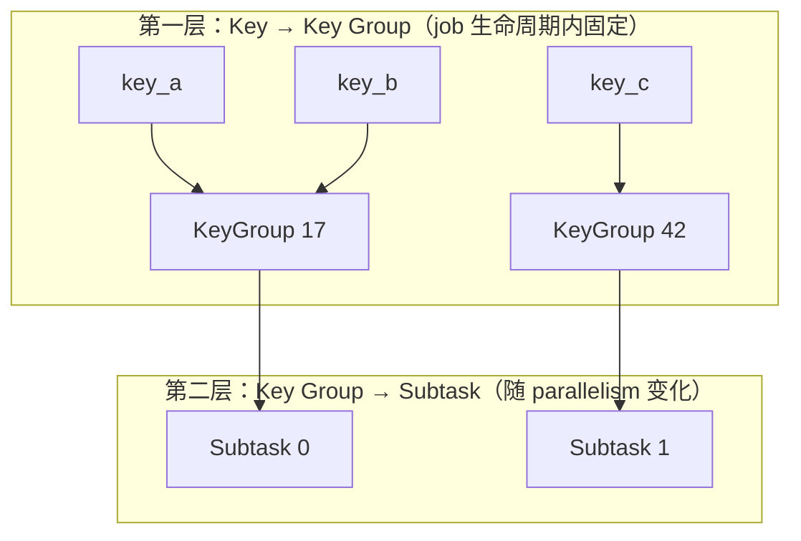
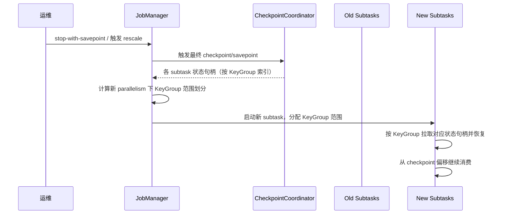
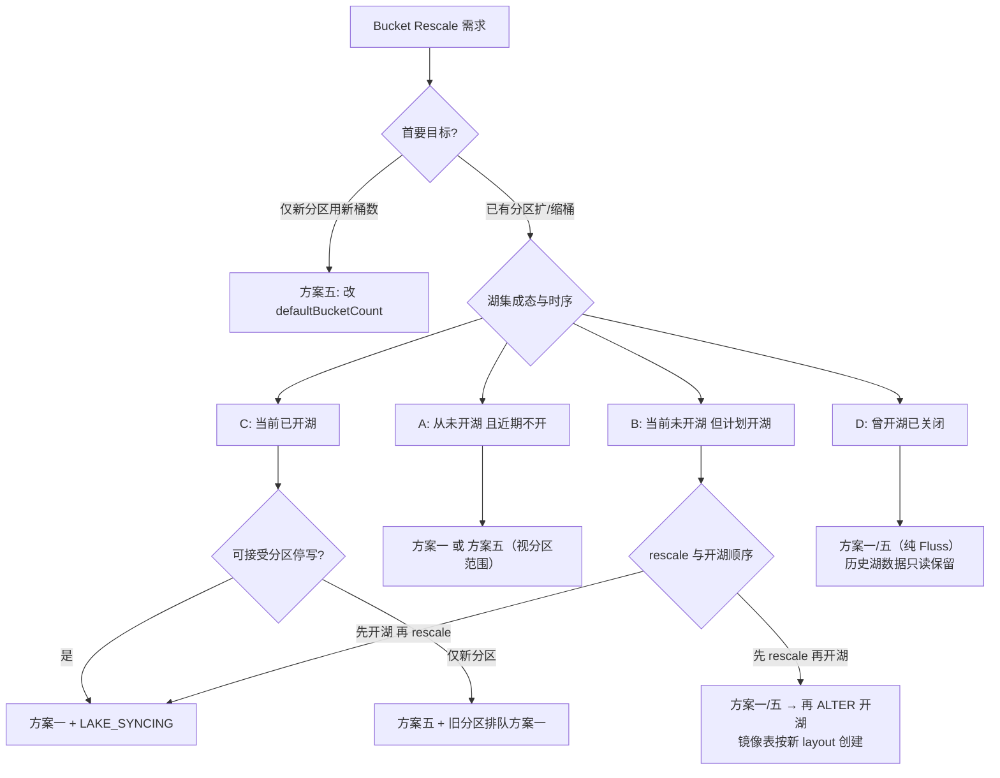
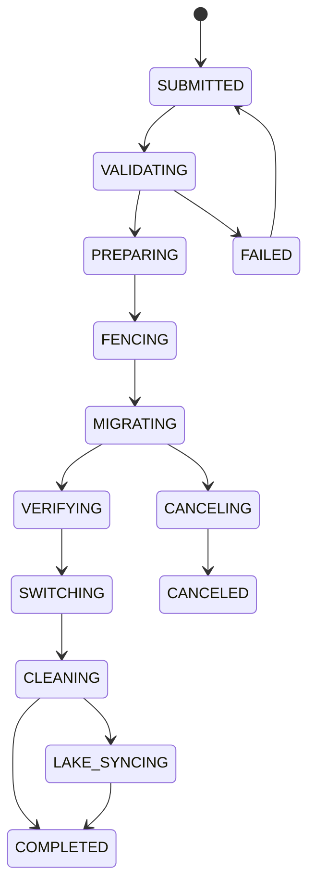
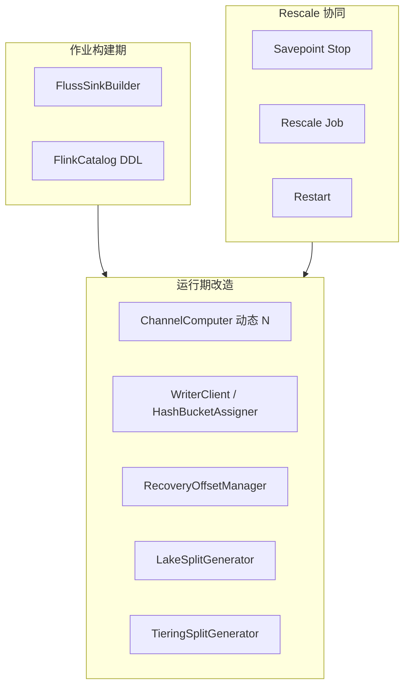
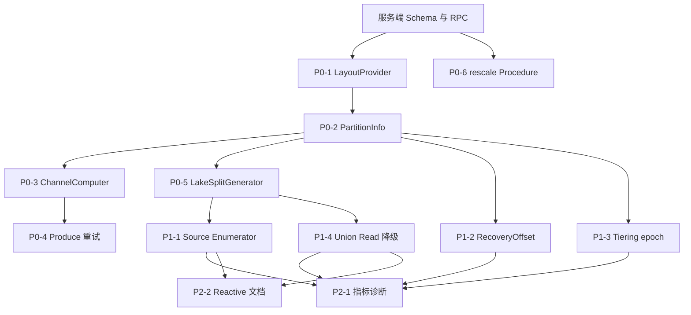

# Fluss 主键表动态 Bucket 能力 — 调研与方案设计

> **文档类型**：架构与时序逻辑设计（不含代码实现细节）  
> **状态**：Draft / 设计讨论稿  
> **关联 Roadmap**：[Operational Excellence — Automated cluster rebalancing and bucket rescaling](/roadmap)

---

## 目录

1. [背景与动机](#1-背景与动机)
2. [当前 Fluss 架构分析](#2-当前-fluss-架构分析)
3. [竞品调研](#3-竞品调研)（含 Paimon / Iceberg / Hudi / Kafka / StarRocks / Doris / Flink Key Group 详解）
4. [问题定义与设计目标](#4-问题定义与设计目标)
5. [可行方案设计](#5-可行方案设计)
6. [湖流一体 Union Read 与 Paimon 对齐](#6-湖流一体-union-read-与-paimon-对齐)
7. [方案综合对比与推荐路线](#7-方案综合对比与推荐路线)
8. [RescaleJob 状态机形式化规约](#8-rescalejob-状态机形式化规约)
9. [PartitionBucketLayout 元数据 Schema](#9-partitionbucketlayout-元数据-schema)
10. [Flink Connector 改造清单](#10-flink-connector-改造清单)
11. [风险、开放问题与结论](#11-风险开放问题与结论)

---

## 1. 背景与动机

### 1.1 业务诉求

主键表（Primary Key Table）是 Fluss 的核心表类型，承载实时 Upsert、点查、Lookup Join、CDC 等能力。数据通过 **Hash Bucketing** 按 `bucket.key`（默认物理主键）路由到固定数量的 Bucket，每个 Bucket 对应一组 **LogTablet + KvTablet**，是 Fluss 最小的读写与副本管理单元。

当前 `bucket.num` 在 **建表时固定、建表后不可变更**。典型痛点：

| 场景 | 问题 |
|------|------|
| 数据量从 GB 增长到 TB | 初始 bucket 数过小，单 bucket 热点、TabletServer 负载不均 |
| 集群扩容 | 新增 TabletServer 无法通过增加 bucket 提升并行度 |
| Flink 作业升并行度 | Sink 并行度与 bucket 数不匹配，部分 subtask 空闲或争用 |
| Lake 分层对齐 | Paimon 支持 dynamic bucket / rescale，Fluss 固定 bucket 导致跨层路由不一致 |
| 分区表生命周期 | 历史分区稀疏、新分区密集，无法按分区独立调 bucket |

### 1.2 与现有 Rebalance 的边界

Fluss 已有 **集群 Rebalance** 能力：在 **bucket 集合不变** 的前提下，将已有 bucket 的副本在 TabletServer 间迁移、重选 Leader。这是 **「搬家具」**，不是 **「拆墙加房」**。

动态 bucket 数要解决的是：

- bucket **数量** 变化（增 / 减 / 按分区变化）
- 数据在 bucket 间的 **重分布**
- 路由规则在过渡期的 **一致性**

二者可组合使用，但语义与实现路径完全不同。

---

## 2. 当前 Fluss 架构分析

### 2.1 核心概念

| 概念 | 说明 |
|------|------|
| **TableBucket** | 逻辑分片标识 `(tableId, partitionId?, bucketId)`，bucketId ∈ [0, numBuckets) |
| **Bucket Key** | Hash 路由键，PK 表必须为 PK 子集（不含分区键），默认物理主键 |
| **TableAssignment** | `bucketId → [replicaServerIds]`，首元素为 preferred Leader |
| **Tablet** | LogTablet（WAL + changelog）+ KvTablet（点查/更新状态） |
| **Leader / ISR / Standby** | 每 bucket 独立选举；KV 支持 Leader + 可选 Standby 读副本 |

### 2.2 端到端数据流

**建表**：Client DDL → Coordinator 校验 → 生成 Assignment → ZK 持久化 → Bucket 状态机 NewBucket → OnlineBucket → NotifyLeaderAndIsr → TabletServer 创建 Tablet。

**写入/点查**：Client 编码 bucket key → `hash % numBuckets` → 查 Metadata 得 leader → RPC 到 TabletServer。

**扫描/Union Read**：枚举 `[0, numBuckets)`（每分区独立），从各 bucket leader 拉取并合并。

### 2.3 元数据与约束

| 元数据 | 存储 | 可变性 |
|--------|------|--------|
| `bucketCount`, `bucketKeys` | ZK `TableRegistration` | **不可变** |
| `TableAssignment` / `PartitionAssignment` | ZK | 创建时生成；Rebalance 可改副本位置 |
| Bucket 状态 | Coordinator + ZK | NewBucket / OnlineBucket / OfflineBucket |

**关键约束**：

1. Hash 路由粘性：`bucketId = hash(bucketKey) % numBuckets`
2. Log + KV 共置：同 bucket 的 LogTablet 与 KvTablet 在同一副本上
3. Lake 对齐：启用 datalake 时 bucketing 函数切换为 Paimon/Iceberg/Hudi 实现
4. 上限：`max.bucket.num` 默认 128,000

### 2.4 能力缺口

| 能力 | 现状 |
|------|------|
| 修改 bucket.num | 不支持 |
| 按分区不同 bucket 数 | 不支持 |
| 在线数据重分布 | 不支持 |
| 集群 Rebalance | 支持（仅迁移已有 bucket 副本） |
| Bucket 状态机 | 具备扩展基础 |

---

## 3. 竞品调研

本章从 **Lake 存储格式**、**OLAP 引擎**、**流计算状态层** 三个维度调研 bucket / 分片动态调整能力。调研重点不是功能清单，而是各系统如何解决同一个根本矛盾：

> **分片数变化** 与 **主键路由稳定性** 之间的冲突。

### 3.1 对比总览

| 系统 | 分布单元 | 动态调整 | 迁移策略 | 过渡期一致性 | 读行为 | 写行为 |
|------|----------|----------|----------|--------------|--------|--------|
| **Paimon** | Bucket (LSM) | Fixed / Dynamic / Postpone | ALTER + OVERWRITE；索引扩桶；compact 分配 | Fixed 需停写；Dynamic 单写者 | 一般继续 | Fixed overwrite 期禁写 |
| **Iceberg** | Partition transform | Spec 演化（非 PK） | 无自动迁移，靠 rewrite | PK 表禁止演化 | 多 spec 共存可读 | 新写用新 spec |
| **Hudi** | Bucket → File Group | 三引擎 | 离线 replace；CH 局部 split/merge | 分区级需停写；CH 声称在线 | 多数可读 | 视引擎而定 |
| **Kafka** | Topic Partition | 仅增加 | 无迁移 | per-key 顺序破坏 | Consumer rebalance | 立即用新分区数 |
| **StarRocks** | Tablet | ALTER BUCKETS | 后台 tablet 重分布 | 元数据事务 + 异步拷贝 | 一般继续 | 一般继续 |
| **Doris** | Tablet | 仅新分区 | 旧分区不可变 | N/A | 不变 | 新分区用新配置 |
| **Flink** | Key Group | Savepoint rescale | 状态句柄随 Key Group 迁移 | Checkpoint 边界原子 | 短暂停机 | 恢复后按新映射 |

### 3.2 Apache Paimon

Paimon 是与 Fluss Lake 分层 **耦合最深** 的参照对象。其 Primary Key Table 以 **Bucket** 为最小读写单元（每个 bucket 一个 LSM 目录），与 Fluss `TableBucket` 概念直接对应。

#### 3.2.1 Fixed Bucket（`bucket = N > 0`）

| 维度 | 说明 |
|------|------|
| **路由** | `abs(hash(bucketKey)) % N`；`bucket-key` 默认为 PK（排除分区列） |
| **扩缩** | `ALTER TABLE SET ('bucket'='新值')` 仅改元数据；**必须** `INSERT OVERWRITE` 重组数据 |
| **迁移** | Overwrite 作业按 **新 N** 重算 hash，将行写入新 bucket 布局 |
| **读写** | ALTER 不影响正在运行的读写；但若布局未 overwrite，写到旧布局分区会抛错 |
| **Flink 协同** | 官方流程：savepoint 暂停 → ALTER + OVERWRITE → 以 **新并行度 ≥ 新 bucket 数** 恢复 |
| **per-partition** | 表级 N；可对单分区 OVERWRITE，但元数据仍是表级 bucket 配置 |

**对 Fluss 启示**：Fixed rescale 是 **正确性最可证明** 的路径；Fluss 离线 rescale 应与其运维流程对齐，尤其是 Write Fence + Flink savepoint 门控。

#### 3.2.2 Dynamic Bucket（`bucket = -1`，PK 表默认）

| 维度 | 说明 |
|------|------|
| **路由** | 维护 **Key → Bucket 索引**；非纯 hash。先到的 key 占旧桶，新 key 可进新桶 |
| **扩缩** | 桶数随 `target-row-num` 自动增长，上限 `max-buckets`；**不支持缩桶** |
| **索引** | 不跨分区 upsert：内存 HASH 索引；跨分区 upsert：磁盘索引，启动时扫全表建索引 |
| **约束** | **单写者**：同表/分区禁止多作业并发写，否则可能重复数据 |
| **顺序依赖** | 同 key 的 bucket 归属取决于首次写入顺序，长期可能不均匀 |
| **rescaling** | 可对某分区执行 `rescale` procedure 做离线重整 |

**对 Fluss 启示**：若 Fluss 引入 Dynamic 模式，须接受单写者约束和索引成本；与 Fluss 双层存储（Log+KV）结合时，索引应由 **Fluss 层主导**，Paimon 侧宜用 Fixed maxBuckets 避免双索引漂移（见第 6 章）。

#### 3.2.3 Postpone Bucket（`bucket = -2`）

| 维度 | 说明 |
|------|------|
| **路由** | 写入先进 `bucket-postpone/`（不可读）；`compact` 时再分配正式 bucket |
| **per-partition N** | **每个分区可在首次 compact 时独立决定 bucket 数** — 最接近 Fluss per-partition 需求 |
| **适用** | 难以预先确定 bucket 数、且各分区数据量差异大的场景 |
| **代价** | 写入后不可立即读；依赖 compaction 周期 |

**对 Fluss 启示**：Fluss 若支持「同表不同分区不同 bucket 数」且走 Lake Fixed 模式，Paimon Postpone 是重要对齐选项。

---

### 3.3 Apache Iceberg

Iceberg 的 bucket 是 **分区变换**（`bucket(N, col)`），属于 hidden partition 字段，而非独立物理 shard 原语。

#### 3.3.1 核心机制

| 维度 | 说明 |
|------|------|
| **路由** | 数据文件携带 `spec_id`；`bucket(N,col)` 产生伪列 `0..N-1` |
| **演化** | `ALTER TABLE SET PARTITION SPEC (...)` 可改 transform（含改 N）— **纯元数据** |
| **数据迁移** | **无自动迁移**；旧文件保持旧 spec，新写入用新 spec，查询引擎合并多 spec |
| **PK + Upsert** | **禁止** 对已设 PRIMARY KEY 的表做 partition spec 演化 |
| **读写** | Spec 演化后读写一般不停；但同一 PK 可能落在不同 bucket transform 的文件中 |

#### 3.3.2 为何 PK 表禁止 Spec 演化

Upsert 依赖 **稳定的行标识 → 物理文件** 路由。若 `bucket(N)` 的 N 变化且不做数据 rewrite：

- 同一 PK 的新 upsert 按新 N 路由
- 旧文件仍按旧 N 布局
- equality delete 与文件路由冲突 → **语义破裂**

因此 Iceberg 选择 **硬禁止**，而非尝试在线双读合并。

**对 Fluss 启示**：「只改元数据、不搬数据」在 append 表可行，在 PK upsert 表不可行。Fluss 不能照搬 Iceberg spec evolution 作为 PK 表 rescale 方案。

---

### 3.4 Apache Hudi

Hudi 以 **Bucket Index** 将 record key 映射到 **File Group**（分区内的一个文件组），是 PK 表分片化的直接竞品。

#### 3.4.1 Simple Bucket

| 维度 | 说明 |
|------|------|
| **路由** | `hash(recordKey) % numBuckets`，分区内固定 |
| **扩缩** | **不支持** 在线改 bucket 数；创建时固定 |
| **问题** | 统一 N 易造成分区级倾斜 |

#### 3.4.2 Partition-Level Bucket（RFC-89）

| 维度 | 说明 |
|------|------|
| **路由** | 按分区正则规则配置 **不同固定 bucket 数** |
| **扩缩** | Spark `partition_bucket_index_manager` 离线 replace-commit |
| **约束** | **必须停止所有写入**；支持 `dry_run` 和多版本 `hashing_config` 回滚 |
| **读写** | 执行期停写；读不受影响分区可继续 |

#### 3.4.3 Consistent Hashing Bucket（RFC-42）

| 维度 | 说明 |
|------|------|
| **路由** | Hash 环 + 范围映射；bucket 对应 file group |
| **扩缩** | 按文件大小阈值 **split/merge** 桶，由 clustering 触发 |
| **迁移范围** | 仅受影响 bucket / 文件组，非全表 shuffle |
| **并发** | 设计目标为在线；但 compaction 与 clustering 互斥，生产常设维护窗 |
| **限制** | 主要支持 MOR；clustering 执行依赖 Spark；与 metadata table 有兼容限制 |

**对 Fluss 启示**：Hudi CH 是 **在线局部迁移** 的代表，与 Fluss 方案四（vnode 分裂）最接近；但 Fluss 额外承担 Log+KV 双写一致，复杂度高于 Hudi 单存储格式。

---

### 3.5 Apache Kafka

Kafka 分区扩展是 **流Transport层** 的典型做法，常作为 PK 存储 rescale 的 **反例**。

| 维度 | 说明 |
|------|------|
| **路由** | 默认 `murmur2(key) % numPartitions` |
| **扩缩** | 仅 **增加** 分区；不可减少 |
| **数据迁移** | **无**；历史消息留在原分区 |
| **扩缩后路由** | 同 key 新消息可能进 **不同分区** |
| **顺序性** | 仅保证 **分区内** 有序；扩分区后同一 key 跨分区无序 |
| **Consumer** | Cooperative rebalance；状态化 consumer 的本地状态 **不会** 随分区扩展自动迁移 |
| **推荐实践** | 新 topic 双写 + 排空 + 下线旧 topic |

**对 Fluss 启示**：「只改分区数、不搬数据」对 PK 表等于放弃路由一致性。Fluss 绝不可采用 Kafka 式 naive rehash。

---

### 3.6 StarRocks

StarRocks 以 **Tablet**（分区 × bucket）为最小存储与调度单元，PK 表强制 hash 分桶。

| 维度 | 说明 |
|------|------|
| **路由** | `hash(bucket_cols) % num_buckets` |
| **扩缩** | `ALTER TABLE ... DISTRIBUTED BY HASH(...) BUCKETS N` — **异步后台** tablet 重分布 |
| **per-partition** | v3.2+ 支持对指定分区 ALTER；v3.5.8+ `DEFAULT BUCKETS` 影响新分区 |
| **v4.1 Range 分桶** | PK 表可选自动 tablet split/merge（按大小阈值），免预设 bucket 数 |
| **读写** | 查询和导入一般继续；ALTER 可能持续数小时 |
| **代价** | 集群 IO 与 CPU 压力大；需监控 `SHOW ALTER TABLE` |

**对 Fluss 启示**：若 Fluss 具备强存储引擎内迁移能力，StarRocks 的「后台 tablet 搬运」是在线 rescale 的工业级参考；但 Fluss 当前 Log+KV 双层 + ZK 协调，更接近 Paimon/Hudi 而非 StarRocks 内核级搬运。

---

### 3.7 Apache Doris

| 维度 | 说明 |
|------|------|
| **路由** | `crc32(bucket_cols) % N` |
| **扩缩** | **已有分区 bucket 数不可变** |
| **新分区** | `ADD PARTITION ... BUCKETS M` 或 `MODIFY DISTRIBUTION` 改 **未来** 分区默认值 |
| **BUCKETS AUTO** | 建表时自动估算，仅创建时生效 |
| **迁移** | 要改变已有分区布局需 **建新表导数据** |

**对 Fluss 启示**：Doris 的「旧分区不变、新分区用新 N」与 Fluss **方案五** 高度同构；适合时间分区自然衰减场景，但无法解救已过热的历史分区。

---

### 3.8 Apache Flink：Key Group 与动态并行度（重点展开）

Flink 本身 **不是存储系统**，不管理持久化 bucket layout。但其 **Key Group** 机制是有状态流计算中 **唯一成熟的大规模「逻辑分片 rescale」实践**，与 Fluss bucket rescale 在 **问题结构** 上高度相似，值得单独深入。

#### 3.8.1 为什么需要 Key Group

对 `keyBy()` 之后的算子（如 `KeyedProcessFunction`、带状态的 aggregate），每条记录的状态挂在 **key** 上。扩缩容 **并行度（parallelism）** 时，若直接把 `hash(key) % newParallelism` 当作分片依据：

- key 与 subtask 的映射 **整体改变**
- 旧 subtask 本地状态 **无法** 通过简单取模关联到新 subtask
- 必须 **全量 shuffle 状态** 或丢失

因此 Flink 引入中间层 **Key Group**：把 key 空间切成固定数量的逻辑分片，rescaling 时 **搬迁 Key Group 整块状态**，而非改变 key→分片规则。

#### 3.8.2 核心概念



| 概念 | 定义 | 可变性 |
|------|------|--------|
| **Key** | 业务键（`keyBy` 字段） | — |
| **maxParallelism** | Key Group 总数上限；默认 128，建议 2 的幂 | **Job 创建后不可变** |
| **Key Group ID** | `hash(key) % maxParallelism` | **固定** |
| **parallelism** | 当前运行 subtask 数 | **可变**（≤ maxParallelism） |
| **Subtask 分配** | Key Group 以 **连续 ID 范围** 分给 subtask | 随 rescale 重划 |

**数值示例**（`maxParallelism=128`，`parallelism=4`）：

- 每个 subtask 负责 32 个连续 Key Group（0–31、32–63、64–95、96–127）
- Rescale 到 `parallelism=8`：每个 subtask 负责 16 个 Key Group
- **key_a 的 Key Group ID 不变**；只是该 Key Group 从 subtask 0 移到 subtask 0 或 1（取决于范围切分）

#### 3.8.3 Rescaling 时序



**要点**：

1. **停机窗口**：rescaling 需要 checkpoint/savepoint 边界，非无限在线
2. **状态迁移单元** = Key Group 状态块，不是单 key
3. **输入重放**：从 checkpoint 位点重放，配合 exactly-once _sink 保证端到端
4. **maxParallelism 不可改**：改变会破坏 snapshot 中 KeyGroup 索引语义；需 State Processor API 重写

#### 3.8.4 与一致性哈希、Kafka、Fluss Bucket 的对比

| 维度 | Flink Key Group | 一致性哈希（Hudi CH） | Kafka 扩分区 | Fluss Fixed Bucket |
|------|-----------------|----------------------|--------------|-------------------|
| **逻辑分片** | Key Group（固定数量） | vnode 范围 | Partition | Bucket ID |
| **key→逻辑分片** | `hash % maxPara` **不变** | hash 落点 **可变** | `hash % N` **随 N 变** | `hash % N` **随 N 变** |
| **逻辑→物理映射** | 范围 → subtask **可变** | 范围 → bucket **可变** | 1:1 partition | 1:1 TabletServer |
| **扩缩时搬什么** | 计算状态 | 持久化数据文件 | 无 | 全部 KV+Log |
| **持久化** | 否（checkpoint 对象） | 是 | 是（日志） | 是 |
| **在线性** | 短暂停机 | 声称在线 | 立即但不一致 | 通常需停写 |

**结论：Flink Key Group 不是一致性哈希。**

- **一致性哈希**：改变 ring 拓扑时，**key 的逻辑落点** 可能变化，通过局部迁移适应
- **Flink Key Group**：**key 的逻辑落点永不变化**；仅 **逻辑分片到物理 subtask 的范围归属** 变化

更准确地说，Flink 模型是：

> **固定 Hash 分区（logical shard）+ 可变范围归属（physical assignment）**

这与 Fluss 方案四（vnode 固定 + bucket 范围可变）在 **两层结构** 上同构，但 Fluss 还需迁移 **持久化** Log+KV，成本远高于 Flink 搬 checkpoint 文件。

#### 3.8.5 Reactive Mode 与并行度自动调整

Flink **Reactive Mode**（Adaptive Scheduler）可根据可用 TaskManager slot **自动增减 parallelism**：

- 仍基于 **同一 maxParallelism** 下重划 Key Group 范围
- 通过 **重启 + 最新 checkpoint** 完成，非热插拔
- **不改变** maxParallelism，也不改变 key→KeyGroup 映射

**常见误解**：Reactive Mode 不等于存储层自动扩 bucket；它只调整 **计算并行度**，与 Fluss `bucket.num` 无直接联动。

#### 3.8.6 Flink × Paimon × Fluss 三角协同

Paimon 官方 Fixed bucket rescale 流程 **显式要求** Flink 侧协同：

| 步骤 | Paimon | Flink |
|------|--------|-------|
| 1 | — | `stop-with-savepoint` |
| 2 | `ALTER TABLE SET bucket=N'` | — |
| 3 | `INSERT OVERWRITE` 重组数据 | — |
| 4 | — | 以 `parallelism ≥ N'` 从 savepoint 恢复 |

Fluss 引入 bucket rescale 后，Flink Connector 必须文档化 **同一维护窗** 内的协同：Fluss RescaleJob（Write Fence）与 Flink savepoint **同一语义边界**。

#### 3.8.7 对 Fluss 设计的可借鉴与不可照搬

| 可借鉴 | 不可照搬 |
|--------|----------|
| 两层映射：logical shard 固定 + physical mapping 可变 | 直接改 `hash%N` 而不搬数据 |
| 原子迁移单元（Key Group / TableBucket / vnode range） | 假设状态搬完后立即在线（Fluss 持久化更重） |
| savepoint/checkpoint 作为一致性边界 | maxParallelism 式「预分配超大逻辑分片上限」（可作为 vnode 上限参考） |
| Rescale 与上游消费位点协同 | 把 Flink subtask 数等同于 Fluss bucket 数（二者独立维度） |

---

### 3.9 设计模式横向归纳

| 模式 | 代表系统 | 核心做法 | PK 表适用性 | Fluss 对应方案 |
|------|----------|----------|-------------|----------------|
| **A: 朴素 Rehash** | Kafka | 改 N，不搬数据 | **反模式** | 禁止 |
| **B: 元数据演化** | Iceberg | 改 spec，旧新共存 | PK 表 **禁止** | 不适用 |
| **C: 离线 Overwrite** | Paimon Fixed、Hudi Partition-Level | 停写 + 全量重组 | **强正确性** | 方案一 |
| **D: Key→Bucket 索引** | Paimon Dynamic | 索引维护路由 | 在线扩桶；单写者 | 方案三 |
| **E: 一致性哈希** | Hudi CH | 环分裂，局部迁移 | 在线；实现复杂 | 方案四 |
| **F: 引擎后台重分片** | StarRocks | 异步 tablet 搬运 | 在线；资源重 | 长期演进 |
| **G: 新分区新配置** | Doris、Paimon Postpone | 旧布局不变 | 渐进式 | 方案五 |
| **H: 计算状态 Rescale** | Flink Key Group | 固定逻辑分片 + 搬状态 | 仅计算层 | Connector 协同参考 |

### 3.10 竞品调研结论（指导 Fluss 选型）

1. **PK 表不存在「只改元数据、零迁移」的通用解法**（Iceberg 直接禁止；Kafka 式 rehash 破坏语义）。
2. **Lake 生态内最可落地的是 Paimon Fixed rescale 路径**（方案一），与 Fluss Union Read 兼容性最好。
3. **per-partition 不同 bucket 数** 在 Paimon 侧靠 Postpone 或分区级 overwrite；Fluss 方案五需为此专门设计 Lake 协同。
4. **Flink Key Group 是计算层 rescale 教科书**，其两层映射思想可指导 Fluss vnode 设计，但 Fluss 必须额外解决持久化与 Lake 双层一致。
5. **在线 rescale** 的工业先例主要来自 Hudi CH 和 StarRocks，均伴随显著工程复杂度；Fluss 宜分阶段交付，先 Offline 后 Online。

---

## 4. 问题定义与设计目标

### 4.1 问题陈述

如何在 **不破坏主键唯一性、Upsert 语义、CDC 连续性** 的前提下，允许主键表在运行时 **增加或减少 bucket 数**（全局或按分区），并协调客户端路由、Coordinator 元数据、TabletServer 存储、Lake 分层的一致性？

### 4.2 核心不变量

| ID | 不变量 |
|----|--------|
| **I1** | PK 唯一性：任意时刻每个 PK 最多一个有效行版本 |
| **I2** | 路由确定性：给定 `(layoutEpoch, pk)` 路由结果唯一 |
| **I3** | Log-KV 一致：同 TableBucket 的 Log 与 KV 可互相恢复 |
| **I4** | CDC 可解释：changelog 可重建为与快照一致的 PK 状态 |
| **I5** | Union Read 正确：lake + fluss log merge 按 PK LastRow 正确 |
| **I6** | Lake 对齐：Tiering 与 Fluss bucket/offset 元数据一致 |
| **I7** | 分区隔离：分区 A 的 rescale 不破坏分区 B 的 I1–I6 |

### 4.3 设计目标

| 优先级 | 目标 |
|--------|------|
| P0 | 正确性、可运维（API、进度、回滚） |
| P1 | 在线能力、Lake 对齐 |
| P2 | 缩桶、分区粒度、自动化 |

### 4.4 非目标（首期）

- 修改 `bucket.key` 列集合
- Log 表动态 bucket（语义不同）
- 改变 `max.bucket.num` 全局上限语义

---

## 5. 可行方案设计

### 5.1 方案一：离线分区级 Overwrite 重分布

**核心**：元数据变更 + 全量数据重组，以分区为最小操作单元。与 Paimon Fixed Rescale 同构。

**元数据**：引入 `layoutEpoch`、`partitionRescaleState`（STABLE / MIGRATING / COMPLETED）。

**时序**：ALTER → 创建新 bucket → Write Fence 停写 → 按源 bucket 扫描 KV → 按新 hash 写入目标 bucket → 校验 → 原子切换元数据 → 清理旧 bucket →（lake）Paimon overwrite。

**读写**：MIGRATING 期间该分区停写；读旧 layout 或阻塞；COMPLETED 后新 hash 路由。

| 优点 | 缺点 |
|------|------|
| 正确性最强 | 分区级停写窗口 |
| 与 Paimon rescale 一致 | 大数据量迁移耗时长 |
| 可复用 Bucket 状态机 | 缩桶成本更高 |

### 5.2 方案二：双读路由过渡期

**核心**：迁移期间不停写，维护旧/新双套路由；写走新 layout，读合并两 layout。

**策略**：写新 + 读双合并 + 后台清扫旧 bucket（推荐）；或双写（2x 写放大）。

| 优点 | 缺点 |
|------|------|
| 无停写窗口（理论上） | 读放大、扫描逻辑复杂 |
| | CDC 双份事件风险 |
| | **Lake Union Read 几乎不可对齐** |

**推荐度**：低（仅适合纯 Fluss、短过渡期）。

### 5.3 方案三：Key→Bucket 索引（Dynamic Bucket）

**核心**：持久化 `PK → bucketId` 映射；新 key 按负载分配；已存在 key 永驻原 bucket。扩桶无需数据迁移。

**约束**：单写者（per table/partition）；缩桶不支持。

**Lake 对齐**：**Fluss 索引主导 + Paimon Fixed maxBuckets**（禁止双层 Dynamic 索引）。

| 优点 | 缺点 |
|------|------|
| 在线扩桶 | 索引内存/磁盘成本 |
| 与 Paimon dynamic 语义相近 | 顺序依赖导致长期不均 |
| per-partition 自然支持 | 单写者运维约束 |

### 5.4 方案四：一致性哈希 + 局部 Split/Merge

**核心**：hash 空间划分为 vnode 范围；扩桶 = 分裂范围；仅受影响区间数据迁移。与 Hudi CH、Flink 两层映射思想同构。

**两层映射**：

```
pk → hash(pk) → vnode position（固定）→ range lookup → bucketId（可变）
```

| 优点 | 缺点 |
|------|------|
| 扩缩均支持，迁移量有界 | 实现复杂度最高 |
| 在线 resize | Log+KV 同步迁移难 |
| | 迁移期并发 Upsert 需 per-key fencing |

### 5.5 方案五：渐进式（新分区新桶数 + 可选离线迁移）

**核心**：`ALTER bucket.num` 仅更新 `defaultBucketCount`；已有分区保持旧桶数；新分区用新 default；旧分区可选触发方案一。

| 优点 | 缺点 |
|------|------|
| 实现量最小 | 同表不同分区 bucket 数不一致 |
| 符合时间分区衰减 | 热分区扩桶需额外 rescale |
| 分区间天然隔离 | |

---

## 6. 湖流一体 Union Read 与 Paimon 对齐

### 6.1 Union Read 数据契约

Fluss lake-enabled 表维持 **热层（Fluss Log/KV）+ 冷层（Paimon）** 两层模型。Union Read 在查询时拼接：

| 层 | 角色 |
|----|------|
| **Paimon** | 历史快照至 readable tiered offset |
| **Fluss** | 自该 offset 至当前的 log tail |

**PK 表**：每个 `(partition, bucketId)` 一个 Hybrid Split，湖层快照 + Fluss log tail 按 PK sort-merge，**log 赢**。

### 6.2 Paimon Bucket 模式映射

| Fluss 配置 | Paimon 模式 |
|------------|-------------|
| 有 `bucket.key` + `bucket.num` | Fixed：`bucket=N, bucket-key=...` |
| 无 `bucket.key` | Dynamic：`bucket=-1` |

当前 **PK 表强制 Hash Bucketing**，因此在 **开湖之后** lake-enabled PK 表必然走 Paimon **Fixed Bucket**。

**动态开湖**：表可在任意时刻 `ALTER SET table.datalake.enabled=true`；Coordinator 按 **当时** Fluss 表的 `bucketCount` / `bucketKeys` 创建镜像 Paimon 表（`lakeCatalog.createTable`）。故 **先 rescale 后开湖** 时，镜像表直接继承新 layout，无需对已有 Paimon 数据 overwrite（因尚未 tier 或仅有空镜像）。

### 6.3 Per-Partition 不同 Bucket 数的硬问题

当前全链路假设 **单表单一 `numBuckets`**：`LakeSplitGenerator`、`TieringSplitGenerator`、Flink Sink 均按表级 N 枚举。

**Paimon 对 per-partition bucket 的支持**：

| 模式 | per-partition N |
|------|-----------------|
| Fixed | 表级 N；分区 rescale 靠 overwrite |
| Postpone (-2) | compact 时 per-partition 决定 |
| Dynamic (-1) | 索引 per-partition 自动增长 |

**Fluss per-partition 对齐路径**：

| Fluss 表类型 | 推荐 Paimon 模式 |
|--------------|------------------|
| 有 bucket.key 的 PK 表 | Fixed + 分区级 rescale overwrite |
| 需 per-partition 不同 N | Postpone 或 Dynamic |
| Log 表无 bucket.key | Dynamic + `__bucket` 列 |

### 6.4 Dynamic Bucket 对齐架构（若 Fluss PK 支持）

**推荐 S4：Fluss 主导**

- Coordinator 维护 `BucketIndex`（持久化）
- Tiering 按 Fluss `bucketId` 写入 Paimon Fixed bucket（`bucket=maxBuckets`）
- Union Read 以 Fluss `bucketId` 枚举；Paimon 按同 bucketId 读取
- **禁止** Fluss 与 Paimon 各维护独立 Dynamic 索引

### 6.5 Rescale 各阶段 Union Read 行为

| 阶段 | Union Read |
|------|------------|
| STABLE | 正常 hybrid merge |
| WRITE_FENCED | 仅读；log tail 不再增长 |
| MIGRATING | **禁止**或返回 STALE |
| LAKE_SYNCING | 使用上一稳定 epoch 的 lake snapshot |
| COMPLETED | 新 layout + 新 readable snapshot |

### 6.6 跨层一致性要求

| # | 要求 |
|---|------|
| 1 | Fluss bucket count + bucket keys → Paimon bucket/bucket-key 自动对齐 |
| 2 | Tiered offsets 按 `(partitionId, bucketId)` 跟踪 |
| 3 | Union Read 使用 `getReadableLakeSnapshot` |
| 4 | `__bucket` 系统列与 Fluss bucket 一致（尤其 BUCKET_UNAWARE） |
| 5 | 分区名编码一致（`partition.legacy-name=false`） |
| 6 | PK comparator 对齐 |
| 7 | 同 bucket splits 共置同一 reader/task |

---

## 7. 方案综合对比与推荐路线

### 7.1 多维度评分

| 维度 | 方案一 | 方案二 | 方案三 | 方案四 | 方案五 |
|------|:---:|:---:|:---:|:---:|:---:|
| 正确性 | ★★★★★ | ★★★☆☆ | ★★★★☆ | ★★★★☆ | ★★★★★ |
| Union Read | ★★★★★ | ★★☆☆☆ | ★★★★☆ | ★★★☆☆ | ★★★★☆ |
| 在线扩桶 | ★★☆☆☆ | ★★★★☆ | ★★★★★ | ★★★★☆ | ★★★☆☆ |
| 缩桶 | ★★★★☆ | ★★★☆☆ | ★☆☆☆☆ | ★★★★☆ | ★☆☆☆☆ |
| 实现复杂度 | 中 | 高 | 高 | 最高 | 低 |
| Lake 对齐 | 最好 | 差 | 好 | 中 | 中-好 |

### 7.2 推荐演进路线：主轨与可选轨

> **核心结论**：演进路线**不是**「同一张表从方案五进化到方案三再进化到方案四」；而是 **三种互斥的 `bucketMode` 长期并存**，按建表时选型。交付上采用 **一条主轨（默认）+ 两条可选轨（少数场景）**。

#### 7.2.1 主轨（默认，覆盖 80%+ PK 表）

**组合**：**方案五（策略）+ 方案一（执行）+ Lake 协同（§6）**

| 里程碑 | 交付内容 | 对应方案/章节 |
|--------|----------|---------------|
| **M1** | 新分区 `bucket.num` 可配置；`PartitionBucketLayout` 元数据；Flink 按分区路由 | 方案五 |
| **M2** | `RescaleJob` 状态机；离线 Overwrite；`UNION_READ`；缩容语义 | 方案一 + §8 |
| **M3** | 湖表 per-partition bucket；Union Read 对齐 Paimon；动态开/关湖与 rescale 时序（§7.3） | §6 |

主轨表生命周期内 **`bucketMode = FIXED_HASH`**，不升级为 Dynamic 或 CH。

#### 7.2.2 可选轨 B：流式高频 rescale（少数表）

**方案三（Dynamic 索引）** — 建表时 `bucketMode = DYNAMIC_INDEX`，与主轨**并列**，非主轨进化阶段。

- 适用：持续在线、不能接受长时间 `REBALANCING` 的少数专表
- 代价：索引存储与维护、与湖 Fixed Bucket 对齐复杂（§6.4）
- **建议**：M2 之后单独立项，**不阻塞**主轨 M1–M3

#### 7.2.3 可选轨 C：极致弹性（远期高级）

**方案四（一致性哈希）** — 建表时 `bucketMode = CONSISTENT_HASH`。

- **扩缩并重**，**非**「CH 专做缩容」；扩桶与缩桶均走 ring 迁移（§5.5、§5.6）
- 适用：超大表、对 rebalance 窗口极敏感、可接受 CH 运维复杂度
- **不能**从主轨表「原地升级」为 CH；新表或明确迁移项目
- **建议**：主轨 + 轨 B 稳定后再评估（M3 之后）

#### 7.2.4 为何不是 Phase 1→2→3 单线进化

| 误解 | 实际情况 |
|------|----------|
| 方案五是过渡，终局是方案三 | 方案五是**主轨默认策略**（新分区不同 bucket），与方案三**场景不同** |
| 方案三由方案五「升级」 | 索引模型与 `FIXED_HASH` **不兼容**，需**新表**或完整迁移 |
| 方案四是缩容专用 | CH **扩缩并重**；主轨缩容用方案一 Overwrite 即可 |
| 所有 PK 表最终同一模式 | **多模式并存**；用户按场景在 `FIXED_HASH` / `DYNAMIC_INDEX` / `CONSISTENT_HASH` 中选型 |

#### 7.2.5 组合自洽性（回应「三阶段能否组合」）

| 组合 | 是否推荐 | 说明 |
|------|----------|------|
| **五 + 一 + Lake**（主轨） | ✅ 推荐 | 策略 + 执行 + 湖协同；§7.1 最优默认 |
| **三** 单独（轨 B） | ✅ 可选 | 与主轨并列，不替代主轨 |
| **四** 单独（轨 C） | ✅ 远期可选 | 高级模式，非主轨终点 |
| 五 → 三 → 四 同表进化 | ❌ 不推荐 | 模式互斥，避免「自动升级」产品预期 |
| 主轨 + 全集群默认切 CH | ❌ 不推荐 | CH 成本高，应显式建表选型 |

#### 7.2.6 与 §7.3 的关系

- **§7.2**：交付节奏与 **bucketMode 产品线**（先做什么、哪些并行）
- **§7.3**：**单表**在已定模式下的 rescale / 开湖决策（主轨表走 7.3 的 FIXED 分支 + Lake 分支）

### 7.3 场景决策树

#### 7.3.1 自主评审：原决策树的问题

原决策树以 **「当前是否 lake-enabled」** 作为第一分叉，在 Fluss 现网能力下 **存在明显偏差**：

| 问题 | 说明 |
|------|------|
| **把湖状态当成静态标签** | `table.datalake.enabled` 可通过 `ALTER TABLE SET/RESET` 动态开关；普通表与湖表可互相转换，并非建表时一次性决定 |
| **忽略 format 预绑定** | `table.datalake.format` 可在未开湖时预置（集群 `datalake.format` 或表级属性）；开湖时 Fluss 会按已有 bucket 布局创建镜像 Paimon 表 |
| **「否」分支隐含「永远纯 Fluss」** | 表可能 **即将开湖** 或 **开湖后又关闭**；rescale 方案须考虑后续 tiering / Union Read，不能仅按当下 `enabled=false` 选型 |
| **「要 Dynamic?」分支误导** | 当前 **PK 表强制 Hash + bucket.key**，开湖后走 Paimon Fixed；Dynamic 是 Log 表或无 bucket.key 场景，不宜作为 PK rescale 的主决策枝 |
| **缺少时序维度** | rescale 与 **开湖 / 关湖 / 历史 tier 数据** 的先后顺序会改变运维路径（见下） |

**Fluss 湖流一体相关事实（实现与文档已支持）**：

- `ALTER TABLE SET ('table.datalake.enabled' = 'true')`：在已有表上 **动态开湖**，Coordinator 调用 `lakeCatalog.createTable`，镜像表 bucket 布局与 **当时** Fluss `bucketCount` / `bucketKeys` 对齐
- `ALTER TABLE RESET ('table.datalake.enabled')`：关闭 tiering；若曾开湖，属性 key 仍存在时 Fluss 仍可能同步 alter 湖表元数据
- 集群 `datalake.enabled=false` + `datalake.format` 预绑定：表可先建好，集群开湖后再 `SET table.datalake.enabled`
- 配置说明：`table.datalake.format` 可先于 `table.datalake.enabled` 设置，**无需重建表** 即可后续开湖

因此，决策树的第一维应是 **「湖集成状态 + rescale 与开湖的时序」**，而非简单的「现在是不是湖表」。

#### 7.3.2 修订后的决策维度



#### 7.3.3 分场景说明

**场景 A：从未开湖，且近期不计划开湖**

- **推荐**：方案五（改 `defaultBucketCount`）+ 按需对方案一（热点旧分区 offline rescale）
- **Union Read**：不在范围；无 LAKE_SYNCING
- **注意**：若表已预置 `table.datalake.format`，rescale 仍只需关心 Fluss 层，但 **开湖时镜像表将继承 rescale 后的 bucket 布局**

**场景 B：当前未开湖，但计划开湖（含 format 已预绑定）**

| 顺序 | 路径 | 说明 |
|------|------|------|
| **先 rescale，后开湖** | 方案一/五 → `ALTER SET table.datalake.enabled=true` | **推荐**：避免对已有 Paimon 数据做 overwrite；镜像表一次性按新 `bucketCount` 创建；历史数据由 tiering 逐步写入 |
| **先开湖，后 rescale** | 开湖 → 积累 tier → 方案一 + LAKE_SYNCING | 与场景 C 相同；若已有大量湖数据，overwrite 成本高 |

**场景 C：当前已开湖（`table.datalake.enabled=true`）**

- PK 表：**方案一（离线分区 rescale）+ LAKE_SYNCING**，与 Paimon Fixed rescale 流程对齐
- 仅新分区扩容：**方案五** + 旧分区排队方案一；Lake 侧需 Postpone 或分区级 overwrite（见第 6 章）
- **不推荐**方案二（双读过渡）用于 lake-enabled 表
- 方案三（Dynamic 索引）仅当 Fluss 未来显式支持 `bucket.mode=DYNAMIC` 的 PK 表时再评估；**不是**当前 `ALTER` 开湖后的默认路径

**场景 D：曾开湖，已 `RESET table.datalake.enabled`**

- Rescale **按纯 Fluss** 执行（方案一/五）
- 历史 Paimon 数据仍在，但 Union Read 不再拼接；若再次开湖，须校验镜像表是否存在、布局是否与 Fluss 一致（`MetadataManager` 在再开湖时会 `createTable` 或 `alterTable`）

#### 7.3.4 与集群级湖配置的关系

| 集群状态 | 表级操作 | Rescale 注意点 |
|----------|----------|----------------|
| `datalake.enabled=true` | 可直接 `SET table.datalake.enabled` | 开湖后立即纳入 tiering；rescale 需 LAKE_SYNCING |
| `datalake.enabled=false`，`datalake.format` 已设 | 表可先 rescale，待集群开湖后再 `SET` | rescale 阶段仅 Fluss；开湖时按 **当前** layout 建镜像 |
| 集群从未配置 datalake | 仅 Fluss rescale | 与场景 A 相同 |

#### 7.3.5 决策树文字版（修订）

```
1. 是否只需「新分区用新桶数、旧分区不动」?
   └─ 是 → 方案五（改 defaultBucketCount）

2. 是否需要对已有分区扩/缩桶?
   ├─ 当前已开湖 (table.datalake.enabled=true)
   │  ├─ 可停写 → 方案一 + Paimon overwrite（LAKE_SYNCING）
   │  └─ 不可停写 → 方案五（仅新分区）或 排队维护窗执行方案一
   │
   ├─ 当前未开湖，但将开湖
   │  ├─ 优先：先 Fluss rescale（方案一/五）→ 再 ALTER 开湖
   │  └─ 若已开湖后再 rescale → 同「已开湖」路径
   │
   ├─ 当前未开湖，且长期不开湖
   │  └─ 方案一 / 方案五（无 Lake 协同）
   │
   └─ 曾开湖已关闭
      └─ 方案一 / 方案五；再开湖时单独校验镜像表与 layout

3. PK 表不以「是否 Dynamic」为决策枝；Log 表无 bucket.key 时另参照 Paimon Dynamic + __bucket（非本章 PK rescale 范围）
```

#### 7.3.6 对设计文档其他章节的连带修正

- **第 6 章** 默认以 lake-enabled 表为 Union Read 主场景，但 rescale 设计须显式覆盖 **「先 rescale 后开湖」** 路径（无 LAKE_SYNCING，开湖时镜像按新 layout 创建）
- **第 8 章** `LAKE_SYNCING` 阶段：仅当 rescale 完成时 **表已处于开湖状态** 或 **湖上已有需 overwrite 的历史数据** 时进入；先 rescale 后开湖可跳过
- **第 10 章** Flink Connector：`BucketLayoutProvider` 须感知 `table.datalake.enabled` 变化，不能仅在作业构建时固化「是否湖表」

---

## 8. RescaleJob 状态机形式化规约

### 8.1 设计原则

- 参照 `TableBucketStateMachine`（bucket 生命周期）与 `RebalanceManager`（副本迁移），与之 **正交**
- 一个 `(tableId, partitionId)` 同时最多一个活跃 RescaleJob
- Coordinator 单线程事件循环驱动状态转移

### 8.2 JobState

| 状态 | 含义 |
|------|------|
| `SUBMITTED` | 已提交，等待校验 |
| `VALIDATING` | 前置检查 |
| `PREPARING` | 创建目标 bucket、生成 Assignment |
| `FENCING` | 广播停写、等待 in-flight 完成 |
| `MIGRATING` | 数据迁移进行中 |
| `VERIFYING` | 完整性校验 |
| `SWITCHING` | 原子切换 layout 元数据 |
| `CLEANING` | 下线旧 bucket |
| `LAKE_SYNCING` | 等待 Paimon 层同步 |
| `COMPLETED` / `FAILED` / `CANCELED` | 终态 |

### 8.3 状态转移图



### 8.4 Write Fence 协议

**两阶段**：

1. **Soft Notice**：广播 `RescaleNotice`，客户端 flush pending batches
2. **Hard Fence**：`Produce` 对目标分区返回 `PARTITION_RESCALING`

| RPC | Fence 期间 |
|-----|------------|
| Produce（目标分区） | 拒绝 |
| Lookup / Scan | 允许读旧 layout（可配置） |
| CreatePartition（其他分区） | 允许 |

### 8.5 MigrationTask 子状态机

每源 bucket 一个任务：`PENDING → SCANNING → WRITING → CHECKPOINTING → DONE`。

断点持久化：`lastScannedPk`、`rowsMigrated` 等于 Remote Storage，支持崩溃续跑。

### 8.6 完整性校验（VERIFYING）

1. **行数守恒**：迁出行数 = 源 bucket 行数
2. **路由抽样**：随机 PK 验证 `hash(pk) % tgtN` 与存储位置一致
3. **Log-KV 一致**：目标 bucket KV 行数 = Log distinct PK 数
4. **无孤儿**：源 bucket 残留为 0

### 8.7 SWITCHING 原子切换

ZK 事务批：

1. 更新 `PartitionBucketLayout`（`bucketCount=tgtN`, `layoutEpoch++`）
2. 删除 `WriteFence`
3. 追加 `LayoutHistory`

### 8.8 与 Rebalance 互斥

| 操作 A | 操作 B | 结果 |
|--------|--------|------|
| Rescale(P) | Rescale(P) | 第二个拒绝 |
| Rescale(P) | Rescale(Q) | 允许并行 |
| Rescale(P) | Rebalance(bucket ∈ P) | 互斥 |
| Rescale(P) | Tiering(P) | Tiering 暂停 |

### 8.9 Admin API

| 接口 | 语义 |
|------|------|
| `rescaleBuckets(table, partition?, targetBuckets)` | 提交 Job |
| `getRescaleProgress(jobId)` | 查询进度 |
| `cancelRescaleJob(jobId)` | 取消 |
| `retryRescaleJob(jobId)` | 重试 |

---

## 9. PartitionBucketLayout 元数据 Schema

### 9.1 设计目标

- 向后兼容：旧表 `partition.bucketCount = null` → 继承表级
- per-partition 桶数支持
- `layoutEpoch` 驱动客户端缓存失效与 Lake offset 版本化

### 9.2 表级扩展（TableRegistration）

| 字段 | 类型 | 说明 |
|------|------|------|
| `defaultBucketCount` | int | 新分区默认桶数（`ALTER` 可改）；兼容原 `bucketCount` |
| `bucketMode` | enum | `FIXED_HASH` / `DYNAMIC_INDEX` / `CONSISTENT_HASH` |
| `maxBucketCount` | int | Dynamic/CH 上限 |
| `bucketLayoutVersion` | int | 协议版本 |

**解析**：

```
resolveBucketCount(table, partition):
  if partition.bucketCount != null: return partition.bucketCount
  return table.defaultBucketCount
```

### 9.3 分区级扩展（PartitionRegistration）

| 字段 | 类型 | 默认 | 说明 |
|------|------|------|------|
| `bucketCount` | int? | null | null = 继承 default |
| `layoutEpoch` | long | 0 | rescale 完成时 +1 |
| `rescaleState` | enum | STABLE | STABLE / FENCED / MIGRATING / LAKE_SYNCING |
| `activeJobId` | string? | null | 当前 RescaleJob |
| `createdWithBucketCount` | int | 创建时快照 | 审计 |

### 9.4 PartitionInfo RPC 扩展

| 字段 | 说明 |
|------|------|
| `bucketCount` | 解析后有效桶数 |
| `layoutEpoch` | 当前 epoch |
| `rescaleState` | 供 Client 决定重试策略 |

分区表路由：**不得**仅用 `TableInfo.numBuckets`，须 per-record 解析分区后查 `bucketCount`。

### 9.5 Lake Snapshot Offset 扩展

```
BucketOffsetEntry:
  partitionId, bucketId, layoutEpoch, logOffset, bucketCountAtTier
```

**Rescale 后 offset 策略（推荐）**：新 epoch 从 offset=0 + 发 `layout_switch` 控制事件。

### 9.6 ZK 路径

| 路径 | 内容 |
|------|------|
| `/fluss/tables/{id}/registration` | TableRegistration |
| `/fluss/tables/{id}/partitions/{pid}/registration` | PartitionRegistration + layout |
| `/fluss/tables/{id}/rescale-jobs/{jobId}` | RescaleJob |
| `/fluss/tables/{id}/write-fences/{pid}` | WriteFence |
| `/fluss/tables/{id}/layout-history/{pid}` | LayoutHistory |

---

## 10. Flink Connector 改造清单

### 10.1 改造总览

当前 Flink Connector 在多处将 `numBuckets` **固化在作业构建期**。动态 bucket 要求 **运行时感知 layout** 或 **作业级协同 rescale**。



### 10.2 BucketLayoutProvider 抽象

```
BucketLayoutProvider:
  getDefaultBucketCount()
  getPartitionBucketCount(partitionName)
  getPartitionLayoutEpoch(partitionName)
  getPartitionRescaleState(partitionName)
  refresh() / refreshIfEpochStale()
```

### 10.3 改造项清单

#### Sink

| 组件 | 改造 |
|------|------|
| `FlinkRowDataChannelComputer` | per-record 解析分区 → 动态 N |
| `HashBucketAssigner` | 接受 `BucketLayoutProvider` |
| `ChannelComputer` | `shouldCombinePartitionInSharding` 用 per-partition N |
| Produce 错误处理 | 捕获 `PARTITION_RESCALING` → 刷新元数据 → 退避重试 |
| `RecoveryOffsetManager` | per-partition 枚举 bucket |

#### Source / Union Read

| 组件 | 改造 |
|------|------|
| `LakeSplitGenerator` | per-partition `resolveBucketCount` |
| `FlinkSourceEnumerator` | 感知 layout 变更，动态增删 split |
| Union Read | `LAKE_SYNCING` 期间降级为纯 Fluss |

#### Catalog

| 组件 | 改造 |
|------|------|
| `FlinkCatalog` | `ALTER TABLE SET bucket.num`；`CALL sys.rescale_buckets` |

### 10.4 Flink 作业协同 Runbook

| 步骤 | 操作 |
|------|------|
| 1 | `STOP WITH SAVEPOINT` |
| 2 | `CALL sys.rescale_buckets(...)` |
| 3 | 轮询至 `COMPLETED` |
| 4 | （lake）Paimon overwrite（若未自动） |
| 5 | `parallelism >= newN` 从 savepoint 恢复 |

**仅改 defaultBucketCount（方案五）**：无需停作业；新分区自动用新 N。

### 10.5 Flink Key Group 与 Connector 映射

| Flink | Fluss Connector |
|-------|-----------------|
| maxParallelism | maxBucketCount |
| hash % maxParallelism（固定） | hash(pk) % bucketCount（Fixed） |
| Key Group → Subtask | (partition, bucketId) → channel |
| Savepoint 门控 | Write Fence + Flink savepoint |

### 10.6 改造分期与依赖

#### 分期总览


| 阶段 | 目标 | 前置条件 |
|------|------|----------|
| **P0 基础** | per-partition layout 感知 + rescale 入口 | 服务端 Schema + RPC |
| **P1 增强** | Source / Union Read / Recovery 全链路 | P0 完成 |
| **P2 完善** | 可观测性、文档 | P1 完成 |

#### P0：基础

| 序号 | 改造项 | 依赖 |
|------|--------|------|
| P0-1 | `BucketLayoutProvider` 抽象 | 服务端 Schema |
| P0-2 | `PartitionInfo` 扩展消费 | P0-1 |
| P0-3 | `ChannelComputer` 动态 N | P0-1, P0-2 |
| P0-4 | Writer Produce 错误重试 | P0-3 |
| P0-5 | `LakeSplitGenerator` per-partition N | P0-2 |
| P0-6 | `rescale_buckets` Procedure | RescaleJob API |

#### P1：增强

| 序号 | 改造项 | 依赖 |
|------|--------|------|
| P1-1 | Source Enumerator 动态 split | P0-5 |
| P1-2 | `RecoveryOffsetManager` | P0-2, P0-3 |
| P1-3 | Tiering offset `layoutEpoch` | P0-2 |
| P1-4 | Union Read 降级策略 | P0-5, P1-3 |

#### P2：完善

| 序号 | 改造项 | 依赖 |
|------|--------|------|
| P2-1 | 指标与诊断 | P1 全量 |
| P2-2 | Reactive Mode 文档 | P1 全量 |

#### 依赖关系



#### 关键路径与上线约束

**关键路径**：服务端 Schema → BucketLayoutProvider → PartitionInfo → ChannelComputer / LakeSplitGenerator → Source / Union Read → P2。

**上线约束**：P0 服务端 `PartitionBucketLayout` 与 `PartitionInfo` RPC 必须先于 Connector 改造发布。

---

## 11. 风险、开放问题与结论

### 11.1 技术风险

| 风险 | 缓解 |
|------|------|
| Log+KV 迁移不一致 | 以 Log 为 source of truth |
| 大分区迁移时间过长 | 并行 per-bucket；可限速 |
| Lake rescale 不同步 | readable snapshot 门控 |
| 与 Rebalance 死锁 | 全局锁 + 优先级 |

### 11.2 开放问题

1. 主轨 M1 是否纳入缩桶（方案一反向 rescale）？建议支持但文档化维护窗与校验要求
2. Bucket ID 是否允许非连续？
3. 可选轨 B（Dynamic）：索引放 Coordinator 还是 IndexTablet？是否纳入近期路线图？
4. Write Fence：Coordinator 拒绝 vs Client 订阅 vs 两者结合？
5. ZK 移除后 Rescale 元数据存储方案？
6. 可选轨 C（CH）：是否在主轨 M3 完成前启动预研？

### 11.3 结论

Fluss 主键表固定 Hash Bucket 已成为并行度与长期运维的瓶颈，但现有 Bucket 状态机、Assignment 管理、Rebalance 基础设施提供了良好底座。

**竞品表明不存在银弹**：要强正确性用离线迁移；要在线扩桶用索引或一致性哈希；纯 rehash 不迁数据是 PK 表反模式。

**推荐演进（主轨 + 可选轨）**：

1. **主轨（默认）**：`FIXED_HASH` 下 **方案五（策略）+ 方案一（执行）+ Lake 协同** — 覆盖绝大多数 PK 表与湖流一体场景；按 M1→M2→M3 分批交付工程能力，**非**路由范式升级
2. **可选轨 B**：方案三 `DYNAMIC_INDEX` — 少数流式专表，与主轨并列，单独立项
3. **可选轨 C**：方案四 `CONSISTENT_HASH` — 远期高级模式，扩缩并重、有界在线迁移，**非**缩容专用补丁，不承接主轨表的「原地进化」

Union Read 与动态开湖是主轨的核心约束面；Flink Key Group 的两层映射思想可指导可选轨 C 的设计，但 Flink 并行度 rescale 与 Fluss bucket rescale 仍是两个独立维度，须通过 savepoint 协同变更。

---

## 参考资料

- [Fluss Bucketing](/table-design/data-distribution/bucketing.md)
- [Fluss Primary Key Table](/table-design/table-types/pk-table.md)
- [Fluss Rebalance](/maintenance/operations/rebalance.md)
- [Fluss Architecture](/concepts/architecture.md)
- [Paimon Data Distribution](https://paimon.apache.org/docs/master/primary-key-table/data-distribution/)
- [Paimon Rescale Bucket](https://paimon.apache.org/docs/master/maintenance/rescale-bucket/)
- [Flink Rescalable State](https://flink.apache.org/2017/07/04/a-deep-dive-into-rescalable-state-in-apache-flink/)
- [Hudi RFC-42 Consistent Hashing](https://github.com/apache/hudi/blob/master/rfc/rfc-42/rfc-42.md)
