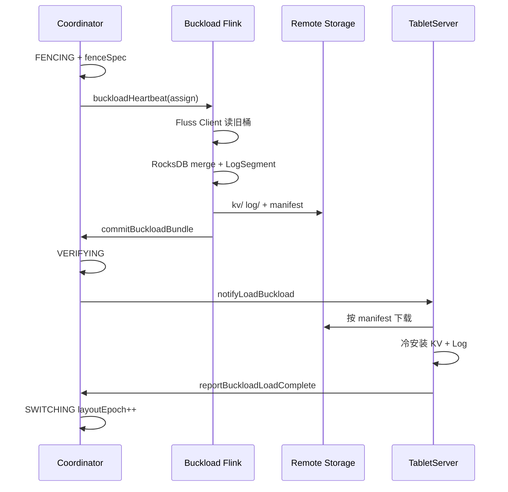

# Fluss 主键表动态分桶 — 架构设计

> **文档类型**：目标架构与时序设计  
> **文档状态**：Architecture Specification  
> **关联 Roadmap**：[Operational Excellence — Automated cluster rebalancing and bucket rescaling](/roadmap)

---

## 目录

1. [执行摘要](#1-执行摘要)
2. [现状与目标](#2-现状与目标)
3. [问题、不变量与范围](#3-问题不变量与范围)
4. [总体架构](#4-总体架构)
5. [核心能力](#5-核心能力)
6. [离线重分布：Buckload 实现](#6-离线重分布buckload-实现)
7. [分桶函数与湖层对齐](#7-分桶函数与湖层对齐)
8. [湖流一体与联合读取](#8-湖流一体与联合读取)
9. [RescaleJob 控制面](#9-rescalejob-控制面)
10. [元数据模型](#10-元数据模型)
11. [Flink 连接器](#11-flink-连接器)
12. [运维指南](#12-运维指南)
13. [行业参考](#13-行业参考)
14. [风险与待决事项](#14-风险与待决事项)

---

## 1. 执行摘要

### 1.1 问题

Fluss 主键表在建表时通过 `bucket.num` 固定分桶数量，建表后无法变更。用户需要在 **不破坏主键唯一性、Upsert 语义、CDC 连续性** 的前提下，按全表或按分区调整分桶数量，并与湖仓分层、Flink 业务作业协同。

### 1.2 方案概要

**默认采用固定哈希分桶（`bucketMode = FIXED_HASH`）**，组合三种能力：

| 能力 | 说明 |
|------|------|
| **新分区采用新桶数** | 修改 `defaultBucketCount`，仅未来分区生效（分区表）；非分区表不适用 |
| **已有分区离线重分布** | 维护窗内停写停读 → 数据按新 layout 重分布 → 原子切换 `layoutEpoch` |
| **湖层协同** | Paimon 镜像布局对齐；联合读取各阶段语义明确 |

**已有分区的离线重分布**在数据面上 **推荐 Buckload 实现**（外置 Flink 作业 + remote 冷包 + TabletServer 冷加载）。集群内 Log 重放写新桶可作为 **备选实现**，适用于开发验证或极小数据量场景，**不作为生产默认路径**。

三种分桶模式（固定哈希、动态索引、一致性哈希）在 **建表时选型、长期并存**；同一张表不在生命周期内切换模式。

### 1.3 交付里程碑

| 里程碑 | 内容 |
|--------|------|
| **M1** | 分区级桶布局元数据；`defaultBucketCount` 可变更；Flink 按分区解析桶数 |
| **M2** | RescaleJob 控制面；`fluss-flink-buckload`；Buckload RPC 协议；冷包 + 冷加载；缩桶 |
| **M3** | 湖表 per-partition 对齐；联合读取；开湖/关湖时序；`layoutEpoch` 与 tier offset 绑定 |

动态索引、一致性哈希在 M3 之后单独立项，不阻塞主路径。

---

## 2. 现状与目标

### 2.1 当前能力

| 项 | 现状 |
|----|------|
| 分桶 | `hash(分桶键) % bucket.num`；开湖后切换为湖格式分桶函数 |
| 主键表分桶键 | 默认物理主键（排除分区键），不可为空 |
| `bucket.num` | 建表固定，ALTER 不可改 |
| 桶数粒度 | 表级单一 `numBuckets` |
| Rebalance | 仅迁移已有桶副本，不改变桶数 |
| Remote storage | 主键表 KV snapshot + remote log segment 已用于容灾 |
| Tiering | 外置 Flink 读 Fluss、写湖 |
| 动态分桶 | **未实现** |

### 2.2 目标能力

| 项 | 目标 |
|----|------|
| 默认桶数 | `ALTER defaultBucketCount`；已有 layout 不变 |
| 分区扩缩 | RescaleJob 编排；数据面默认 Buckload |
| 元数据 | `layoutEpoch`、`rescaleState`、per-partition `bucketCount` |
| 隔离 | 目标范围 FENCE 期间停写停读 |
| CDC | Bootstrap Log 含 `layout_switch`；下游按 epoch 重置 |
| 湖层 | 已开湖时 Paimon overwrite 与 Fluss 冷加载协同 |

### 2.3 与 Rebalance 的边界

Rebalance 改变桶 **副本位置**；动态分桶改变桶 **数量与数据布局**。同一分区同一时刻不可并行执行。

---

## 3. 问题、不变量与范围

### 3.1 核心不变量

| 编号 | 不变量 | 验收 |
|------|--------|------|
| **I1** | 主键唯一性 | 任意时刻每主键最多一行有效版本 |
| **I2** | 路由确定性 | `(layoutEpoch, 主键)` → 唯一 `bucketId` |
| **I3** | Log-KV 一致 | 切换后同桶 Log 与 KV 可互相恢复 |
| **I4** | CDC 可解释 | `layout_switch` 关联 old/new epoch |
| **I5** | 联合读取正确 | 湖快照 + Fluss log merge，以 log 为准 |
| **I6** | 湖层对齐 | tier offset 携带 `layoutEpoch` |
| **I7** | 分区间隔离 | 分区 A 扩缩不影响分区 B |

### 3.2 范围

**包含**：主键表、固定哈希模式、分区表与非分区表、Buckload 生产路径。

**不包含（首期）**：修改 `bucket.key`、日志表动态分桶、动态索引/一致性哈希实现、改变 `max.bucket.num` 语义。

---

## 4. 总体架构

### 4.1 设计原则

1. 主键表不存在「只改元数据、零迁移」的通用解法。
2. 分桶模式建表选定，长期并存，非同表升级。
3. 湖流一体是默认约束，未开湖也须考虑后续开湖时序。
4. Flink **业务作业**并行度与 Fluss 桶数独立；layout 变更须 Savepoint 协同。
5. **Coordinator 管控制面，数据面默认外置**：避免在 TabletServer 上与在线 PutKV 争抢资源。

### 4.2 逻辑分层

```text
┌─────────────────────────────────────────────────────────┐
│  运维 / Admin API（rescaleBuckets）                       │
└───────────────────────────┬─────────────────────────────┘
                            ▼
┌─────────────────────────────────────────────────────────┐
│  Coordinator：RescaleJob 状态机（FENCE / VERIFY / SWITCH）│
└───────┬───────────────────────────────┬─────────────────┘
        │ buckloadHeartbeat 等             │ notifyLoadBuckload
        ▼                               ▼
┌───────────────────┐           ┌─────────────────────────┐
│ Buckload Flink Job │           │ TabletServer 冷加载      │
│ （fluss-flink-     │  remote   │ KvSnapshot + LogSegment  │
│  buckload）        │ ────────► │ 安装到新桶 Leader        │
└───────────────────┘           └─────────────────────────┘
        ▲
        │ Fluss Client 读旧 layout（fence 快照）
```

### 4.3 三种分桶模式（建表选型）

| 模式 | 说明 | 首期 |
|------|------|------|
| **FIXED_HASH** | `hash(key) % N`；离线扩缩 | **默认实现** |
| **DYNAMIC_INDEX** | 主键→桶索引；单写者 | 不实现 |
| **CONSISTENT_HASH** | 虚拟节点环；有界迁移 | 不实现 |

### 4.4 可选分桶模式（远期占位）

动态索引、一致性哈希须 **新建表** 选型；不能从 `FIXED_HASH` 表原地升级。

---

## 5. 核心能力

### 5.1 新分区采用新桶数

**语义**：`ALTER` 修改 `defaultBucketCount`；已有分区 `bucketCount` 不变；之后创建的分区使用新默认值。

**适用**：时间分区表；旧分区稀疏、新分区密集。

**Flink 协同**：出现 per-partition 桶数差异或首个新 N 分区写入前，业务 Sink/Source 须 **Savepoint 重启**（Sink 在规划期固化 `numBuckets`）。

**非分区表**：无「未来分区」；全表扩缩须走离线重分布（§5.2）。

### 5.2 已有分区离线重分布（能力定义）

**单元**：`(tableId, partitionId)`；非分区表为 `partitionId = null`。

**语义**：

1. FENCE：目标范围停写停读；Coordinator 冻结 **fenceSpec**（各旧桶一致快照上界）
2. 按 fenceSpec 读取旧 layout 全部 PK 最终态，按 **新分桶函数** 路由到新桶
3. VERIFY：行数守恒、路由抽样、manifest checksum
4. SWITCH：`layoutEpoch++`；Bootstrap Log 发出 `layout_switch`
5. CLEAN：下线旧桶；可选 LAKE_SYNCING（Paimon overwrite）

**不复制**旧 layout 全量历史 Log；新 layout 下 log 从 offset=0 起。

### 5.3 离线重分布：两种实现方式

| 维度 | **Buckload（推荐生产）** | **集群内重放（备选）** |
|------|--------------------------|------------------------|
| 计算位置 | 外置 Flink TaskManager | TabletServer 进程内 |
| 读 | **Fluss Client**（Scan / BatchScanner / LogScanner） | TS 本地读 Log+KV |
| 写 | Remote 冷包 → TS **冷加载** | 在线 Produce 写新桶 |
| 在线路径影响 | 不占用 PutKV | 与用户写入争用 WAL/KV/CPU |
| 资源隔离 | Flink slot 限速、离峰调度 | 难隔离 |
| 依赖 | remote storage、Buckload 协议 | 无额外服务 |
| **建议** | **生产默认** | 开发/极小分区/无 remote 时的降级 |

本文 §6 详述 Buckload；集群内重放不展开实现规格，RescaleJob 状态机可复用，数据面阶段标记为 `MIGRATING` 替代 `BUCKLOADING`+`LOADING`。

### 5.4 非分区主键表

| 需求 | 路径 |
|------|------|
| 调整全表桶数 | 对 `partitionId=null` 提交 RescaleJob |
| 仅改 defaultBucketCount | **无效** |

`max.bucket.num`：非分区表校验 `bucketCount`；分区表校验各分区 `bucketCount` 之和。

---

## 6. 离线重分布：Buckload 实现

### 6.1 服务定位

Buckload 是与 **Lake Tiering** 并列的外置 Flink 服务，模块 **`fluss-flink-buckload`**，部署形态与 `fluss-flink-tiering` 相同。

| | Tiering | Buckload |
|---|---------|----------|
| 触发 | 周期性 | RescaleJob 一次性 |
| 读 | Fluss 旧 bucket | Fluss 旧 layout（fence 点） |
| 写 | Paimon | Remote **冷包** |
| 安装 | — | TabletServer 冷加载 |

### 6.2 读路径：Fluss Client

Buckload 作业通过 **Fluss Client** 读取旧 layout（与 Tiering 相同客户端栈）：

| 表态 | 读法 |
|------|------|
| 主键表有 KV snapshot | `BatchScanner`（snapshot）+ bounded `LogScanner`（snapshot offset → fence） |
| 仅 Log | bounded `LogScanner`（EARLIEST → fence） |

**fenceSpec** 由 Coordinator 在 FENCING 完成后下发；Buckload **不得**读取 fence 点之后数据。

读负载仍落在旧桶 Leader，可通过 Flink 并行度与 Client 侧限速控制；计算在 TaskManager，不占 TS 迁移线程。

### 6.3 写路径：KvSnapshot 冷包 + Bootstrap LogSegment

#### 6.3.1 格式选择

冷包采用与线上一致的 **KvSnapshotHandle 兼容布局**（路径 A）。Buckload 作业位于 Fluss 仓库内，可内聚依赖：

- **`fluss-client`**：读
- **`fluss-server` / KV 模块**：LogSegment 序列化、Record 格式
- **RocksDB**：与 TabletServer **相同版本**（由根 `pom.xml` 统一管理）；Flink 子任务内按新桶实例化 RocksDB，merge 后 checkpoint，上传 SST 与 manifest 清单

因此不存在「Flink 与 TS RocksDB 版本不一致」问题；须在 CI 中做 **冷包 round-trip**（Buckload 产出 → TS 冷加载 → 读写校验）回归。

#### 6.3.2 单新桶产出流程

1. `keyBy(newBucketId)` 接收 fence 合并后的 PK 行
2. 写入 TaskManager 本地 RocksDB（schema / column family 与 TS 一致）
3. Checkpoint → 上传 `kv/` 至 remote staging
4. 用 Fluss 原生 API 生成 **Bootstrap LogSegment**（含 `layout_switch`）→ 上传 `log/`
5. 计算 rowCount、checksum
6. **最后** PUT `buckload-bundle.json`（`status=COMMITTED`）
7. 调用 `commitBuckloadBundle` 通知 Coordinator

新 layout 不保留旧 history log；CDC 靠 Bootstrap Log + epoch 切换。

### 6.4 Remote Storage 布局与提交

#### 6.4.1 路径

**复用**表级 `remoteDataDir`（`RemoteDirSelector` 与 KV snapshot、remote log 相同根路径），独立子树：

```text
{remoteDataDir}/{physicalTablePath}/buckload/{rescaleJobId}/
  bucket-{newBucketId}/
    attempt-{attemptId}/
      kv/...
      log/...
      buckload-bundle.json    ← 最后写入，提交标记
```

#### 6.4.2 Manifest-First（无 mvdir）

多数远程文件系统 **不支持原子目录 rename**。提交规则：

| 规则 | 说明 |
|------|------|
| **Manifest-First** | 仅当 `buckload-bundle.json` 存在且 `status=COMMITTED` 时包可见 |
| **RPC 登记** | Coordinator 在 `commitBuckloadBundle` 中记录 manifest URI；TS **禁止**轮询 remote 目录触发加载 |
| **显式路径** | 加载方只读 manifest 内文件清单，不依赖 `listDir` 推断完整性 |
| **Attempt** | 失败递增 `attemptId`；Coordinator 仅认一个 committed attempt |
| **清理** | orphan attempt 由 `RemoteStorageCleaner` TTL 异步删除 |

#### 6.4.3 Manifest 逻辑字段

```json
{
  "version": 1,
  "status": "COMMITTED",
  "rescaleJobId": "...",
  "tableId": 1,
  "partitionId": 2,
  "newBucketId": 3,
  "newLayoutEpoch": 5,
  "attemptId": 1,
  "fenceSpec": { "...": "Coordinator 下发的快照上界" },
  "kvSnapshotHandle": { "...": "与线上一致" },
  "bootstrapLogSegments": [ { "segmentId": "...", "paths": {} } ],
  "rowCount": 123456,
  "checksum": "...",
  "remoteDataDir": "s3://..."
}
```

### 6.5 Buckload 协议（Coordinator 驱动）

| RPC | 方向 | 作用 |
|-----|------|------|
| `rescaleBuckets` | Admin → Coordinator | 创建 RescaleJob |
| `buckloadHeartbeat` | Flink → Coordinator | 注册 worker、领取任务与 fenceSpec、上报进度 |
| `commitBuckloadBundle` | Flink → Coordinator | 登记单桶 manifest |
| `notifyLoadBuckload` | Coordinator → TabletServer | **推送**冷加载指令 |
| `reportBuckloadLoadComplete` | TabletServer → Coordinator | 单桶 LOAD 结果 |
| `getRescaleProgress` | Admin → Coordinator | 查询 Job |



### 6.6 TabletServer 冷加载

收到 `notifyLoadBuckload` 后：

1. 校验 Leader epoch 与 RescaleJob 代际
2. 按 manifest 下载 KV 文件（复用 snapshot download 线程池与 `KvSnapshotDataDownloader`）
3. 打开 RocksDB / 挂载 KV
4. 安装 Bootstrap LogSegment 至 LocalLog，初始化 HW
5. 校验 rowCount vs manifest
6. `reportBuckloadLoadComplete`

LOAD 完成前拒绝 Produce；全部新桶 LOAD 成功后方可 SWITCHING。

### 6.7 与 Tiering / Remote Log 隔离

- 路径前缀：`buckload/` 与 snapshot、remote-log 并列
- 同分区 Rescale 期间 **暂停 Tiering**
- 不共享 manifest 命名空间

---

## 7. 分桶函数与湖层对齐

### 7.1 分桶函数矩阵

| 湖格式 | 分桶函数 | Key 编码 |
|--------|----------|----------|
| 无（纯 Fluss） | `FlussBucketingFunction` | Fluss |
| Paimon | `PaimonBucketingFunction` | `PaimonKeyEncoder` |
| Iceberg | `IcebergBucketingFunction` | Iceberg |
| Hudi | `HudiBucketingFunction` | Hudi |
| Lance | `FlussBucketingFunction` | Fluss |

**规约**：

- **R1**：Buckload rehash 与 TS 路由均使用 **目标 layout 生效时** 的分桶函数与编码器
- **R2**：开湖前后若函数切换，扩缩前须验证同 PK 的 bucketId 一致性
- **R3**：联合读取按 `(partition, bucketId)` 配对时，跨层路由抽样验证

主键表开湖后为 Paimon **Fixed Bucket**；per-partition 不同 N 走 Fixed + 分区 overwrite，不用 Dynamic/Postpone 作为主路径。

---

## 8. 湖流一体与联合读取

### 8.1 模型

开湖表：**Fluss 热层 + Paimon 冷层**；主键表按 `(partition, bucketId, layoutEpoch)` Hybrid Split merge，**以 Fluss log 为准**。

### 8.2 开湖与扩缩时序

| 顺序 | 建议 |
|------|------|
| **先 Fluss 扩缩，后开湖** | 镜像表按新 layout 创建；无 LAKE_SYNCING |
| **先开湖，后扩缩** | Buckload 冷加载 + Paimon partition overwrite |

**关湖后再开湖**：镜像存在且 layout 一致 → 恢复 tiering；不一致 → 拒绝自动开湖，须 overwrite 或重建镜像。

### 8.3 LAKE_SYNCING

| 条件 | 进入 LAKE_SYNCING |
|------|-------------------|
| 扩缩完成时未开湖 | 否 |
| 已开湖且该分区无历史 tier 数据 | 否 |
| 已开湖且湖上有旧 layout 数据 | **是** |

### 8.4 各阶段联合读取

| RescaleJob 阶段 | 联合读取 |
|-----------------|----------|
| STABLE | 正常 |
| FENCE / BUCKLOADING / VERIFYING / LOADING / SWITCHING | **拒绝** |
| LAKE_SYNCING | 上一稳定 epoch 湖快照 + 冻结的 Fluss tail |
| COMPLETED | 新 epoch |

### 8.5 layoutEpoch 与 tier offset

Tier offset 记录 `layoutEpoch`；旧 epoch 湖数据不参与新 epoch merge；扩缩后 Fluss tail 从 offset=0 起。

---

## 9. RescaleJob 控制面

### 9.1 状态（Buckload 路径）

| 状态 | 含义 |
|------|------|
| `SUBMITTED` / `VALIDATING` / `PREPARING` | 校验与创建新桶 |
| `FENCING` | 停写停读；生成 fenceSpec |
| `BUCKLOADING` | Buckload Flink 写 remote 冷包 |
| `VERIFYING` | 校验 manifest |
| `LOADING` | Coordinator 推送 TS 冷加载 |
| `SWITCHING` | `layoutEpoch++` |
| `CLEANING` | 下线旧桶；清理 orphan |
| `LAKE_SYNCING` | Paimon overwrite（条件） |
| `ROLLING_BACK` / `FAILED` / `CANCELED` / `COMPLETED` | 终态 |

```mermaid
stateDiagram-v2
    [*] --> SUBMITTED
    SUBMITTED --> VALIDATING --> PREPARING --> FENCING
    FENCING --> BUCKLOADING --> VERIFYING --> LOADING --> SWITCHING
    SWITCHING --> CLEANING
    CLEANING --> LAKE_SYNCING --> COMPLETED
    CLEANING --> COMPLETED
    BUCKLOADING --> ROLLING_BACK --> FAILED
    LOADING --> ROLLING_BACK
```

**备选路径**：集群内重放时，`BUCKLOADING`+`LOADING` 合并为 `MIGRATING`。

### 9.2 FENCE 隔离

目标分区：Produce、Lookup、Scan、联合读取 → `PARTITION_RESCALING`；其他分区正常。

### 9.3 VERIFYING

1. 各新桶 manifest 已登记，`fenceSpec` 一致
2. 旧桶 rowCount 之和 = 新桶 rowCount 之和
3. 随机 PK 路由抽样
4. checksum 校验

### 9.4 回滚

| 失败点 | 动作 |
|--------|------|
| BUCKLOADING | 放弃 attempt；不增 layoutEpoch |
| LOADING | 重试 notify 或 ROLLING_BACK |
| SWITCHING 已提交 | 人工介入 |

### 9.5 互斥

Rescale(P) 与 Rebalance(P)、Tiering(P)、DropPartition(P) 互斥；与 Rescale(Q)（Q≠P）可并行。

### 9.6 Admin API

`rescaleBuckets` · `getRescaleProgress` · `cancelRescaleJob` · `retryRescaleJob`

---

## 10. 元数据模型

### 10.1 表级

| 字段 | 说明 |
|------|------|
| `defaultBucketCount` | 新分区默认桶数 |
| `bucketMode` | 首期仅 `FIXED_HASH` |
| `bucketLayoutVersion` | 协议版本 |

### 10.2 分区级

| 字段 | 说明 |
|------|------|
| `bucketCount` | null → 继承 default |
| `layoutEpoch` | SWITCH 时 +1 |
| `rescaleState` | STABLE / FENCED / BUCKLOADING / LOADING / LAKE_SYNCING |
| `activeJobId` | 当前 RescaleJob |

### 10.3 RescaleJob 扩展

| 字段 | 说明 |
|------|------|
| `fenceSpec` | 快照上界 |
| `implementation` | `BUCKLOAD` / `IN_CLUSTER` |
| `buckloadWorkerId` | Flink 作业实例 |
| `committedBundles` | `newBucketId → manifestUri` |
| `loadReports` | `newBucketId → status` |

### 10.4 PartitionInfo RPC

须返回 `bucketCount`、`layoutEpoch`、`rescaleState`；分区表 **不得**仅用 `TableInfo.numBuckets`。

---

## 11. Flink 连接器

### 11.1 BucketLayoutProvider

运行时供 Sink/Source 解析 per-partition 桶数与 epoch；布局变更后业务作业须 Savepoint 重启。

### 11.2 改造要点

| 组件 | 改造 |
|------|------|
| Sink `ChannelComputer` | per-partition 动态 N |
| Source / `LakeSplitGenerator` | per-partition 枚举 |
| Catalog | `rescale_buckets` procedure |
| Lookup / Recovery | FENCED 分区拒绝；per-partition bucket 枚举 |

### 11.3 并行度与桶数

`parallelism >= 新桶数` 为 **建议**，非硬约束。

### 11.4 交付顺序

服务端 Schema + RPC → Connector → 文档与指标。

---

## 12. 运维指南

### 12.1 决策要点

1. 非分区表 → 只能离线重分布  
2. 仅新分区新 N → `defaultBucketCount`  
3. 已有分区扩缩 → RescaleJob（默认 Buckload）  
4. 已开湖 → 预期 LAKE_SYNCING  
5. 计划开湖 → 优先先扩缩后开湖  

### 12.2 Buckload 维护 Runbook

| 步 | 操作 |
|----|------|
| 1 | 业务作业 `STOP WITH SAVEPOINT` |
| 2 | `CALL sys.rescale_buckets(...)` |
| 3 | 确认 Buckload Flink 作业运行且 `buckloadHeartbeat` 注册 |
| 4 | `getRescaleProgress` → `COMPLETED` |
| 5 | Savepoint 恢复业务作业 |

### 12.3 CDC 下游

处理 Bootstrap Log 中 `layout_switch`；重置 per-bucket 消费进度至新 epoch。

---

## 13. 行业参考

主键表扩缩的核心矛盾：**分片数变化** vs **路由稳定性**。Paimon Fixed overwrite、Doris 新分区新 N、Kafka 式 rehash（禁止）、Flink Key Group（计算层参考）等结论与 Fluss 选型一致：离线迁移保正确性，在线模式高复杂度。细节见 Paimon rescale 文档与 Fluss Tiering 实现。

---

## 14. 风险与待决事项

### 14.1 风险

| 风险 | 缓解 |
|------|------|
| 冷包 KV / Log 不一致 | manifest 绑定；VERIFY + LOAD 后校验 |
| Remote 孤儿文件 | manifest-first；attempt TTL |
| LOADING 磁盘峰值 | 限制并发 LOAD；离峰 |
| Buckload 读放大旧桶 | Client 限速；低峰窗口 |
| 无 remote 配置的集群 | 降级集群内重放（非生产推荐） |

### 14.2 待决

1. `layout_switch` record 的 proto schema  
2. `notifyLoadBuckload` 投递通道（TabletServerGateway vs 内部队列）  
3. 开湖表 Buckload 与 Paimon overwrite 同 job 还是两阶段（M3）  
4. 集群内重放是否保留为长期备选或仅测试用途  

### 14.3 结论

Fluss 主键表动态分桶的默认路径是：**新分区新桶数 + 离线重分布（Buckload 生产实现）+ 湖层协同**。Coordinator 管 RescaleJob；数据面通过 Fluss Client 读、同版 RocksDB 写 KvSnapshot 冷包、manifest-first remote 提交、TS 冷加载，避免在线 PutKV 抖动。M1→M2→M3 分批交付。

---

## 参考资料

- [Fluss Bucketing](/table-design/data-distribution/bucketing.md)
- [Fluss Primary Key Table](/table-design/table-types/pk-table.md)
- [Fluss Remote Storage](/maintenance/tiered-storage/remote-storage.md)
- [Fluss Rebalance](/maintenance/operations/rebalance.md)
- [Paimon Rescale Bucket](https://paimon.apache.org/docs/master/maintenance/rescale-bucket/)
