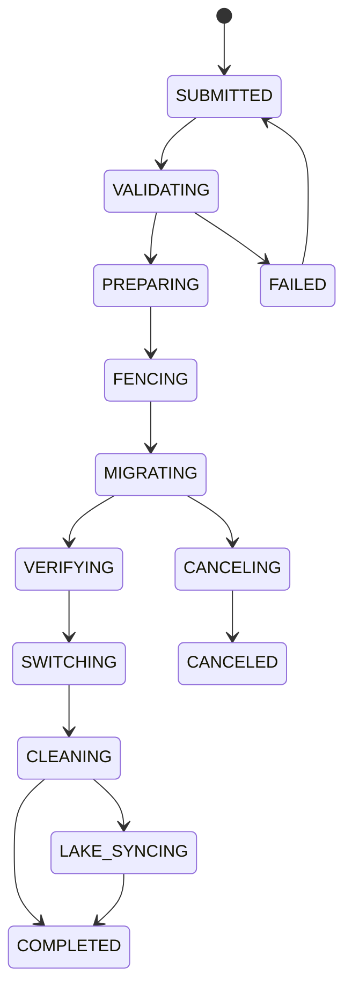
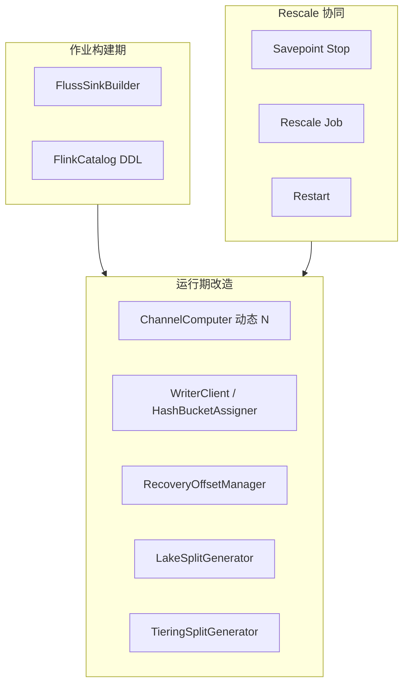
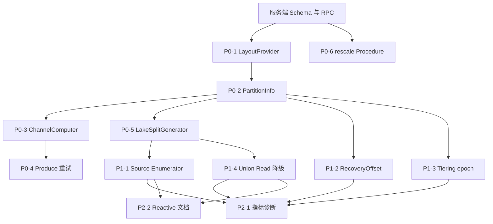

# Fluss 主键表动态 Bucket 能力 — 调研与方案设计

> **文档类型**：架构与时序逻辑设计（不含代码实现细节）  
> **状态**：Draft / 设计讨论稿  
> **关联 Roadmap**：[Operational Excellence — Automated cluster rebalancing and bucket rescaling](/roadmap)

---

## 目录

1. [背景与动机](#1-背景与动机)
2. [当前 Fluss 架构分析](#2-当前-fluss-架构分析)
3. [竞品调研](#3-竞品调研)
4. [问题定义与设计目标](#4-问题定义与设计目标)
5. [可行方案设计](#5-可行方案设计)
6. [湖流一体 Union Read 与 Paimon 对齐](#6-湖流一体-union-read-与-paimon-对齐)
7. [方案综合对比与推荐路线](#7-方案综合对比与推荐路线)
8. [RescaleJob 状态机形式化规约](#8-rescalejob-状态机形式化规约)
9. [PartitionBucketLayout 元数据 Schema](#9-partitionbucketlayout-元数据-schema)
10. [Flink Connector 改造清单](#10-flink-connector-改造清单)
11. [风险、开放问题与结论](#11-风险开放问题与结论)

---

## 1. 背景与动机

### 1.1 业务诉求

主键表（Primary Key Table）是 Fluss 的核心表类型，承载实时 Upsert、点查、Lookup Join、CDC 等能力。数据通过 **Hash Bucketing** 按 `bucket.key`（默认物理主键）路由到固定数量的 Bucket，每个 Bucket 对应一组 **LogTablet + KvTablet**，是 Fluss 最小的读写与副本管理单元。

当前 `bucket.num` 在 **建表时固定、建表后不可变更**。典型痛点：

| 场景 | 问题 |
|------|------|
| 数据量从 GB 增长到 TB | 初始 bucket 数过小，单 bucket 热点、TabletServer 负载不均 |
| 集群扩容 | 新增 TabletServer 无法通过增加 bucket 提升并行度 |
| Flink 作业升并行度 | Sink 并行度与 bucket 数不匹配，部分 subtask 空闲或争用 |
| Lake 分层对齐 | Paimon 支持 dynamic bucket / rescale，Fluss 固定 bucket 导致跨层路由不一致 |
| 分区表生命周期 | 历史分区稀疏、新分区密集，无法按分区独立调 bucket |

### 1.2 与现有 Rebalance 的边界

Fluss 已有 **集群 Rebalance** 能力：在 **bucket 集合不变** 的前提下，将已有 bucket 的副本在 TabletServer 间迁移、重选 Leader。这是 **「搬家具」**，不是 **「拆墙加房」**。

动态 bucket 数要解决的是：

- bucket **数量** 变化（增 / 减 / 按分区变化）
- 数据在 bucket 间的 **重分布**
- 路由规则在过渡期的 **一致性**

二者可组合使用，但语义与实现路径完全不同。

---

## 2. 当前 Fluss 架构分析

### 2.1 核心概念

| 概念 | 说明 |
|------|------|
| **TableBucket** | 逻辑分片标识 `(tableId, partitionId?, bucketId)`，bucketId ∈ [0, numBuckets) |
| **Bucket Key** | Hash 路由键，PK 表必须为 PK 子集（不含分区键），默认物理主键 |
| **TableAssignment** | `bucketId → [replicaServerIds]`，首元素为 preferred Leader |
| **Tablet** | LogTablet（WAL + changelog）+ KvTablet（点查/更新状态） |
| **Leader / ISR / Standby** | 每 bucket 独立选举；KV 支持 Leader + 可选 Standby 读副本 |

### 2.2 端到端数据流

**建表**：Client DDL → Coordinator 校验 → 生成 Assignment → ZK 持久化 → Bucket 状态机 NewBucket → OnlineBucket → NotifyLeaderAndIsr → TabletServer 创建 Tablet。

**写入/点查**：Client 编码 bucket key → `hash % numBuckets` → 查 Metadata 得 leader → RPC 到 TabletServer。

**扫描/Union Read**：枚举 `[0, numBuckets)`（每分区独立），从各 bucket leader 拉取并合并。

### 2.3 元数据与约束

| 元数据 | 存储 | 可变性 |
|--------|------|--------|
| `bucketCount`, `bucketKeys` | ZK `TableRegistration` | **不可变** |
| `TableAssignment` / `PartitionAssignment` | ZK | 创建时生成；Rebalance 可改副本位置 |
| Bucket 状态 | Coordinator + ZK | NewBucket / OnlineBucket / OfflineBucket |

**关键约束**：

1. Hash 路由粘性：`bucketId = hash(bucketKey) % numBuckets`
2. Log + KV 共置：同 bucket 的 LogTablet 与 KvTablet 在同一副本上
3. Lake 对齐：启用 datalake 时 bucketing 函数切换为 Paimon/Iceberg/Hudi 实现
4. 上限：`max.bucket.num` 默认 128,000

### 2.4 能力缺口

| 能力 | 现状 |
|------|------|
| 修改 bucket.num | 不支持 |
| 按分区不同 bucket 数 | 不支持 |
| 在线数据重分布 | 不支持 |
| 集群 Rebalance | 支持（仅迁移已有 bucket 副本） |
| Bucket 状态机 | 具备扩展基础 |

---

## 3. 竞品调研

### 3.1 对比总览

| 系统 | 分布单元 | 动态调整 | 迁移策略 | 过渡期一致性 |
|------|----------|----------|----------|--------------|
| **Paimon** | Bucket (LSM) | 三种模式 | Fixed：ALTER + OVERWRITE；Dynamic：索引自动扩 | 固定模式需停写 |
| **Iceberg** | Partition transform | 元数据演化（非 PK 表） | 无自动迁移 | PK 表禁止 spec 演化 |
| **Hudi** | Bucket → File Group | 部分（3 种引擎） | Simple 离线；CH 局部 split/merge | 分区级 rescale 需停写 |
| **Kafka** | Partition | 仅增加 | 无数据迁移 | keyed 顺序破坏 |
| **StarRocks** | Tablet | ALTER BUCKETS | 后台异步重分布 | 一般在线 |
| **Doris** | Tablet | 仅新分区 | 已有分区不可变 | — |
| **Flink State** | Key Group | Savepoint 重分布 | 状态随 Key Group 迁移 | Checkpoint 原子性 |

### 3.2 设计模式提炼

| 模式 | 代表 | PK 表适用性 |
|------|------|-------------|
| **A: 朴素 Rehash** | Kafka 扩分区 | 反模式 |
| **B: 元数据演化** | Iceberg spec evolution | PK Upsert 禁止 |
| **C: 离线 Overwrite** | Paimon Fixed rescale | 强正确性 |
| **D: Key→Bucket 索引** | Paimon Dynamic | 在线扩桶，顺序依赖 |
| **E: 一致性哈希** | Hudi CH | 在线局部迁移 |
| **F: 存储引擎后台重分片** | StarRocks | 在线但重 |

### 3.3 Flink 动态并行度（Key Group）

Flink 对有状态算子的扩缩容采用 **Key Group 固定分区 + Subtask 范围重分配**：

| 概念 | 含义 |
|------|------|
| **maxParallelism** | Key Group 总数，job 启动后不可变 |
| **Key Group** | `keyGroup = hash(key) % maxParallelism`，映射固定 |
| **Subtask 分配** | Key Group 以连续范围分给各 subtask |
| **Rescaling** | 从 savepoint 恢复，重划 Key Group 范围，状态随 Key Group 迁移 |

**Flink Key Group ≠ 一致性哈希**：

| 维度 | Flink Key Group | 一致性哈希 |
|------|-----------------|------------|
| Key→分片映射 | 固定不变 | 随 ring 拓扑变化 |
| 扩缩迁移单元 | 整个 Key Group 状态块 | 仅受影响 vnode 区间 |
| 目的 | 计算状态搬迁 | 存储分片在线分裂/合并 |

**可借鉴**：两层映射（key → logicalShard 固定 + logicalShard → physicalNode 可变）、原子迁移单元、savepoint 门控、范围分配。

---

## 4. 问题定义与设计目标

### 4.1 问题陈述

如何在 **不破坏主键唯一性、Upsert 语义、CDC 连续性** 的前提下，允许主键表在运行时 **增加或减少 bucket 数**（全局或按分区），并协调客户端路由、Coordinator 元数据、TabletServer 存储、Lake 分层的一致性？

### 4.2 核心不变量

| ID | 不变量 |
|----|--------|
| **I1** | PK 唯一性：任意时刻每个 PK 最多一个有效行版本 |
| **I2** | 路由确定性：给定 `(layoutEpoch, pk)` 路由结果唯一 |
| **I3** | Log-KV 一致：同 TableBucket 的 Log 与 KV 可互相恢复 |
| **I4** | CDC 可解释：changelog 可重建为与快照一致的 PK 状态 |
| **I5** | Union Read 正确：lake + fluss log merge 按 PK LastRow 正确 |
| **I6** | Lake 对齐：Tiering 与 Fluss bucket/offset 元数据一致 |
| **I7** | 分区隔离：分区 A 的 rescale 不破坏分区 B 的 I1–I6 |

### 4.3 设计目标

| 优先级 | 目标 |
|--------|------|
| P0 | 正确性、可运维（API、进度、回滚） |
| P1 | 在线能力、Lake 对齐 |
| P2 | 缩桶、分区粒度、自动化 |

### 4.4 非目标（首期）

- 修改 `bucket.key` 列集合
- Log 表动态 bucket（语义不同）
- 改变 `max.bucket.num` 全局上限语义

---

## 5. 可行方案设计

### 5.1 方案一：离线分区级 Overwrite 重分布

**核心**：元数据变更 + 全量数据重组，以分区为最小操作单元。与 Paimon Fixed Rescale 同构。

**元数据**：引入 `layoutEpoch`、`partitionRescaleState`（STABLE / MIGRATING / COMPLETED）。

**时序**：ALTER → 创建新 bucket → Write Fence 停写 → 按源 bucket 扫描 KV → 按新 hash 写入目标 bucket → 校验 → 原子切换元数据 → 清理旧 bucket →（lake）Paimon overwrite。

**读写**：MIGRATING 期间该分区停写；读旧 layout 或阻塞；COMPLETED 后新 hash 路由。

| 优点 | 缺点 |
|------|------|
| 正确性最强 | 分区级停写窗口 |
| 与 Paimon rescale 一致 | 大数据量迁移耗时长 |
| 可复用 Bucket 状态机 | 缩桶成本更高 |

### 5.2 方案二：双读路由过渡期

**核心**：迁移期间不停写，维护旧/新双套路由；写走新 layout，读合并两 layout。

**策略**：写新 + 读双合并 + 后台清扫旧 bucket（推荐）；或双写（2x 写放大）。

| 优点 | 缺点 |
|------|------|
| 无停写窗口（理论上） | 读放大、扫描逻辑复杂 |
| | CDC 双份事件风险 |
| | **Lake Union Read 几乎不可对齐** |

**推荐度**：低（仅适合纯 Fluss、短过渡期）。

### 5.3 方案三：Key→Bucket 索引（Dynamic Bucket）

**核心**：持久化 `PK → bucketId` 映射；新 key 按负载分配；已存在 key 永驻原 bucket。扩桶无需数据迁移。

**约束**：单写者（per table/partition）；缩桶不支持。

**Lake 对齐**：**Fluss 索引主导 + Paimon Fixed maxBuckets**（禁止双层 Dynamic 索引）。

| 优点 | 缺点 |
|------|------|
| 在线扩桶 | 索引内存/磁盘成本 |
| 与 Paimon dynamic 语义相近 | 顺序依赖导致长期不均 |
| per-partition 自然支持 | 单写者运维约束 |

### 5.4 方案四：一致性哈希 + 局部 Split/Merge

**核心**：hash 空间划分为 vnode 范围；扩桶 = 分裂范围；仅受影响区间数据迁移。与 Hudi CH、Flink 两层映射思想同构。

**两层映射**：

```
pk → hash(pk) → vnode position（固定）→ range lookup → bucketId（可变）
```

| 优点 | 缺点 |
|------|------|
| 扩缩均支持，迁移量有界 | 实现复杂度最高 |
| 在线 resize | Log+KV 同步迁移难 |
| | 迁移期并发 Upsert 需 per-key fencing |

### 5.5 方案五：渐进式（新分区新桶数 + 可选离线迁移）

**核心**：`ALTER bucket.num` 仅更新 `defaultBucketCount`；已有分区保持旧桶数；新分区用新 default；旧分区可选触发方案一。

| 优点 | 缺点 |
|------|------|
| 实现量最小 | 同表不同分区 bucket 数不一致 |
| 符合时间分区衰减 | 热分区扩桶需额外 rescale |
| 分区间天然隔离 | |

---

## 6. 湖流一体 Union Read 与 Paimon 对齐

### 6.1 Union Read 数据契约

Fluss lake-enabled 表维持 **热层（Fluss Log/KV）+ 冷层（Paimon）** 两层模型。Union Read 在查询时拼接：

| 层 | 角色 |
|----|------|
| **Paimon** | 历史快照至 readable tiered offset |
| **Fluss** | 自该 offset 至当前的 log tail |

**PK 表**：每个 `(partition, bucketId)` 一个 Hybrid Split，湖层快照 + Fluss log tail 按 PK sort-merge，**log 赢**。

### 6.2 Paimon Bucket 模式映射

| Fluss 配置 | Paimon 模式 |
|------------|-------------|
| 有 `bucket.key` + `bucket.num` | Fixed：`bucket=N, bucket-key=...` |
| 无 `bucket.key` | Dynamic：`bucket=-1` |

当前 **PK 表强制 Hash Bucketing**，因此 lake-enabled PK 表必然走 Paimon **Fixed Bucket**。

### 6.3 Per-Partition 不同 Bucket 数的硬问题

当前全链路假设 **单表单一 `numBuckets`**：`LakeSplitGenerator`、`TieringSplitGenerator`、Flink Sink 均按表级 N 枚举。

**Paimon 对 per-partition bucket 的支持**：

| 模式 | per-partition N |
|------|-----------------|
| Fixed | 表级 N；分区 rescale 靠 overwrite |
| Postpone (-2) | compact 时 per-partition 决定 |
| Dynamic (-1) | 索引 per-partition 自动增长 |

**Fluss per-partition 对齐路径**：

| Fluss 表类型 | 推荐 Paimon 模式 |
|--------------|------------------|
| 有 bucket.key 的 PK 表 | Fixed + 分区级 rescale overwrite |
| 需 per-partition 不同 N | Postpone 或 Dynamic |
| Log 表无 bucket.key | Dynamic + `__bucket` 列 |

### 6.4 Dynamic Bucket 对齐架构（若 Fluss PK 支持）

**推荐 S4：Fluss 主导**

- Coordinator 维护 `BucketIndex`（持久化）
- Tiering 按 Fluss `bucketId` 写入 Paimon Fixed bucket（`bucket=maxBuckets`）
- Union Read 以 Fluss `bucketId` 枚举；Paimon 按同 bucketId 读取
- **禁止** Fluss 与 Paimon 各维护独立 Dynamic 索引

### 6.5 Rescale 各阶段 Union Read 行为

| 阶段 | Union Read |
|------|------------|
| STABLE | 正常 hybrid merge |
| WRITE_FENCED | 仅读；log tail 不再增长 |
| MIGRATING | **禁止**或返回 STALE |
| LAKE_SYNCING | 使用上一稳定 epoch 的 lake snapshot |
| COMPLETED | 新 layout + 新 readable snapshot |

### 6.6 跨层一致性要求

| # | 要求 |
|---|------|
| 1 | Fluss bucket count + bucket keys → Paimon bucket/bucket-key 自动对齐 |
| 2 | Tiered offsets 按 `(partitionId, bucketId)` 跟踪 |
| 3 | Union Read 使用 `getReadableLakeSnapshot` |
| 4 | `__bucket` 系统列与 Fluss bucket 一致（尤其 BUCKET_UNAWARE） |
| 5 | 分区名编码一致（`partition.legacy-name=false`） |
| 6 | PK comparator 对齐 |
| 7 | 同 bucket splits 共置同一 reader/task |

---

## 7. 方案综合对比与推荐路线

### 7.1 多维度评分

| 维度 | 方案一 | 方案二 | 方案三 | 方案四 | 方案五 |
|------|:---:|:---:|:---:|:---:|:---:|
| 正确性 | ★★★★★ | ★★★☆☆ | ★★★★☆ | ★★★★☆ | ★★★★★ |
| Union Read | ★★★★★ | ★★☆☆☆ | ★★★★☆ | ★★★☆☆ | ★★★★☆ |
| 在线扩桶 | ★★☆☆☆ | ★★★★☆ | ★★★★★ | ★★★★☆ | ★★★☆☆ |
| 缩桶 | ★★★★☆ | ★★★☆☆ | ★☆☆☆☆ | ★★★★☆ | ★☆☆☆☆ |
| 实现复杂度 | 中 | 高 | 高 | 最高 | 低 |
| Lake 对齐 | 最好 | 差 | 好 | 中 | 中-好 |

### 7.2 推荐组合路线


| 阶段 | 内容 |
|------|------|
| **Phase 1** | 方案五（新分区新桶数）+ 方案一（单分区离线 rescale API）+ Union Read per-partition 枚举 |
| **Phase 2** | 方案一自动化 + 方案三 Dynamic 可选 + Lake 协同 rescale |
| **Phase 3** | 方案四 vnode CH + 自动扩缩容策略 |

### 7.3 场景决策树

```
是否 lake-enabled?
├─ 否 → 方案五 + 方案一（按需）
└─ 是
   ├─ 有 bucket.key (Fixed)?
   │  ├─ 可停写? → 方案一 + Paimon overwrite
   │  └─ 仅新分区扩容? → 方案五 + 旧分区排队方案一
   └─ 要 Dynamic? → 方案三（Fluss 主导索引）
```

---

## 8. RescaleJob 状态机形式化规约

### 8.1 设计原则

- 参照 `TableBucketStateMachine`（bucket 生命周期）与 `RebalanceManager`（副本迁移），与之 **正交**
- 一个 `(tableId, partitionId)` 同时最多一个活跃 RescaleJob
- Coordinator 单线程事件循环驱动状态转移

### 8.2 JobState

| 状态 | 含义 |
|------|------|
| `SUBMITTED` | 已提交，等待校验 |
| `VALIDATING` | 前置检查 |
| `PREPARING` | 创建目标 bucket、生成 Assignment |
| `FENCING` | 广播停写、等待 in-flight 完成 |
| `MIGRATING` | 数据迁移进行中 |
| `VERIFYING` | 完整性校验 |
| `SWITCHING` | 原子切换 layout 元数据 |
| `CLEANING` | 下线旧 bucket |
| `LAKE_SYNCING` | 等待 Paimon 层同步 |
| `COMPLETED` / `FAILED` / `CANCELED` | 终态 |

### 8.3 状态转移图



### 8.4 Write Fence 协议

**两阶段**：

1. **Soft Notice**：广播 `RescaleNotice`，客户端 flush pending batches
2. **Hard Fence**：`Produce` 对目标分区返回 `PARTITION_RESCALING`

| RPC | Fence 期间 |
|-----|------------|
| Produce（目标分区） | 拒绝 |
| Lookup / Scan | 允许读旧 layout（可配置） |
| CreatePartition（其他分区） | 允许 |

### 8.5 MigrationTask 子状态机

每源 bucket 一个任务：`PENDING → SCANNING → WRITING → CHECKPOINTING → DONE`。

断点持久化：`lastScannedPk`、`rowsMigrated` 等于 Remote Storage，支持崩溃续跑。

### 8.6 完整性校验（VERIFYING）

1. **行数守恒**：迁出行数 = 源 bucket 行数
2. **路由抽样**：随机 PK 验证 `hash(pk) % tgtN` 与存储位置一致
3. **Log-KV 一致**：目标 bucket KV 行数 = Log distinct PK 数
4. **无孤儿**：源 bucket 残留为 0

### 8.7 SWITCHING 原子切换

ZK 事务批：

1. 更新 `PartitionBucketLayout`（`bucketCount=tgtN`, `layoutEpoch++`）
2. 删除 `WriteFence`
3. 追加 `LayoutHistory`

### 8.8 与 Rebalance 互斥

| 操作 A | 操作 B | 结果 |
|--------|--------|------|
| Rescale(P) | Rescale(P) | 第二个拒绝 |
| Rescale(P) | Rescale(Q) | 允许并行 |
| Rescale(P) | Rebalance(bucket ∈ P) | 互斥 |
| Rescale(P) | Tiering(P) | Tiering 暂停 |

### 8.9 Admin API

| 接口 | 语义 |
|------|------|
| `rescaleBuckets(table, partition?, targetBuckets)` | 提交 Job |
| `getRescaleProgress(jobId)` | 查询进度 |
| `cancelRescaleJob(jobId)` | 取消 |
| `retryRescaleJob(jobId)` | 重试 |

---

## 9. PartitionBucketLayout 元数据 Schema

### 9.1 设计目标

- 向后兼容：旧表 `partition.bucketCount = null` → 继承表级
- per-partition 桶数支持
- `layoutEpoch` 驱动客户端缓存失效与 Lake offset 版本化

### 9.2 表级扩展（TableRegistration）

| 字段 | 类型 | 说明 |
|------|------|------|
| `defaultBucketCount` | int | 新分区默认桶数（`ALTER` 可改）；兼容原 `bucketCount` |
| `bucketMode` | enum | `FIXED_HASH` / `DYNAMIC_INDEX` / `CONSISTENT_HASH` |
| `maxBucketCount` | int | Dynamic/CH 上限 |
| `bucketLayoutVersion` | int | 协议版本 |

**解析**：

```
resolveBucketCount(table, partition):
  if partition.bucketCount != null: return partition.bucketCount
  return table.defaultBucketCount
```

### 9.3 分区级扩展（PartitionRegistration）

| 字段 | 类型 | 默认 | 说明 |
|------|------|------|------|
| `bucketCount` | int? | null | null = 继承 default |
| `layoutEpoch` | long | 0 | rescale 完成时 +1 |
| `rescaleState` | enum | STABLE | STABLE / FENCED / MIGRATING / LAKE_SYNCING |
| `activeJobId` | string? | null | 当前 RescaleJob |
| `createdWithBucketCount` | int | 创建时快照 | 审计 |

### 9.4 PartitionInfo RPC 扩展

| 字段 | 说明 |
|------|------|
| `bucketCount` | 解析后有效桶数 |
| `layoutEpoch` | 当前 epoch |
| `rescaleState` | 供 Client 决定重试策略 |

分区表路由：**不得**仅用 `TableInfo.numBuckets`，须 per-record 解析分区后查 `bucketCount`。

### 9.5 Lake Snapshot Offset 扩展

```
BucketOffsetEntry:
  partitionId, bucketId, layoutEpoch, logOffset, bucketCountAtTier
```

**Rescale 后 offset 策略（推荐）**：新 epoch 从 offset=0 + 发 `layout_switch` 控制事件。

### 9.6 ZK 路径

| 路径 | 内容 |
|------|------|
| `/fluss/tables/{id}/registration` | TableRegistration |
| `/fluss/tables/{id}/partitions/{pid}/registration` | PartitionRegistration + layout |
| `/fluss/tables/{id}/rescale-jobs/{jobId}` | RescaleJob |
| `/fluss/tables/{id}/write-fences/{pid}` | WriteFence |
| `/fluss/tables/{id}/layout-history/{pid}` | LayoutHistory |

---

## 10. Flink Connector 改造清单

### 10.1 改造总览

当前 Flink Connector 在多处将 `numBuckets` **固化在作业构建期**。动态 bucket 要求 **运行时感知 layout** 或 **作业级协同 rescale**。



### 10.2 BucketLayoutProvider 抽象

```
BucketLayoutProvider:
  getDefaultBucketCount()
  getPartitionBucketCount(partitionName)
  getPartitionLayoutEpoch(partitionName)
  getPartitionRescaleState(partitionName)
  refresh() / refreshIfEpochStale()
```

### 10.3 改造项清单

#### Sink

| 组件 | 改造 |
|------|------|
| `FlinkRowDataChannelComputer` | per-record 解析分区 → 动态 N |
| `HashBucketAssigner` | 接受 `BucketLayoutProvider` |
| `ChannelComputer` | `shouldCombinePartitionInSharding` 用 per-partition N |
| Produce 错误处理 | 捕获 `PARTITION_RESCALING` → 刷新元数据 → 退避重试 |
| `RecoveryOffsetManager` | per-partition 枚举 bucket |

#### Source / Union Read

| 组件 | 改造 |
|------|------|
| `LakeSplitGenerator` | per-partition `resolveBucketCount` |
| `FlinkSourceEnumerator` | 感知 layout 变更，动态增删 split |
| Union Read | `LAKE_SYNCING` 期间降级为纯 Fluss |

#### Catalog

| 组件 | 改造 |
|------|------|
| `FlinkCatalog` | `ALTER TABLE SET bucket.num`；`CALL sys.rescale_buckets` |

### 10.4 Flink 作业协同 Runbook

| 步骤 | 操作 |
|------|------|
| 1 | `STOP WITH SAVEPOINT` |
| 2 | `CALL sys.rescale_buckets(...)` |
| 3 | 轮询至 `COMPLETED` |
| 4 | （lake）Paimon overwrite（若未自动） |
| 5 | `parallelism >= newN` 从 savepoint 恢复 |

**仅改 defaultBucketCount（方案五）**：无需停作业；新分区自动用新 N。

### 10.5 Flink Key Group 与 Connector 映射

| Flink | Fluss Connector |
|-------|-----------------|
| maxParallelism | maxBucketCount |
| hash % maxParallelism（固定） | hash(pk) % bucketCount（Fixed） |
| Key Group → Subtask | (partition, bucketId) → channel |
| Savepoint 门控 | Write Fence + Flink savepoint |

### 10.6 改造分期与依赖

#### 分期总览


| 阶段 | 目标 | 前置条件 |
|------|------|----------|
| **P0 基础** | per-partition layout 感知 + rescale 入口 | 服务端 Schema + RPC |
| **P1 增强** | Source / Union Read / Recovery 全链路 | P0 完成 |
| **P2 完善** | 可观测性、文档 | P1 完成 |

#### P0：基础

| 序号 | 改造项 | 依赖 |
|------|--------|------|
| P0-1 | `BucketLayoutProvider` 抽象 | 服务端 Schema |
| P0-2 | `PartitionInfo` 扩展消费 | P0-1 |
| P0-3 | `ChannelComputer` 动态 N | P0-1, P0-2 |
| P0-4 | Writer Produce 错误重试 | P0-3 |
| P0-5 | `LakeSplitGenerator` per-partition N | P0-2 |
| P0-6 | `rescale_buckets` Procedure | RescaleJob API |

#### P1：增强

| 序号 | 改造项 | 依赖 |
|------|--------|------|
| P1-1 | Source Enumerator 动态 split | P0-5 |
| P1-2 | `RecoveryOffsetManager` | P0-2, P0-3 |
| P1-3 | Tiering offset `layoutEpoch` | P0-2 |
| P1-4 | Union Read 降级策略 | P0-5, P1-3 |

#### P2：完善

| 序号 | 改造项 | 依赖 |
|------|--------|------|
| P2-1 | 指标与诊断 | P1 全量 |
| P2-2 | Reactive Mode 文档 | P1 全量 |

#### 依赖关系



#### 关键路径与上线约束

**关键路径**：服务端 Schema → BucketLayoutProvider → PartitionInfo → ChannelComputer / LakeSplitGenerator → Source / Union Read → P2。

**上线约束**：P0 服务端 `PartitionBucketLayout` 与 `PartitionInfo` RPC 必须先于 Connector 改造发布。

---

## 11. 风险、开放问题与结论

### 11.1 技术风险

| 风险 | 缓解 |
|------|------|
| Log+KV 迁移不一致 | 以 Log 为 source of truth |
| 大分区迁移时间过长 | 并行 per-bucket；可限速 |
| Lake rescale 不同步 | readable snapshot 门控 |
| 与 Rebalance 死锁 | 全局锁 + 优先级 |

### 11.2 开放问题

1. 缩桶是否纳入 Phase 1？
2. Bucket ID 是否允许非连续？
3. Dynamic Bucket 索引放 Coordinator 还是 IndexTablet？
4. Write Fence：Coordinator 拒绝 vs Client 订阅 vs 两者结合？
5. ZK 移除后 Rescale 元数据存储方案？

### 11.3 结论

Fluss 主键表固定 Hash Bucket 已成为并行度与长期运维的瓶颈，但现有 Bucket 状态机、Assignment 管理、Rebalance 基础设施提供了良好底座。

**竞品表明不存在银弹**：要强正确性用离线迁移；要在线扩桶用索引或一致性哈希；纯 rehash 不迁数据是 PK 表反模式。

**推荐路径**：

1. **短期**：方案五（新分区新桶数）+ 方案一（分区级离线 rescale）
2. **中期**：Lake 协同 + 方案三 Dynamic 可选
3. **长期**：方案四 vnode CH + 自动扩缩容

Union Read 是约束最强的一环；Flink Key Group 的两层映射思想可指导方案四，但 Flink 并行度 rescale 与 Fluss bucket rescale 是两个独立维度，须通过 savepoint 协同变更。

---

## 参考资料

- [Fluss Bucketing](/table-design/data-distribution/bucketing.md)
- [Fluss Primary Key Table](/table-design/table-types/pk-table.md)
- [Fluss Rebalance](/maintenance/operations/rebalance.md)
- [Fluss Architecture](/concepts/architecture.md)
- [Paimon Data Distribution](https://paimon.apache.org/docs/master/primary-key-table/data-distribution/)
- [Paimon Rescale Bucket](https://paimon.apache.org/docs/master/maintenance/rescale-bucket/)
- [Flink Rescalable State](https://flink.apache.org/2017/07/04/a-deep-dive-into-rescalable-state-in-apache-flink/)
- [Hudi RFC-42 Consistent Hashing](https://github.com/apache/hudi/blob/master/rfc/rfc-42/rfc-42.md)
