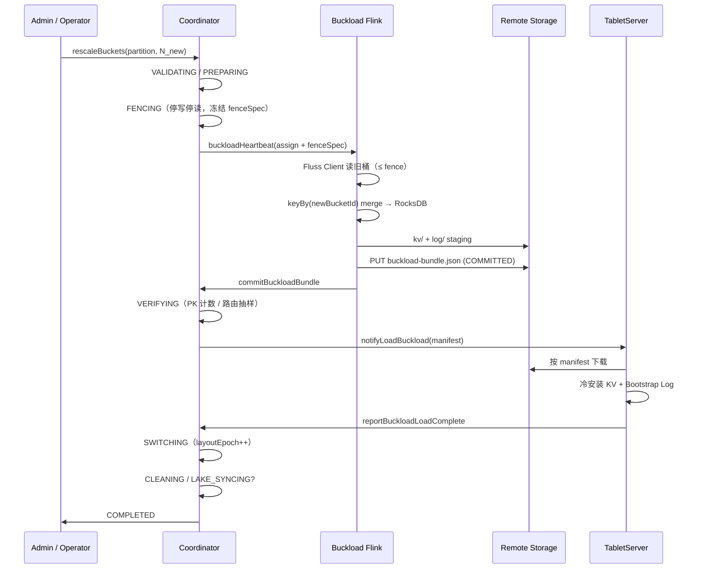

# 方案一：已有分区离线重分布

> **父文档**：[主键表动态分桶 — 架构总览](../dynamic-bucket-rescaling-design.md)  
> **路由范式**：`bucketMode = FIXED_HASH`（`hash(key) % N`）  
> **生产数据面**：**Buckload**（外置 Flink + remote 冷包 + TabletServer 冷加载）  
> **交付**：M2（控制面 + Buckload）；与方案五组合为默认主轨

---

## 1. 方案定义

### 1.1 解决什么问题

在 **固定哈希分桶** 下，当已有分区（或非分区全表）的 `bucketCount` 必须从 `N_old` 变为 `N_new` 时，`hash(key) % N` 对几乎所有主键都会改变路由。必须通过 **全量数据重分布** 保证主键唯一性与 Upsert 语义。

### 1.2 最小操作单元

- **分区表**：单个 `(tableId, partitionId)`
- **非分区表**：`partitionId = null` 表示全表一个逻辑分区

### 1.3 不适用场景

- 仅希望 **未来新分区** 使用新桶数、旧分区不动 → 用 [方案五](./scheme-05-progressive-partition-bucket.md)
- 需要 **不停写** 完成扩缩 → 本方案要求 FENCE（停写停读）；在线路径见 [方案三](./scheme-03-dynamic-index.md)、[方案四](./scheme-04-consistent-hashing.md)
- 期望只改元数据、零迁移 → 主键表 **不可行**（Iceberg PK 禁止 spec 演化同理）

---

## 2. 核心机制

### 2.1 语义概要

```text
FENCE → 读旧 layout（fence 快照）→ 按新 hash % N_new 路由
     → 写入新 layout → VERIFY → SWITCH(layoutEpoch++) → CLEAN
```

| 阶段 | 行为 |
|------|------|
| **FENCE** | 目标范围停写停读；Coordinator 冻结 `fenceSpec` |
| **重分布** | 读取 fence 点前 PK 最终态，写入新桶 |
| **VERIFY** | 行数守恒、路由抽样、checksum |
| **SWITCH** | 原子切换元数据；Bootstrap Log 含 `layout_switch` |
| **CLEAN** | 下线旧桶；可选 LAKE_SYNCING |

**不复制**旧 layout 全量历史 Log；新 layout 下 changelog 从 offset=0 起，CDC 靠 `layout_switch` + `layoutEpoch` 衔接。

### 2.2 与 Paimon Fixed Rescale 的对齐

与 Paimon `ALTER bucket` + 分区 `INSERT OVERWRITE` 同构。已开湖表在 SWITCH 后须 Paimon 侧 overwrite（LAKE_SYNCING），使湖层 bucket 布局与 Fluss 一致。

---

## 3. 数据面实现

### 3.1 Buckload（生产推荐）

Buckload 是方案一的 **推荐生产实现**，不是独立「第六种方案」。与 Lake Tiering 并列的外置 Flink 服务 **`fluss-flink-buckload`**。

| 维度 | Buckload |
|------|----------|
| 读 | **Fluss Client**（`BatchScanner` + bounded `LogScanner`，与 Tiering 读路径同构） |
| 计算 | Flink TaskManager；`keyBy(newBucketId)` |
| 写 | Remote **KvSnapshot 兼容冷包** + **Bootstrap LogSegment** |
| 安装 | Coordinator **`notifyLoadBuckload`** → TS **冷加载**（不走在线 PutKV） |
| 协议 | `buckloadHeartbeat` / `commitBuckloadBundle` / `reportBuckloadLoadComplete` |

#### 3.1.1 读路径

| 表态 | 读法 |
|------|------|
| 有 KV snapshot | snapshot 全量 + log(snapshotOffset → fence) |
| 仅 Log | bounded log(EARLIEST → fence) |

`fenceSpec` 由 Coordinator 在 FENCING 完成后下发；Buckload **不得**越过 fence 点。读负载落在旧桶 Leader，通过 Client 限速与离峰窗口控制。

**建议**：Buckload 的 fence 快照规划与 Tiering `TieringSplitGenerator` **共用同一套边界语义**（或抽公共 `FenceSnapshotPlanner`），避免与 Tiering 读路径不一致导致丢行。

#### 3.1.2 写路径（KvSnapshot 冷包）

冷包采用与线上一致的 **KvSnapshotHandle** 布局：

- **`fluss-client`**：读
- **KV / Log 模块**：Record 与 LogSegment 格式
- **RocksDB**：与 TabletServer **同版本**（根 `pom.xml`）；**RocksDB 打开选项须与 `KvTablet` 同源工厂**，保证冷包可加载

单新桶流程：

1. merge PK 行至 TM 本地 RocksDB
2. Checkpoint → 上传 `kv/` 至 remote staging
3. 生成 Bootstrap LogSegment（含 `layout_switch`）→ 上传 `log/`
4. 最后 PUT `buckload-bundle.json`（`status=COMMITTED`）
5. `commitBuckloadBundle` 登记 Coordinator

#### 3.1.3 Remote 布局与 Manifest-First

复用表级 **`remoteDataDir`**，子树：

```text
{remoteDataDir}/{physicalTablePath}/buckload/{rescaleJobId}/
  bucket-{newBucketId}/attempt-{attemptId}/
    kv/ ...  log/ ...  buckload-bundle.json
```

**禁止**依赖目录原子 `mvdir`。仅 manifest `COMMITTED` + RPC 登记后包可见；TabletServer **禁止**轮询 remote 触发加载。

#### 3.1.4 冷加载（TabletServer）

`notifyLoadBuckload` 推送后：下载 manifest 清单 → 安装 KV（`KvSnapshotDataDownloader`）→ 安装 LogSegment → `reportBuckloadLoadComplete`。全部新桶 LOAD 成功后才 SWITCHING。

**Log-KV 对齐（I3）**：

| 项 | 规则 |
|----|------|
| 冷 KV 语义 | fence 点各 PK **最终有效版本**（含 delete tombstone） |
| Bootstrap Log | 从 offset=0；**至少一条** `layout_switch`；不复制旧 layout 全量 changelog |
| HW / LEO | 安装后 LEO = Bootstrap Log 长度；HW 在 SWITCHING 前可达 LEO；禁止在 LOAD 完成前对外 Produce |
| 在线恢复 | 切换后新写入从 Bootstrap 之后 append；KV 与 Log 由现有 merge engine 保持一致 |

#### 3.1.5 fenceSpec 逻辑结构（目标设计）

Coordinator 在 `FENCING` 完成时为 **每个旧桶** 冻结读上界，下发给 Buckload 与 VERIFY：

```json
{
  "rescaleJobId": "...",
  "tableId": 1,
  "partitionId": 2,
  "oldLayoutEpoch": 4,
  "oldBucketCount": 16,
  "newBucketCount": 32,
  "perOldBucket": [
    {
      "bucketId": 0,
      "leaderEpoch": 7,
      "kvSnapshotId": "snap-abc",
      "kvSnapshotOffset": 12345,
      "logEndOffset": 67890,
      "fencedAtMs": 1710000000000
    }
  ]
}
```

| 字段 | 含义 |
|------|------|
| `kvSnapshotId` / `kvSnapshotOffset` | 有 KV 时：以此为基线全量扫 KV，再读 log(kvSnapshotOffset → logEndOffset) |
| `logEndOffset` | 无 KV 或仅 Log 时：bounded log 上界（**含**该 offset 之前已 commit 的记录） |
| `leaderEpoch` | 读路径须校验 Leader，防止 fence 后 leader 漂移导致双读 |

Buckload **不得**读取任一 `perOldBucket` 的 `logEndOffset` 之后数据。建议与 `TieringSplitGenerator` 共用边界语义（或抽公共 `FenceSnapshotPlanner`）。

#### 3.1.6 端到端时序（Buckload 主路径）



#### 3.1.7 Manifest 完整示例

```json
{
  "version": 1,
  "status": "COMMITTED",
  "rescaleJobId": "job-uuid",
  "tableId": 1,
  "partitionId": 2,
  "newBucketId": 3,
  "newLayoutEpoch": 5,
  "attemptId": 1,
  "fenceSpec": { "perOldBucket": [] },
  "kvSnapshotHandle": { "backendId": "...", "files": [] },
  "bootstrapLogSegments": [{ "segmentId": "...", "baseOffset": 0, "paths": {} }],
  "effectivePkCount": 123456,
  "checksum": "sha256:...",
  "remoteDataDir": "s3://bucket/fluss/..."
}
```

`effectivePkCount`：有效主键数（delete tombstone 计为「已删除」，不重复计入）。

### 3.2 集群内重放（备选，非生产默认）

| 维度 | 集群内重放 |
|------|------------|
| 读/写 | TS 本地扫 Log → 在线 Produce 写新桶 |
| 优点 | 无 remote、无 Buckload 服务 |
| 缺点 | 与在线 PutKV 争用；抖动难隔离 |
| 状态机 | RescaleJob 用 `MIGRATING` 替代 `BUCKLOADING`+`LOADING` |
| 建议 | 开发/极小数据/无 remote 降级；**M2 可不交付** |

### 3.3 缩桶（N_new < N_old）

扩桶与缩桶共用 Buckload 框架，差异在 **旧→新桶映射**：

| 项 | 扩桶 | 缩桶 |
|----|------|------|
| 映射 | 多个旧桶 PK → 更少新桶 | 多个旧桶 PK 合并到同一 `newBucketId` |
| Buckload | `keyBy(newBucketId)` 自然合并 | 同上；单新桶 manifest 可对应多旧桶 fence 来源 |
| VERIFY | Σ effectivePk(旧) = Σ effectivePk(新) | 须额外校验 **无 PK 丢失**（合并后仍唯一） |
| 风险 | 新桶数多、manifest 多 | 单桶冷包体积大、LOAD 磁盘峰值高 |

缩桶 **不**支持「只改元数据不迁移」；必须走完整 FENCE → Buckload → SWITCH。

---

## 4. 控制面：RescaleJob

方案一由 Coordinator **RescaleJob** 编排（Buckload 路径）：

```text
SUBMITTED → VALIDATING → PREPARING → FENCING
  → BUCKLOADING → VERIFYING → LOADING → SWITCHING
  → CLEANING → [LAKE_SYNCING] → COMPLETED
```

详见 [主文档 §9](../dynamic-bucket-rescaling-design.md#9-rescalejob-控制面)。

### 4.1 FENCE 隔离

目标分区：Produce、Lookup、Scan、联合读取 → `PARTITION_RESCALING`。

### 4.2 VERIFYING

1. 各新桶 manifest 已登记，`fenceSpec` 一致  
2. Σ **effectivePkCount**(旧桶) = Σ **effectivePkCount**(新桶)（delete tombstone 按 merge engine 规则计入）  
3. 随机 PK：`hash(pk) % N_new` 与 manifest 中 `newBucketId` 存储位置一致  
4. checksum / 可选 TS 预检（冷包 round-trip）

### 4.3 失败模式与回滚

| 阶段 | 失败场景 | 系统行为 | 操作员动作 |
|------|----------|----------|------------|
| FENCING | 旧桶无法冻结 | 中止 Job；保持旧 layout | 检查副本/Leader |
| BUCKLOADING | TM 失败、remote 写中断 | 放弃 `attemptId`；不增 epoch | 重试 Job 或 `retryRescaleJob` |
| BUCKLOADING | 部分桶 manifest 已 COMMITTED | Coordinator 仅认完整 N_new 集合 | 等待重试或 cancel |
| VERIFYING | PK 计数不一致 | → ROLLING_BACK | 查 fenceSpec / merge 逻辑 |
| LOADING | TS 磁盘不足 | 该桶 `reportLoadFailed`；阻塞 SWITCH | 扩容或降并发 LOAD |
| LOADING | 重复 `notifyLoadBuckload` | **幂等**：同 `jobId+bucketId+attemptId` 重入 | 无需人工 |
| SWITCHING | 元数据提交后 TS 未就绪 | **人工介入**；禁止自动回滚 epoch | 运维 runbook |
| LAKE_SYNCING | Paimon overwrite 失败 | Job 停留 LAKE_SYNCING | 手动 overwrite 后 complete |

### 4.4 回滚摘要

| 失败点 | 动作 |
|--------|------|
| BUCKLOADING | 放弃 attempt；不增 layoutEpoch |
| LOADING | 重试 notify 或 ROLLING_BACK |
| SWITCHING 已提交 | 人工介入 |

### 4.5 互斥

与 Rebalance(P)、Tiering(P)、DropPartition(P) 互斥；与 Rescale(其他分区) 可并行。

---

## 5. 元数据

| 字段 | 说明 |
|------|------|
| `layoutEpoch` | SWITCH 时 +1 |
| `rescaleState` | FENCED / BUCKLOADING / LOADING / LAKE_SYNCING |
| `fenceSpec` | 各旧桶 snapshot + log 上界 |
| `committedBundles` | `newBucketId → manifestUri` |

---

## 6. 湖流一体

| 场景 | 行为 |
|------|------|
| 未开湖 | 无 LAKE_SYNCING |
| 先扩缩后开湖 | 推荐；镜像按新 layout 创建 |
| 已开湖且有历史 tier | LAKE_SYNCING：Paimon partition overwrite |
| 联合读取 | FENCE～SWITCHING 拒绝；COMPLETED 后新 epoch |

分桶函数须满足 [主文档 §7](../dynamic-bucket-rescaling-design.md#7-分桶函数与湖层对齐) 规约 R1–R3。

---

## 7. Flink 协同

方案一涉及两类 Flink 作业，职责不同：

| 对象 | 角色 | 协同要求 |
|------|------|----------|
| **Buckload 作业** | **纯计算引擎**（与 Lake Tiering 同构） | 独立 Flink 作业；`buckloadHeartbeat` 注册；读 fence 快照、产出 remote 冷包 |
| **业务 Sink/Source** | 读写 Fluss 表的上下游作业 | rescale 前 `STOP WITH SAVEPOINT`；完成后恢复，以重新加载 per-partition 桶布局 |

**物化布局由 Fluss 分桶函数决定，不由 Flink 并行度决定**：

- Buckload 按 `hash(key) % N_new` 路由到 `newBucketId`，经 `keyBy(newBucketId)` 写出 **每新桶一份** KvSnapshot 冷包与 Bootstrap Log。作业 **并行度仅影响计算与 IO 吞吐**，不要求与 `N_new` 对齐，也不参与路由语义。
- 业务作业侧：Fluss Flink Sink 在 **规划期固化** `numBuckets`；layout 变更后须 Savepoint 重启，否则仍按旧 N 分配写入通道。这是 Connector 元数据缓存问题，与 Buckload 作业的并发配置无关。

---

## 8. CDC 语义

- FENCE～SWITCH：目标分区无可消费增量（或仅 fence 心跳）
- SWITCH：Bootstrap Log 中 `layout_switch`，逻辑字段（**proto 待实现**）：

| 字段 | 类型 | 说明 |
|------|------|------|
| `oldLayoutEpoch` | int | 切换前 epoch |
| `newLayoutEpoch` | int | 切换后 epoch |
| `oldBucketCount` | int | N_old |
| `newBucketCount` | int | N_new |
| `partitionId` | long? | 非分区表 null |
| `rescaleJobId` | string | 关联 RescaleJob |

- 下游须重置 per-bucket 进度；**官方 CDC 路径须纳入 M2 验收**

---

## 9. 失败模式索引

完整表见 [§4.3](#43-失败模式与回滚)。与 [DESIGN-REVIEW](./DESIGN-REVIEW.md) P0/P1 跟踪同步更新。

---

## 10. 优缺点

| 优点 | 缺点 |
|------|------|
| 正确性最强；与 Paimon 对齐最好 | 分区级停写停读维护窗 |
| Buckload 不占用在线 PutKV | Buckload 读仍打旧桶 IO；LOAD 打新桶磁盘 |
| 可缩桶 | 大数据量耗时长；缩桶成本更高 |
| 复用 remote snapshot 基础设施 | 依赖 remote storage 与 Buckload 服务 |

---

## 11. 交付与验收

| 里程碑 | 内容 |
|--------|------|
| M2 | RescaleJob、Buckload 模块、RPC、冷加载、缩桶 |
| 验收 | 冷包 round-trip IT；开湖/未开湖 rescale；CDC layout_switch；Flink savepoint 协同 |

---

## 12. 与其他方案的关系

| 方案 | 关系 |
|------|------|
| [方案五](./scheme-05-progressive-partition-bucket.md) | **组合**：五管新分区默认 N，一管旧分区强制改 N |
| [方案二](./scheme-02-dual-read-transition.md) | 替代关系；二不停写但正确性/湖对齐差，**不采用** |
| [方案三](./scheme-03-dynamic-index.md) | 不同 `bucketMode`；三在线扩桶、单写者，并列选型 |
| [方案四](./scheme-04-consistent-hashing.md) | 不同 `bucketMode`；四改 N 时迁移量有界，不需整分区 Buckload |

---

## 参考资料

- [Fluss Remote Storage](/maintenance/tiered-storage/remote-storage.md)
- [Paimon Rescale Bucket](https://paimon.apache.org/docs/master/maintenance/rescale-bucket/)
