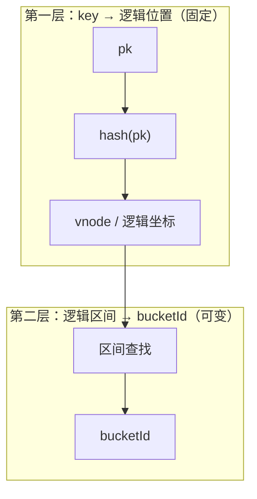

# 方案四：一致性哈希分桶

> **父文档**：[主键表动态分桶 — 架构总览](../dynamic-bucket-rescaling-design.md)  
> **路由范式**：`bucketMode = CONSISTENT_HASH`  
> **对标**：Hudi RFC-42 Consistent Hashing；与 **Flink Key Group** 同构的「固定逻辑分片 + 可变物理归属」  
> **交付**：M3 之后预研；**不阻塞**主轨

---

## 1. 方案定义

### 1.1 核心思想

将 key 空间映射到 **固定逻辑分片**（虚拟节点 / vnode），再将 vnode 区间 **动态分配** 给物理 `bucketId`：

```text
主键 ──► hash(key) ──► 逻辑位置（固定）──► vnode 区间查找 ──► bucketId（可变）
```

扩桶 = **分裂** vnode 区间，将部分区间划给新 bucket；缩桶 = **合并** 区间。仅 **受影响区间** 上的 PK 需要迁移，迁移量 **有界**，而非 [方案一](./scheme-01-offline-redistribution.md) 的全分区重 hash。

### 1.2 适用场景

| 适合 | 不适合 |
|------|--------|
| 超大表、多次扩缩缩 | 希望实现简单、运维成本低 |
| 可接受 CH 运维与迁移协议 | 不愿维护 vnode 元数据 |
| 扩缩并重 | 期望从 FIXED_HASH 表原地升级 |

### 1.3 建表选型

`bucketMode = CONSISTENT_HASH` 须 **新建表** 或完整迁移项目；**不能**从 `FIXED_HASH` 原地升级。

---

## 2. 与 Flink Key Group 的关系

### 2.1 同一抽象：固定逻辑分片 + 可变物理归属

| 概念 | Flink Key Group | 方案四 vnode |
|------|-----------------|--------------|
| 逻辑 ID | `KeyGroupId = hash(k) % maxParallelism` | `vnodeId` 或环上位置（固定） |
| 物理归属 | 连续 KeyGroup 区间 → Subtask | 连续 vnode 区间 → `bucketId` |
| 扩缩时 | 重划区间；**KeyGroupId 不变** | 分裂/合并区间；**key 逻辑位置不变** |
| 迁移单元 | Key Group 状态块 | 受影响 vnode 区间上的 Log+KV |

**Key Group 可映射为 vnode 格**：二者都不是经典 Ketama「环上最小扰动」算法，但都属于 **Fixed Logical Shard** 家族。

### 2.2 与经典「一致性哈希环」的差异

| 维度 | 经典 CH 环 | 方案四 / Key Group |
|------|------------|---------------------|
| 几何 | 环上弧段 | 整数格 / 有序区间 |
| 加节点扰动 | 理想 O(1/N) 键迁移 | 区间分裂，迁移量取决于分裂点 |
| 典型场景 | 分布式缓存 | 状态计算 / 持久化分片 |

文档中称「一致性哈希」指 **区间分裂式 CH**（同 Hudi RFC-42 方向），不是指 Flink 与 CH 「无关」。

### 2.3 与方案一的本质区别

| | 方案一 `hash % N` | 方案四 vnode |
|---|-------------------|--------------|
| 改 N 时逻辑 ID | **全体变化** | **不变** |
| 迁移量 | O(分区数据量) | O(受影响区间) |
| 数据面 | Buckload 整包冷加载 | 区间迁移（可在线/有界停写） |
| 与 Buckload | **强依赖** | **弱依赖**（仅全量修复/冷备场景） |

---

## 3. 核心机制

### 3.1 两层映射



### 3.2 扩桶

1. 增加 `bucketId`  
2. 从某现有 bucket 的 vnode 区间 **分裂** 一半给新 bucket  
3. 迁移该子区间内 PK 的 Log+KV（有界）  
4. 更新区间表元数据  

### 3.3 缩桶

合并相邻 vnode 区间到更少 bucket；迁移被合并区间的数据。**扩缩并重**，非「专做缩容」。

### 3.4 迁移期并发写

受影响区间内的 PK 须 **per-key fence** 或短窗停写，避免迁移与 Upsert 交错。Log+KV **同步迁移** 难度高于 Flink 搬 checkpoint。

---

## 4. 元数据

| 字段 | 说明 |
|------|------|
| `bucketMode` | `CONSISTENT_HASH` |
| `maxVnodeCount` | 逻辑格上限（类比 `maxParallelism`） |
| `vnodeRanges` | `[(vnodeStart, vnodeEnd) → bucketId]` |
| `layoutEpoch` | 区间拓扑变更时递增 |

---

## 5. 数据迁移实现选项

| 方式 | 说明 |
|------|------|
| **区间在线迁移** | TS 或外置任务搬迁受影响 PK；迁移量有界 |
| **Buckload 降级** | 极端情况全量冷备（失去 CH 优势，不推荐常规路径） |
| **与 Rebalance 组合** | 先 CH 区间迁移，再 Rebalance 搬副本 |

---

## 6. 湖流一体

- Paimon 侧仍建议 **Fixed maxBuckets**；Fluss `bucketId` 与 Paimon bucket 对齐  
- 区间分裂时须同步 tier 与 Union Read 的 split 枚举  
- LAKE_SYNCING 可能仅覆盖 **受影响 vnode 区间** 对应 bucket，而非整分区 overwrite  

细节 M3+ 预研。

---

## 7. Flink 协同

| 层 | 说明 |
|----|------|
| **Fluss CH 桶** | 物理数据分片 |
| **Flink Key Group** | 计算状态分片 |
| 关系 | **独立旋钮**；savepoint rescale 与 Fluss vnode 分裂 **分别规划** |

可选优化：使 `maxVnodeCount` 与 Flink `maxParallelism` 对齐，便于运维对照，**非强制**。

---

## 8. CDC

区间分裂产生 **拓扑变更事件**（类似 `vnode_split`），影响 bucket 数但非全表 `layout_switch`。下游须按事件更新 bucket 订阅集合。

---

## 9. 优缺点

| 优点 | 缺点 |
|------|------|
| 扩缩迁移量有界 | 实现复杂度最高 |
| 逻辑分片稳定 | Log+KV 同步迁移难 |
| 与 Key Group 哲学一致 | 运维理解成本高 |
| 支持缩桶 | 产品化前需长预研 |

---

## 10. 与方案三对比

| 维度 | 方案三 索引 | 方案四 CH |
|------|-------------|-----------|
| 路由 | 查表 | hash 固定格 |
| 热点 | 可人工均衡 | 依赖 hash 均匀性 |
| 内存 | 索引成本 | 区间元数据较轻 |
| Flink 同构 | 否 | **是** |

---

## 11. 交付路线

| 阶段 | 内容 |
|------|------|
| M3 后预研 | vnode 元数据、分裂迁移 PoC、与 Rebalance 互斥 |
| 产品化 | 新表 DDL；文档与 Key Group 对照运维手册 |

**明确不交付**：从 FIXED_HASH 自动升级工具。

---

## 参考资料

- [Hudi RFC-42 Consistent Hashing](https://github.com/apache/hudi/blob/master/rfc/rfc-42/rfc-42.md)
- [Flink Rescalable State](https://flink.apache.org/2017/07/04/a-deep-dive-into-rescalable-state-in-apache-flink/)
